AIRLab软件解析
====================
.. toctree:: 
    :maxdepth: 5

AIRLab软件初始界面如图3-1所示，主要分为五个部分。界面中间是主显示框（分为场景显示和相机显示），上方是菜单栏，最左侧是工程树，最右侧是操作区，界面最下端是指令反馈区。本章节将对上述区域的功能和使用方法、AIRLab软件中出现的弹窗及其他页面以及子页面功能进行详细介绍。

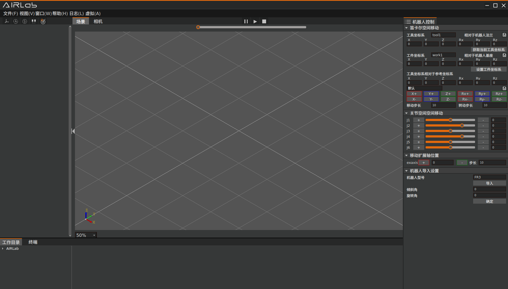

.. centered:: 图3-1 AIRLab软件初始界面

菜单栏
--------------------------
菜单栏包含的所有内容如图3-2所示，主要有按钮：“文件”、“视图”、“窗口”、“帮助”、“日志”、“虚拟”，以及图标按钮（从左到右顺序）：三维球、模式切换、运行状态、ROS2通信、点位新增、暂停运行、开始运行、停止运行。

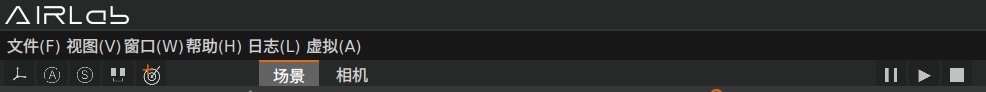

.. centered:: 图3-2 AIRLab菜单栏

文件
~~~~~~~~~~~~~~~~~~~
点击“文件”按钮，会出现“文件设置”弹窗，如图3-3所示。该弹窗包含三个功能：创建、打开或导出一个焊接JSON文件，使用方法如下（详细内容参考弹窗解析章节）：

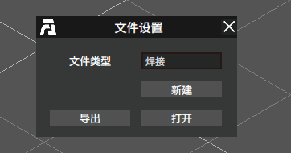

.. centered:: 图3-3 AIRLab菜单栏-文件设置弹窗

新建工程：如果用户需要新建一个焊接工程，将文件类型选择为“焊接”，再点击“新建”创建并打开一个新的焊接程序，如图3-4所示；

.. figure:: analysis/3.0/4-4.png
	:align: center
	:width: 7in

.. centered:: 图3-4 AIRLab菜单栏-文件设置-新建

导入工程：如果用户需要打开已存在的焊接文件，点击“打开”，然后进入工作路径查找需导入的文件后，点击“Open”选择一个文件导入，如图3-5所示；

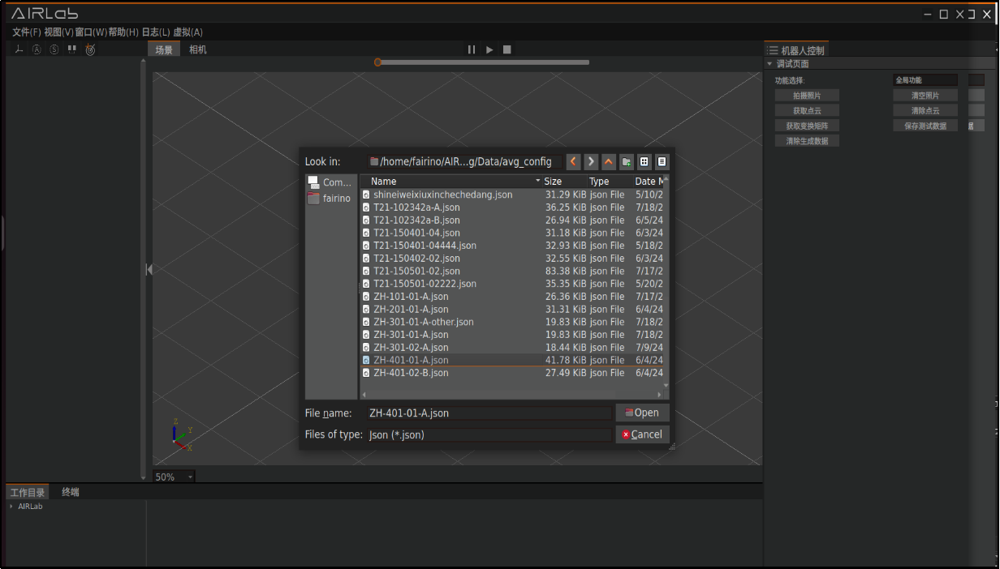

.. centered:: 图3-5 AIRLab菜单栏-文件设置-打开

导出工程：如果用户需要保存当前正在使用的焊接文件，点击“导出”，选择导出路径，设置导出文件名称后，点击“Save”当前的焊接工程将被保存，如图3-6所示。

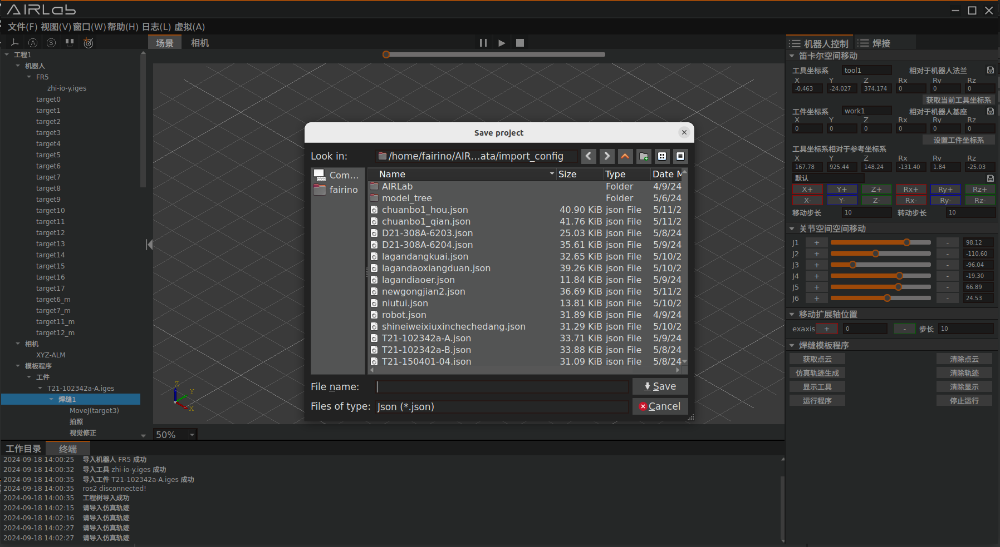

.. centered:: 图3-6 AIRLab菜单栏-文件设置-导出

视图
~~~~~~~~~~~~~~~~~~~
视图包含12个功能，如图3-7所示，主要功能是调整主显示框中机器人的观察视角。分别为：Zoom、Pan、Rotate、Reset、Fit all、前视、后视、俯视、仰视、左视、右视、全视。

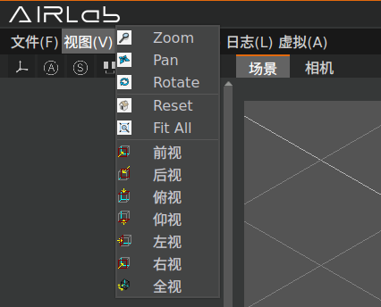

.. centered:: 图3-7 AIRLab菜单栏-视图

视图的具体功能说明见表3-1。

.. centered:: 表3-1 视图功能说明表

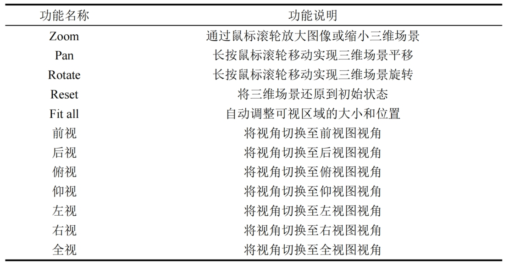

窗口
~~~~~~~~~~~~~~~~~~~
“窗口”包含5个二级选项，分别是“机器人控制”、“其他控制”、“仿真”、“调试页面”、“程序配置”。点击不同的选项，AIRLab软件右侧的操作区会显示对应的功能页面，如图3-8。其中“机器人控制”页面如图3-9，“其他控制”页面如图3-10，“仿真”页面如图3-11，“调试页面”如图3-12，“程序配置”页面如图3-13。

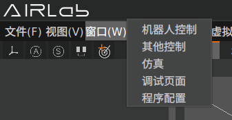

.. centered:: 图3-8 AIRLab菜单栏-窗口

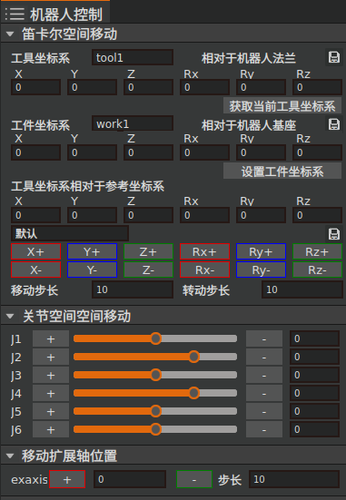

.. centered:: 图3-9 AIRLab菜单栏-窗口-机器人控制

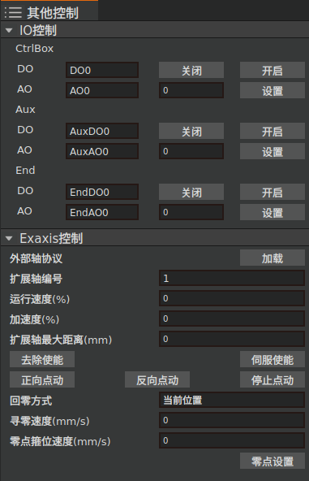

.. centered:: 图3-10 AIRLab菜单栏-窗口-其他控制

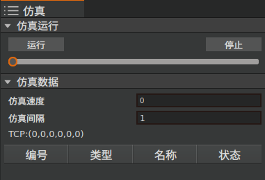

.. centered:: 图3-11 AIRLab菜单栏-窗口-仿真

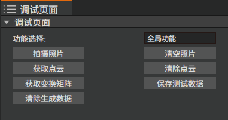

.. centered:: 图3-12 AIRLab菜单栏-窗口-调试页面

.. figure:: analysis/3.0/4-13.png
	:align: center
	:width: 4in

.. centered:: 图3-13 AIRLab菜单栏-窗口-程序配置

帮助
~~~~~~~~~~~~~~~~~~~

暂未开放。

日志
~~~~~~~~~~~~~~~~~~~

日志用于记录系统的运行过程及异常信息，可以快速定位问题。点击该按钮会出现一个“日志等级”弹窗。日志记录分为4个等级，分别是INFO、WARNING、ERROR、DEBUG，选择日志等级后设置当前日志等级（默认INFO）。如图3-14所示，具体含义见表3-2。

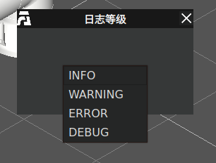

.. centered:: 图3-14 AIRLab菜单栏-日志

.. centered:: 表3-2 视图功能说明表

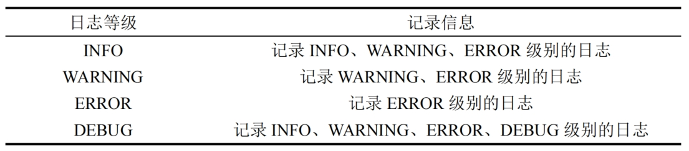

虚拟
~~~~~~~~~~~~~~~~~~~

该按钮用于切换虚拟机器人和实体机器人，使用前需成功导入或创建一个JSON文件(否则会出现图3-15中的错误信息)，且与实体机器人成功建立Ros2通信连接。完成上述前提后点击该按钮就可以实现虚拟机器人和实体机器人二者之间的切换，切换实机后如图3-16。虚拟场景：用于仿真不会实时同步更新三维场景中机器人位置；实体场景：更新当前工具坐标系、DH补偿参数与实际机器人一致，三维场景中机器人位置与实体机器人一致。

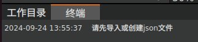

.. centered:: 图3-15 虚拟切换时未导入JSON文件

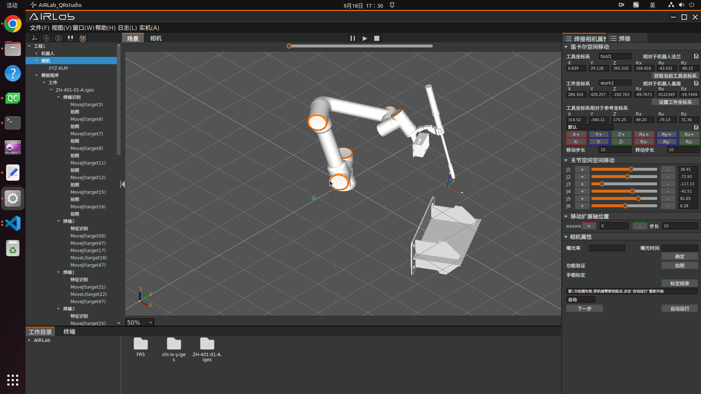

.. centered:: 图3-16 实机切换后AIRLab显示

三维球
~~~~~~~~~~~~~~~~~~~

暂未开放。

模式切换
~~~~~~~~~~~~~~~~~~~

AIRLab软件与实体机器人建立ROS2通信后，用户点击该按钮可以切换实体机器人的模式状态。A代表当前机器人处于自动模式，M代表当前机器人处于手动模式。此外，在自动模式下点击该图标会将机器人模式切换至手动，在手动模式下点击该图标会将机器人模式切换至自动。

运行状态
~~~~~~~~~~~~~~~~~~~

该图标按钮用于实时展示当前实体机器人的运行状态，其中S表示机器人停止运行，R表示机器人正在运行程序中，P表示机器人处于暂停运行状态。

ROS2通信
~~~~~~~~~~~~~~~~~~~

该图标按钮用于实时监测相机和Ros2的连接状态，当相机和Ros2的通信均连接成功或者Ros2连接成功而相机连接失败时，图标都会显示连接成功，如图3-17a；否则图标显示连接失败，如图3-17b。

.. centered:: 图3-17a ROS2通信连接成功

.. centered:: 图3-17b ROS2通信未连接

.. centered:: 图3-17 ROS2通信连接状态

点位新增
~~~~~~~~~~~~~~~~~~~

该功能用于快速记录机器人当前点位，点击该按钮后，工程树中的“机器人”节点下会新增一个点位targetX，X的作用是防止新增点位重名，如图3-18所示。该点位的j1、j2、j3、j4、j5、j6、x、y、z、rx、ry、rz信息为机器人当前的关节坐标和笛卡尔坐标。

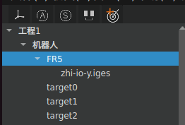

.. centered:: 图3-18 AIRLab菜单栏-点位新增

暂停程序
~~~~~~~~~~~~~~~~~~~

点击该按钮会立即暂停正在运行程序的机器人，再次按下该按钮后将恢复机器人继续运行暂停前的程序。

开始运行
~~~~~~~~~~~~~~~~~~~

点击该按钮，实体机器人会先运行工程树中“工件定位”节点下的所有指令，工件定位成功后机器人开始运行“模板程序”节点下的所有焊缝程序，如图3-19，焊缝识别成功后，机器人执行“程序”节点下的所有焊接指令。

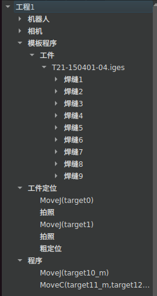

.. centered:: 图3-19 开始运行按钮功能

停止运行
~~~~~~~~~~~~~~~~~~~

点击按钮会立即停止正在运行程序的机器人，该按钮与暂停/恢复按钮的区别在于，再次按下该按钮，机器人无法恢复运行，只能通过开始运行按钮重新开始。

主显示框
--------------------------

主显示框分为场景显示和相机显示，其中场景主要显示机器人、工具、工件、扩展轴模型等，如图3-20。相机主要显示获得的点云图，如图3-21。

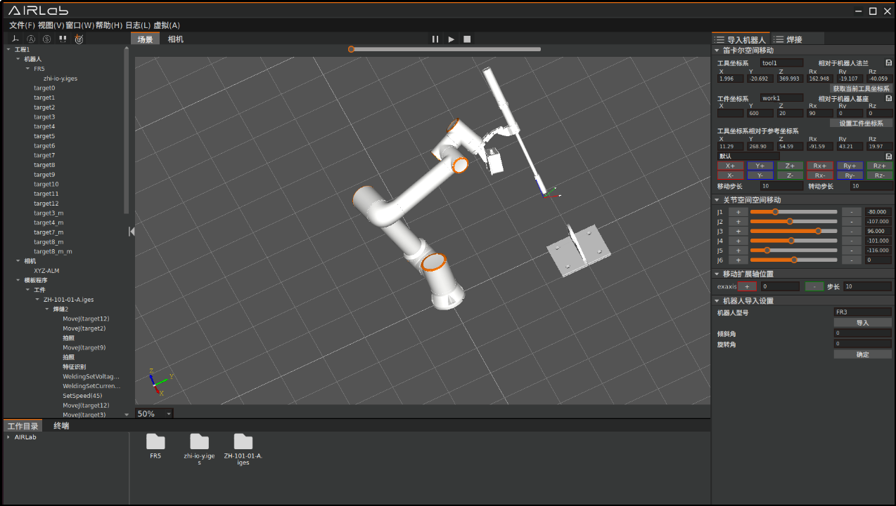

.. centered:: 图3-20 AIRLab主显示框-场景显示

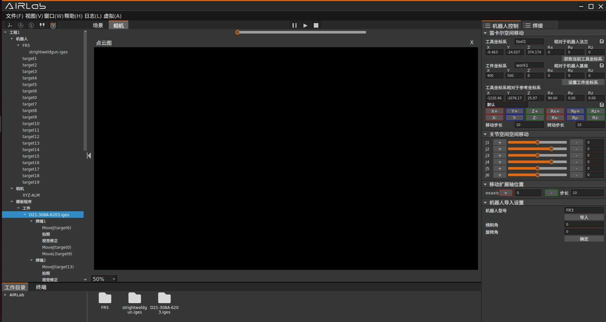

.. centered:: 图3-21 AIRLab主显示框-相机显示

指令反馈区
--------------------------

指令反馈区。分为工作目录和终端两个选项，其中工作目录显示当前的机器人型号、工具、工件模型，如图3-22；终端显示程序指令执行结果和返回的机器人错误信息，如图3-23。

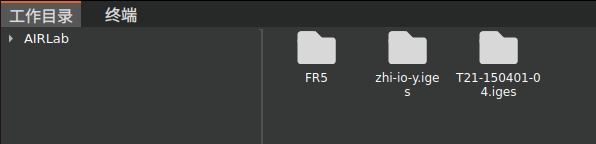

.. centered:: 图3-22 AIRLab指令反馈区-工作目录

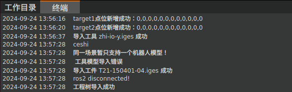

.. centered:: 图3-23 AIRLab指令反馈区-终端

操作区
--------------------------

笛卡尔空间移动
~~~~~~~~~~~~~~~~~~~

该区域包括工具坐标系、工件坐标系、工具坐标系相对于参考坐标系以及长按点动触发、移动步长和转动步长设置四部分内容，如图3-24所示。

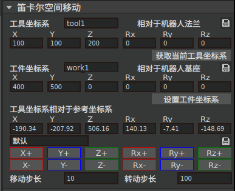

.. centered:: 图3-24 AIRLab操作区-笛卡尔空间移动

- 工具坐标系部分。工具坐标系的下拉列表中共有15个编号tool0-tool14，选择对应的坐标系（坐标系名称可自定义）后，在下方X、Y、Z、Rx、Ry、Rz的文本框中会显示对应坐标值，改变上述6个文本框内的数值，场景显示框中虚拟机器人的工具坐标系会相应变化。点击“获取当前工具坐标系”按钮用于获取实体机器人当前的工具坐标系。

- 工件坐标系部分，工件坐标系的下拉列表同样有15个编号work0-work14，设置文本框X、Y、Z、Rx、Ry、Rz中值会改变AIRLab软件场景显示框中工件的位置。点击“设置工件坐标系”按钮，机器人会将三维场景中的工具坐标系下发至实际机器人并应用。

.. important:: 
     用户在设置工具/工件坐标系编号时，需与Web端当前机器人使用的工具坐标系编号和工件坐标系编号一致。

- 工具坐标系相对于参考坐标系部分，该部分显示的是工具坐标系相对于参考坐标系的值。

- 长按点动触发、移动步长和转动步长设置部分。如图3-25所示，如果当前导入的机器人模型是实体机器人，长按X+按钮，实体机器人会执行X+点动指令；如果当前导入的机器人模型不是实体机器人，长按X+按钮，仿真机器人会执行X+点动指令。

.. important:: 
     通过长按按钮控制机器人的JOG点动，若在机器人运行中松开按钮，机器人会立即停止运动；若一直按住按钮不松开，机器人会运行移动步长设置的值后停止运动。X-、Y+、Y-、Z+、Z-按钮的操作同理。如果是长按Rx+、Rx-、Ry+、Ry-、Rz+、Rz-按钮，其他方面不变，只是机器人将按照设置的转动步长值运动。

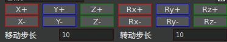

.. centered:: 图3-25 AIRLab操作区-长按点动

关节空间空间移动
~~~~~~~~~~~~~~~~~~~

该区域包括关节J3-J6的12个关节坐标长按触发按钮，6个关节坐标变化文本框以及6个关节滑块三部分内容，如图3-26。

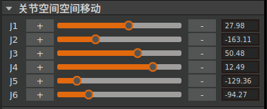

.. centered:: 图3-26 AIRLab操作区-关节空间空间移动

- 长按J1的“+” 或“-”按钮，可以在手动模式和关节坐标系下通过长按“+”或“-”按钮控制实体机器人J1关节的运动。其他关节的“+” 或“-”按钮操作同理。

.. important:: 
    通过长按按钮控制机器人运行，若在机器人运行中松开按钮，机器人会立即停止运动；若一直按住按钮不松开，机器人会运行移动步长/转动步长的设置值后停止运动。

- 6个文本框会实时更新显示机器人6个关节的角度值。此外，编辑6个文本框中的数值也可以达到控制机器人关节运动的目的（编辑时需要注意不能超出机器人的关节角度软限位）。

- 关节滑槽的作用是用户可以通过滑动关节滑槽实现机器人各关节的运动，滑槽代表的关节角度通过文本框内的数值显示。

移动扩展轴设置
~~~~~~~~~~~~~~~~~~~

该部分包括“exaxis+”、“exaxis-”以及步长设置框，如图3-27。“exaxis+”、“exaxis-”的功能与工具坐标系下的点动X+、X-类似，通过上述两个按钮可以控制扩展轴的运动。长按按钮控制扩展轴运行，若在扩展轴运行中松开按钮，扩展轴会立即停止运动；若一直按住按钮不松开，扩展轴会运行步长设置框设置的值后停止运动。

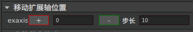

.. centered:: 图3-27 AIRLab操作区-移动扩展轴位置

工程树
--------------------------
工程树一般包括5个对象，分别是：机器人、相机、模板程序、工件定位、程序。下面从新建一个焊接文件的角度介绍工程树的功能和用法。

新建JSON文件
~~~~~~~~~~~~~~~~~~~

点击菜单栏中的“文件”，在出现的“文件设置”弹窗中选择新建，工程树中会出现一个模板工程。包括机器人、相机、模板程序、工件定位、程序5个节点对象，其中节点“机器人”下已存在机器人FR5，节点“相机”下已存在相机“XYZ-ALM”，如图3-28。

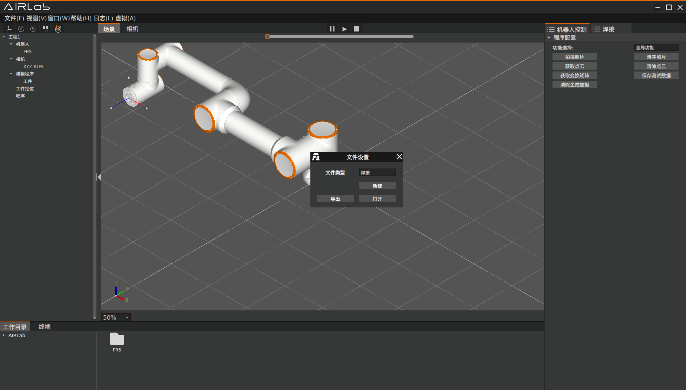

.. centered:: 图3-28 AIRLab工程树-新建

导入机器人模型
~~~~~~~~~~~~~~~~~~~

鼠标双击选中工程树中的 “机器人”节点，AIRLab软件最右侧会切换“机器人导入设置”子页面。在机器人型号下拉框中选择需要的机器人模型（例如FR3），点击“导入”按钮，如图3-29所示。工程树中“机器人”节点下面会出现导入成功的FR3节点，指令反馈区返回“导入机器人FR3成功”结果，场景显示框出现FR3机器人模型。

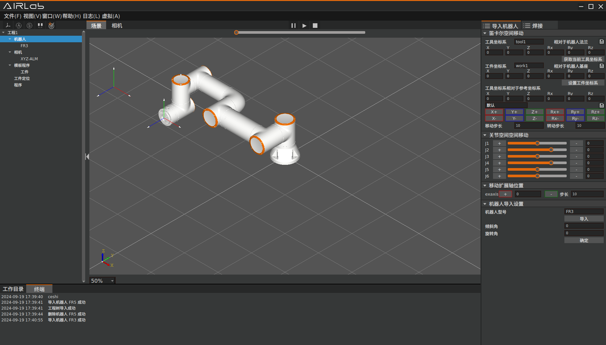

.. centered:: 图3-29 AIRLab工程树-导入机器人

.. important:: 
    如果需要更换机器人型号，首先要删除工程树中已导入的机器人模型FR5，具体操作如下：鼠标选中FR5节点然后右击，出现选项“Remove Item”，点击该选项，FR5即被删除成功，底端指令反馈区返回“删除机器人FR5成功”，如图3-30。

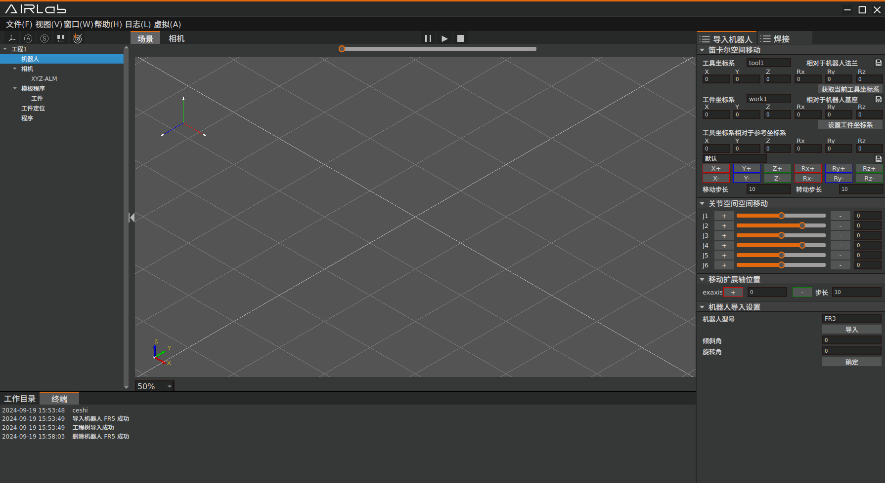

.. centered:: 图3-30 AIRLab工程树-更换导入的机器人型号

导入工具
~~~~~~~~~~~~~~~~~~~

鼠标选中工程树中“FR3”节点，AIRLab软件最右侧会切换“工具导入设置”子页面，点击“打开”按钮，在出现的“Select tool”弹窗中选择需要的工具即可，如图3-31。工具成功导入后，指令反馈区返回“导入工具zhi-io-y.iges成功”结果，如图3-32所示。

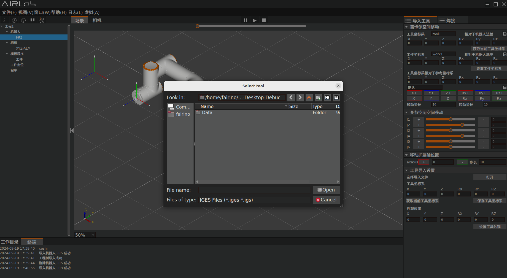

.. centered:: 图3-31 AIRLab工程树-导入工具

.. figure:: analysis/3.0/4-32.png
	:align: center
	:width: 7in

.. centered:: 图3-32 AIRLab工程树-工具导入成功

如果需要更换导入的工具，必须先将已导入的工具删除，再重新导入新的工具，否则会提示错误“同一场景暂只支持一个工具模型！”，如图3-33所示。删除工具的操作同样是鼠标选中工程树中导入的工具节点，然后右击选择选项“Remove Item”，点击完成工具的删除，指令反馈区同样会返回工具删除的结果，删除成功后用户才可以重新开始导入工具。

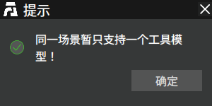

.. centered:: 图3-33 AIRLab工程树-重复导入工具模型

导入相机
~~~~~~~~~~~~~~~~~~~

工程树中的初始相机型号为“XYZ-ALM”，如果需要更换其他型号的相机，鼠标选中工程树XYZ-ALM节点，右击选择选项“Remove Item”，点击即完成XYZ-ALM型号相机的删除。重新导入其他型号相机操作如下：点击鼠标选中工程树中“相机”节点，AIRLab软件最右侧会切换“相机选择”子页面，如图3-34所示，在选择型号的下拉框中点击需要的相机型号，再点击“确定”按钮即完成新型号相机的导入。

.. figure:: analysis/3.0/4-34.png
	:align: center
	:width: 7in

.. centered:: 图3-34 AIRLab工程树-导入相机

导入工件
~~~~~~~~~~~~~~~~~~~

鼠标点击工程树中“模板程序”下的节点“工件”， AIRLab软件最右侧会切换“工件导入设置”子页面，点击“打开”按钮，在出现的“Select wobj”弹窗中选择需要的工件即可，如图3-35。导入成功后，工程树的“工件”节点下会增加导入工件的子节点，底端指令反馈区会返回“导入工件 T23-150403-04.iges 成功”的结果，如图3-36所示。

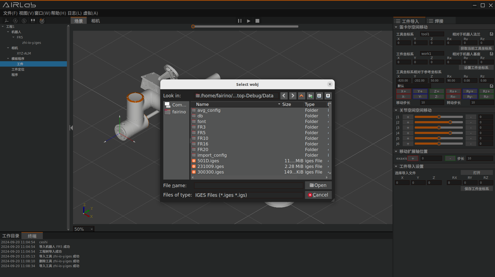

.. centered:: 图3-35 AIRLab工程树-导入工件

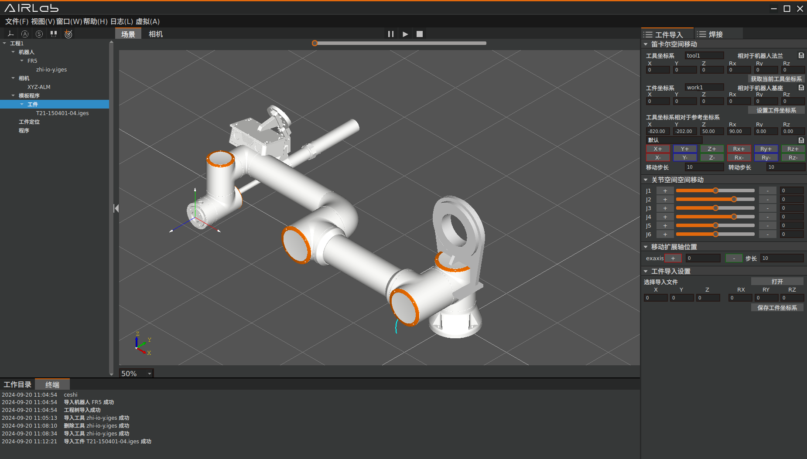

.. centered:: 图3-36 AIRLab工程树-工件导入成功

以上是工程树中涉及的所有导入需求，下面介绍工件定位的功能和使用方法。

工件定位
~~~~~~~~~~~~~~~~~~~

机器人在运行焊接程序前需要完成导入和工件定位这两项工作，本节将在完成导入的基础上介绍工件定位的内容，主要分为两部分：一是用户如何创建自己的工件定位程序；二是用户应该如何运行创建成功的工件定位程序。

1. 如何创建工件定位程序

鼠标选中工程树中的“工件定位”节点，右击会出现以下选项，如图3-37所示。工件定位中主要使用的指令有“MoveJ”、“拍照”、“粗定位”，在工件定位中，机器人需要通过MoveJ指令运行到合适的位置去拍摄工件的照片，然后利用拍摄的照片通过“粗定位”功能得到工件与机器人的实际相对位置。因此，创建工件定位程序的第一步应该是先确定机器人拍照的位置，并记录这些点位。

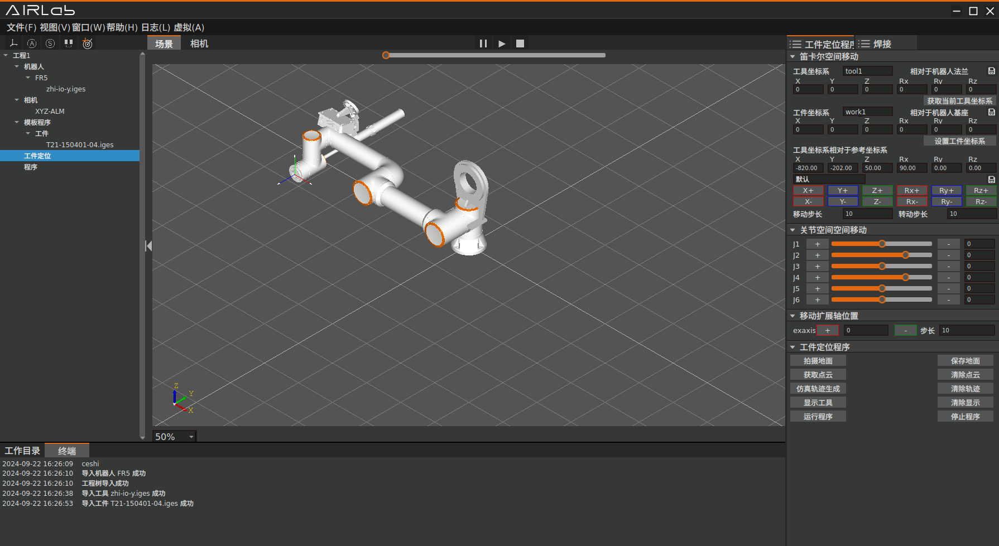

.. centered:: 图3-37 AIRLab工程树-工件定位

Step1：记录相机拍照点位。

操作方法：可以通过手动模式将机器人移动到合适的拍照位置，然后点击AIRLab软件菜单栏中的新增点位图标按钮，即可在工程树“机器人”节点下增加点位target0，指令反馈区会返回点位新增的结果，如图3-38所示。其中点位信息的前6位数字代表机器人在该位置的关节坐标，后6位数字代表机器人的笛卡尔坐标。其他点位的新增方法同target0一致。双击工程树节点可自定义节点名称(自定义名称请以target为前缀)，点击工程树中点位节点会跳转至点位修改子界面，在该界面可以实现对当前保存点位置的修改。

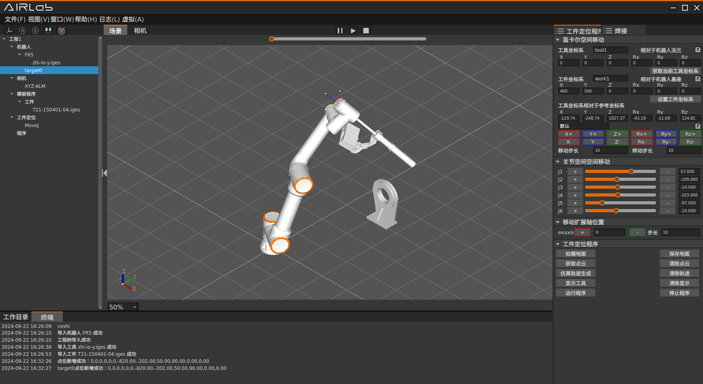

.. centered:: 图3-38 AIRLab工程树-新增点位

.. important:: 
    如果用户在这里需要修改已增加的点位信息，例如target0。操作如下：点击鼠标选中工程树中的子节点“target0”， AIRLab软件最右侧会切换“点位信息修改”子页面，在这里修改target0的名称、关节坐标、笛卡尔坐标等信息，修改完成后点击按钮“示教当前位置”即可。此时，工程树中的target0节点信息会更新且在指令反馈区返回点位修改结果。详细内容可参考子页面解析章节-点位修改。

Step2：新增点位成功后，创建工作定位程序。

鼠标选中“工件定位”节点，右击选择MoveJ后，工程树中“工件定位”节点下会增加“MoveJ”子节点。鼠标选中该节点，右击会出现两个选项：“关联的目标点”和“Remove Item”，选择“关联的目标点”，会出现工程树中已有的点位名称。根据实际情况选择关联的点位，其中MoveJ和MoveL指令只需要一个目标点，MoveC和Circle指令需要关联2个点位。如图3-39所示，该条程序的含义是机器人将通过MoveJ运动从当前位置移动到target0点位。

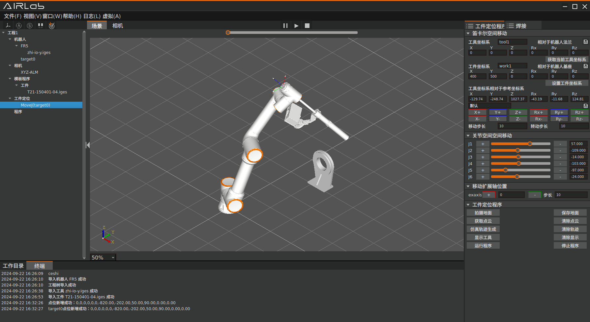

.. centered:: 图3-39 AIRLab工程树-新增MoveJ指令

如果用户需要删除该条程序指令，选中指令并右击选择“Remove Item”即可。

Step3：机器人到达点位target0后开始对工件进行拍照。

操作方法：鼠标选中工程树中的“工件定位”节点，右击选择“拍照”，点击即可在工件定位节点中添加该条指令，如图3-40所示，详细参数设置见子页面解析章节。其他拍照点位的添加方法不变，用户可以根据实际需要添加任意数量的MoveJ和拍照指令。

.. centered:: 图3-40 AIRLab工程树-新增拍照指令

Step4：最后一步添加“粗定位”指令。

操作方法：指令新增方法不变，粗定位指令增加成功后，通过子页面“粗定位设置”设置相关参数，如图3-41，详细内容见子页面解析章节。

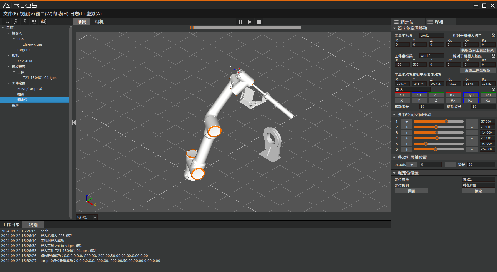

.. centered:: 图3-41 AIRLab工程树-新增粗定位指令

2. 如何运行创建成功的工件定位定位程序

操作方法：鼠标选中工程树中的“工件定位”节点，AIRLab软件最右侧会切换“工件定位程序”子页面。先通过点击“仿真轨迹生成”按钮查看工件定位程序的仿真轨迹曲线，进而确认创建的工件定位程序是否合理。之后点击“清除轨迹”按钮清除轨迹。对于仿真轨迹合理的工件定位程序，点击“运行程序”按钮，机器人将开始运行工程树中“工件定位”节点下的所有指令。在机器人的运行过程中，可以随时点击“停止程序”按钮，机器人会立即停止运行工件定位程序。详细的操作说明见子页面解析章节。

模板程序
~~~~~~~~~~~~~~~~~~~

工件定位程序运行成功后，机器人的控制器会获取实际的工件坐标系。随后可以开始运行工程树中的焊缝模板程序进行精确的焊缝定位和焊接参数设置，本节将介绍如何创建并运行工程树中“模板程序”节点下的程序指令，以及机器人按钮盒与模板程序的交互功能使用方法。

1. 创建模板程序内容

Step1：创建“焊缝1”节点

操作方法：鼠标点击导入的工件子节点，本例是“T23-150403-04.iges”节点，如图所示。右击选择“Custom”，即在“T23-150403-04.iges”节点下新增一个子节点“T23-150403-04.iges Child1”，鼠标双击该节点可以修改节点名称，本例中将其修改为“焊缝1”，如图3-42所示。

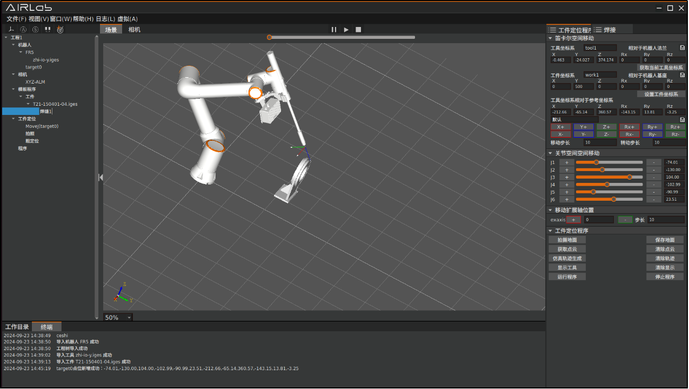

.. centered:: 图3-42 AIRLab工程树-新增“焊缝1”节点

.. important:: 
   机器人执行焊接任务时通常需要对工件的不同部位进行焊接操作，不同部位的焊接操作不同（例如有直线焊缝、圆弧焊缝等等），因此会定义不同的焊缝程序，即焊缝1、焊缝2、焊缝3等等。

Step2：根据实际焊接情况创建“焊缝1”节点下的具体程序。

操作方法：这里以焊缝1程序为例进行简单介绍，假设焊缝1是一条直线焊缝，机器人首先需要移动到一个合适点位对工件上的该条焊缝拍照，获取该直线焊缝的完整信息，以便后续特征识别可以识别出焊缝的起始点和终点。因此需要增加的指令节点为“MoveJ”和“拍照”，二者为一组。拍照的参数设置详见子页面解析章节，用户根据实际焊缝长度和形状设置指令组数。 

其次需要在工程树中添加“特征识别”指令，具体参数设置见特征识别子页面解析章节。特征识别的目的是根据实际拍照得到的工件焊缝照片去修正焊缝的焊接起始点、中间点（圆弧焊缝）和终点，所以本例中“特征识别”节点后面需要添加的指令是MoveJ(targetS)，S为焊缝的起始点和MoveL(targetE)，E为直线焊缝的终点。如果焊缝1是圆弧焊缝，特征识别节点后面添加MoveJ(targetS)和MoveC(targetM ,targetE)，M是圆弧焊缝的中间点，E为圆弧焊缝的终点。

特征识别完成后得到两个结果：一是工程树中机器人节点下会新增修正点位，targetS_m和targetE_m；二是工程树中程序节点下会新增焊接指令，包括MoveJ(targetS_m)和MoveL(targetE_m)以及在设置MoveL(targetE)焊接工艺时所需的一些指令。注意：这两个结果在执行下一个特征识别指令时会被自动清除。

下面对一些新节点的使用方法进行说明。如表3-3所示。

.. centered:: 表3-3 节点使用方法说明

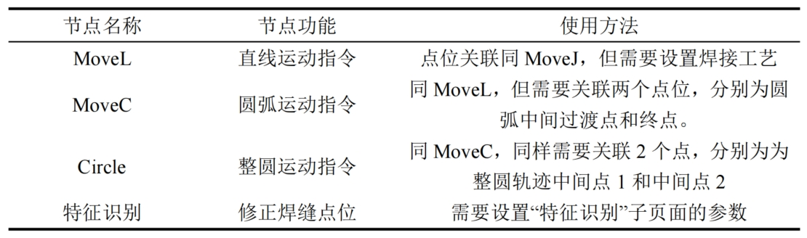

2. 运行模板程序
   
有三种方法可以运行模板程序。

- 完成如图3-43中的程序配置后，点击菜单栏中的开始运行按钮，机器人会先自动运行工件定位程序，运行成功后，根据设置的配置模式开始运行焊缝程序；
- 手动调试情况下，在工件定位程序运行成功的前提下，鼠标选中工程树中的“模板程序”节点下的具体焊缝程序节点，在AIRLab右侧切换的“焊缝模板程序”子页面中点击“运行程序”按钮；
- 通过按钮盒的开始停止运行按键控制机器人开始运行。

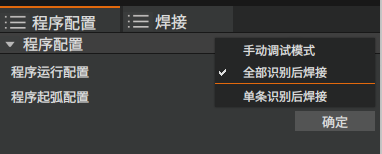

.. centered:: 图3-43 AIRLab工程树-运行前的程序配置设置

3. 模板程序与按钮盒开始停止运行按键的交互功能

在完成前文中介绍的导入工作、工件定位程序创建以及视觉和Ros2通信连接等必要工作后，可以通过按钮盒上的开始停止运行按键直接控制机器人实现工程树中模板程序的运行和停止。

- 开始运行：第一次按下开始运行按键后，机器人会开始运行工件定位程序，定位程序运行成功后，根据设置的程序配置模式自动开始运行“模板程序”节点下的焊缝程序焊缝识别完成后机器人会开始运行“程序”节点下的指令进行焊接工作。
- 停止运行：再次按下开始运行按键，机器人会立即停止运行。

程序
~~~~~~~~~~~~~~~~~~~

执行完模板程序中的焊缝1后，程序节点下会生成待执行的Lua程序节点，用户通过鼠标选中工程树中的“程序”节点，在AIRLab软件右侧切换的子页面，工作程序”中点击按钮“运行程序”即可实现机器人对工件指定焊缝的焊接，如图3-44。

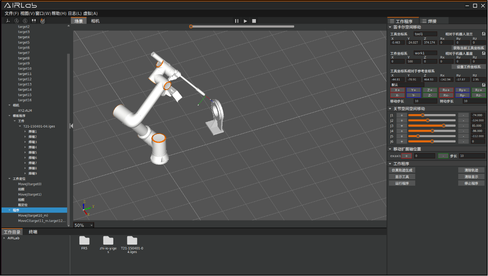

.. centered:: 图3-44 AIRLab工程树-运行“程序”

弹窗及其他页面
--------------------------
本节介绍AIRLab软件中出现的弹窗及五个其他页面：机器人控制、其他控制、仿真、调试页面、程序配置。

弹窗
~~~~~~~~~~~~~~~~~~~
弹窗包括文件设置弹窗、日志等级弹窗、焊接弹窗。

1. 文件设置弹窗

如图3-45，点击“文件”,出现“文件设置”弹窗。选择文件类型为“焊接”，点击“新建”按钮即可导入机器人。

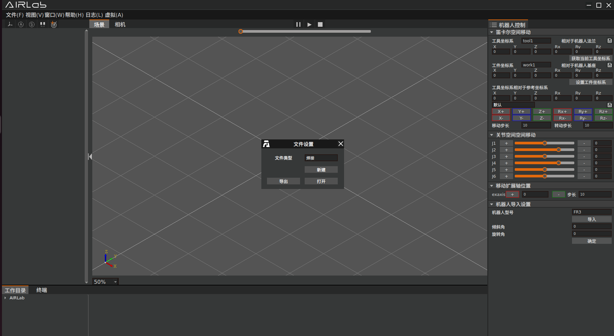

.. centered:: 图3-45 “文件设置”弹窗

点击“打开”按钮，出现如图3-46所示的文件选择弹窗，用户可以选择导入自己所需要的机器人、工具或者工件配置文件，点击“open”进行导入，点击“cancel” 取消导入。

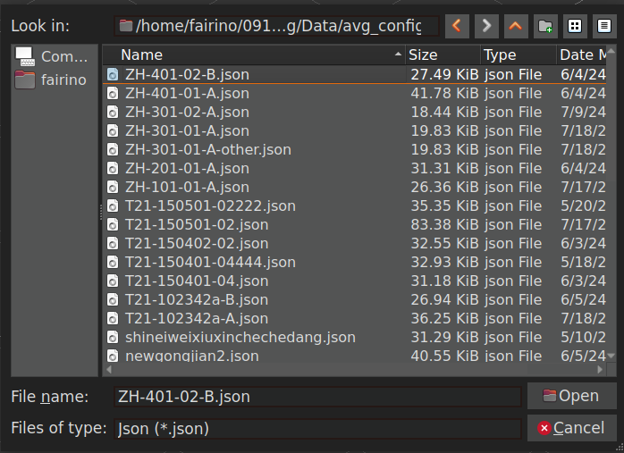

.. centered:: 图3-46 “文件选择”弹窗

2. 日志等级弹窗

图3-47为日志等级管理模块。日志等级分为ERROR、WARNING、INFO和DEBUG。

- ERROR: 记录ERROR级别的日志。
- WARING: 记录ERROR和WARING级别的日志。
- INFO: 记录ERROR、WARNING、INFO级别的日志
- DEBUG: 记录所有日志。

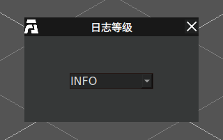

.. centered:: 图3-47 “日志等级”弹窗

可以通过修改日志等级来修改当前记录日志情况。

3. 焊接弹窗

焊接模块分为焊缝编辑模块和特征识别模块，如图3-48和图3-49所示。

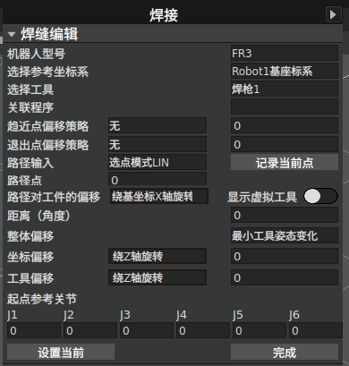

.. centered:: 图3-48 焊接-焊缝编辑模块

焊缝编辑模块选择机器人型号，选择参考坐标系和选择工具等，调整机器人姿态，点击“记录焊接点”记录当前焊接点，同时选择焊接路径，调整工件和工具的姿态等，点击“完成”按钮，机器人将会按照用户编辑的焊缝参数进行焊接。

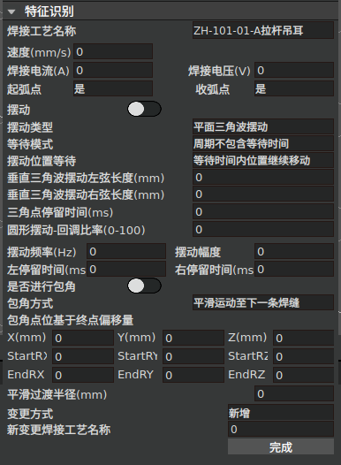

.. centered:: 图3-49 焊接-特征识别模块

特征识别模块可以新增、修改或删除已有的焊接工艺。按照需求设置焊接速度（mm/s）、焊接电流（A）、焊接电压（V）等参数，选择变更方式（新增、修改或删除），点击“完成”完成相应的增删改操作，终端将会显示“新增焊接工艺成功”，如图3-50所示。同时工程树会自动添加焊接工艺节点。

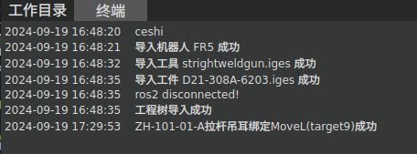

.. centered:: 图3-50 焊接-新增焊接工艺

其他页面
~~~~~~~~~~~~~~~~~~~

其他页面包括其他控制、仿真、程序配置三个页面。

1. 其他控制
   
点击操作区“其他控制”按钮可进入IO设置界面，主要包括IO控制和外部轴设置两个模块。

a. IO控制模块
  
如图3-51所示，IO控制模块可以实现对机器人控制箱中数字输出、模拟输出（0-10v）和末端工具数字输出、模拟输出（0-10v）扩展IO数字输出、模拟输出（0-10v）进行手动控制：

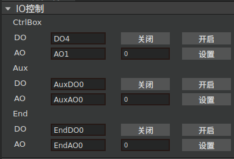

.. centered:: 图3-51 IO控制模块

- DO设置：选择端口号，点击“开启”按钮对应DO高电平，点击“关闭”按钮设置对应DO为低电平。

- AO设置：选择端口号，右侧输入框输入值（0-100），该数值为百分比，设置100即表示设置该AO端口为10v。

b. Exaxis控制

如图3-52所示，外部轴设置模块可以实现对机器人外部轴控制。

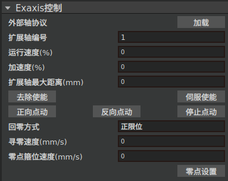

.. centered:: 图3-52 Exaxis控制

- 选择扩展轴编号：点击“加载”按钮根据选择的扩展轴编号加载外部轴协议。分别设置运行速度（%）、加速度（%）和扩展轴最大距离（mm）。
- 去除使能：点击“去除使能”按钮外部轴去除使能。
- 伺服使能：点击“伺服使能”按钮外部轴使能。
- 正向点动：点击“正向点动”按钮，根据设置的运行速度、加速度、扩展轴最大距离进行外部轴正向点动。
- 反向点动：点击“反向点动”按钮，根据设置的运行速度、加速度、扩展轴最大距离进行外部轴反向点动。
- 停止点动：点击“停止点动”按钮，外部轴停止点动。
- 零点设置：点击“零点设置”按钮，根据回零方式、寻零速度、箍位速度进行外部轴回零。

1. 仿真

如图3-53所示，对程序进行仿真轨迹生成后，打开操作区-仿真，设置仿真速度和仿真间隔后，点击“运行”按钮开始对模板程序进行仿真，点击“停止”按钮可以停止模板程序仿真。同时会生成仿真轨迹点表格，记录仿真轨迹点。表格中，仿真轨迹端点的类型为LINEND。点击表格中某一行，虚拟仿真机器人将移动到点击的仿真轨迹点，同时会同步显示该仿真轨迹点的TCP坐标。

.. figure:: analysis/3.6/9.png
	:align: center
	:width: 7in

.. centered:: 图3-53 仿真页面

3. 程序配置

进行程序运行配置和程序起弧配置，如图3-54。

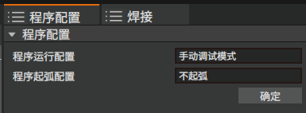

.. centered:: 图3-54 程序配置页面

程序运行配置可以选择手动调试模式、全部识别后焊接和单条识别后焊接。

- 手动调试模式：用于单步调试。

- 全部识别后焊接：点击自动运行将所有的焊缝都识别后再进行焊接。

- 单条识别后焊接：点击自动运行后机器人会先识别模板程序节点下的第一条焊缝，识别成功后进行第一天焊缝的焊接，完成焊接后会继续开始识别第二条，直到所有焊缝都被焊接后结束。

程序起弧配置可以设置为起弧或者不起弧。全部配置好之后，点击“确定’按钮，完成程序配置。

子页面解析
--------------------------

本节介绍AIRLab软件中的所有子页面功能。

机器人导入设置
~~~~~~~~~~~~~~~~~~~
如图3-55所示，选择机器人型号，现有FR3、FR5、FR10、FR16和FR20、点击“导入”按钮，相应型号的机器人模型显示在场景中，如图4-56所示，同时工程树上会增加相应节点。

导入机器人模型后，设置机器人的倾斜角和旋转角，点击“确定”按钮，机器人将按照设置好的倾斜角和旋转角进行变换。

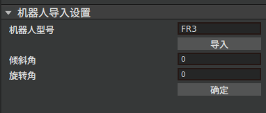

.. centered:: 图3-55 导入机器人设置

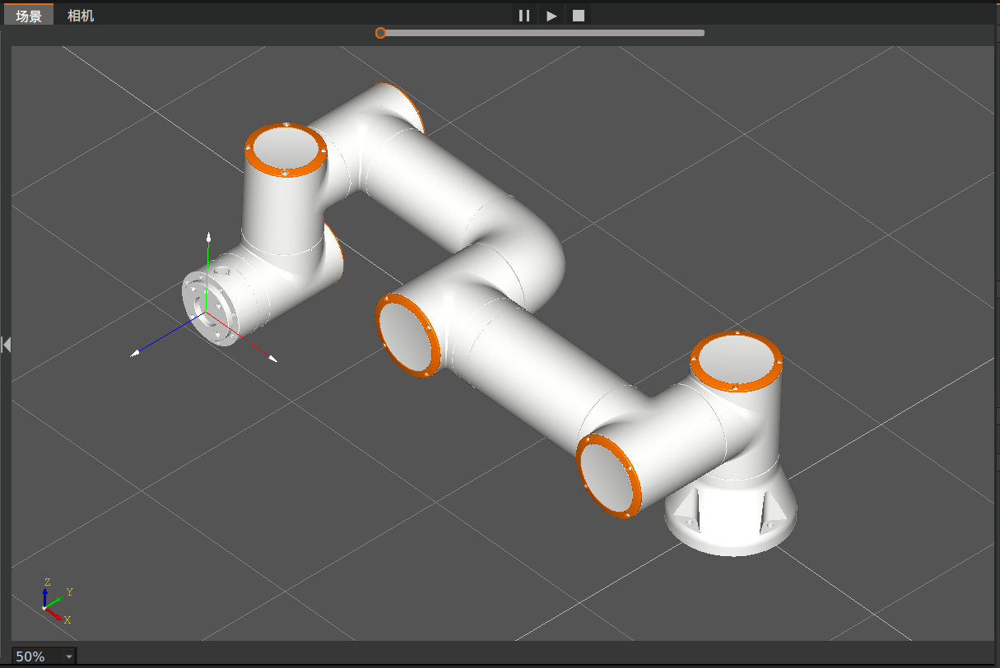

.. centered:: 图3-56 导入机器人成功

工件导入设置
~~~~~~~~~~~~~~~~~~~
如图3-57所示，在“工件导入设置”子界面点击“打开”按钮。出现“Select wobj”弹窗，选择要导入的工件模型，点击“open”导入工件模型，点击“cancel”取消导入。

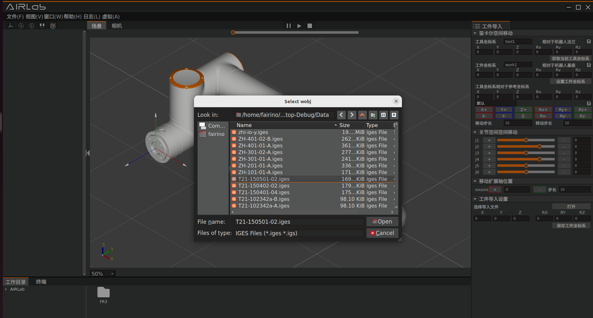

.. centered:: 图3-57 导入工件

导入工件模型后，可以设置工件坐标系，点击“保存工件坐标系”按钮，工件将按照设置的坐标进行变换。

工具导入设置
~~~~~~~~~~~~~~~~~~~
如图3-58所示，在“工具导入设置”子界面点击“打开”按钮。出现“Select tool”弹窗，选择要导入的工具模型，点击“open”导入工具模型，点击“cancel”取消导入。

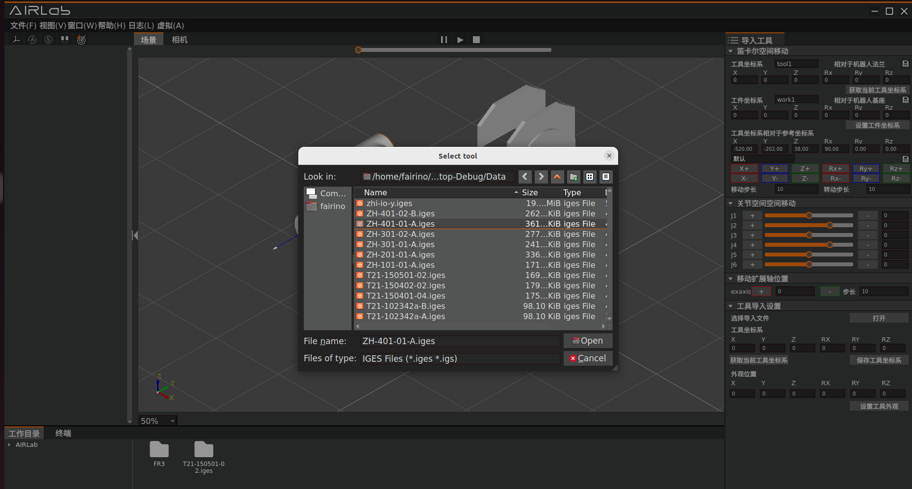

.. centered:: 图3-58 导入工具

导入工具模型后，设置工具坐标系，点击“保存工具坐标系”，则保存当前的工具坐标系；设置工具外观位置，点击“设置工具外观”，场景中的工具模型外观则会按照设置的工具外观位置坐标进行变换。

点位信息
~~~~~~~~~~~~~~~~~~~
如图3-59所示，选择左侧工程树焊接程序语句，出现“点位信息”子界面。对所选择的程序语句绑定焊接工艺。

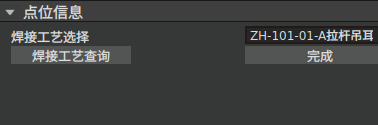

.. centered:: 图3-59 焊接工艺设置

点击下拉框，选择所需要的焊接工艺名称，如图3-60。

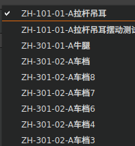

.. centered:: 图3-60 焊接工艺选择

点击“完成”按钮，终端显示绑定成功信息，如图3-61。

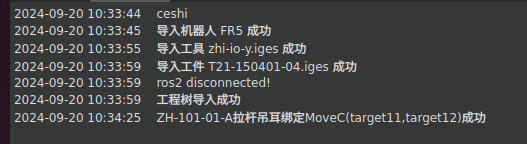

.. centered:: 图3-61 焊接工艺设置成功

点击“焊接工艺查询”按钮，左侧出现“焊接”界面，如图3-62所示，在“特征识别”模块可以查看并修改焊接工艺参数。

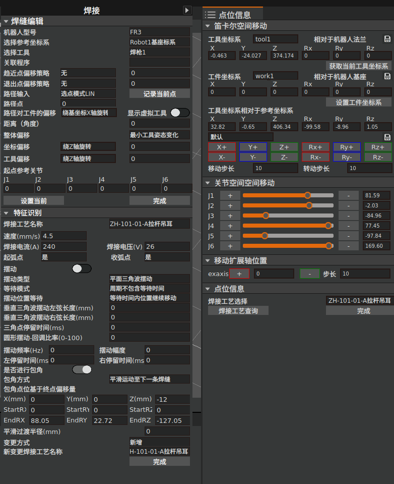

.. centered:: 图3-62 焊接工艺参数查询

点位修改
~~~~~~~~~~~~~~~~~~~
如图3-59所示，选择左侧工程树焊接程序语句，出现“点位信息”子界面。对所选择的程序语句绑定焊接工艺。

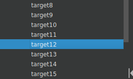

.. centered:: 图3-63 工程树中修改点位

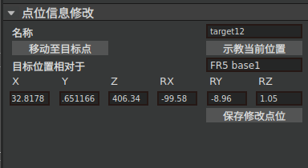

.. centered:: 图3-64 “点位信息”子界面

- 移动至目标点：点击该按钮，下发指令将实体机器人移动至存储记录点的位置。

- 示教当前位置：点击该按钮，获取当前AIRLab场景中机器人的位置信息并存储。

- 保存修改点位：点击该按钮，获取点位信息修改子界面X、Y、Z、RX、RY、RZ的位置并存储（该操作用于选点后存储，点击三维场景中的工件上的位置会出现小圆圈，同时会将选中位置的笛卡尔信息更新至点位信息修改子界面中的X、Y、Z、RX、RY、RZ区域）。

如图3-65所示，在场景显示框中的工件模型上，单击鼠标左键标记新的点位或修改 “点位信息修改”子界面上的点位坐标，点击“保存修改点位”按钮，即可修改原点位坐标，target12从图3-65所示的点位修改为图3-66所示的点位。 

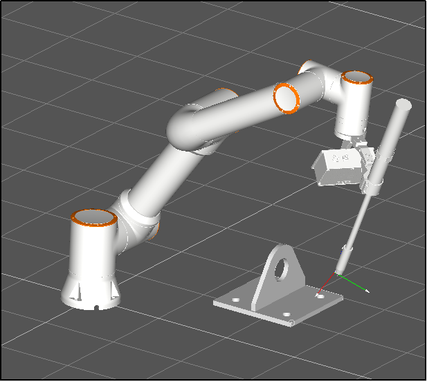

.. centered:: 图3-65 target12修改前点位

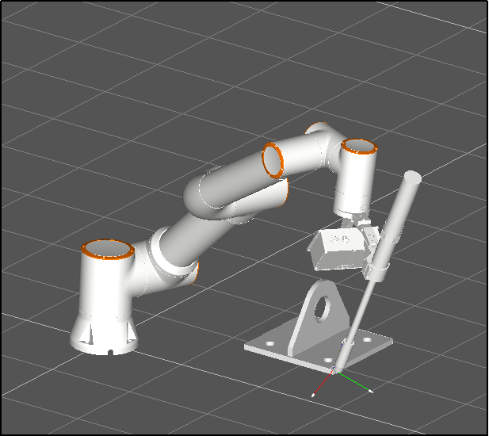

.. centered:: 图3-66 target12修改后点位

工作程序
~~~~~~~~~~~~~~~~~~~

点击左侧工程树“程序”节点，如图所示，子界面跳转到“工作程序”，如图3-67。

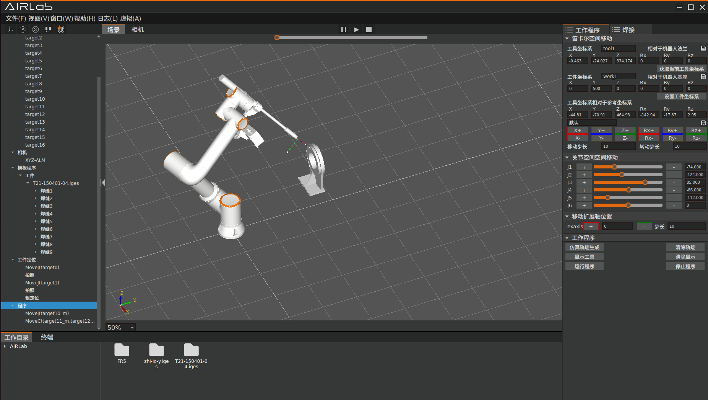

.. centered:: 图3-67 “工作程序”子界面

如图3-68所示，“工作程序”子界面具体的功能有仿真轨迹生成、清除轨迹、显示工具、清除显示、运行程序和停止程序。

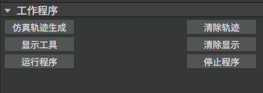

.. centered:: 图3-68 “工作程序”子界面功能

- 仿真轨迹生成：点击“仿真轨迹生成”按钮，场景中生成工程树中“程序”运行过程中的仿真轨迹，如图3-69所示。

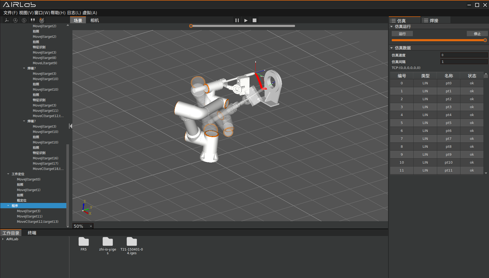

.. centered:: 图3-69 程序仿真轨迹生成

- 清除轨迹：点击“清除轨迹”按钮，清除场景中生成的仿真轨迹。

- 显示工具：点击“显示工具”按钮，场景中显示程序运行时关键点位处工具的姿态，如图3-70所示为工作程序运行时关键点位处工具的姿态。
  
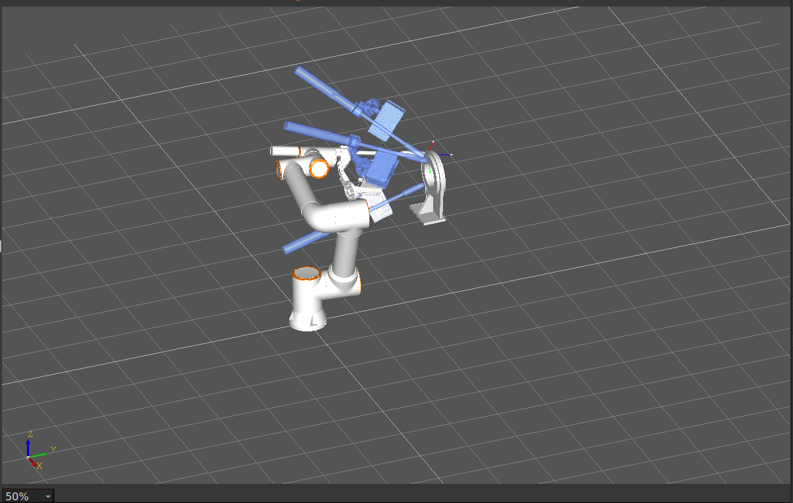

.. centered:: 图3-70 工作程序显示工具

- 清除显示：点击“清除显示”按钮，清除场景中生成的虚拟工具。
  
- 运行程序：点击“运行程序”，实体机器人按照程序生成的轨迹进行运动。

- 停止程序：点击“停止程序”,机器人运动停止。

工件定位程序
~~~~~~~~~~~~~~~~~~~
点击左侧工程树“工件定位”节点，如图3-71所示，子界面跳转到“工件定位程序”。

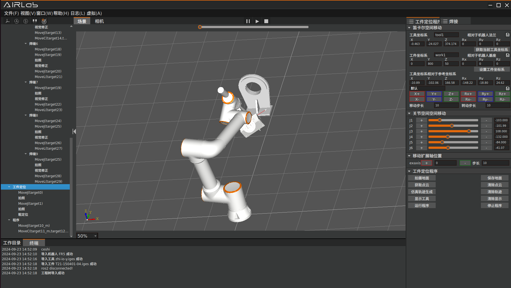

.. centered:: 图3-71 “工件定位程序”子界面

如图3-72所示，“工件定位程序”子界面具体的功能有拍摄地面、保存地面、获取点云、清除点云、仿真轨迹生成、清除轨迹、显示工具、清除显示、运行程序以及停止程序。

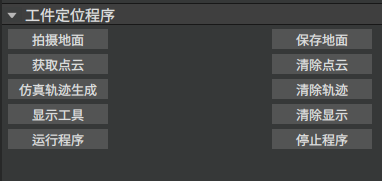

.. centered:: 图3-72 “工件定位程序”子界面功能

- 拍摄地面：将机械臂移动到平行于工作台并可以完整拍摄工件的位置，点击“拍摄照片”按钮，拍摄地面照片。终端显示拍摄成功。

- 保存地面：保存拍摄的地面照片。

- 获取点云：点击“获取点云”按钮，生成实际场景中工件的点云数据模型，并于虚拟场景中工件模型进行配准。

- 清除点云：点击“清除点云”按钮，清除场景中的工件点云数据。

- 仿真轨迹生成：点击“仿真轨迹生成”按钮，场景中生成工程树中“程序”运行过程中的仿真轨迹，如图3-73所示。

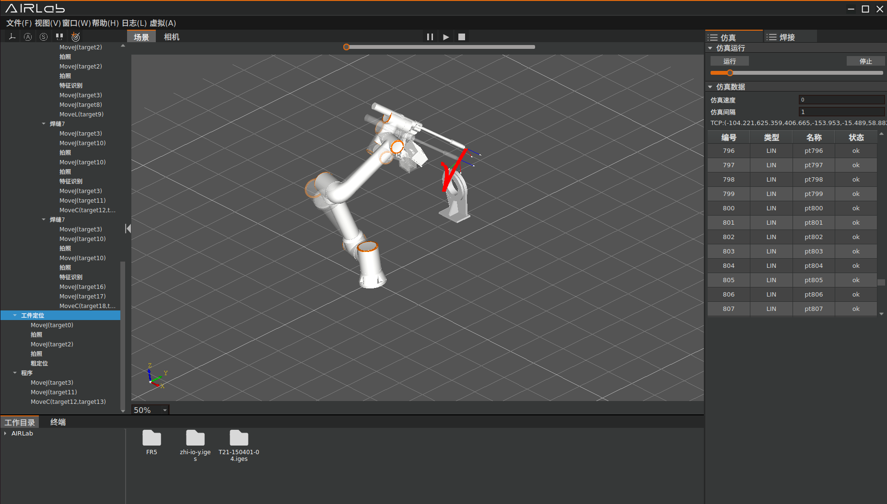

.. centered:: 图3-73 工件定位仿真轨迹生成

- 清除轨迹：点击“清除轨迹”按钮，清除场景中生成的仿真轨迹。

- 显示工具：点击“显示工具”按钮，场景中显示出程序运行时关键点位处工具的姿态，如图3-74所示显示工件定位时工具的姿态，用户可以直观的看到关键点位处工具的姿态。

.. figure:: analysis/3.7/20.png
	:align: center
	:width: 6in

.. centered:: 图3-74 工件定位程序显示工具

- 清除显示：点击“清除显示”按钮，清除场景中生成的虚拟工具。

- 运行程序：点击“运行程序”，实体机器人按照程序生成的轨迹进行运动。

- 停止程序：点击“停止程序”,机器人运动停止。

焊缝模板程序
~~~~~~~~~~~~~~~~~~~

如图3-75所示，点击左侧工程树“模板程序”下的焊缝模板程序，子界面跳转到“焊缝模板程序”。

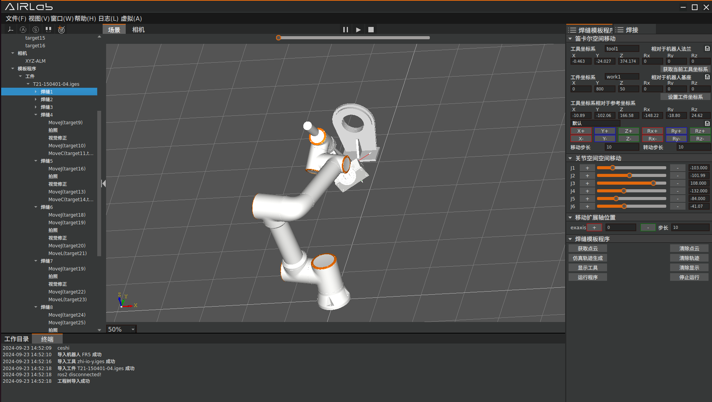

.. centered:: 图3-75 “焊缝模板程序”子界面

如图3-76所示，“焊缝模板程序”子界面具体的功能包括获取点云、清除点云、仿真轨迹生成、清除轨迹、显示工具、清除显示、运行程序以及停止程序。

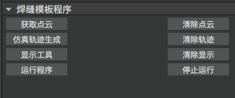

.. centered:: 图3-76 “焊缝模板程序”子界面功能

- 获取点云：点击“获取点云”按钮，生成实际场景中工件的点云数据模型，并于虚拟场景中工件模型进行配准。

- 清除点云：点击“清除点云”按钮，清除场景中的工件点云数据。

- 仿真轨迹生成：点击“仿真轨迹生成”按钮，场景中生成工程树中“程序”运行过程中的仿真轨迹，如图3-76所示

.. figure:: analysis/3.7/23.png
	:align: center
	:width: 7in

.. centered:: 图3-77 焊缝模板程序仿真轨迹

- 清除轨迹：点击“清除轨迹”按钮，清除场景中生成的仿真轨迹。

- 显示工具：点击“显示工具”按钮，场景中显示出运行焊缝模板程序时关键点位处工具的姿态，如图3-78所示，用户可以直观的看到焊缝模板程序运行过程中关键点处工具的位姿。

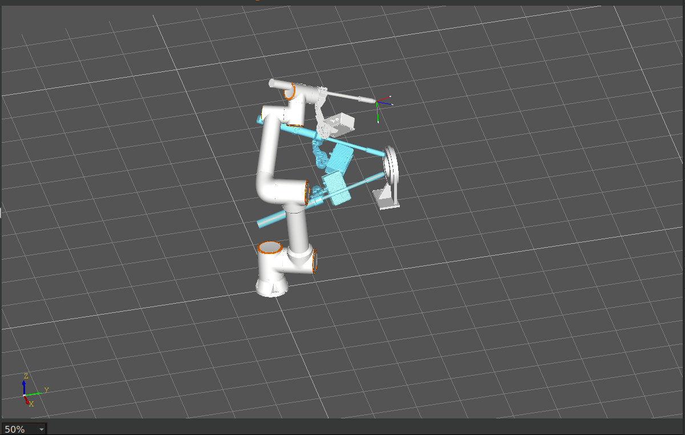

.. centered:: 图3-78 焊缝模板程序显示工具

- 清除显示：点击“清除显示”按钮，清除场景中生成的虚拟工具。

- 运行程序：点击“运行程序”，实体机器人按照程序生成的轨迹进行运动。

- 停止程序：点击“停止程序”,机器人运动停止。

拍照设置
~~~~~~~~~~~~~~~~~~~
如图3-79所示，点击左侧工程树“拍照”子节点，子界面跳转到“拍照设置”。

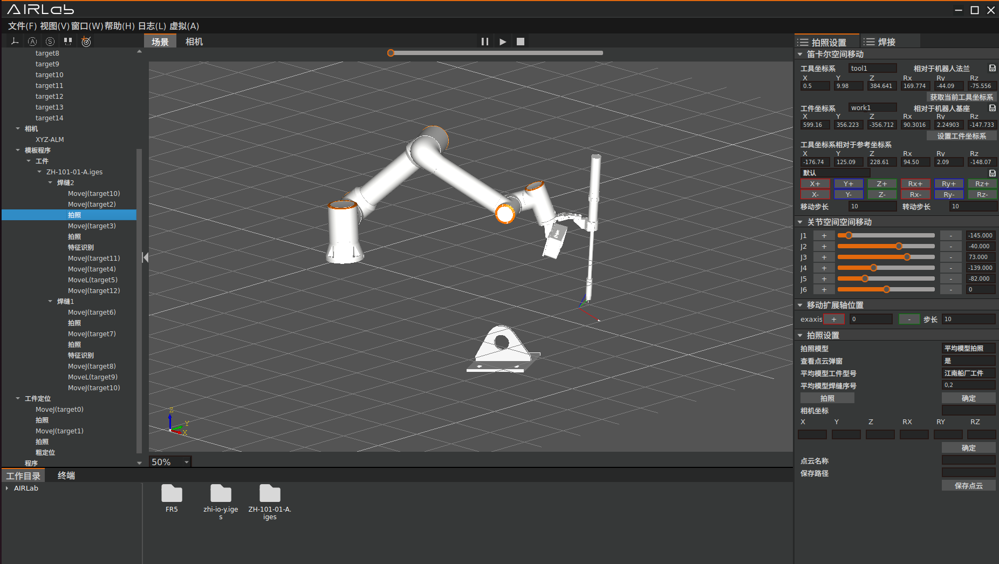

.. centered:: 图3-79 “拍照设置”子界面

拍照设置主要功能时验证相机拍照功能是否可用。

确定（拍照设置）：设置拍照参数，包括以下参数：

1. 拍照模型：0-全局拍照，1-局部拍照（暂未开放），2-平均模型拍照。
2. 查看点云弹窗：0-查看，1-不查看。
3. 平均模型工件型号：暂未开放。
4. 平均模型焊缝序号：一项或多项（例：1-1，1-2，2-1，3-2，表示可拍摄到焊缝1的起点、焊缝1的终点、焊缝2的起点、焊缝3的终点。）

确定（相机坐标）：暂未开放。

保存点云：输入点云名称和保存路径，保存点云数据。

焊缝相机属性
~~~~~~~~~~~~~~~~~~~

如图3-80所示，点击工程树“相机”节点下的相机型号，子界面跳转到“焊接相机属性”。在“焊接相机属性”子界面进行相机标定，可选手动标定和自动标定。先将相机调整到合适的位姿作为相机标定的初始位姿，再进行手动或自动标定。

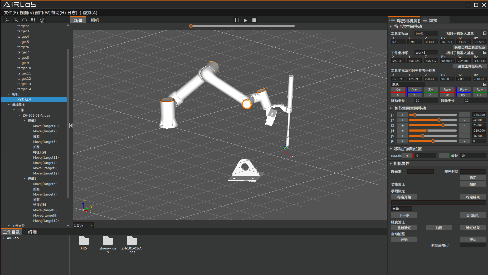

.. centered:: 图3-80 “焊缝相机属性”子界面

- 手动标定：选择“手动”，输入框中显示“进入手动模式，请点击下一步”；点击“下一步”按钮，相机变换相应的位姿并进行拍照，点击八次，拍八张照片进行相机标定。

- 自动标定：选择“自动”，输入框中“显示进入自动模式，机器人即将自动运动，请勿操作”；点击“自动运行”按钮，相机连续拍八张照片自动进行相机标定。

焊接相机属性精度验证（需已进行3-5次标定）

- 重新验证：点击“重新验证”按钮，清空精度验证的拍照信息。

- 拍照：点击“拍照”按钮，进行精度验证拍照。

- 验证结果：移动机器人拍摄标定板三次后，点击验证结果可显示手眼标定精度验证结果并应用最好的一次标定结果。

- 开始：暂未开放。

- 停止：暂未开放。

导入扩展轴
~~~~~~~~~~~~~~~~~~~
该页面的功能是导入扩展轴，并对扩展轴的位置进行设置。

- 选择扩展轴下拉框：确定要导入的扩展轴类型。

- “导入”按钮：点击后，AIRLab软件的场景中会出现刚选择的扩展轴，如图所示。

- exaxispos文本编辑框：设置文本框中的数值，可以改变机器人在扩展轴上的位置，如图3-81所示。

.. figure:: analysis/3.7/27.png
	:align: center
	:width: 7in

.. centered:: 图3-81 扩展轴导入设置

相机选择
~~~~~~~~~~~~~~~~~~~
点击左侧工程树“相机”节点，子界面跳转到“相机选择”，如图3-82所示。该功能用于确定焊接工作中使用的相机型号。用户选中相机型号后，点击确定即可（当前仅开放XYZ-ALM）。

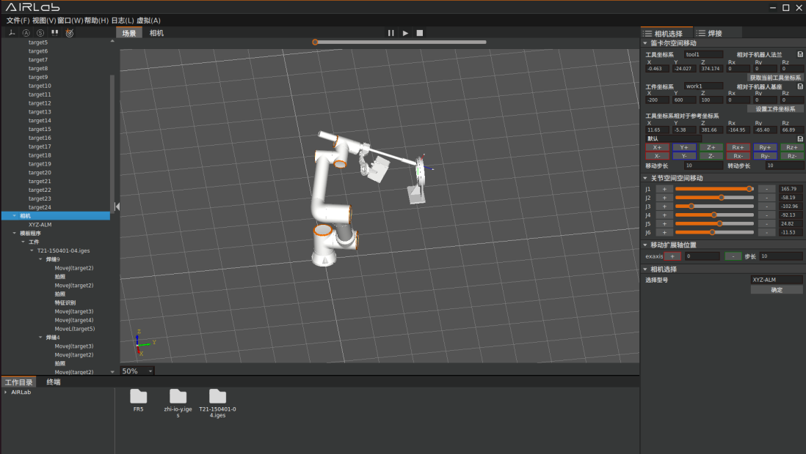

.. centered:: 图3-82 相机选择子界面