离线编程软件解析
====================

.. toctree:: 
    :maxdepth: 5

基础信息
--------------------------

系统简介
~~~~~~~~~~~~~~~~~~~

离线编程软件是针对机器人焊接开发的配套软件，其主要功能和技术特点如下：

- 能够对机器人进行焊接程序的编写；
- 能够显示机器人位置坐标，三维模拟实体机器人，并能控制机器人运动；
- 搭载配套相机能够实现工件三维模型建立和配准；
- 能够实现焊接程序的仿真运行等。

启动软件
~~~~~~~~~~~~~~~~~~~

在Ubuntu下打开命令行，输入：

1. ./fr_weld.sh 

法奥ROS2主程序、视觉模块、离线编程软件一键启动。

系统初始页面
--------------------------

如图表3-1所示，离线编程软件主要包括菜单栏、工具栏、三维机器人及功能区、指令反馈区、操作区五个部分组成。其中三维机器人及功能区主要显示机器人、工具、工件模型，指令反馈区反馈指令执行结果和机器人错误信息。菜单栏、工具栏、操作区介绍见3-3~3-5。

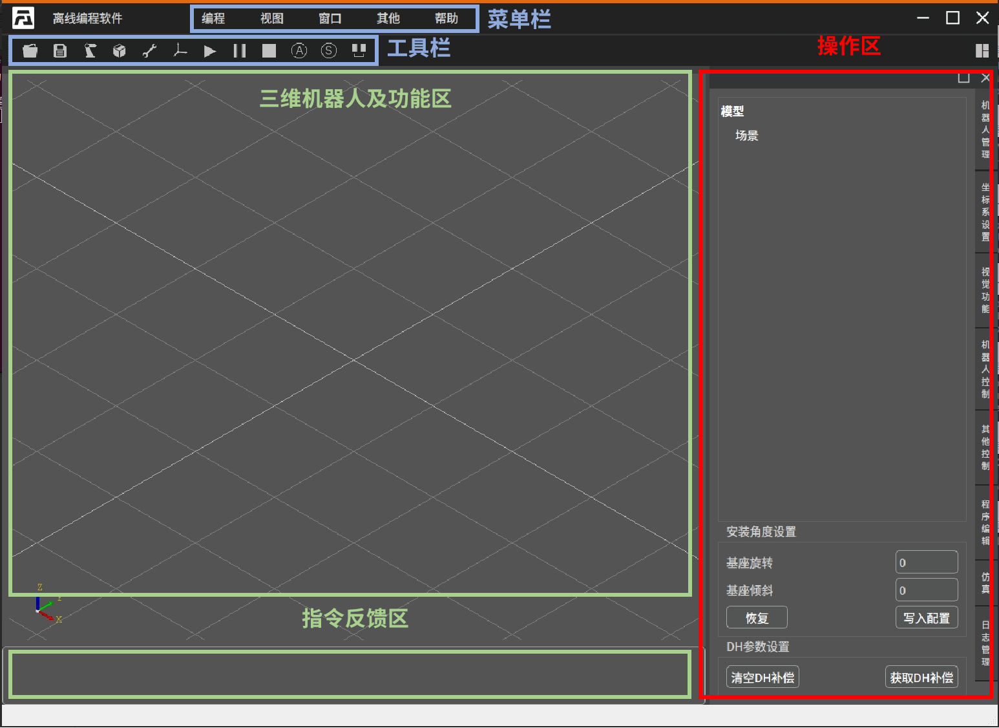

.. centered:: 图表 3-1 离线编程软件

菜单栏
--------------------------

菜单栏分级如表3-2所示：

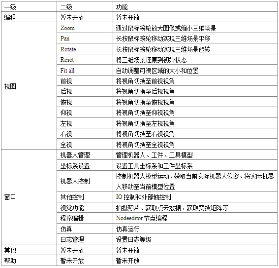

.. centered:: 图表 3-2 离线编程软件菜单栏分级

工具栏
--------------------------

操作区
--------------------------

机器人管理
~~~~~~~~~~~~~~~~~~~

机器人管理部分主要包括两个部分模型场景和安装角度设置。
如图表3-3所示为模型场景区域，该区域显示当前导入的机器人模型、工具模型、工件模型，右击删除可以删除已导入模型。 

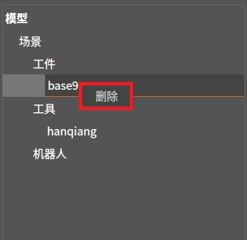

.. centered:: 图表 3-3 模型场景区

如图表3-4所示为机器人安装角度设置，输入旋转角度和倾斜角度设置机器人安装角度。点击恢复按钮恢复默认设置，点击写入配置将当前旋转角度和倾斜角度设置为默认设置。（如需设置机器人安装角度，请设置安装角度后再导入工具和工件）

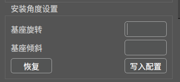

.. centered:: 图表 3-4 机器人安装角度设置

如图表3-5所示为DH参数设置功能，分为清空DH补偿和获取DH补偿。高精度机器人对DH参数进行了补偿，但目前离线软件的运动规划基于标准的DH参数，使得两者计算的关节角或者笛卡尔位置有一定偏差，需要对离线软件的DH参数进行对应的补偿。点击获取DH补偿，获取当前机器人DH补偿参数并同步到离线编程软件，点击清空DH补偿则恢复标准DH参数。

.. figure:: analysis/017.png
	:align: center
	:width: 3in

.. centered:: 图表 3-5 DH参数设置

坐标系设置
~~~~~~~~~~~~~~~~~~~

坐标系设置分为工具坐标系设置、工件坐标系设置和坐标系选择三个部分。
如图表3-6所示为工具坐标系设置。修改工具坐标系坐标值后三维场景的工具会根据当前设置进行移动。点击获取当前工具坐标系可以获取当前机器人工具坐标系的坐标值，并同步至离线编程软件。

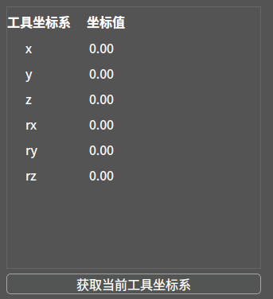

.. centered:: 图表 3-6 工具坐标系设置

如图表3-7所示为工件坐标系设置。修改工具坐标系坐标值后三维场景的工具会根据当前设置进行移动。点击获取当前工具坐标系可以获取当前机器人工具坐标系的坐标值，并同步至离线编程软件。

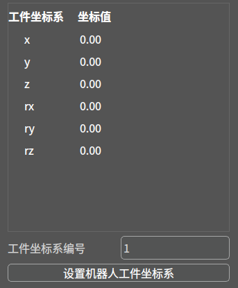

.. centered:: 图表 3-7 工件坐标系设置

	
如图表3-8所示为坐标系选择。选择工具坐标系编号(t0-t14)，选择工件坐标系编号(wo-w14)设置离线编程软件下发指令的坐标系编号。

.. centered:: 图表 3-8 坐标系选择

视觉功能
~~~~~~~~~~~~~~~~~~~

视觉功能组件如表3-9所示。

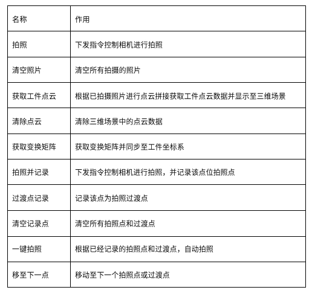

.. centered:: 图表 3-9 视觉功能组件

.. important:: 
    - 	视觉功能需要拍摄七张及以上照片，其中第一张必须为未摆放工件的平面。（建议相机距离工件 60-90mm ）
    - 	一键拍照功能使用前需按顺序记录拍照点位和过渡点位。
    -   一键拍照功能适用于工件摆放位置变化不大的情况，如工件摆放位置发生较大改动，请重新设置拍照点位和过渡点位。

机器人控制
~~~~~~~~~~~~~~~~~~~

机器人控制包括机器人运动和点位保存功能。机器人运动包括关节空间和笛卡尔空间两个部分。
如图表3-10所示，拖动J1-J6滑槽或设置J1-J6关节值实现机器人三维模型关节空间运动。

.. figure:: analysis/022.png
	:align: center
	:width: 3in

.. centered:: 图表 3-10 关节空间运动

如图表3-11所示，点击点击“+”“—”（ 可以通过修改移动步长和转动步长设置步长）或设置笛卡尔空间位姿实现机器人三维模型笛卡尔空间运动。长按0.6s后触发运动，松开或运动到位停止运动。

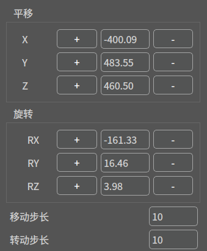

.. centered:: 图表 3-10 笛卡尔空间运动

如图表3-12所示，点击同步位姿按钮获取机器人当前位置并同步至三维场景，点击移至该点按钮实现实际机器人关节空间运动至当前三维场景的位姿。

.. centered:: 图表 3-12 同步位姿和移至该点

其他控制
~~~~~~~~~~~~~~~~~~~

机器人控制主要包括IO控制和外部轴设置两个模块。
如图表3-13所示，该模块可以实现对机器人控制箱中数字输出、模拟输出（0-10v）和末端工具数字输出、模拟输出（0-10v）扩展IO数字输出、模拟输出（0-10v）进行手动控制：
DO 操作：选择端口号，点击开启设置对应DO为高电平，点击关闭设置对应DO为低电平。
AO 操作：选择端口号，右侧输入框输入值（0-100），该数值为百分比，设置 100 即表示设置该 AO 端，点击设置实现对应AO端口设置。

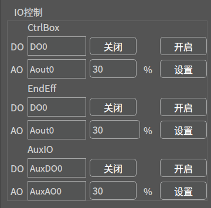

.. centered:: 图表 3-13  IO控制

如图表3-14所示，该模块可以实现对机器人外部轴控制。
加载：根据选择的扩展轴编号加载外部轴协议。
去除使能：外部轴去除使能。
伺服使能：外部轴使能。
正向点动：根据设置的运行速度、加速度、距离进行外部轴正向点动。
反止点动：根据设置的运行速度、加速度、距离进行外部轴反向点动。
停止点动：外部轴停止点动。
零点设置：根据当前的回零方式、寻零速度、箍位速度进行外部轴回零。

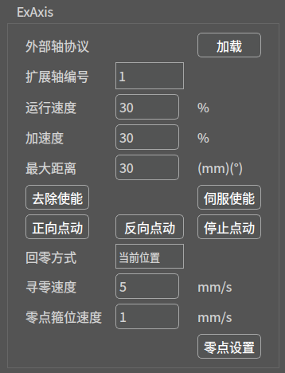

.. centered:: 图表 3-14  外部轴控制

程序编辑
~~~~~~~~~~~~~~~~~~~

程序编辑包括三个部分nodegraph程序编辑器模块、程序模块、点位拾取模块。
如图表3-15所示为nodegraph程序编辑器模块组件，右击鼠标选择需添加组件，选中组件后键盘按Delete删除选中组件。

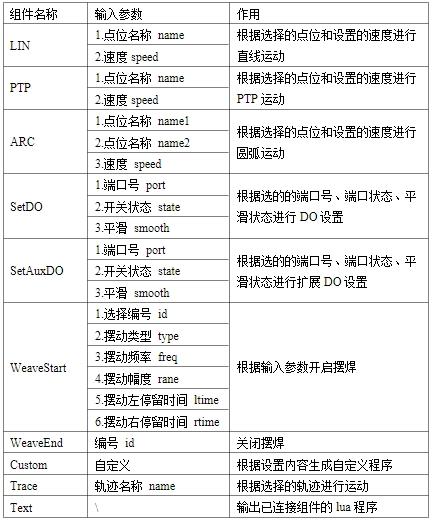

.. centered:: 图表 3-15  nodegraph组件

如图表3-16所示，添加对应的控件后将控件首尾相连，最后一个控件必须为Text控件，根据已经连接的控件生成lua程序。

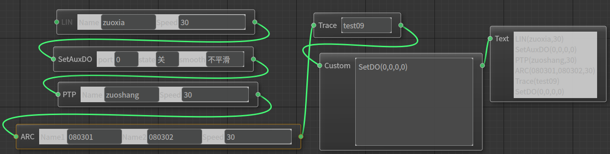

.. centered:: 图表 3-16   nodegraph程序编辑器

如图表3-17所示，nodegrapth编辑完成后会在程序模块显示生成的lua程序。
清除：清除lua程序。
仿真轨迹轨迹生成：根据lua程序在三维场景中生成仿真轨迹。

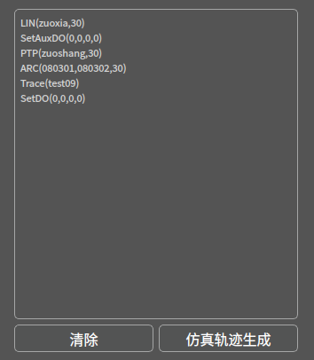

.. centered:: 图表 3-17   程序模块

当拾取方式选为点位拾取时，如图表3-18所示为点位拾取模块。
保存点位：点击三维场景中的工件模型上的点获取点位信息，点击保存点位会保存当前的点位名称和信息。
生成虚拟位姿：根据点位信息生成虚拟机器人位姿。
清除虚拟位姿：清除当前虚拟机器人位姿。
仿真轨迹生成：根据拾取的点位信息和轨迹类别生成仿真轨迹。

.. figure:: analysis/030.png
	:align: center
	:width: 3in

.. centered:: 图表 3-18   点位拾取

.. important:: 
    - 	选点如有误差或需要进行调整，可以设置X、Y、Z、rx、ry、rz后再保存点位。

当拾取方式选为线段拾取时，如图表3-19所示为线段拾取模块。
保存点位：点击三维场景中的工件模型上的线段获取线段信息，点击保存点位会根据当前设置的起点名称和终点名称保存起点和终点。
通过偏移量设置可以设置起点和终点的偏移量。

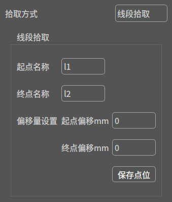

.. centered:: 图表 3-19   线段拾取

仿真
~~~~~~~~~~~~~~~~~~~

仿真包括仿真运行、轨迹数据两个模块。
如图表3-20所示，为仿真运行模块。
运行：根据设置的仿真速度仿真间隔和当前加载的仿真轨迹在三维场景区域进行仿真运行。
停止：停止仿真运行。
清空轨迹：清除当前加载的仿真轨迹。

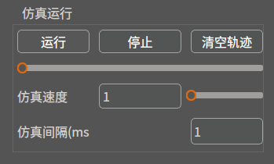

.. centered:: 图表 3-20  仿真运行

	
如图表3-21所示，为轨迹数据模块。
保存：保存当前轨迹。
轨迹加载：加载选择的轨迹。
轨迹删除：删除选择的轨迹。

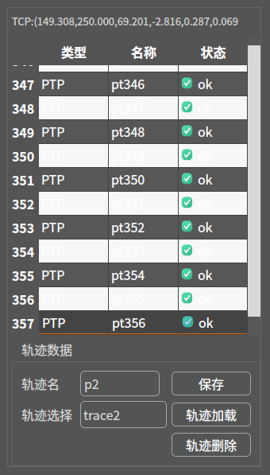

.. centered:: 图表 3-21  轨迹数据

日志管理
~~~~~~~~~~~~~~~~~~~

如图表3-22所示，为日志等级管理模块。
日志等级分为ERROR、WARNING、INFO和DEBUG。ERROR记录ERROR级别的日志，WARING记录ERRO和WARING级别的日志，INFO记录ERROR、WARNING、INFO级别的日志，DEBUG记录所有日志。可以通过修改日志等级以修改当前记录日志情况。

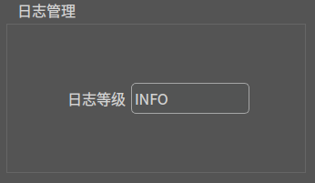

.. centered:: 图表 3-22  日志管理

