AIRLab软件解析
====================
.. toctree:: 
    :maxdepth: 5

AIRLab软件初始界面如图4-1所示，主要分为五个部分。界面中间是主显示框（分为场景显示和相机显示），上方是菜单栏，最左侧是工程树，最右侧是操作区，界面最下端是指令反馈区。本章节将对上述区域的功能和使用方法、AIRLab软件中出现的弹窗及其他页面以及子页面功能进行详细介绍。

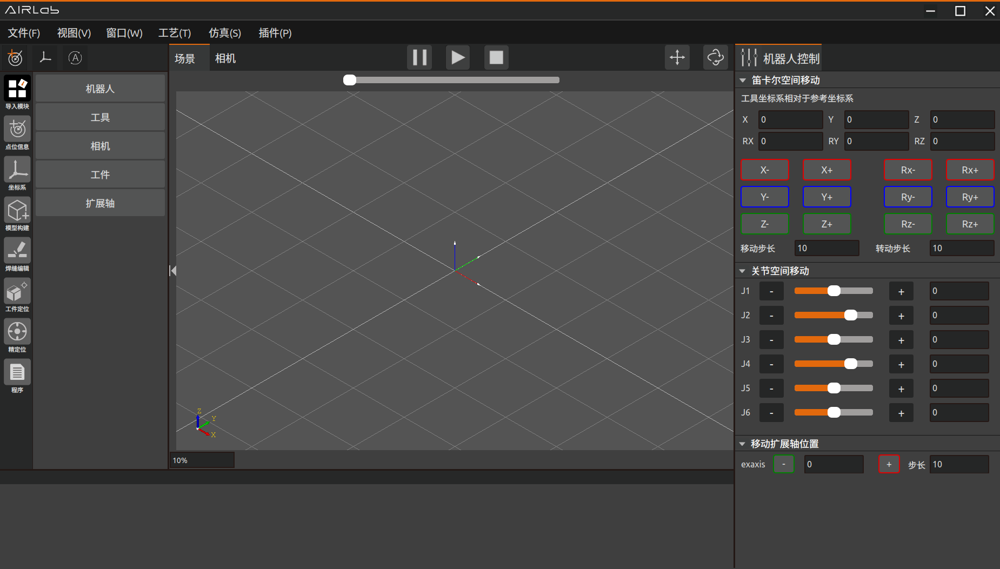

.. centered:: 图4-1 AIRLab软件初始界面

菜单栏
--------------------------
菜单栏包含的所有内容如图4-2所示，主要有按钮：“文件”、“视图”、“窗口”、“帮助”、“日志”、“虚拟”，以及图标按钮（从左到右顺序）：三维球、模式切换、运行状态、ROS2通信、点位新增、暂停运行、开始运行、停止运行。

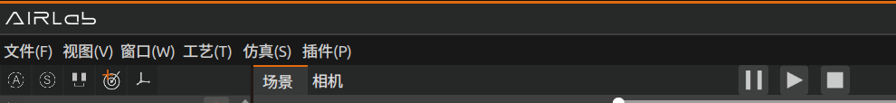

.. centered:: 图4-2 AIRLab菜单栏

文件
~~~~~~~~~~~~~~~~~~~
点击“文件”按钮，会出现“文件设置”弹窗，如图4-3所示。该弹窗包含三个功能：创建、打开或导出一个焊接JSON文件，使用方法如下（详细内容参考弹窗解析章节）：

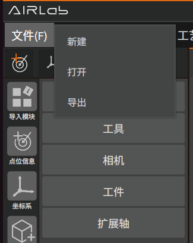

.. centered:: 图4-3 AIRLab菜单栏-文件设置弹窗

新建工程：如果用户需要新建一个焊接工程，将文件类型选择为“焊接”，再点击“新建”创建并打开一个新的焊接程序，如图4-4所示；

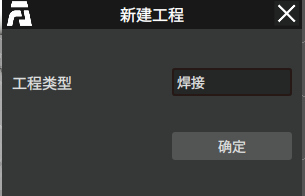

.. centered:: 图4-4 AIRLab菜单栏-文件设置-新建

导入工程：如果用户需要打开已存在的焊接文件，点击“打开”，然后进入工作路径查找需导入的文件后，点击“Open”选择一个文件导入，如图4-5所示；

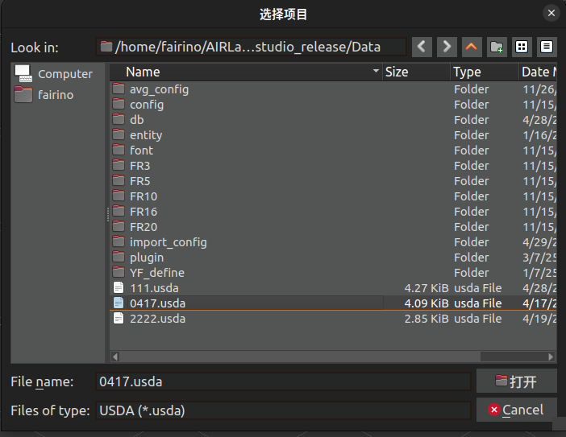

.. centered:: 图4-5 AIRLab菜单栏-文件设置-打开

导出工程：如果用户需要保存当前正在使用的焊接文件，点击“导出”，选择导出路径，设置导出文件名称后，点击“Save”当前的焊接工程将被保存，如图4-6所示。

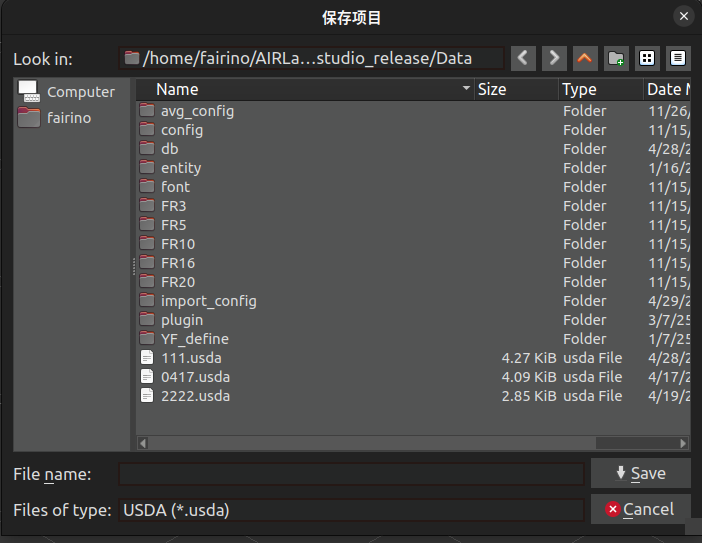

.. centered:: 图4-6 AIRLab菜单栏-文件设置-导出

视图
~~~~~~~~~~~~~~~~~~~
视图包含12个功能，如图4-7所示，主要功能是调整主显示框中机器人的观察视角。分别为：Zoom、Pan、Rotate、Reset、Fit all、前视、后视、俯视、仰视、左视、右视、全视。

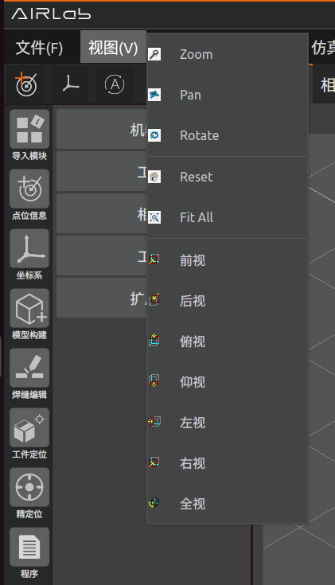

.. centered:: 图4-7 AIRLab菜单栏-视图

视图的具体功能说明见表4-1。

.. centered:: 表4-1 视图功能说明表

.. image:: analysis/4-1.png
	:align: center
	:width: 6in

窗口
~~~~~~~~~~~~~~~~~~~
“窗口”包含7个二级选项，分别是“机器人控制”、“其他控制”、“仿真”、“调试页面”、“程序配置”、“多语言设置”、“软件升级”。点击不同的选项，AIRLab软件右侧的操作区会显示对应的功能页面，如图4-8。其中“机器人控制”页面如图4-9，“其他控制”页面如图4-10，“仿真”页面如图4-11，“调试页面”如图4-12，“程序配置”页面如图4-13，“多语言设置”页面如图4-14所示。

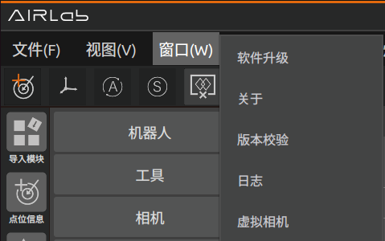

.. centered:: 图4-8 AIRLab菜单栏-窗口

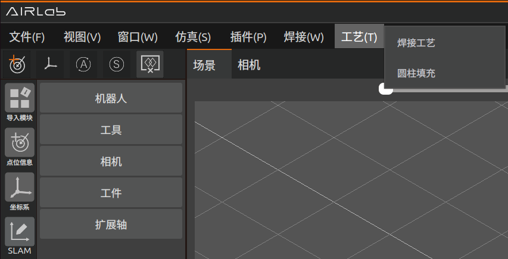

.. centered:: 图4-9 AIRLab菜单栏-窗口-机器人控制

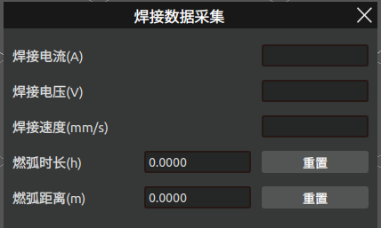

.. centered:: 图4-10 AIRLab菜单栏-窗口-其他控制

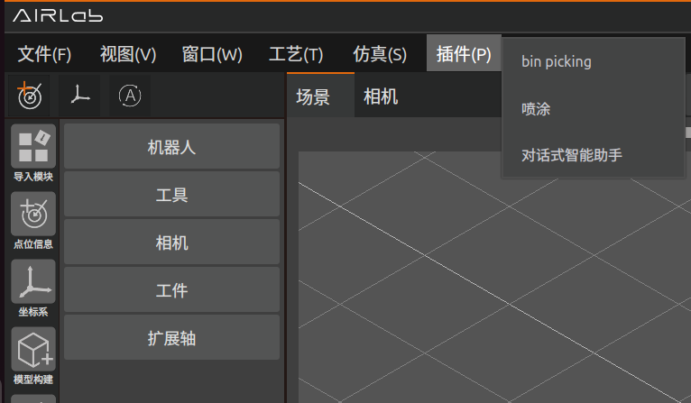

.. centered:: 图4-11 AIRLab菜单栏-窗口-仿真

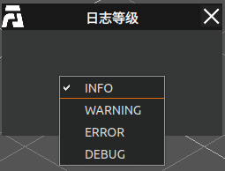

.. centered:: 图4-12 AIRLab菜单栏-窗口-调试页面

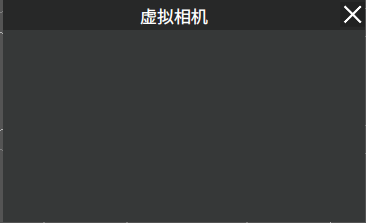

.. centered:: 图4-13 AIRLab菜单栏-窗口-程序配置

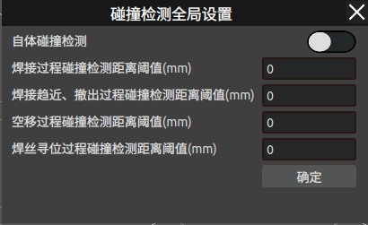

.. centered:: 图4-14 AIRLab菜单栏-窗口-多语言设置

帮助
~~~~~~~~~~~~~~~~~~~

目前帮助菜单下只开放了“关于”按钮，点击该按钮会查询到当前AIRLab软件、中间层和视觉的版本信息和发布日期，如图4-15所示。

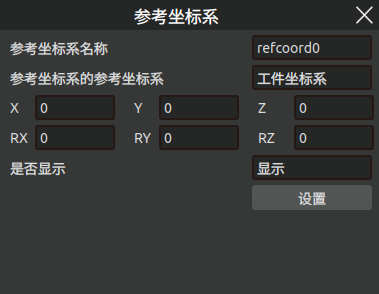

.. centered:: 图4-15 AIRLab菜单栏-窗口-多语言设置

日志
~~~~~~~~~~~~~~~~~~~

日志用于记录系统的运行过程及异常信息，可以快速定位问题。点击该按钮会出现一个“日志等级”弹窗。日志记录分为4个等级，分别是INFO、WARNING、ERROR、DEBUG，选择日志等级后设置当前日志等级（默认INFO）。如图4-16所示，具体含义见表4-2。

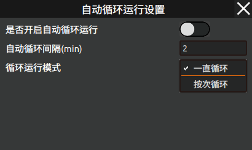

.. centered:: 图4-16 AIRLab菜单栏-日志

.. centered:: 表4-2 视图功能说明表

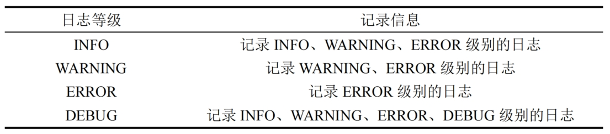

仿真
~~~~~~~~~~~~~~~~~~~

该按钮用于切换仿真机器人和实体机器人，使用前需成功导入或创建一个JSON文件(否则会出现图4-17中的错误信息)，且与实体机器人成功建立Ros2通信连接。完成上述前提后点击该按钮就可以实现虚拟机器人和实体机器人二者之间的切换，切换实机后如图4-18。仿真场景：用于仿真不会实时同步更新三维场景中机器人位置；真机场景：更新当前工具坐标系、DH补偿参数与实际机器人一致，三维场景中机器人位置与实体机器人一致。

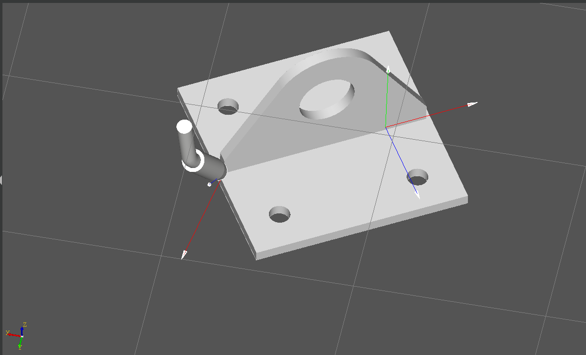

.. centered:: 图4-17 虚拟切换时未导入JSON文件
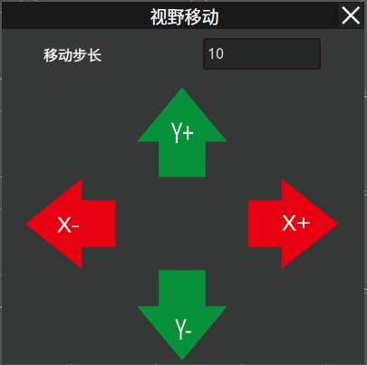

.. centered:: 图4-18 实机切换后AIRLab显示

插件
~~~~~~~~~~~~~~~~~~~
为增强AIRLab软件的可扩展性和用户体验，AIRLab提供了插件模块，允许用户根据自己的需求，开发出符合自己需求的插件。这些插件可以通过动态库（.so）加载到AIRLab软件中，从而实现对软件功能的扩展和增强。现有的插件包括binpick、喷涂、对话式智能助手三个功能模块。各个插件介绍和具体操作详见第五章插件部分。

三维球
~~~~~~~~~~~~~~~~~~~

暂未开放。

模式切换
~~~~~~~~~~~~~~~~~~~

AIRLab软件与实体机器人建立ROS2通信后，用户点击该按钮可以切换实体机器人的模式状态。A代表当前机器人处于自动模式，M代表当前机器人处于手动模式。此外，在自动模式下点击该图标会将机器人模式切换至手动，在手动模式下点击该图标会将机器人模式切换至自动。

运行状态
~~~~~~~~~~~~~~~~~~~

该图标按钮用于实时展示当前实体机器人的运行状态，其中S表示机器人停止运行，R表示机器人正在运行程序中，P表示机器人处于暂停运行状态。

ROS2通信
~~~~~~~~~~~~~~~~~~~

该图标按钮用于实时监测相机和Ros2的连接状态，当相机和Ros2的通信均连接成功或者Ros2连接成功而相机连接失败时，图标都会显示连接成功，如图4-19a；否则图标显示连接失败，如图4-19b。

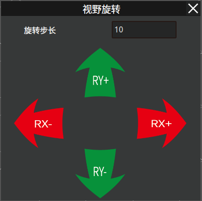

.. centered:: 图4-19 ROS2通信连接成功（左）未成功（右）

点位新增
~~~~~~~~~~~~~~~~~~~

该功能用于快速记录机器人当前点位，点击该按钮后，工程树中的“机器人”节点下会新增一个点位targetX，X的作用是防止新增点位重名，如图4-20所示。该点位的j1、j2、j3、j4、j5、j6、x、y、z、rx、ry、rz信息为机器人当前的关节坐标和笛卡尔坐标。

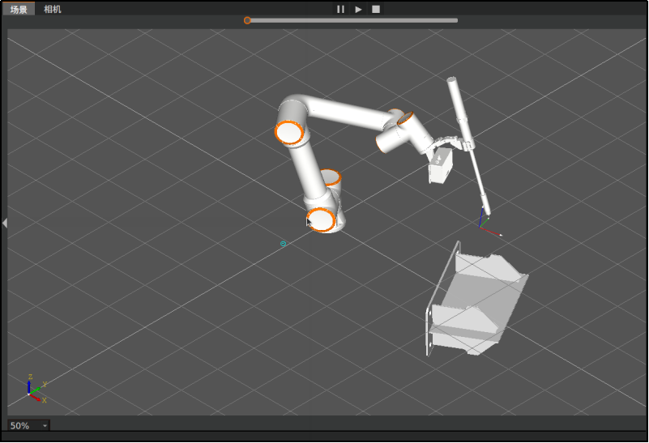

.. centered:: 图4-20 AIRLab菜单栏-点位新增

暂停程序
~~~~~~~~~~~~~~~~~~~

点击该按钮会立即暂停正在运行程序的机器人，再次按下该按钮后将恢复机器人继续运行暂停前的程序。

开始运行
~~~~~~~~~~~~~~~~~~~

点击该按钮，实体机器人会先运行工程树中“工件定位”节点下的所有指令，工件定位成功后机器人开始运行“模板程序”节点下的所有焊缝程序，如图4-21，焊缝识别成功后，机器人执行“程序”节点下的所有焊接指令。

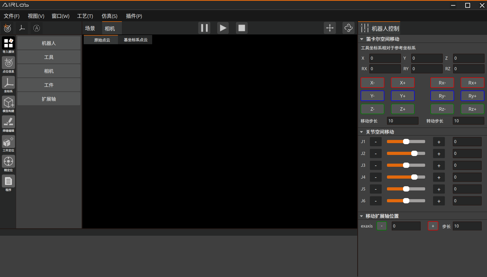

.. centered:: 图4-21 开始运行按钮功能

停止运行
~~~~~~~~~~~~~~~~~~~

点击按钮会立即停止正在运行程序的机器人，该按钮与暂停/恢复按钮的区别在于，再次按下该按钮，机器人无法恢复运行，只能通过开始运行按钮重新开始。

主显示框
--------------------------

主显示框分为场景显示和相机显示，其中场景主要显示机器人、工具、工件、扩展轴模型等，如图4-22。相机主要显示获得的点云图，如图4-23。

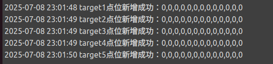

.. centered:: 图4-22 AIRLab主显示框-场景显示

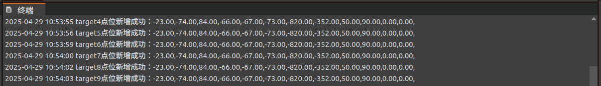

.. centered:: 图4-23 AIRLab主显示框-相机显示

指令反馈区
--------------------------

指令反馈区。分为工作目录和终端两个选项，其中工作目录显示当前的机器人型号、工具、工件模型，如图4-24；终端显示程序指令执行结果和返回的机器人错误信息，如图4-25。

.. figure:: analysis/24.png
	:align: center
	:width: 4in

.. centered:: 图4-24 AIRLab指令反馈区-工作目录

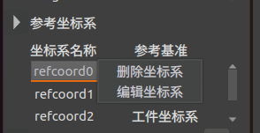

.. centered:: 图4-25 AIRLab指令反馈区-终端

操作区
--------------------------

笛卡尔空间移动
~~~~~~~~~~~~~~~~~~~

该区域包括工具坐标系、工件坐标系、工具坐标系相对于参考坐标系以及长按点动触发、移动步长和转动步长设置四部分内容，如图4-26所示。

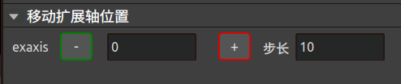

.. centered:: 图4-26 AIRLab操作区-笛卡尔空间移动

- 工具坐标系部分。工具坐标系的下拉列表中共有15个编号tool0-tool14，选择对应的坐标系（坐标系名称可自定义）后，在下方X、Y、Z、Rx、Ry、Rz的文本框中会显示对应坐标值，改变上述6个文本框内的数值，场景显示框中虚拟机器人的工具坐标系会相应变化。点击“获取当前工具坐标系”按钮用于获取实体机器人当前的工具坐标系。

- 工件坐标系部分，工件坐标系的下拉列表同样有15个编号work0-work14，设置文本框X、Y、Z、Rx、Ry、Rz中值会改变AIRLab软件场景显示框中工件的位置。点击“设置工件坐标系”按钮，机器人会将三维场景中的工具坐标系下发至实际机器人并应用。

.. important:: 
     用户在设置工具/工件坐标系编号时，需与Web端当前机器人使用的工具坐标系编号和工件坐标系编号一致。

- 工具坐标系相对于参考坐标系部分，该部分显示的是工具坐标系相对于参考坐标系的值。

- 长按点动触发、移动步长和转动步长设置部分。如图4-27所示，如果当前导入的机器人模型是实体机器人，长按X+按钮，实体机器人会执行X+点动指令；如果当前导入的机器人模型不是实体机器人，长按X+按钮，仿真机器人会执行X+点动指令。

.. important:: 
     通过长按按钮控制机器人的JOG点动，若在机器人运行中松开按钮，机器人会立即停止运动；若一直按住按钮不松开，机器人会运行移动步长设置的值后停止运动。X-、Y+、Y-、Z+、Z-按钮的操作同理。如果是长按Rx+、Rx-、Ry+、Ry-、Rz+、Rz-按钮，其他方面不变，只是机器人将按照设置的转动步长值运动。

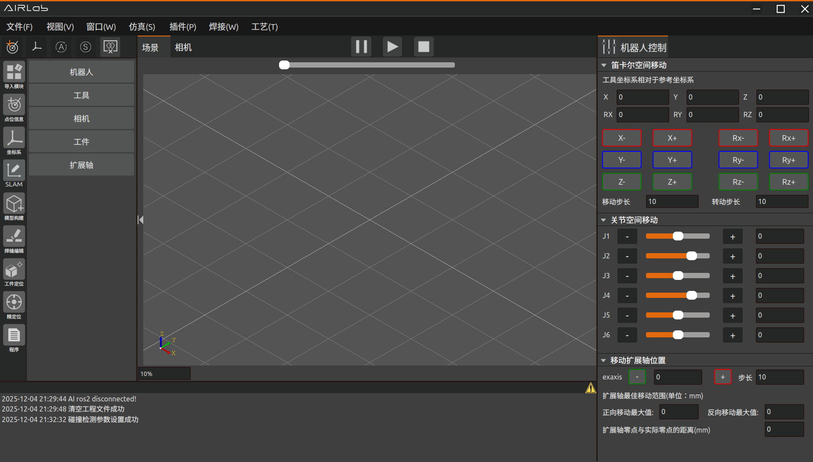

.. centered:: 图4-27 AIRLab操作区-长按点动

关节空间空间移动
~~~~~~~~~~~~~~~~~~~

该区域包括关节J4-J6的12个关节坐标长按触发按钮，6个关节坐标变化文本框以及6个关节滑块三部分内容，如图4-28。

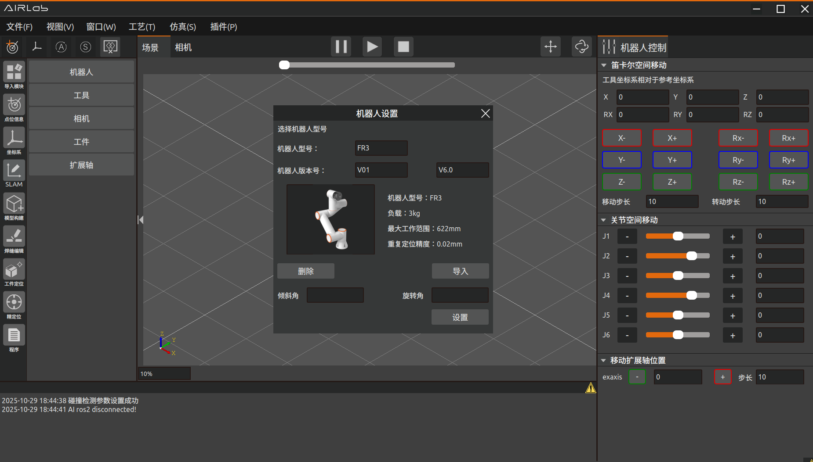

.. centered:: 图4-28 AIRLab操作区-关节空间空间移动

- 长按J1的“+” 或“-”按钮，可以在手动模式和关节坐标系下通过长按“+”或“-”按钮控制实体机器人J1关节的运动。其他关节的“+” 或“-”按钮操作同理。

.. important:: 
    通过长按按钮控制机器人运行，若在机器人运行中松开按钮，机器人会立即停止运动；若一直按住按钮不松开，机器人会运行移动步长/转动步长的设置值后停止运动。

- 6个文本框会实时更新显示机器人6个关节的角度值。此外，编辑6个文本框中的数值也可以达到控制机器人关节运动的目的（编辑时需要注意不能超出机器人的关节角度软限位）。

- 关节滑槽的作用是用户可以通过滑动关节滑槽实现机器人各关节的运动，滑槽代表的关节角度通过文本框内的数值显示。

移动扩展轴设置
~~~~~~~~~~~~~~~~~~~

该部分包括“exaxis+”、“exaxis-”以及步长设置框，如图4-29。“exaxis+”、“exaxis-”的功能与工具坐标系下的点动X+、X-类似，通过上述两个按钮可以控制扩展轴的运动。长按按钮控制扩展轴运行，若在扩展轴运行中松开按钮，扩展轴会立即停止运动；若一直按住按钮不松开，扩展轴会运行步长设置框设置的值后停止运动。

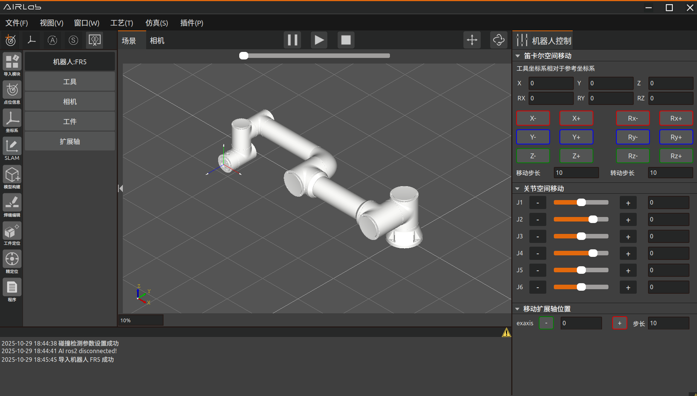

.. centered:: 图4-29 AIRLab操作区-移动扩展轴位置

工程树
--------------------------
工程树一般包括5个对象，分别是：机器人、相机、模板程序、工件定位、程序。下面从新建一个焊接文件的角度介绍工程树的功能和用法。

新建JSON文件
~~~~~~~~~~~~~~~~~~~

点击菜单栏中的“文件”，在出现的“文件设置”弹窗中选择新建，工程树中会出现一个模板工程。包括机器人、相机、模板程序、工件定位、程序5个节点对象，其中节点“机器人”下已存在机器人FR5，节点“相机”下已存在相机“XYZ-ALM”，如图4-30。

.. figure:: analysis/30.png
	:align: center
	:width: 6in

.. centered:: 图4-30 AIRLab工程树-新建

导入机器人模型
~~~~~~~~~~~~~~~~~~~

鼠标双击选中工程树中的 “机器人”节点，AIRLab软件最右侧会切换“机器人导入设置”子页面。在机器人型号下拉框中选择需要的机器人模型（例如FR3），点击“导入”按钮，如图4-31所示。工程树中“机器人”节点下面会出现导入成功的FR3节点，指令反馈区返回“导入机器人FR3成功”结果，场景显示框出现FR3机器人模型。

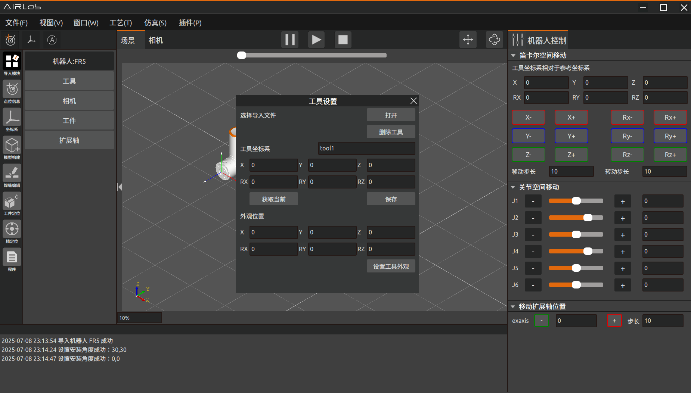

.. centered:: 图4-31 AIRLab工程树-导入机器人

.. important:: 
    如果需要更换机器人型号，首先要删除工程树中已导入的机器人模型FR5，具体操作如下：鼠标选中FR5节点然后右击，出现选项“Remove Item”，点击该选项，FR5即被删除成功，底端指令反馈区返回“删除机器人FR5成功”，如图4-32。

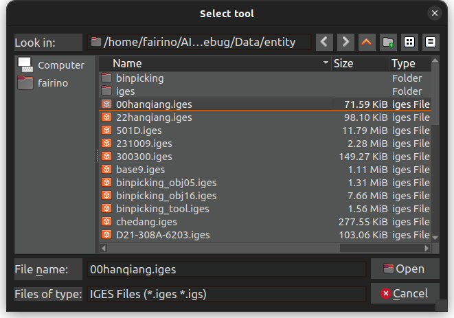

.. centered:: 图4-32 AIRLab工程树-更换导入的机器人型号

导入工具
~~~~~~~~~~~~~~~~~~~

鼠标选中工程树中“FR3”节点，AIRLab软件最右侧会切换“工具导入设置”子页面，点击“打开”按钮，在出现的“Select tool”弹窗中选择需要的工具即可，如图4-33。工具成功导入后，指令反馈区返回“导入工具zhi-io-y.iges成功”结果，如图4-34所示。

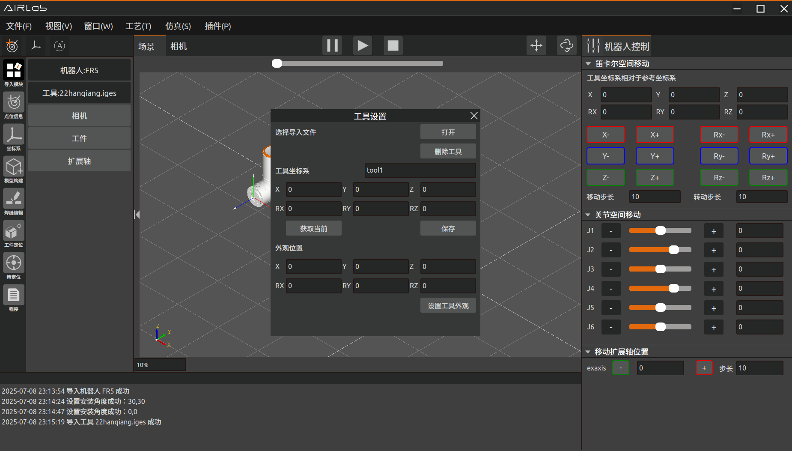

.. centered:: 图4-33 AIRLab工程树-导入工具

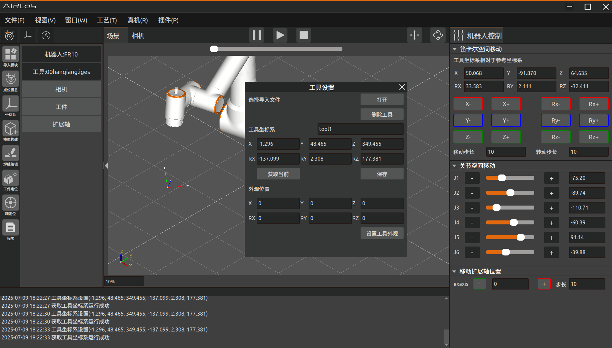

.. centered:: 图4-34 AIRLab工程树-工具导入成功

如果需要更换导入的工具，必须先将已导入的工具删除，再重新导入新的工具，否则会提示错误“同一场景暂只支持一个工具模型！”，如图4-35所示。删除工具的操作同样是鼠标选中工程树中导入的工具节点，然后右击选择选项“Remove Item”，点击完成工具的删除，指令反馈区同样会返回工具删除的结果，删除成功后用户才可以重新开始导入工具。

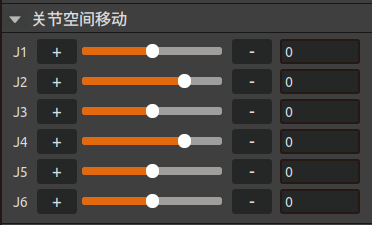

.. centered:: 图4-35 AIRLab工程树-重复导入工具模型

导入相机
~~~~~~~~~~~~~~~~~~~

工程树中的初始相机型号为“XYZ-ALM”，如果需要更换其他型号的相机，鼠标选中工程树XYZ-ALM节点，右击选择选项“Remove Item”，点击即完成XYZ-ALM型号相机的删除。重新导入其他型号相机操作如下：点击鼠标选中工程树中“相机”节点，AIRLab软件最右侧会切换“相机选择”子页面，如图4-36所示，在选择型号的下拉框中点击需要的相机型号，再点击“确定”按钮即完成新型号相机的导入。

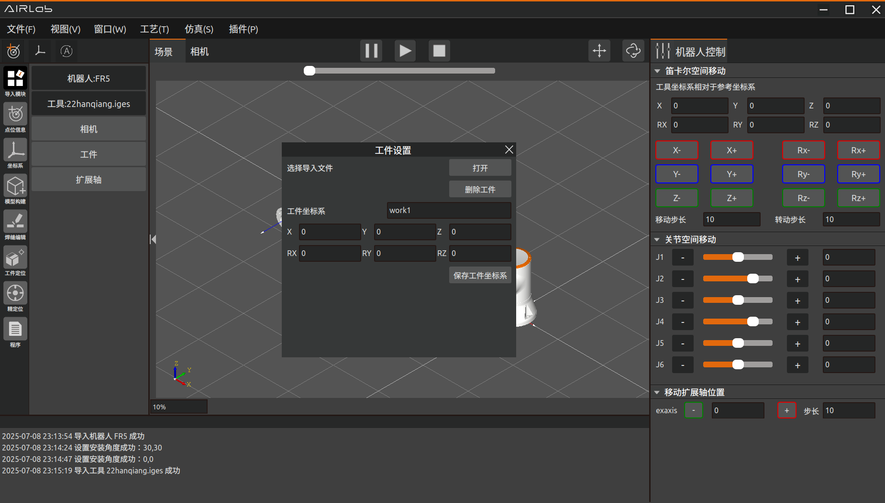

.. centered:: 图4-36 AIRLab工程树-导入相机

无模型工件建模
~~~~~~~~~~~~~~~~~~~
无模型工件建模是针对待焊接的工件模型是未知的情况。如果待焊接工件在数据库是已知的，请跳过本节，进入下一节“导入工件”。如果待焊接的工件（形状和焊缝）是未知的，需要先对工件进行模型及焊缝数据库的构建，使用构建完成的模型数据库，切入到平均模型焊缝识别解决方案，进行焊接工作。因此本节以一个无模型的工件为例，介绍如何利用无模型工件建模功能对无模型工件进行建模的具体操作步骤。

Step1：首先用户在实际场景中放置无模型工件，如图4-37所示；

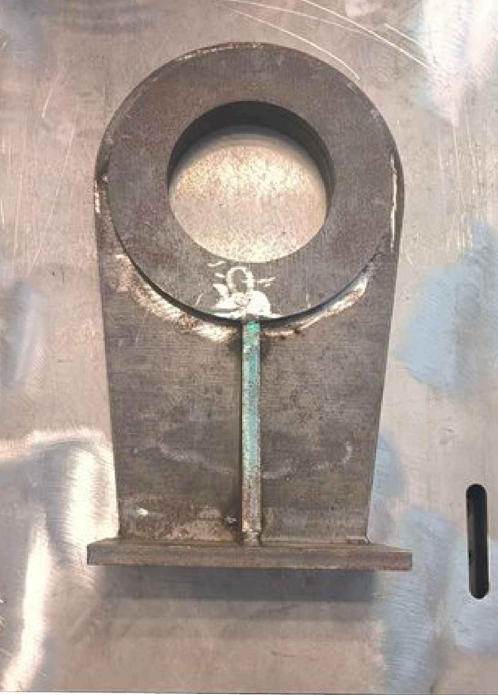

.. centered:: 图4-37 无模型工件

Step2：工程树创建无模型工件构建模板程序，增加“拍照”及“模型构建”等子节点，如图4-38所示。

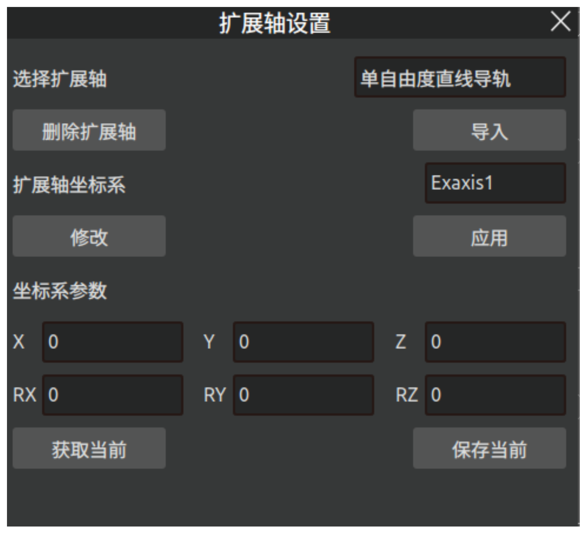

.. centered:: 图4-38 增加拍照和模型构建节点

增加拍照点位节点，拍照点位可以通过手动示教或基于点云来获取拍照点位。下面对这两种获取拍照点位的方式进行介绍。

1. 手动示教拍照点位
   
手动示教拍照点位是由操作人员手动调整相机和工件相对位置并记录点位。拍照点位的示教原则是相机能够清晰完整的拍摄到无模型工件的各个位置，特别是需要焊接的焊缝位置。如图4-39所示

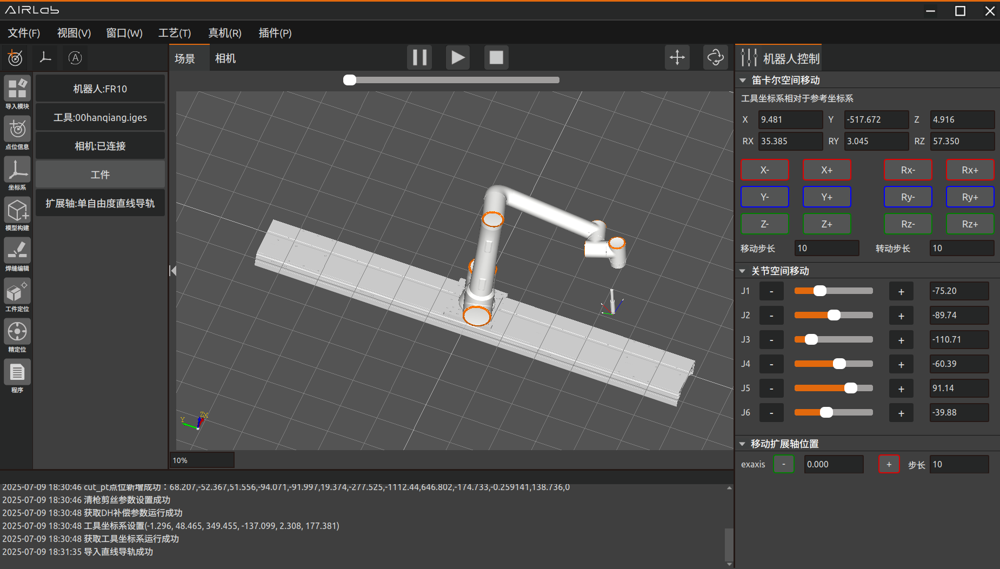

.. centered:: 图4-39 不同角度下的工件拍照点位

.. important:: 
	在示教拍照点位时，如果是待焊接的焊缝，我们建议设置两个或两个以上不同的点位对该焊缝进行拍照，如图4-40所示，提高焊缝构建的准确性。

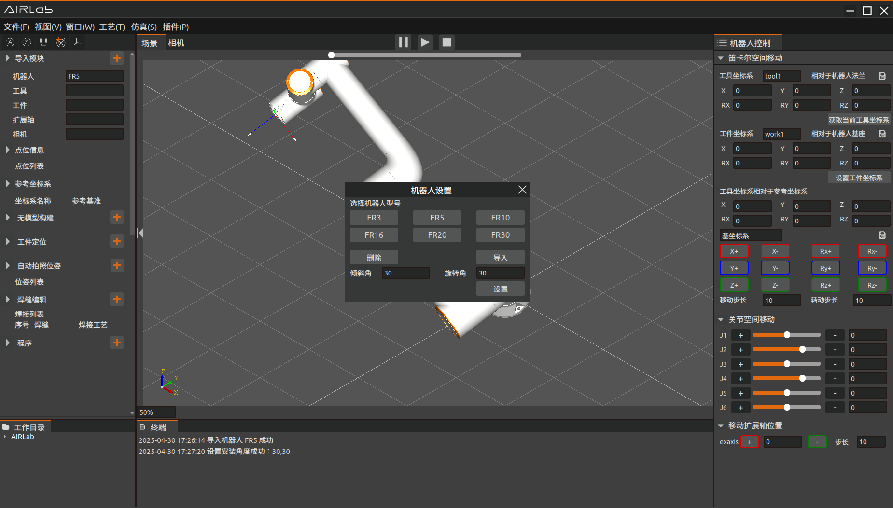

.. centered:: 图4-40 同一条焊缝的两个不同位置拍照点位

1. 基于点云获取拍照点位

基于点云获取拍照点云现阶段只支持无模型直线工件构建。需要先对工件进行粗定位点云采集。创建工件定位程序，增加“拍照”及“粗定位”等子节点，如图4-41所示。

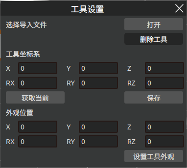

.. centered:: 图4-41 创建工件定位程序

之后对程序进行配置。点击工程树“拍照”子节点，子页面跳转到“拍照设置”,配置拍照类型为“无模型直线”；

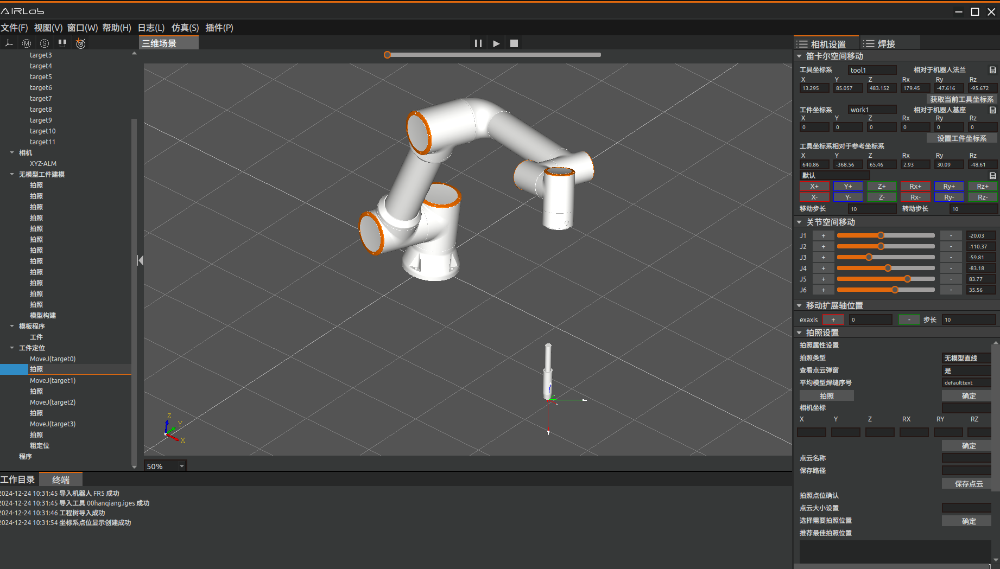

.. centered:: 图4-42 拍照设置

点击工程树“粗定位”指令节点，子页面跳转到“粗定位指令配置”，对算法参数进行配置；定位算法目前只有一种算法，定位规则选择“粗定位-无模型”。

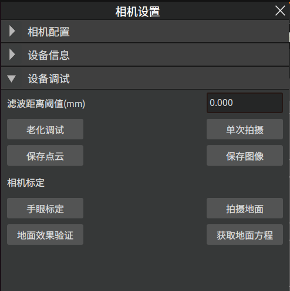

.. centered:: 图4-43 粗定位设置

配置完成后点击“工件定位”节点，在工件定位程序子页面点击运行程序开始运行工件定位模板程序；程序运行至“拍照”点位，页面弹出“已采集点云”弹窗并显示点云数据，进行多次“拍照”三维场景中显示拟合后的点云数据，如图4-44-图4-46所示。

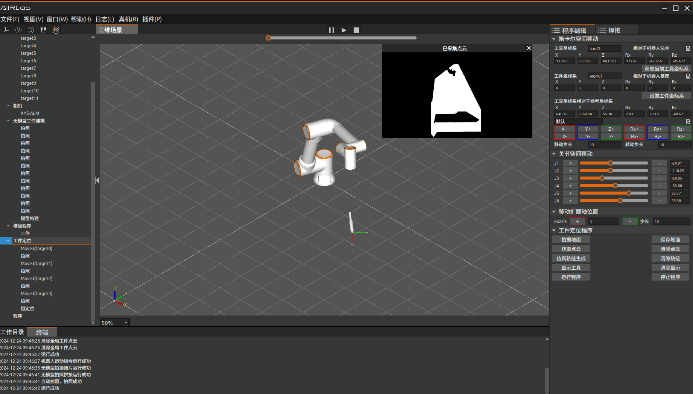

.. centered:: 图4-44 粗定位获取点云第一次拍照

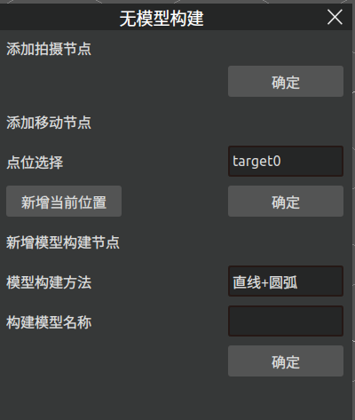

.. centered:: 图4-45 粗定位获取点云第二次拍照

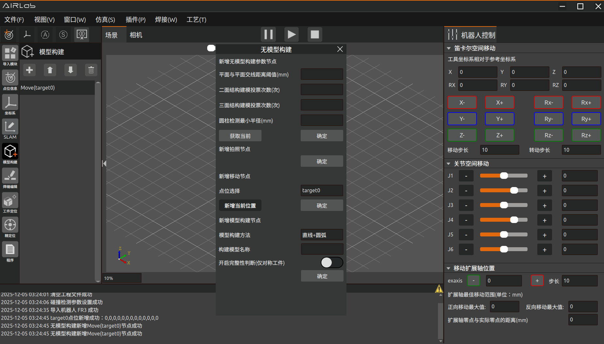

.. centered:: 图4-46 粗定位获取点云第三次拍照
	
程序运行结束后，三维场景中显示出完整的RGB深度点云，识别出的角点，如图4-47是构建的工件点云模型。

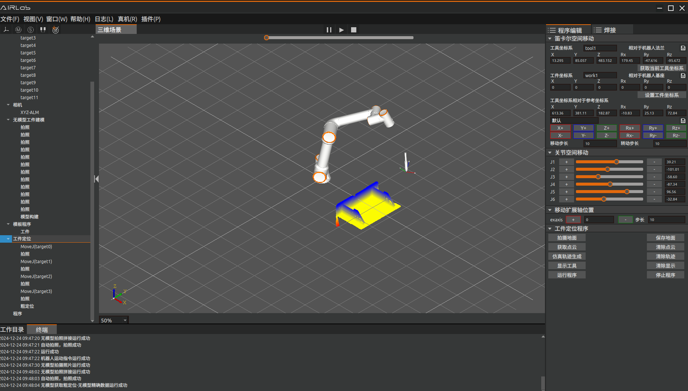

.. centered:: 图4-47 构建的工件点云模型

之后根据三维场景显示的深度点云与特征角点信息，点击“拍照”节点，在构建的模型上选择需要拍照的位置（一般选择角点的位置）；查看自动计算得到的最佳拍照位置和点位信息，根据需要不调整或进行微调后输入点位名称后确认保存该点位，工程树出现相应点位，如图4-48所示。同时当前拍照子节点上一节点生成moveJ(targetT)，其中targetT是获取的拍照点位名称。

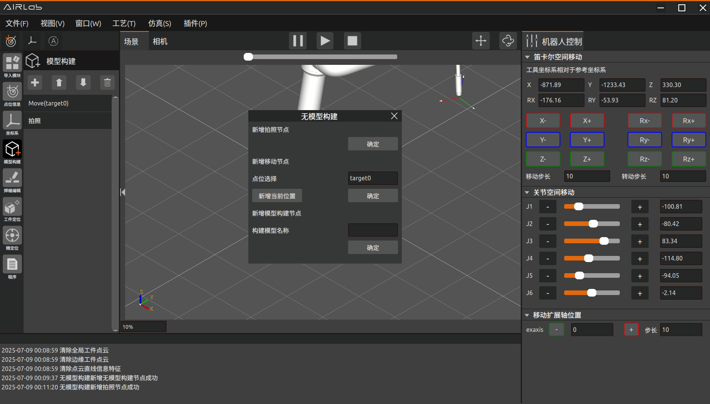

.. centered:: 图4-48 获取拍照点位

重复以上步骤，依次添加各个拍照点位，直至完成无模型工件构建模板程序；
手动示教或自动获取所有拍照点位后，增加拍照点位节点MoveJ(targetT)；“无模型工件构建”程序创建完成，如图为创建的无模型工件构建程序。

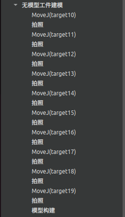

.. centered:: 图4-49 无模型工件建模程序

Step3：“无模型工件构建”程序配置；
- 点击“无模型工件建模”程序“拍照”子节点，子页面跳转到“拍照设置”，根据当前焊缝类型配置拍照类型为无模型直线或无模型圆弧；
- 点击工程树“模型构建”指令节点，子页面跳转到“模型构建”，对算法参数和工件名称进行配置；
- 对程序配置-无模型构建进行配置，配置为“重新构建”；

配置完成后完成无模型工件构建模板程序创建及配置，之后运行无模型工件建模程序即可得到无模型工件模型数据。具体见4.7.14节无模型工件建模程序内容。

.. important:: 
	对于同一种无模型工件，构建成功后不建议再对其重新构建，因为无模型构建得到的焊缝编号在每次构建中可能会发生变化！如果必须要重新构建，请在构建后检查和修改模板程序的内容。

导入工件
~~~~~~~~~~~~~~~~~~~
鼠标点击工程树中“模板程序”下的节点“工件”， AIRLab软件最右侧会切换“工件导入设置”子页面，点击“打开”按钮，在出现的“Select wobj”弹窗中选择需要的工件即可，如图4-50。导入成功后，工程树的“工件”节点下会增加导入工件的子节点，底端指令反馈区会返回“导入工件 T24-150404-04.iges 成功”的结果，如图4-51所示。

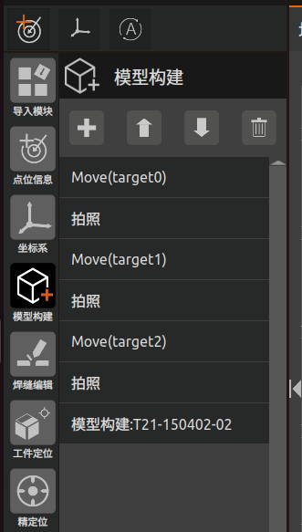

.. centered:: 图4-50 AIRLab工程树-导入工件

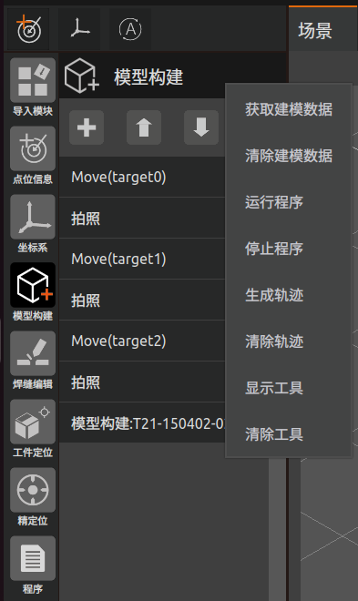

.. centered:: 图4-51 AIRLab工程树-工件导入成功

以上是工程树中涉及的所有导入需求，下面介绍工件定位的功能和使用方法。

工件定位
~~~~~~~~~~~~~~~~~~~
机器人在运行焊接程序前需要完成导入和工件定位这两项工作，本节将在完成导入的基础上介绍工件定位的内容，主要分为两部分：一是用户如何创建自己的工件定位程序；二是用户应该如何运行创建成功的工件定位程序。

第一部分：如何创建工件定位程序

鼠标选中工程树中的“工件定位”节点，右击会出现以下选项，如图4-52所示。工件定位中主要使用的指令有“MoveJ”、“拍照”、“粗定位”，在工件定位中，机器人需要通过MoveJ指令运行到合适的位置去拍摄工件的照片，然后利用拍摄的照片通过“粗定位”功能得到工件与机器人的实际相对位置。因此，创建工件定位程序的第一步应该是先确定机器人拍照的位置，并记录这些点位。

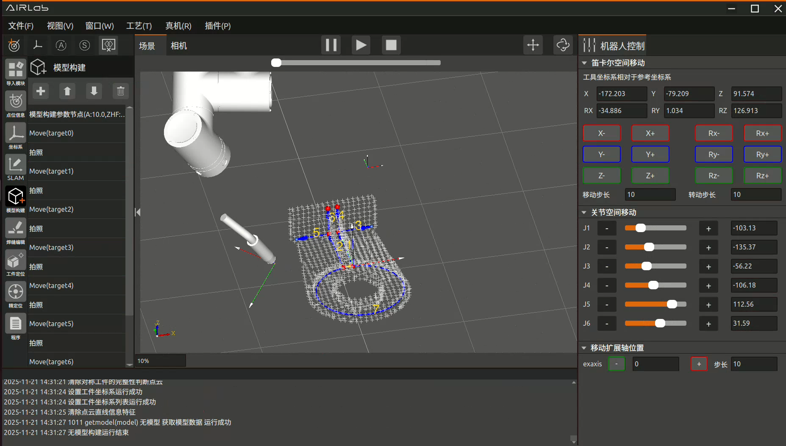

.. centered:: 图4-52 AIRLab工程树-工件导入成功

Step1：记录相机拍照点位。

操作方法：可以通过手动模式将机器人移动到合适的拍照位置，然后点击AIRLab软件菜单栏中的新增点位图标按钮，即可在工程树“机器人”节点下增加点位target0，指令反馈区会返回点位新增的结果，如图4-53所示。其中点位信息的前6位数字代表机器人在该位置的关节坐标，后6位数字代表机器人的笛卡尔坐标。其他点位的新增方法同target0一致。双击工程树节点可自定义节点名称(自定义名称请以target为前缀)，点击工程树中点位节点会跳转至点位修改子界面，在该界面可以实现对当前保存点位置的修改。

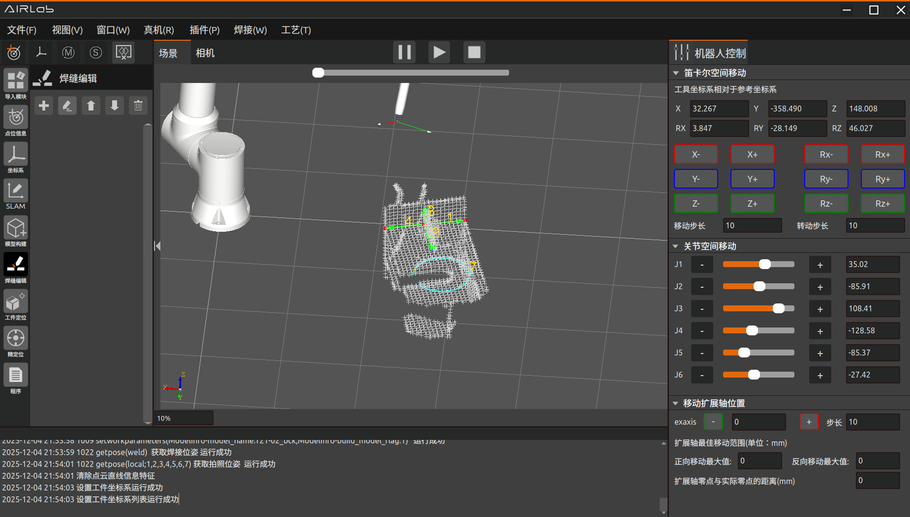

.. centered:: 图4-53 AIRLab工程树-新增点位

.. important:: 
	如果用户在这里需要修改已增加的点位信息，例如target0。操作如下：点击鼠标选中工程树中的子节点“target0”， AIRLab软件最右侧会切换“点位信息修改”子页面，在这里修改target0的名称、关节坐标、笛卡尔坐标等信息，修改完成后点击按钮“示教当前位置”即可。此时，工程树中的target0节点信息会更新且在指令反馈区返回点位修改结果。详细内容可参考子页面解析章节-点位修改。

Step2：新增点位成功后，创建工作定位程序。

鼠标选中“工件定位”节点，右击选择MoveJ后，工程树中“工件定位”节点下会增加“MoveJ”子节点。鼠标选中该节点，右击会出现两个选项：“关联的目标点”和“Remove Item”，选择“关联的目标点”，会出现工程树中已有的点位名称。根据实际情况选择关联的点位，其中MoveJ和MoveL指令只需要一个目标点，MoveC和Circle指令需要关联2个点位。如图4-54所示，该条程序的含义是机器人将通过MoveJ运动从当前位置移动到target0点位。

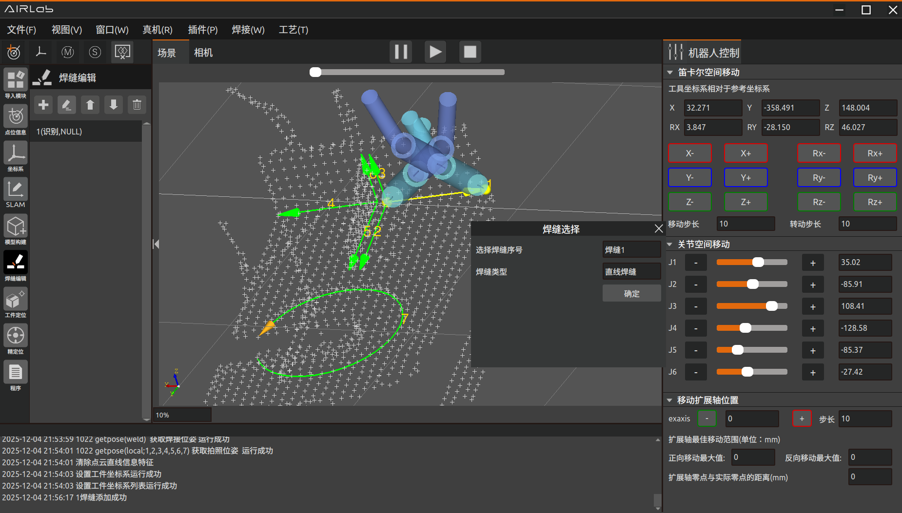

.. centered:: 图4-54 AIRLab工程树-新增MoveJ指令

如果用户需要删除该条程序指令，选中指令并右击选择“Remove Item”即可。

Step3：机器人到达点位target0后开始对工件进行拍照。

操作方法：鼠标选中工程树中的“工件定位”节点，右击选择“拍照”，点击即可在工件定位节点中添加该条指令，如图4-55所示，详细参数设置见子页面解析章节。其他拍照点位的添加方法不变，用户可以根据实际需要添加任意数量的MoveJ和拍照指令。

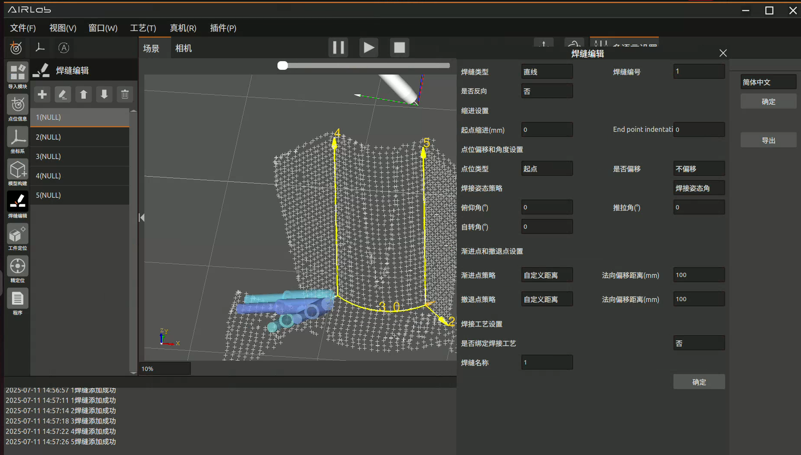

.. centered:: 图4-55 AIRLab工程树-新增拍照指令

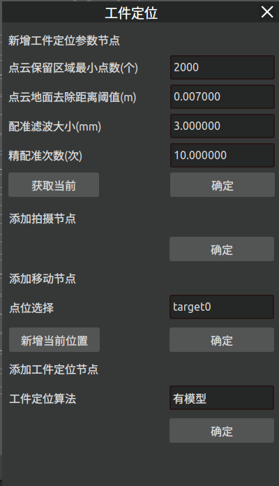

.. centered:: 图4-56 AIRLab工程树-新增粗定位指令

第二部分：如何运行创建成功的工件定位程序

操作方法：鼠标选中工程树中的“工件定位”节点，AIRLab软件最右侧会切换“工件定位程序”子页面。先通过点击“仿真轨迹生成”按钮查看工件定位程序的仿真轨迹曲线，进而确认创建的工件定位程序是否合理。之后点击“清除轨迹”按钮清除轨迹。对于仿真轨迹合理的工件定位程序，点击“运行程序”按钮，机器人将开始运行工程树中“工件定位”节点下的所有指令。在机器人的运行过程中，可以随时点击“停止程序”按钮，机器人会立即停止运行工件定位程序。详细的操作说明见子页面解析章节。

模板程序
~~~~~~~~~~~~~~~~~~~

工件定位程序运行成功后，机器人的控制器会获取实际的工件坐标系。随后可以开始运行工程树中的焊缝模板程序进行精确的焊缝定位和焊接参数设置，本节将介绍如何创建并运行工程树中“模板程序”节点下的程序指令，以及机器人按钮盒与模板程序的交互功能使用方法。

第一部分：创建模板程序内容

Step1：创建“焊缝识别”节点

操作方法：鼠标点击导入的工件子节点，本例是“T23-150403-04.iges”节点，如图所示。右击选择“焊缝识别”，即在“T23-150403-04.iges”节点下新增焊缝识别节点成功。

首先示教对焊缝进行识别的拍照点位，保证相机能够清晰完整地将所有焊缝拍摄下来；其次点击工程树中“焊缝识别”节点创建“MoveJ”和“拍照”指令，右击工程树中添加的MoveJ节点，设置关联目标点，再点击拍照节点，在右侧触发的子页面“拍照设置”中设置拍照模型为“平均模型拍照”，在子页面中的“平均模型焊缝序号”文本框中输入相机能够识别到的所有焊缝序号，如图4-57所示。

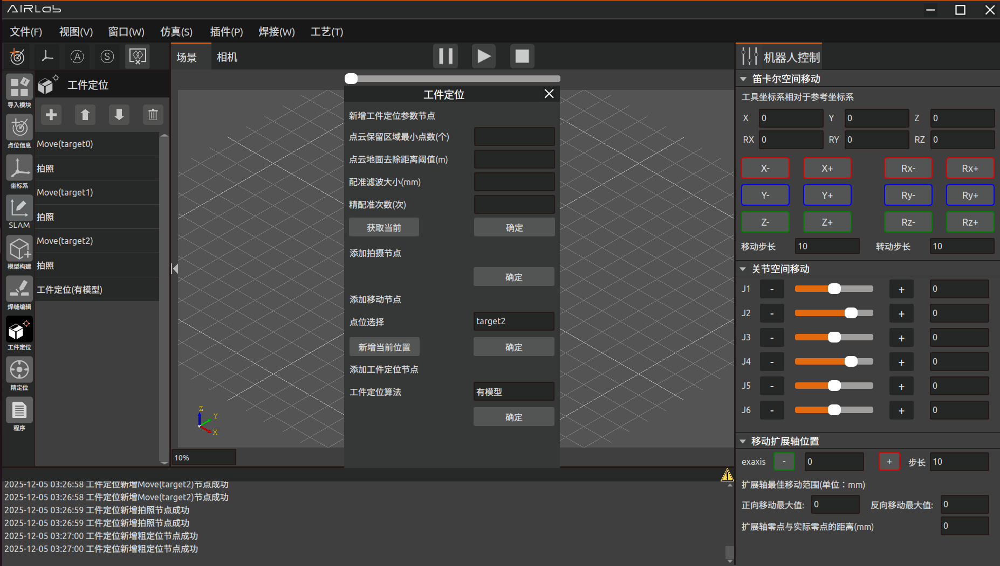

.. centered:: 图4-57 AIRLab工程树-新增粗定位指令

.. important:: 
	用户输入平均模型焊缝序号时，应该结合AIRLab显示的工件模型焊缝编号，根据焊缝编号和MoveJ所关联的目标点位实际位置，添加机器人的拍照点位。

如果是无模型工件，焊缝编号显示图如图4-58所示，如果是已建模工件，焊缝编号查询如图4-59所示。

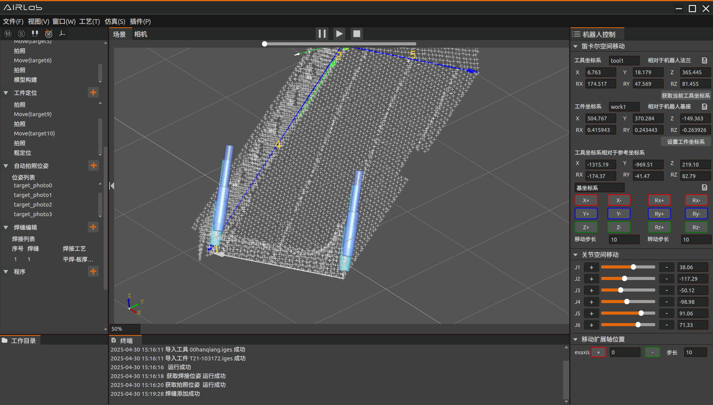

.. centered:: 图4-58 焊缝识别时“拍照设置”页面的参数设置

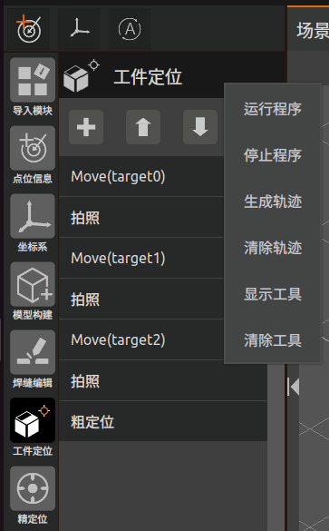

.. centered:: 图4-59 有模型工件-焊缝编号

以图4-58所示的无模型工件为例，机器人对图中的焊缝1、焊缝2和焊缝3进行识别，相机实际拍照点位设置如图4-60所示，平均模型焊缝序号输入值见图4-58。其他焊缝的识别方法同理。

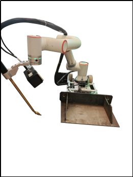

.. centered:: 图4-60 机器人焊缝识别拍摄点位

.. important:: 
	在焊缝识别节点中将所有的焊缝序号进行拍照，这样在具体的焊缝程序中可以直接开始特征识别，不用再对单条焊缝单独拍照，有助于提高识别效率。

Step2：创建“焊缝1”节点。

操作方法：鼠标点击导入的工件子节点，本例是“T24-150404-04.iges”节点，如图所示。右击选择“Custom”，即在“T24-150404-04.iges”节点下新增一个子节点“T24-150404-04.iges Child1”，鼠标双击该节点可以修改节点名称，本例中将其修改为“焊缝1”，如图4-61所示。

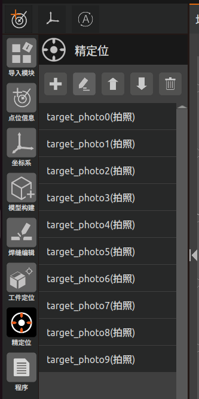

.. centered:: 图4-61 AIRLab工程树-新增“焊缝1”节点

注明：机器人执行焊接任务时通常需要对工件的不同部位进行焊接操作，不同部位的焊接操作不同（例如有直线焊缝、圆弧焊缝等等），因此会定义不同的焊缝程序，即焊缝1、焊缝2、焊缝3等等。

Step3：根据实际焊接情况创建“焊缝1”节点下的具体程序。

操作方法：这里以焊缝1程序为例进行简单介绍，假设焊缝1是一条直线焊缝，机器人首先需要移动到一个合适点位对工件上的该条焊缝拍照，获取该直线焊缝的完整信息，以便后续特征识别可以识别出焊缝的起始点和终点。因此需要增加的指令节点为“MoveJ”和“拍照”，二者为一组。拍照的参数设置详见子页面解析章节，用户根据实际焊缝长度和形状设置指令组数。 

其次需要在工程树中添加“特征识别”指令，具体参数设置见特征识别子页面解析章节。特征识别的目的是根据实际拍照得到的工件焊缝照片去修正焊缝的焊接起始点、中间点（圆弧焊缝）和终点，所以本例中“特征识别”节点后面需要添加的指令是MoveJ(targetS)，S为焊缝的起始点和MoveL(targetE)，E为直线焊缝的终点。如果焊缝1是圆弧焊缝，特征识别节点后面添加MoveJ(targetS)和MoveC(targetM ,targetE)，M是圆弧焊缝的中间点，E为圆弧焊缝的终点。

特征识别完成后得到两个结果：一是工程树中机器人节点下会新增修正点位，targetS_m和targetE_m；二是工程树中程序节点下会新增焊接指令，包括MoveJ(targetS_m)和MoveL(targetE_m)以及在设置MoveL(targetE)焊接工艺时所需的一些指令。注意：这两个结果在执行下一个特征识别指令时会被自动清除。

下面对一些新节点的使用方法进行说明。如表4-3所示。

.. centered:: 表4-3 节点使用方法说明

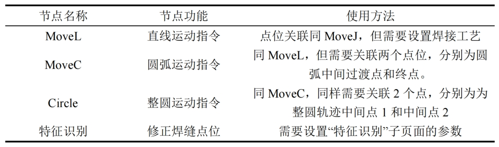

第二部分：运行模板程序

有三种方法可以运行模板程序。

1. 完成如图4-62中的程序配置后，点击菜单栏中的开始运行按钮，机器人会先自动运行工件定位程序，运行成功后，根据设置的配置模式开始运行焊缝程序；
2. 手动调试情况下，在工件定位程序运行成功的前提下，鼠标选中工程树中的“模板程序”节点下的具体焊缝程序节点，在AIRLab右侧切换的“焊缝模板程序”子页面中点击“运行程序”按钮；
3. 通过按钮盒的开始停止运行按键控制机器人开始运行。

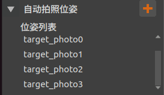

.. centered:: 图4-62 AIRLab工程树-运行前的程序配置设置

第三部分：模板程序与按钮盒开始停止运行按键的交互功能
在完成前文中介绍的导入工作、工件定位程序创建以及视觉和Ros2通信连接等必要工作后，可以通过按钮盒上的开始停止运行按键直接控制机器人实现工程树中模板程序的运行和停止。
1. 开始运行
第一次按下开始运行按键后，机器人会开始运行工件定位程序，定位程序运行成功后，根据设置的程序配置模式自动开始运行“模板程序”节点下的焊缝程序焊缝识别完成后机器人会开始运行“程序”节点下的指令进行焊接工作。
2. 停止运行
再次按下开始运行按键，机器人会立即停止运行。

程序
~~~~~~~~~~~~~~~~~~~
执行完模板程序中的焊缝1后，程序节点下会生成待执行的Lua程序节点，用户通过鼠标选中工程树中的“程序”节点，在AIRLab软件右侧切换的子页面，工作程序”中点击按钮“运行程序”即可实现机器人对工件指定焊缝的焊接，如图4-63。

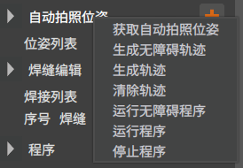

.. centered:: 图4-63 AIRLab工程树-运行“程序”

弹窗及其他页面
--------------------------
本节介绍AIRLab软件中出现的弹窗及其他页面，弹窗包括文件设置弹窗、日志等级弹窗、软件升级弹窗、焊接工艺查询弹窗及多层多道焊工艺查询弹窗；其他页面包括机器人控制、其他控制、仿真、调试页面、程序配置及多语言设置。

文件设置弹窗
~~~~~~~~~~~~~~~~~~~

如图4-64，点击“文件”,出现“文件设置”弹窗。选择文件类型为“焊接”，点击“新建”按钮即可导入机器人。

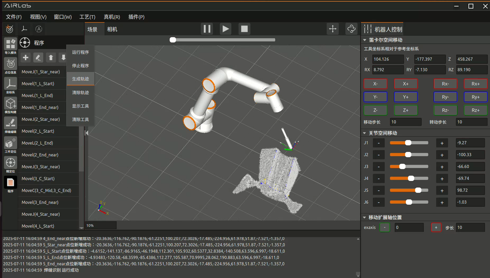

.. centered:: 图4-64 “文件设置”弹窗

点击“打开”按钮，出现如图4-65所示的文件选择弹窗，用户可以选择导入自己所需要的机器人、工具或者工件配置文件，点击“open”进行导入，点击“cancel” 取消导入。

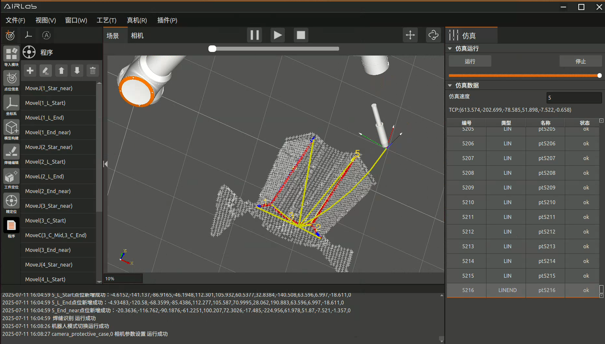

.. centered:: 图4-65 “文件选择”弹窗

日志等级弹窗
~~~~~~~~~~~~~~~~~~~

图4-66为日志等级管理模块。日志等级分为ERROR、WARNING、INFO和DEBUG。

- ERROR: 记录ERROR级别的日志。
- WARING: 记录ERROR和WARING级别的日志。
- INFO: 记录ERROR、WARNING、INFO级别的日志
- DEBUG: 记录所有日志。

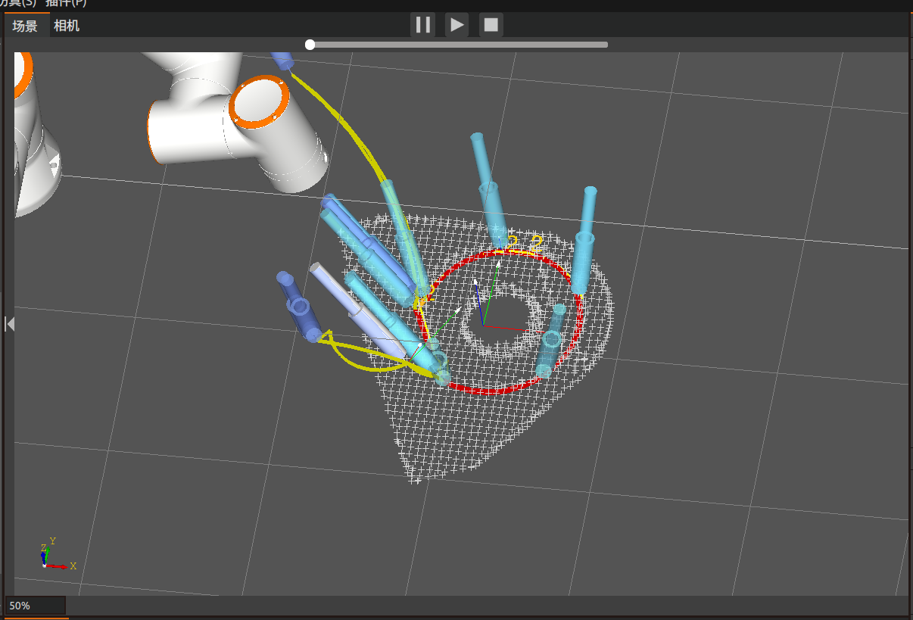

.. centered:: 图4-66 “日志等级”弹窗

可以通过修改日志等级来修改当前记录日志情况。

软件升级弹窗
~~~~~~~~~~~~~~~~~~~

点击窗口-软件升级，弹出软件升级弹窗。

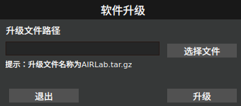

.. centered:: 图4-67 “软件升级”弹窗

点击“选择文件”弹出文件选择窗口，选择AIRLab.tar.gz升级文件点击“open”，请确保文件名和格式正确。

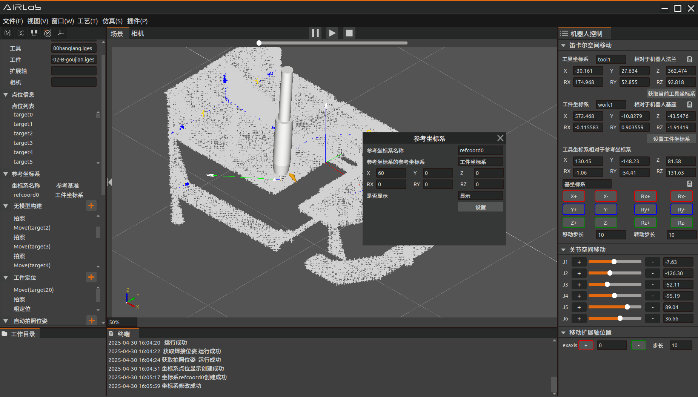

.. centered:: 图4-68 选择AIRLab软件升级包

选择文件后，点击“open”，确认升级包路径正确无误后点击“升级”按钮。开始软件升级。

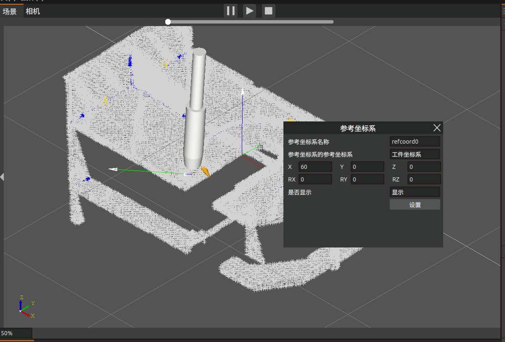

.. centered:: 图4-69 点击“升级”按钮

点击升级，等待升级包解压完成，升级进度将在进度条中显示。点击退出则退出软件升级。

.. centered:: 图4-70 AIRLab软件升级中

升级进度到100%后，点击确认并重启软件，升级完成。

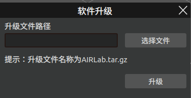

.. centered:: 图4-71 AIRLab软件升级失败反馈界面

当升级包损坏或者不完整时，界面会出现升级失败的反馈。可以选择退出升级或者重新选择升级包继续升级。

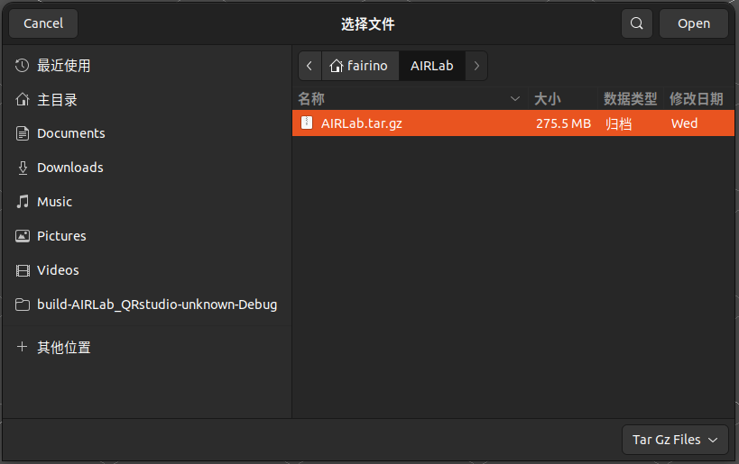

.. centered:: 图4-72 AIRLab软件升级失败反馈界面

焊接工艺查询弹窗
~~~~~~~~~~~~~~~~~~~

如图4-73所示为焊接工艺查询弹窗，可以新增、修改或删除焊接工艺。焊接工艺包含焊接速度、焊接电流、焊接电压以及选择是否摆动、是否包角以及是否段焊。同时可以查询具体的摆动工艺、包角工艺以及段焊工艺。

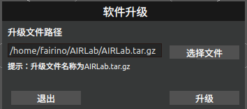

.. centered:: 图4-73 焊接工艺查询弹窗

摆动工艺：选择“工艺选择”按钮为摆动工艺或点击“摆动工艺查询”按钮跳转到摆动工艺查询弹窗。选择摆动工艺名称可以查询该摆动工艺的具体参数，同时可选变更方式为新增、修改、删除来新增摆动工艺、修改当前摆动工艺或删除当前摆动工艺。

.. figure:: analysis/74.png
	:align: center
	:width: 3in

.. centered:: 图4-74 摆动工艺查询弹窗

包角工艺：选择“工艺选择”按钮为包角工艺或点击“包角工艺查询”按钮跳转到包角工艺查询弹窗。选择包角工艺名称可以查询该包角工艺的具体参数，同时可选变更方式为新增、修改、删除来新增包角工艺、修改当前包角工艺或删除当前包角工艺。

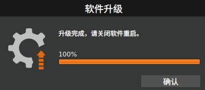

.. centered:: 图4-75 包角工艺查询弹窗

段焊工艺：选择“工艺选择”按钮为段焊工艺或点击“段焊工艺查询”按钮跳转到段焊工艺查询弹窗。选择段焊工艺名称可以查询该段焊工艺的具体参数，同时可选变更方式为新增、修改、删除来新增段焊工艺、修改当前段焊工艺或删除当前段焊工艺。

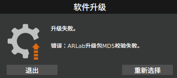

.. centered:: 图4-76 段焊工艺查询弹窗

多层多道焊工艺查询弹窗
~~~~~~~~~~~~~~~~~~~
如图4-77为多层多道焊焊接工艺查询弹窗，包括焊道编号、参考坐标系、偏移以及焊接工艺信息。可以选择新增、修改或删除工艺。

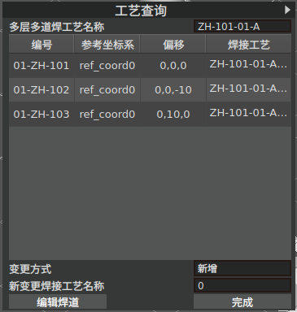

.. centered:: 图4-77 多层多道焊工艺查询弹窗

如图4-78所示，新增多层多道焊工艺需要先选择多层多道焊工艺名称为“待新增”，选择变更方式为“新增”，输入新变更焊接工艺名称ZH-101-02-A。

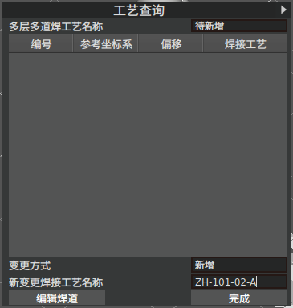

.. centered:: 图4-78 新增多层多道焊工艺

点击“完成”按钮，则名称为ZH-101-01-A的多层多道焊接工艺增加到数据库。

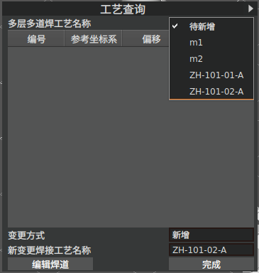

.. centered:: 图4-79 新增多层多道焊工艺成功

如图4-80所示，选择要修改的多层多道焊的工艺名称，选择变更方式为“修改”。

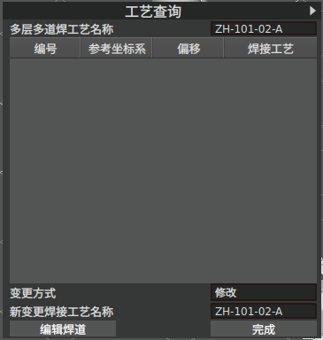

.. centered:: 图4-80 修改多层多道焊工艺

点击“编辑焊道”，对多层多道焊工艺进行修改。包括新增、修改、删除焊道工艺，如图4-81所示。以新增焊道工艺为例，输入新变更焊接工艺名称，选择变更方式为“新增”，设置其他工艺参数并选择焊接工艺。

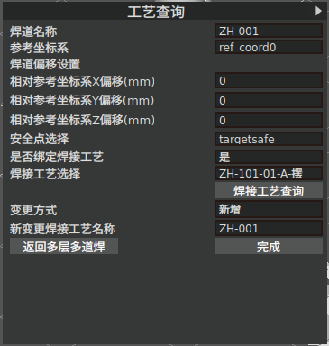

.. centered:: 图4-81 新增焊道

设置完成后点击“完成”按钮。返回多层多道焊，如图4-82所示，多层多道焊焊接工艺新增一条焊道工艺。点击“完成”，保存多层多道焊修改变更。

.. figure:: analysis/82.png
	:align: center
	:width: 3in

.. centered:: 图4-82 多层多道焊工艺修改成功

图4-83所示，选择变更方式为“删除”，点击“完成”按钮，则会删除数据库中当前所选的多层多道焊工艺，如图4-84。

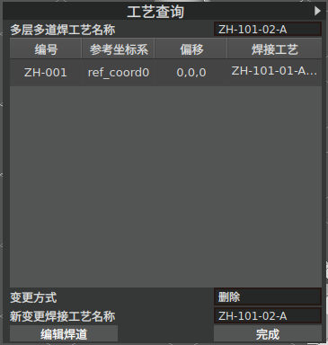

.. centered:: 图4-83 删除多层多道焊工艺

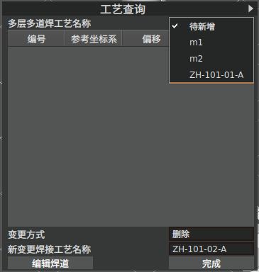

.. centered:: 图4-84 删除多层多道焊工艺成功

圆柱填充工艺查询弹窗
~~~~~~~~~~~~~~~~~~~

图4-85所示为圆柱填充工艺查询的弹窗，圆柱填充工艺包括圆柱底面填充和二次加固两个部分。

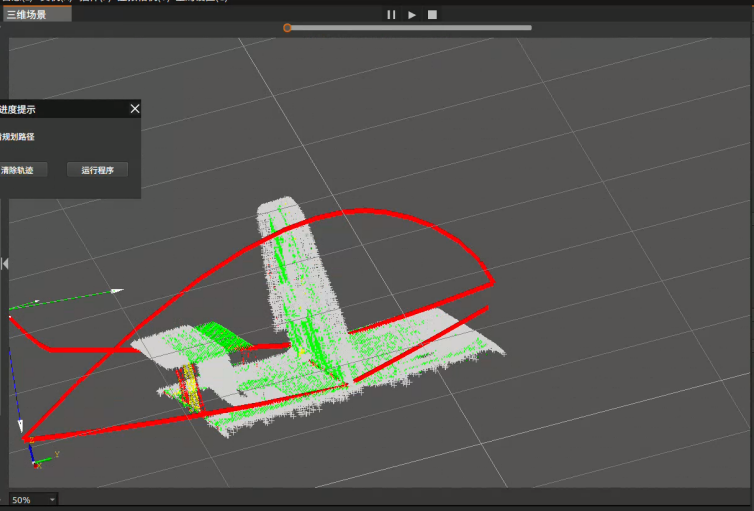

.. centered:: 图4-85 圆柱填充工艺工艺查询弹窗

1. 圆柱底面填充

在进行圆柱填充焊接之前，用户需先设置焊接电流、焊接电压、焊接速度、间隔、偏移量、安全点选择以及摆动工艺选择等参数。 

2. 二次加固
   
在圆柱填充焊接完成后进行二次加固焊接，同样的用户需要先设置参数。

其中填充间隔指相邻两个填充层之间的垂直距离；

向内填充偏移指填充起始点与圆柱边缘的水平距离；

安全点名称是机器人在填充和加固过程中的过渡点，当完成一次填充或加固后，机器人需要回到该点再进行下一次焊接。

加固间隔指相邻两个加固层之间的垂直距离；

二次加固向上偏移指第二次加固起始点与第一次加固起始点之间的垂直间隔；

摆动工艺名称和是否摆动指用户根据实际焊接需要选择哪种摆动工艺以及是否进行摆动，如图4-86所示。

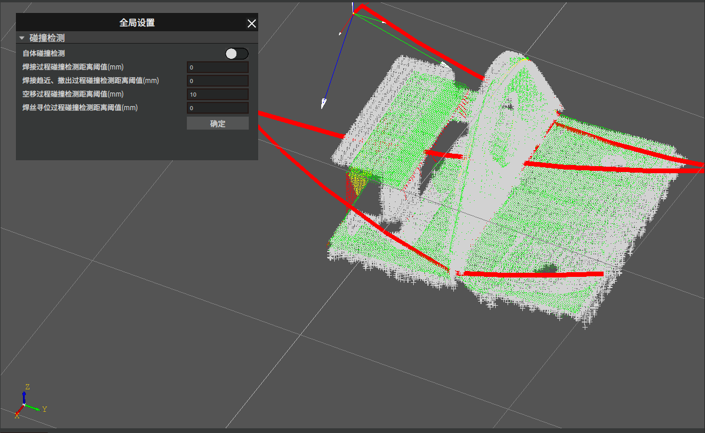

.. centered:: 图4-86 摆动工艺查询弹窗

用户可以对圆柱填充工艺进行新增、修改、删除操作。

新增：变更方式选择“新增”，然后设置工艺参数及新变更填充工艺名称，再点击“完成”按钮，即可新增一种填充工艺；

修改：选择“修改”，再选择一种圆柱填充工艺名称，然后重新设置工艺参数，再点击“完成”按钮即可修改该工艺的参数；

删除：选择“删除”，选择一种圆柱填充工艺名称，再点击“完成”按钮，即可删除该工艺。

其他控制
~~~~~~~~~~~~~~~~~~~
   
点击操作区“其他控制”按钮可进入IO设置界面，主要包括IO控制和外部轴设置两个模块。

1. IO控制模块
  
如图4-87所示，IO控制模块可以实现对机器人控制箱中数字输出、模拟输出（0-10v）和末端工具数字输出、模拟输出（0-10v）扩展IO数字输出、模拟输出（0-10v）进行手动控制：

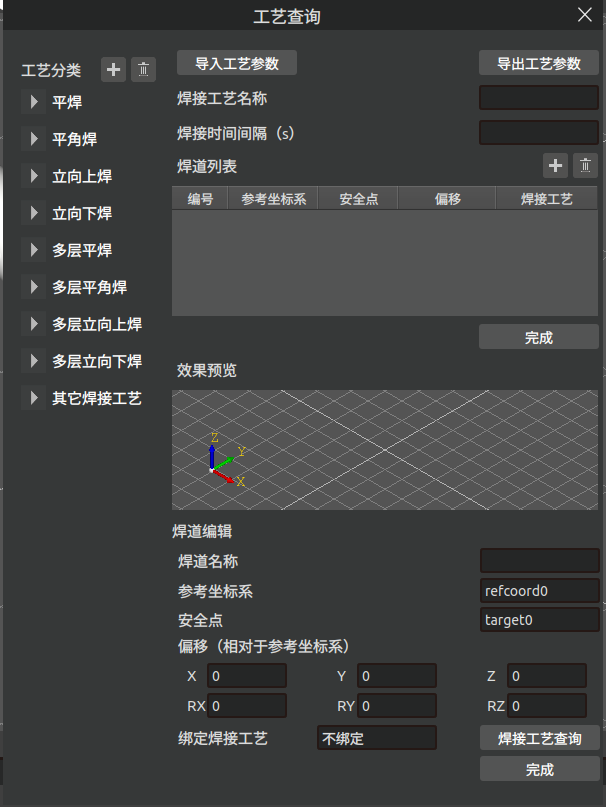

.. centered:: 图4-87 IO控制模块

- DO设置：选择端口号，点击“开启”按钮对应DO高电平，点击“关闭”按钮设置对应DO为低电平。

- AO设置：选择端口号，右侧输入框输入值（0-100），该数值为百分比，设置100即表示设置该AO端口为10v。

2. Exaxis控制

如图4-88所示，外部轴设置模块可以实现对机器人外部轴控制。

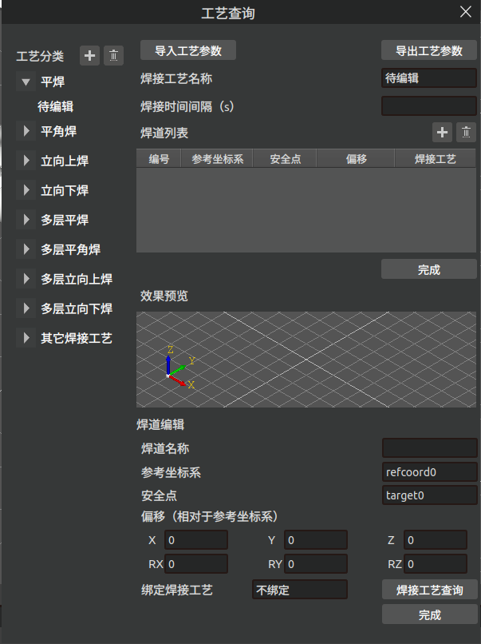

.. centered:: 图4-88 Exaxis控制

- 选择扩展轴编号：点击“加载”按钮根据选择的扩展轴编号加载外部轴协议。分别设置运行速度（%）、加速度（%）和扩展轴最大距离（mm）。
- 去除使能：点击“去除使能”按钮外部轴去除使能。
- 伺服使能：点击“伺服使能”按钮外部轴使能。
- 正向点动：点击“正向点动”按钮，根据设置的运行速度、加速度、扩展轴最大距离进行外部轴正向点动。
- 反向点动：点击“反向点动”按钮，根据设置的运行速度、加速度、扩展轴最大距离进行外部轴反向点动。
- 停止点动：点击“停止点动”按钮，外部轴停止点动。
- 零点设置：点击“零点设置”按钮，根据回零方式、寻零速度、箍位速度进行外部轴回零。

仿真
~~~~~~~~~~~~~~~~~~~

如图4-89所示，对程序进行仿真轨迹生成后，打开操作区-仿真，设置仿真速度和仿真间隔后，点击“运行”按钮开始对模板程序进行仿真，点击“停止”按钮可以停止模板程序仿真。同时会生成仿真轨迹点表格，记录仿真轨迹点。表格中，仿真轨迹端点的类型为LINEND。点击表格中某一行，虚拟仿真机器人将移动到点击的仿真轨迹点，同时会同步显示该仿真轨迹点的TCP坐标。

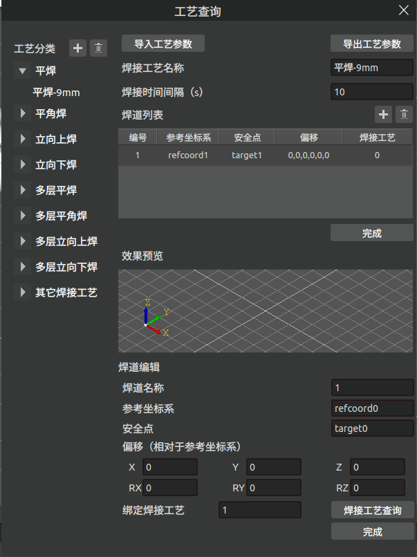

.. centered:: 图4-89 仿真页面

程序配置
~~~~~~~~~~~~~~~~~~~

进行程序运行配置和程序起弧配置，如图4-90。

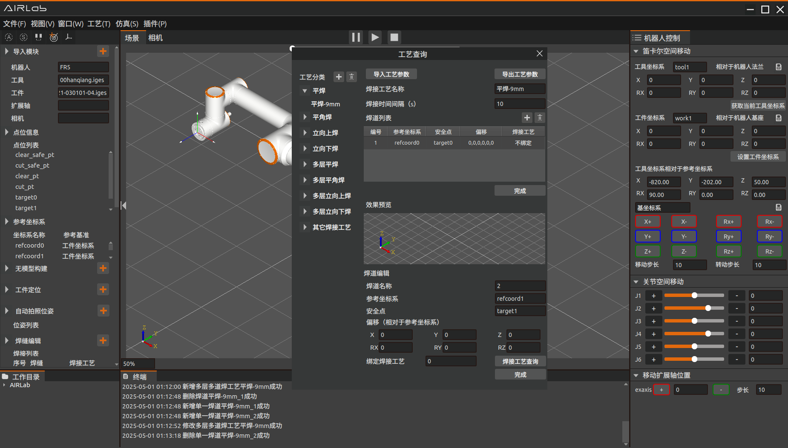

.. centered:: 图4-90 程序配置页面

程序运行配置可以选择手动调试模式、全部识别后焊接和单条识别后焊接。

- 手动调试模式：用于单步调试。

- 全部识别后焊接：点击自动运行将所有的焊缝都识别后再进行焊接。

- 单条识别后焊接：点击自动运行后机器人会先识别模板程序节点下的第一条焊缝，识别成功后进行第一天焊缝的焊接，完成焊接后会继续开始识别第二条，直到所有焊缝都被焊接后结束。

程序起弧配置可以设置为起弧或者不起弧。全部配置好之后，点击“确定’按钮，完成程序配置。

无模型构建设置：目前包括两种方式——重新构建和不重新构建。

如果用户想自动运行：无模型工件建模——工件定位——模板程序——程序执行，该参数应该选择“重新构建”，那么在点击自动运行后，会先解析运行无模型工件构建程序，重新识别构建工件模型数据库，构建成功后开始运行工件定位、模板程序、程序等过程。
.. important:: 
	在实际操作中我们不建议使用这种方式，因为无模型构建得到的焊缝编号在每次构建中可能会发生变化！所以建议将无模型工件构建过程先单独进行，工件构建成功后按照原有的平均模型方式操作。在这种方式下，无模型构建设置参数一直选择“不重新构建”。
如果不需要对工件进行无模型构建（即：该工件模型在数据库中是已经存在的，或者已经构建成功过），无模型构建设置选择“不重新构建”，那么自动运行程序后会跳过无模型工件构建程序直接开始执行工件定位等过程。

多语言设置
~~~~~~~~~~~~~~~~~~~

AIRLab软件目前提供了中文（简体）、中文（繁体）、英文、日文、韩语、俄语、法语七种语言选择，详细的多语言设置页面如图4-91所示。该页面提供三种操作：切换语言；导出AIRLab软件中已有的语言；导入新语言。满足用户切换多语言，为AIRLab软件设置新语言以及修改AIRLab软件已有的语言内容的需求。

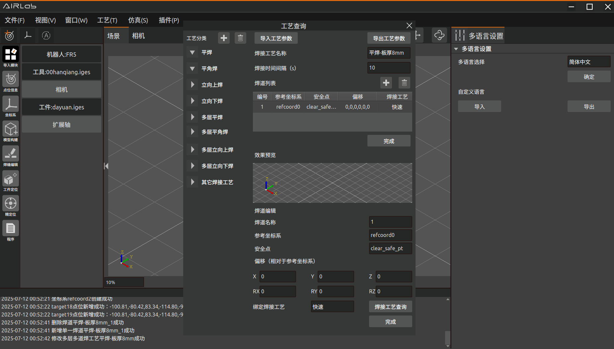

.. centered:: 图4-91 “多语言设置”页面

上述功能的详细操作介绍如下：

1. 切换AIRLab的语言

点击图4-91中“多语言选择”的下拉框，选择需要的语言类型后点击“确定”按钮即可立即切换AIRLab软件语言。

2. 用户为AIRLab设置新语言
   
首先点击“导出”按钮，导出AIRLab当前使用的语言文件，该文件为CSV格式，导出的文件路径在本地的Downloads文件夹下，如图4-92。CSV文件的内容格式如图4-93，包括四列内容：language_id，location，source_text，translation_text。“language_id”代表语言类型，“location”代表该文本在源代码中的位置，“source_text”代表源代码中的文本(中文)，“translation_text”代表的是源文本对应的翻译值。

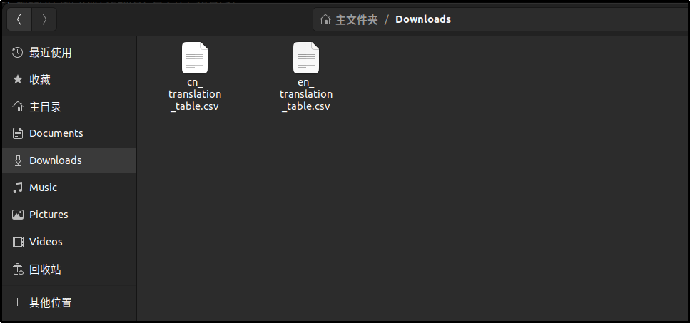

.. centered:: 图4-92 AIRLab语言文件导出路径

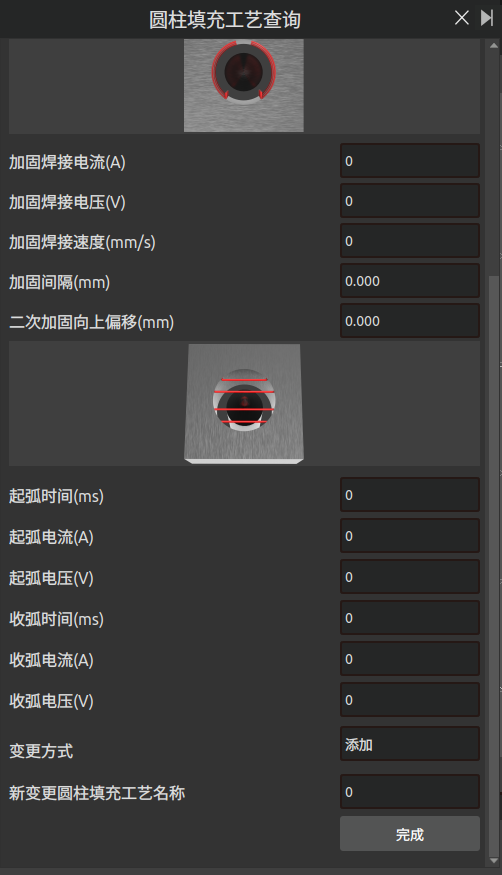

.. centered:: 图4-93 AIRLab语言CSV文件的内容及格式

其次是编写用户的CSV文件，用户设置新语言时只需要修改第一列language_id和第四列translation_text的内容。假设用户新增的是法语，就使用“Français”替换图4-93中第一列下的所有“English”；第四列translation_text的内容需要用户根据“source_text”的中文文本进行翻译得到对应的目标语言(对于源文本中出现的相同字符串，请将其翻译为同样的单词)。

.. important:: 
	请不要修改“source_text”列下的任何字符！

完成翻译工作后，用户需要为该CSV文件重命名一个文件名，文件名将是AIRLab语言数据库中的该语言数据表的表名，比如图4-92中的文件名“en_translation_table”就是语言类型“English”在数据库中的表名。

.. important:: 
	用户CSV文件的命名建议保留其语言特色，避免与数据库中已有的语言数据表名重复，由此导致其他语言数据表内容被替换的错误。

最后是向AIRLab软件中导入该CSV文件，将该文件复制到~/AIRLabExe/CSVfile目录下，点击“导入”按钮，选择该文件导入，如图4-94。AIRLab终端显示“CSV文件导入成功”即表示用户的语言文件导入成功，如图4-95。重启AIRLab后，在“语言选择”的下拉框选择用户新增的语言切换即可。

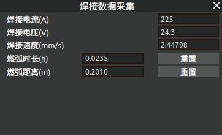

.. centered:: 图4-94 “导入”按钮的弹窗

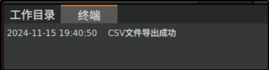

.. centered:: 图4-95 语言文件导入成功时的终端显示信息

如果终端显示“CSV文件导入失败”，可以查看日志记录的错误信息，如图4-96所示，并仔细检查导入的CSV文件与最初导出的CSV文件是否在行数、列数以及列之间的中文分隔符“；”有不一致的地方。

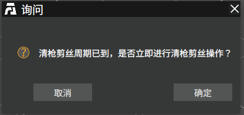

.. centered:: 图4-96 语言文件导入失败时的日志信息提示

.. important:: 
	当对“translation_text”的内容进行修改时，需要参考“source_text”的中文文本的字段长度，如果翻译值过长，请适当使用缩写，否则AIRLab界面中对应的控件文本可能会显示不全。

1. 用户修改AIRLab已存在的语言

如果用户需要修改AIRLab中已经存在的语言，首先需要点击“导出”按钮将该语言的CSV文件导出；修改完成后将文件复制在到~/AIRLabExe/CSVfile目录下，点击“导入”按钮，选择修改后的文件导入，终端显示“CSV导入成功”后重启软件，即完成语言的修改。

子页面解析
--------------------------

本节介绍AIRLab软件中的所有子页面功能。

机器人导入设置
~~~~~~~~~~~~~~~~~~~
如图4-97所示，选择机器人型号，现有FR3、FR5、FR10、FR16和FR20、点击“导入”按钮，相应型号的机器人模型显示在场景中，如图4-98所示，同时工程树上会增加相应节点。

导入机器人模型后，设置机器人的倾斜角和旋转角，点击“确定”按钮，机器人将按照设置好的倾斜角和旋转角进行变换。

.. centered:: 图4-97 导入机器人设置

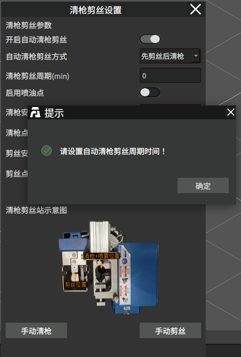

.. centered:: 图4-98 导入机器人成功

工件导入设置
~~~~~~~~~~~~~~~~~~~
如图4-99所示，在“工件导入设置”子界面点击“打开”按钮。出现“Select wobj”弹窗，选择要导入的工件模型，点击“open”导入工件模型，点击“cancel”取消导入。

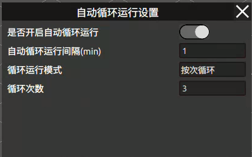

.. centered:: 图4-99 导入工件

导入工件模型后，可以设置工件坐标系，点击“保存工件坐标系”按钮，工件将按照设置的坐标进行变换。

工具导入设置
~~~~~~~~~~~~~~~~~~~
如图4-100所示，在“工具导入设置”子界面点击“打开”按钮。出现“Select tool”弹窗，选择要导入的工具模型，点击“open”导入工具模型，点击“cancel”取消导入。

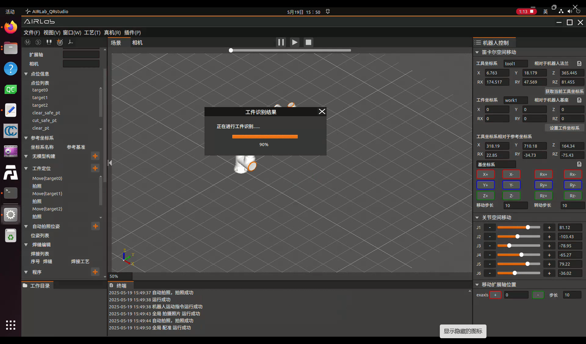

.. centered:: 图4-100 导入工具

导入工具模型后，设置工具坐标系，点击“保存工具坐标系”，则保存当前的工具坐标系；设置工具外观位置，点击“设置工具外观”，场景中的工具模型外观则会按照设置的工具外观位置坐标进行变换。

点位信息
~~~~~~~~~~~~~~~~~~~
如图4-101所示，点击左侧工程树“MoveL()”或“MoveC()”，弹出“点位信息”子界面，对所选择的程序语句绑定焊接工艺。

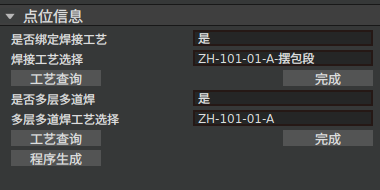

.. centered:: 图4-101 “点位信息”子界面

选择是否绑定焊接工艺并对焊接工艺进行选择，点击“工艺查询”可以查看焊接工艺的具体信息，同时可以对焊接工艺进行新增、修改和删除。详见4.6.4焊接工艺查询弹窗。

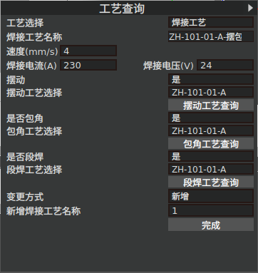

.. centered:: 图4-102 焊接工艺查询

设置完成后点击“完成”按钮对程序语句进行焊接工艺的绑定。绑定成功后终端输出绑定成功信息。

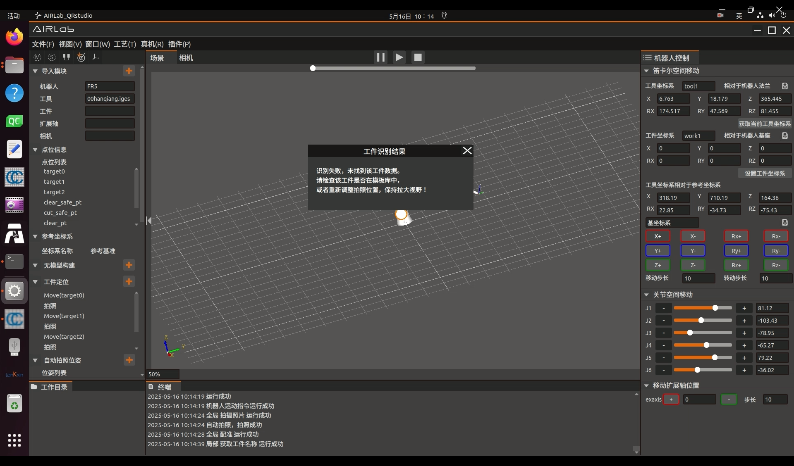

.. centered:: 图4-103 焊接工艺绑定成功

选择是否为多层多道焊并对多层多道焊焊接工艺进行选择，点击“工艺查询”可以查看多层多道焊焊接工艺的具体信息，同时可以对多层多道焊焊接工艺进行新增、修改或删除操作。详见3.6.5多层多道焊工艺查询弹窗。

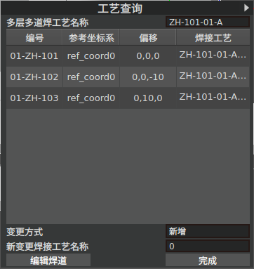

.. centered:: 图4-104 多层多道焊焊接工艺查询

设置完成后点击“完成”按钮对程序语句进行多层多道焊焊接工艺的绑定。绑定成功后终端输出绑定成功信息。

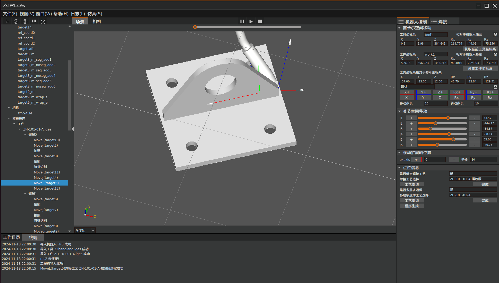

.. centered:: 图4-105 多层多道焊焊接工艺绑定成功

焊接工艺及多层多道焊焊接工艺绑定完成后，点击“程序生成”按钮，左侧工程树自动生成焊接程序。

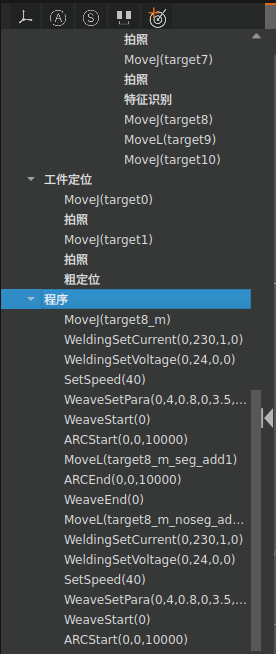

.. centered:: 图4-106 生成焊接程序

点位修改
~~~~~~~~~~~~~~~~~~~
点击左侧工程树点位，如图4-107，跳转到“点位信息修改”子界面，如图4-108，可以在子页面中对当前所选点位信息进行修改。

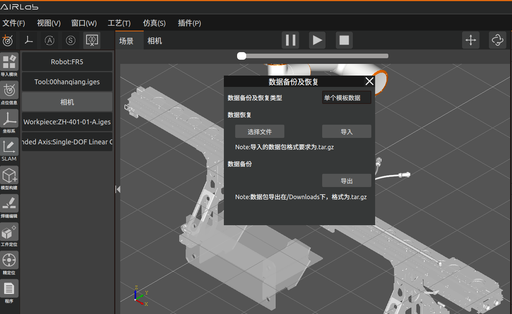

.. centered:: 图4-107 工程树中修改点位

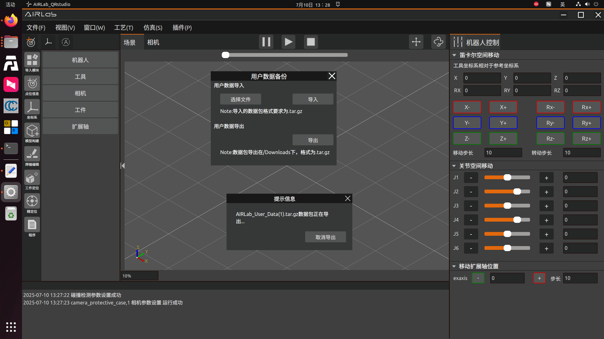

.. centered:: 图4-108 “点位信息”子界面

- 移动至目标点：点击该按钮，下发指令将实体机器人移动至存储记录点的位置。

- 示教当前位置：点击该按钮，获取当前AIRLab场景中机器人的位置信息并存储。

- 保存修改点位：点击该按钮，获取点位信息修改子界面X、Y、Z、RX、RY、RZ的位置并存储（该操作用于选点后存储，点击三维场景中的工件上的位置会出现小圆圈，同时会将选中位置的笛卡尔信息更新至点位信息修改子界面中的X、Y、Z、RX、RY、RZ区域）。

如图4-109所示，在场景显示框中的工件模型上，单击鼠标左键标记新的点位或修改 “点位信息修改”子界面上的点位坐标，点击“保存修改点位”按钮，即可修改原点位坐标，target12从图4-65所示的点位修改为图4-66所示的点位。 

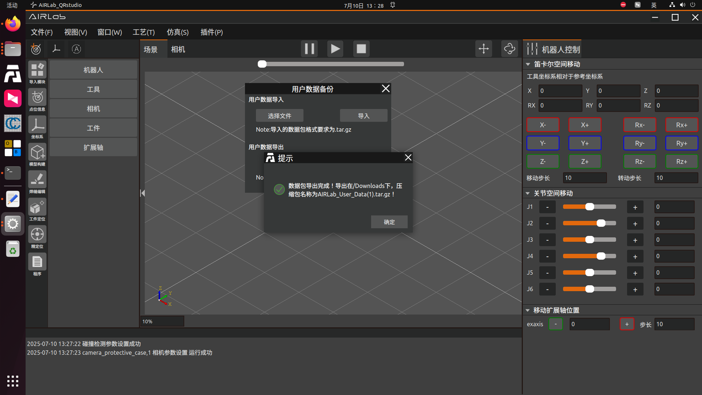

.. centered:: 图4-109 点位target12修改过程

工作程序
~~~~~~~~~~~~~~~~~~~

点击左侧工程树“程序”节点，如图所示，子界面跳转到“工作程序”，如图4-110。

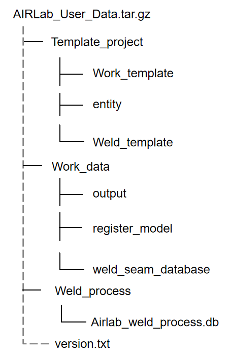

.. centered:: 图4-110 “工作程序”子界面

如图4-111所示，“工作程序”子界面具体的功能有仿真轨迹生成、清除轨迹、显示工具、清除显示、运行程序和停止程序。

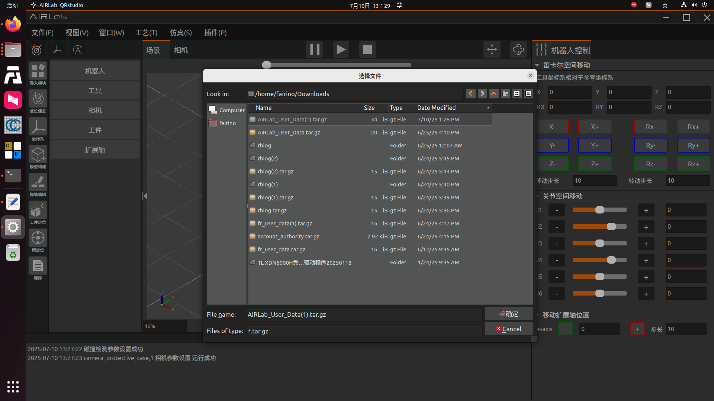

.. centered:: 图4-111 “工作程序”子界面功能

- 仿真轨迹生成：点击“仿真轨迹生成”按钮，场景中生成工程树中“程序”运行过程中的仿真轨迹，如图4-112所示。

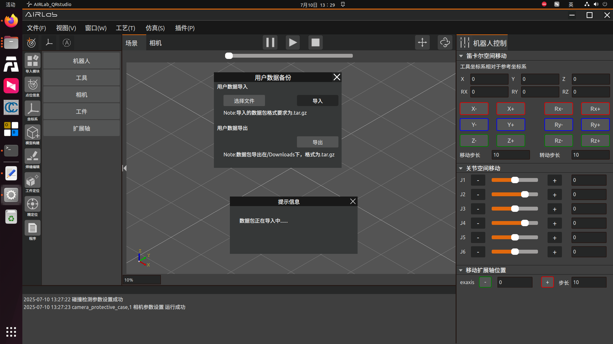

.. centered:: 图4-112 程序仿真轨迹生成

- 清除轨迹：点击“清除轨迹”按钮，清除场景中生成的仿真轨迹。

- 显示工具：点击“显示工具”按钮，场景中显示程序运行时关键点位处工具的姿态，如图4-113所示为工作程序运行时关键点位处工具的姿态。
  
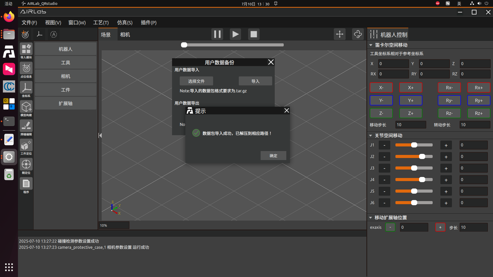

.. centered:: 图4-113 工作程序显示工具

- 清除显示：点击“清除显示”按钮，清除场景中生成的虚拟工具。
  
- 运行程序：点击“运行程序”，实体机器人按照程序生成的轨迹进行运动。

- 停止程序：点击“停止程序”,机器人运动停止。

工件定位程序
~~~~~~~~~~~~~~~~~~~
点击左侧工程树“工件定位”节点，如图4-114所示，子界面跳转到“工件定位程序”。

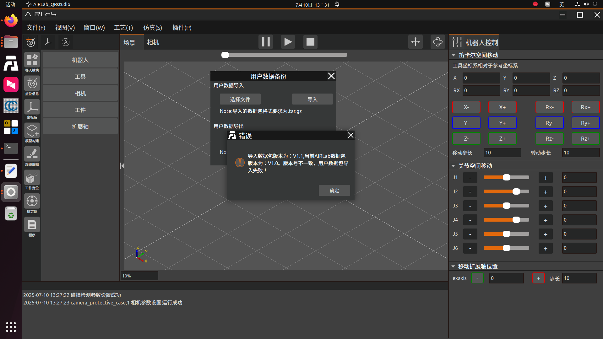

.. centered:: 图4-114 “工件定位程序”子界面

如图4-115所示，“工件定位程序”子界面具体的功能有拍摄地面、保存地面、获取点云、清除点云、仿真轨迹生成、清除轨迹、显示工具、清除显示、运行程序以及停止程序。

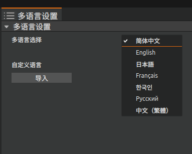

.. centered:: 图4-115 “工件定位程序”子界面功能

- 拍摄地面：将机械臂移动到平行于工作台并可以完整拍摄工件的位置，点击“拍摄照片”按钮，拍摄地面照片。终端显示拍摄成功。

- 保存地面：保存拍摄的地面照片。

- 获取点云：点击“获取点云”按钮，生成实际场景中工件的点云数据模型，并于虚拟场景中工件模型进行配准。

- 清除点云：点击“清除点云”按钮，清除场景中的工件点云数据。

- 仿真轨迹生成：点击“仿真轨迹生成”按钮，场景中生成工程树中“程序”运行过程中的仿真轨迹，如图4-116所示。

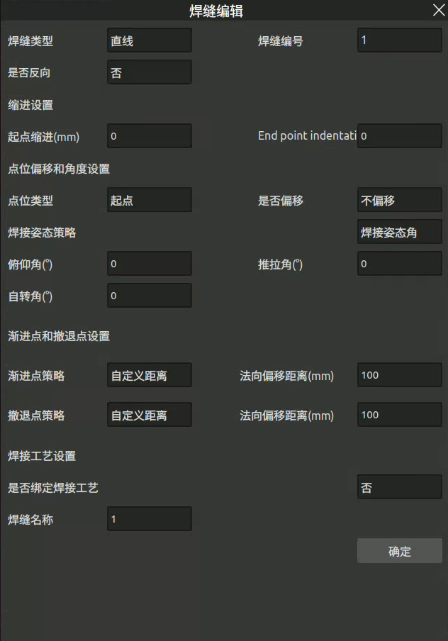

.. centered:: 图4-116 工件定位仿真轨迹生成

- 清除轨迹：点击“清除轨迹”按钮，清除场景中生成的仿真轨迹。

- 显示工具：点击“显示工具”按钮，场景中显示出程序运行时关键点位处工具的姿态，如图4-117所示显示工件定位时工具的姿态，用户可以直观的看到关键点位处工具的姿态。

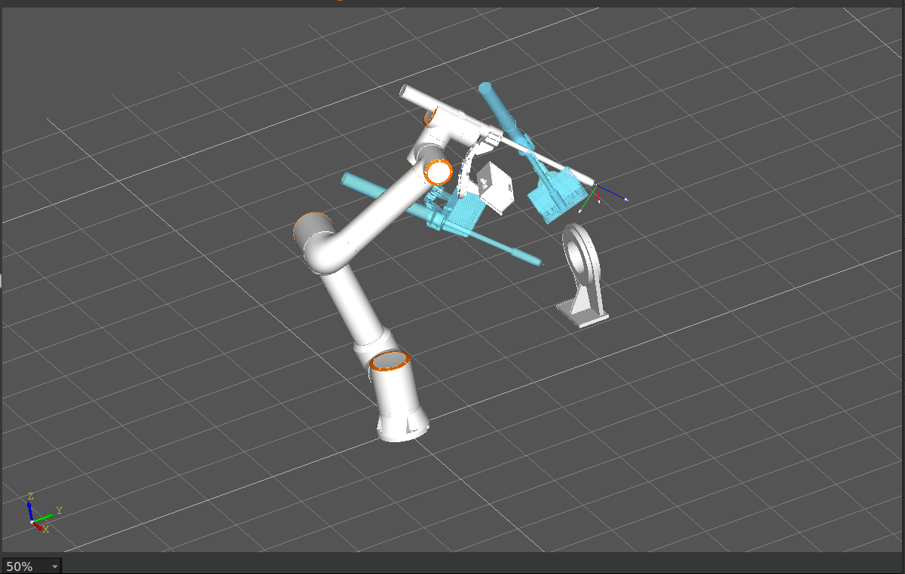

.. centered:: 图4-117 工件定位程序显示工具

- 清除显示：点击“清除显示”按钮，清除场景中生成的虚拟工具。

- 运行程序：点击“运行程序”，实体机器人按照程序生成的轨迹进行运动。

- 停止程序：点击“停止程序”,机器人运动停止。

焊缝模板程序
~~~~~~~~~~~~~~~~~~~

如图4-118所示，点击左侧工程树“模板程序”下的焊缝模板程序，子界面跳转到“焊缝模板程序”。

.. figure:: analysis/118.png
	:align: center
	:width: 6in

.. centered:: 图4-118 “焊缝模板程序”子界面

如图4-119所示，“焊缝模板程序”子界面具体的功能包括获取点云、清除点云、仿真轨迹生成、清除轨迹、显示工具、清除显示、运行程序以及停止程序。

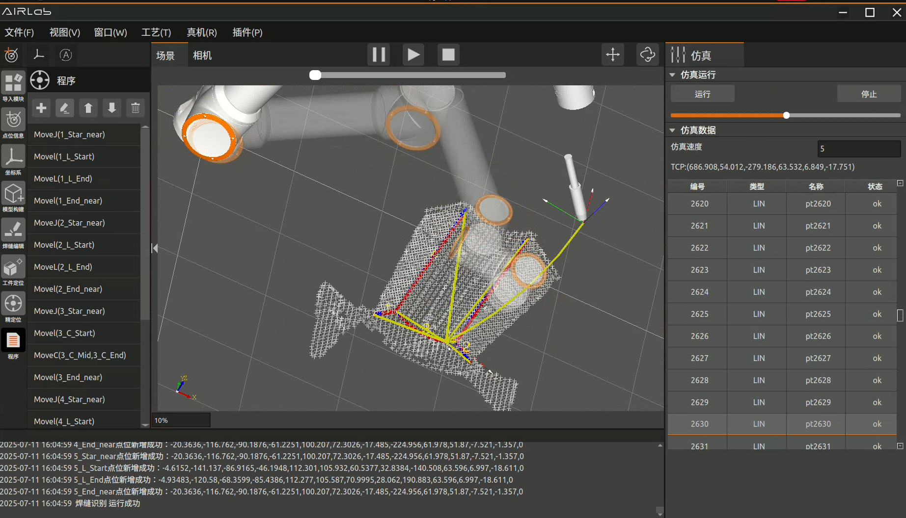

.. centered:: 图4-119 “焊缝模板程序”子界面功能

- 获取点云：点击“获取点云”按钮，生成实际场景中工件的点云数据模型，并于虚拟场景中工件模型进行配准。

- 清除点云：点击“清除点云”按钮，清除场景中的工件点云数据。

- 仿真轨迹生成：点击“仿真轨迹生成”按钮，场景中生成工程树中“程序”运行过程中的仿真轨迹，如图4-120所示

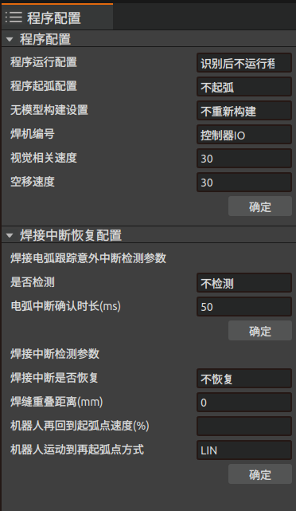

.. centered:: 图4-120 焊缝模板程序仿真轨迹

- 清除轨迹：点击“清除轨迹”按钮，清除场景中生成的仿真轨迹。

- 显示工具：点击“显示工具”按钮，场景中显示出运行焊缝模板程序时关键点位处工具的姿态，如图4-121所示，用户可以直观的看到焊缝模板程序运行过程中关键点处工具的位姿。

.. centered:: 图4-121 焊缝模板程序显示工具

- 清除显示：点击“清除显示”按钮，清除场景中生成的虚拟工具。

- 运行程序：点击“运行程序”，实体机器人按照程序生成的轨迹进行运动。

- 停止程序：点击“停止程序”,机器人运动停止。

拍照设置
~~~~~~~~~~~~~~~~~~~
如图4-122所示，点击左侧工程树“拍照”子节点，子界面跳转到“拍照设置”。

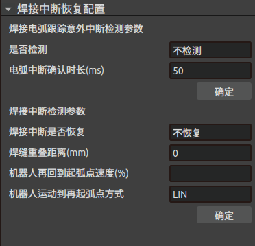

.. centered:: 图4-122 “拍照设置”子界面

拍照设置子页面主要作用是根据焊接程序的不同来设置不同的拍照模型，同时可以设置无模型工件点云模型的拍照点位。拍照设置子页面分为拍照参数设置和拍照点位确认两部分，其中拍照参数设置部分是设置拍照参数以适应不同的焊接程序；拍照点位确认是针对无模型工件建模程序来获取拍照点位需要设置的参数。

拍照参数设置：

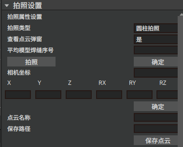

.. centered:: 图4-123 拍照参数设置界面

1. 拍照模型：拍照模型可选择全局拍照、局部拍照、平均模型拍照、圆柱拍照、无模型直线拍照以及无模型圆弧拍照，以适应不同的拍照需求。
   
- 工件定位程序中的拍照模型需要设置为“全局拍照”；
  
- 模板程序中的拍照模型需要设置为“平均模型拍照”；
                    
- 圆柱填充工艺中拍照模型需要设置为“圆柱拍照”；
       
- 无模型工件建模程序中无模型直线焊缝识别拍照模型需要设置为“无模型直线”，无模型纯圆弧拍照类型设置为“无模型圆弧”。
  
1. 查看点云弹窗：可以选择查看点云弹窗或不查看。
   
2. 平均模型工件型号：暂未开放。
   
3. 平均模型焊缝序号：一项或多项（例：1-1，1-2，2-1，3-2，表示可拍摄到焊缝1的起点、焊缝1的终点、焊缝2的起点、焊缝3的终点。）
   
4. 确定（相机坐标）：暂未开放
   
5. 保存点云：输入点云名称和保存路径，保存点云数据。

拍照点位确认：

拍照点位确认是针对无模型工件建模程序来获取拍照点位需要设置的参数。首先点击工程树无模型工件建模程序下“拍照”子节点，子界面跳转到拍照设置，再进行以下拍照点位的设置。

.. centered:: 图4-124 拍照参数设置界面 
	
- 点云大小设置：根据需要对无模型工件点云大小进行设置。
- 选择需要拍照位置：点击需要拍照的位置（一般是角点），点击“确定”按钮，则会显示需要拍照的点位信息。
- 推荐最佳拍照位置：暂未开放
- 点位名称：输入点位名称保存当前获取的拍照点位，点击“确定”，该拍照点位被保存，工程树出现相应点位。同时当前拍照子节点上一节点生成moveJ(target)，其中target是获取的拍照点位名称。

焊缝相机属性
~~~~~~~~~~~~~~~~~~~

如图4-125所示，点击工程树“相机”节点下的相机型号，子界面跳转到“焊接相机属性”。在“焊接相机属性”子界面进行相机标定，可选手动标定和自动标定。先将相机调整到合适的位姿作为相机标定的初始位姿，再进行手动或自动标定。

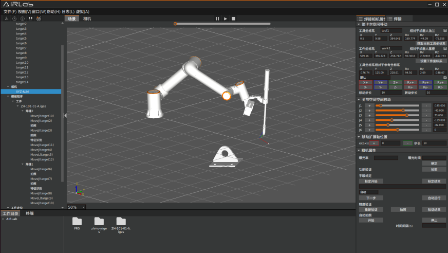

.. centered:: 图4-125 “焊缝相机属性”子界面

- 手动标定：选择“手动”，输入框中显示“进入手动模式，请点击下一步”；点击“下一步”按钮，相机变换相应的位姿并进行拍照，点击八次，拍八张照片进行相机标定。

- 自动标定：选择“自动”，输入框中“显示进入自动模式，机器人即将自动运动，请勿操作”；点击“自动运行”按钮，相机连续拍八张照片自动进行相机标定。

焊接相机属性精度验证（需已进行4-5次标定）

- 重新验证：点击“重新验证”按钮，清空精度验证的拍照信息。

- 拍照：点击“拍照”按钮，进行精度验证拍照。

- 验证结果：移动机器人拍摄标定板三次后，点击验证结果可显示手眼标定精度验证结果并应用最好的一次标定结果。

- 开始：暂未开放。

- 停止：暂未开放。

导入扩展轴
~~~~~~~~~~~~~~~~~~~
该页面的功能是导入扩展轴，并对扩展轴的位置进行设置。

- 选择扩展轴下拉框：确定要导入的扩展轴类型。

- “导入”按钮：点击后，AIRLab软件的场景中会出现刚选择的扩展轴，如图所示。

- exaxispos文本编辑框：设置文本框中的数值，可以改变机器人在扩展轴上的位置，如图4-126所示。

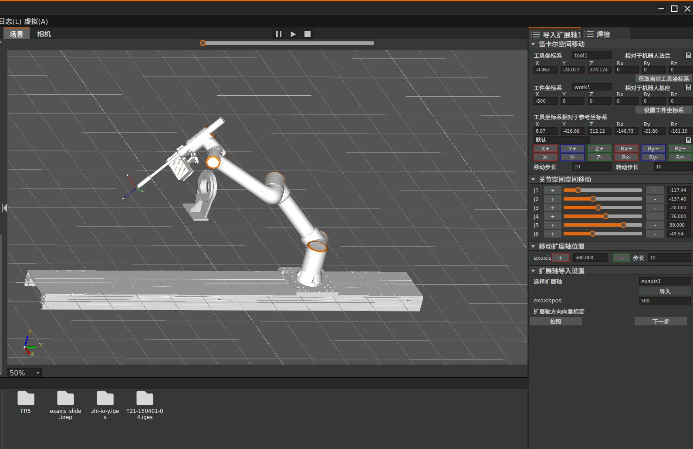

.. centered:: 图4-126 扩展轴导入设置

相机选择
~~~~~~~~~~~~~~~~~~~
点击左侧工程树“相机”节点，子界面跳转到“相机选择”。如图4-127所示。在该界面可查看相机连接状态并对相机厂商进行选择，同时可根据拍摄场景的不同对相机参数进行设置。

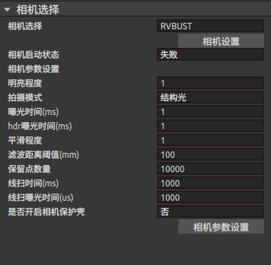

.. centered:: 图4-127 相机选择子界面

首先选择相机厂商，现有如本、XYZ、微视、亚博汉四个厂商相机可供选择。之后点击“相机设置”按钮确认选择的相机。

如果相机连接成功，相机启动状态为“成功”，否则为“失败”，需要重新对相机进行连接。

相机选择完成并连接成功后就可以对相机参数进行设置，包括明亮程度，拍摄模式、曝光时间等。以下是对相机参数的具体介绍。

- 明亮程度：控制相机图像的亮度。
- 拍摄模式：可选择结构光、线扫或2D三种拍摄模式，以应对不同的拍摄需求。
- 曝光时间（ms）：控制相机曝光的时间长度。增加曝光时间可以使图像更亮，减少曝光时间可以使图像更暗。
- hdr曝光时间（ms）：设置高动态范围（HDR）图像的曝光时间。
- 平滑程度：控制图像的平滑程度。增加平滑程度可以减少图像的噪点和杂讯，减少平滑程度可以保留更多的图像细节。
- 滤波距离阈值（mm）：设置图像滤波的距离阈值。滤波距离阈值决定了图像中哪些区域需要进行滤波处理。
- 保留点数量：设置图像中保留的点数量。增加保留点数量可以保留更多的图像细节，减少保留点数量可以减少图像的噪点和杂讯。
- 线扫时间（ms）：设置相机进行线扫描的时间长度。
- 线扫曝光时间（us）：设置线扫描曝光的时间长度。
- 是否开启相机保护壳：设置相机是否开启保护壳。
根据拍摄场景具体情况以及拍摄需求对上述相机参数进行设置，设置完成后点击“相机参数设置”保存设置。

参考坐标系
~~~~~~~~~~~~~~~~~~~

点击工程树“ref_coord”节点，跳转到“参考坐标系”子页面，如图4-128。

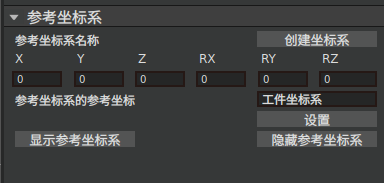

.. centered:: 图4-128 “参考坐标系”子界面

输入要设置的参考坐标系的值，选择参考坐标系的参考坐标为“工件坐标系”或“基坐标系”。操作完成后点击“设置”，设置参考坐标系。

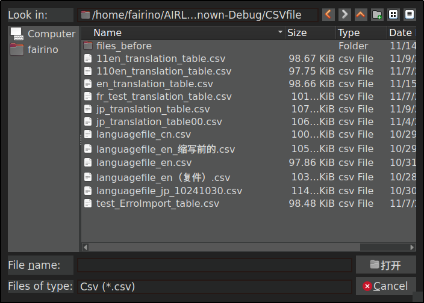

.. centered:: 图4-129 设置参考坐标系

设置成功后终端输出“坐标系位置设置成功”

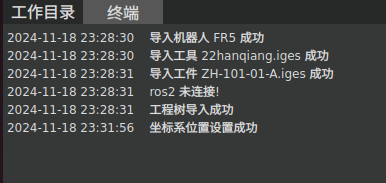

.. centered:: 图4-130 参考坐标系设置成功

参考坐标系可以选择显示或者隐藏；点击“显示参考坐标系”按钮，场景中出现设置的参考坐标系。终端输出“设置坐标系显示状态成功”信息。

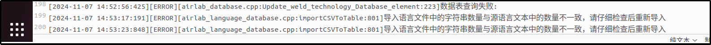

.. centered:: 图4-131 显示参考坐标系

点击“隐藏参考坐标系”按钮，场景中参考坐标系隐藏。设置完成参考坐标系状态后终端输出“设置坐标系显示状态成功”信息。

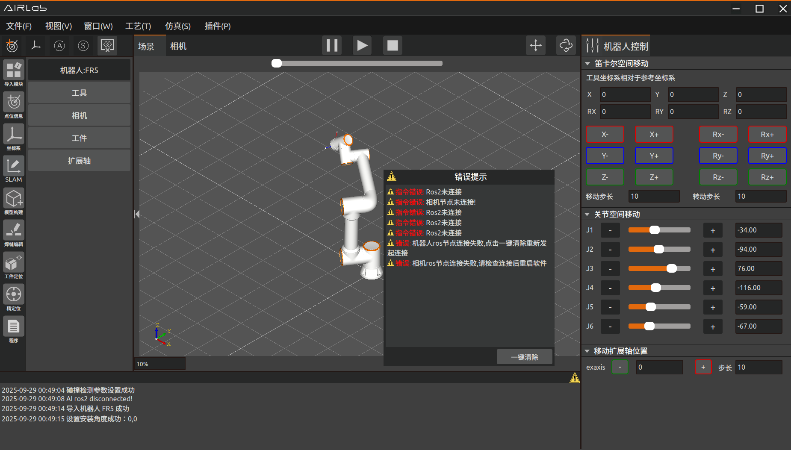

.. centered:: 图4-132 隐藏参考坐标系

无模型工件建模程序
~~~~~~~~~~~~~~~~~~~

无模型工件建模程序作用是对无模型工件进行模型的创建，进行无模型工件建模程序的运行需要先创建无模型工件建模程序，具体见4.5.5节。点击工程树“无模型工件建模”节点，子界面跳转到“无模型工件建模程序”。“无模型工件建模程序”子界面具体的功能有获取模型数据、清除建模数据、仿真轨迹生成、清除轨迹、虚拟工具生成、清除工具、运行程序和停止程序。

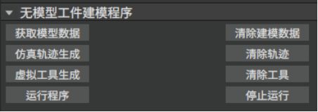

.. centered:: 图4-133 无模型工件建模程序

仿真轨迹生成：点击该按钮，场景中生成工程树中“无模型工件建模程序”运行过程中的仿真轨迹。
清除轨迹：点击该按钮，清除三维场景中生成的仿真轨迹。
运行程序：点击运行程序按钮，实体机器人按照创建的无模型工件建模程序下的指令进行移动、拍照和模型构建（在运行程序前可以先生成仿真轨迹，确定轨迹后再进行程序运行）。程序运行到“拍照”子节点，三维场景中会出现一个已采集点云弹窗，实时显示点云采集结果并进行拼接，直至显示出完整的工件点云。如图4-134所示。

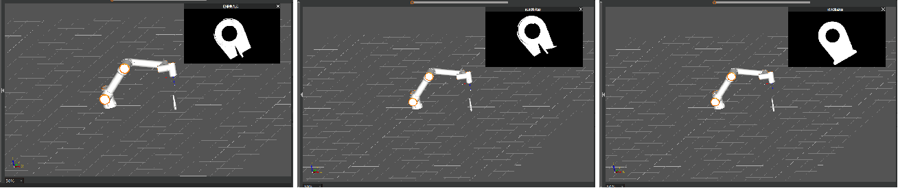

.. centered:: 图4-134 无模型点云采集过程图

“模型构建”指令执行完成后，三维场景中会显示构建成功的工件模型和焊缝编号，如图4-135和图4-136所示。

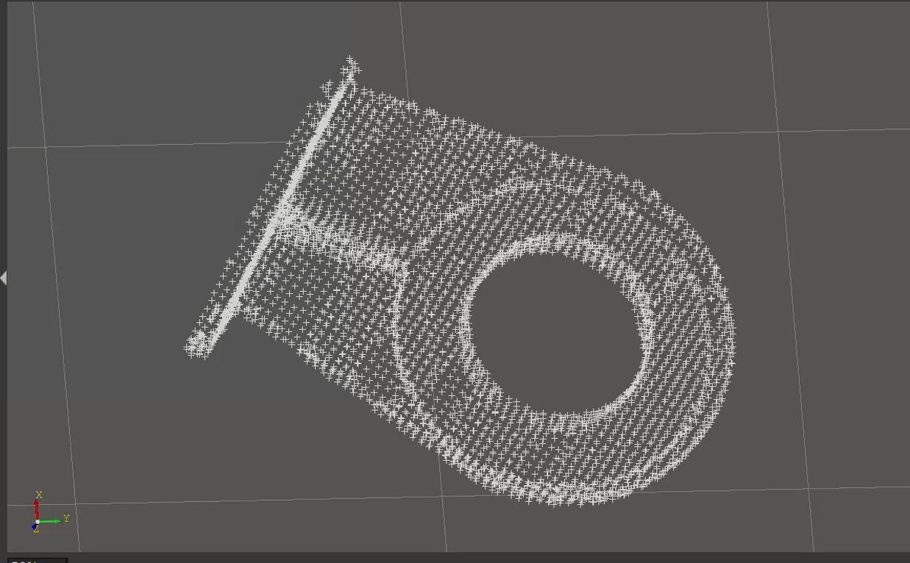

.. centered:: 图4-135 无模型工件的构建结果图

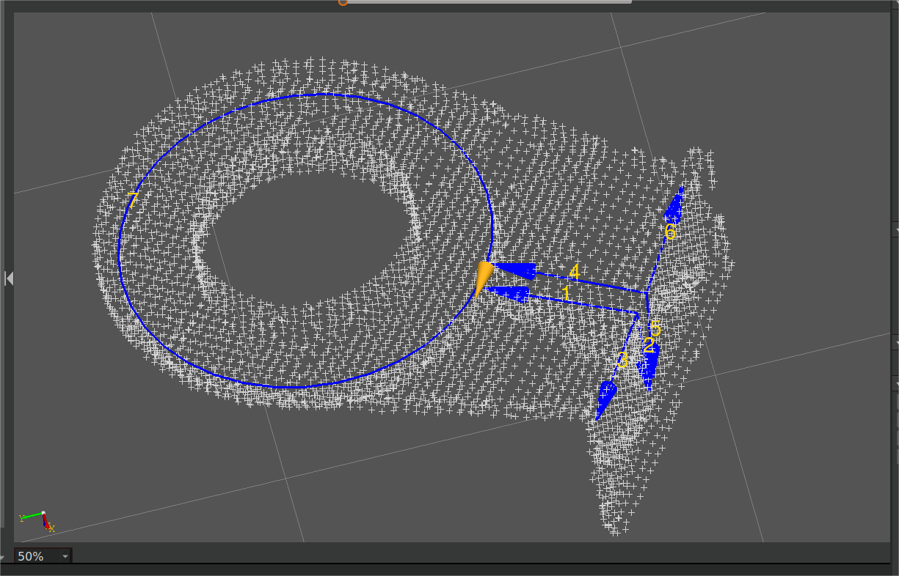

.. centered:: 图4-136 构建的焊缝编号

停止程序：点击该按钮，实际机器人立即停止运行无模型工件建模程序。
获取模型数据：点击该按钮，AIRLab界面会显示构建得到的焊缝编号。如果是用户正在构建无模型工件，在构建完成后，工件模型和焊缝编号会自动显示在界面上，不需要点击该按钮进行获取；只有当用户打开之前构建成功的工件时，界面会只显示工件模型，此时需要点击该按钮获取焊缝编号，结果如图4-137所示。

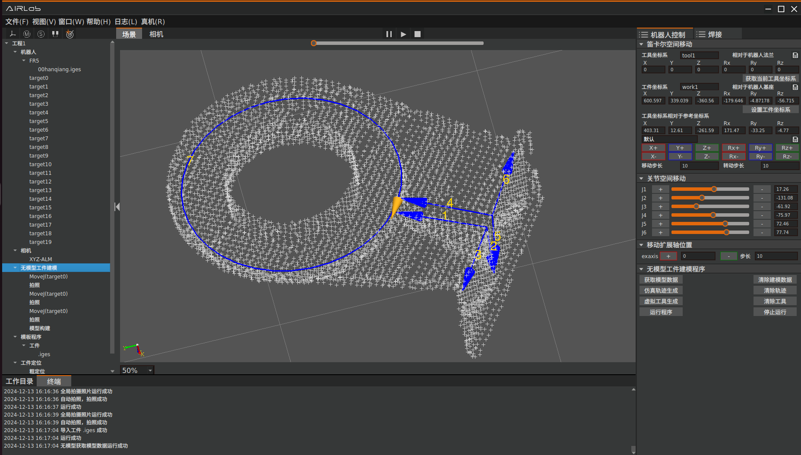

.. centered:: 图4-137 获取工件的焊缝编号

清除建模数据：点击该按钮会清除界面上显示的焊缝编号，如图4-138所示。

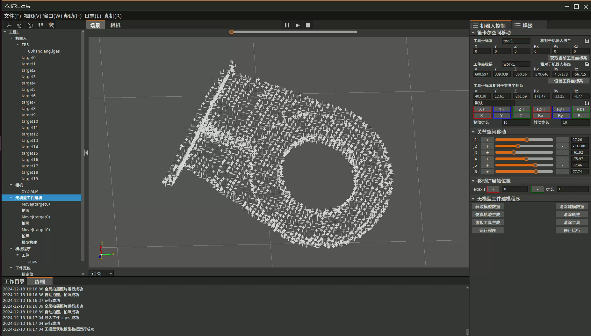

.. centered:: 图4-138 清除AIRLab界面上工件的焊缝编号

虚拟工具生成：点击该按钮，场景中显示无模型工件建模程序运行时关键点位处工具的姿态。
清除工具：点击该按钮，清除场景中生成的虚拟工具。

模型构建
~~~~~~~~~~~~~~~~~~~

点击左侧工程树“无模型工件建模”节点下的“模型构建”子节点，如图4-139所示，子界面跳转到“模型构建”。
用户在模型构建页面选择构建算法(AIRLab目前提供了一种构建算法：算法1)，并为待构建工件设置工件名称。如图所示，设置完成后点击“确定”按钮即可，该步骤需要在运行工程树“无模型工件建模”节点程序前设置完成。

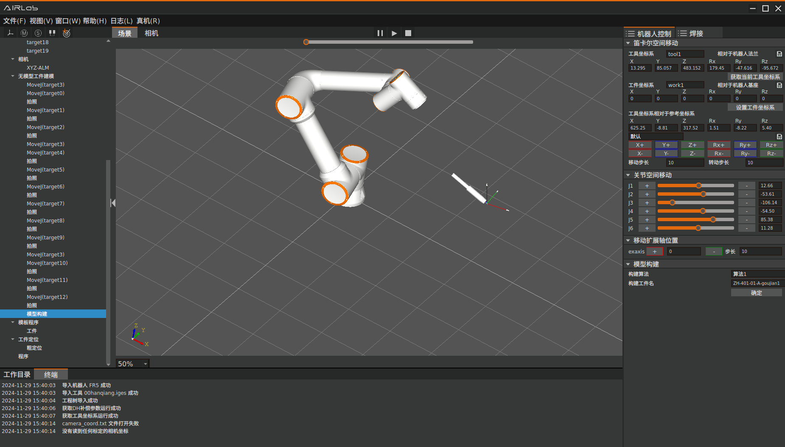

.. centered:: 图4-139 模型构建子页面

圆柱填充指令配置
~~~~~~~~~~~~~~~~~~~

右击左侧工程树“焊缝”节点，选择PlugWeld新增子节点，点击该节点如图4-140所示，右侧子页面切换为“圆柱填充指令配置”。用户根据实际焊接需求编辑焊接工艺，该焊接工艺主要分为两部分，一部分是圆柱填充，另一部分是圆柱表面加固。图4-141中的左图为待焊接圆柱工件示意图，右图为焊接工艺示意图。

.. figure:: analysis/140.png
	:align: center
	:width: 6in

.. centered:: 图4-140 圆柱填充指令配置子页面

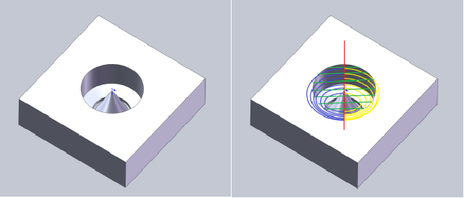

.. centered:: 图4-141 圆柱工件示意图（左）焊接工艺示意图（右）

下面介绍该工艺的使用方法：
在焊缝工程树节点右击PlugWeld，添加圆柱填充指令配置节点，点击PlugWeld跳转至圆柱填充指令配置，如图所示设置圆柱填充工艺的6个填充姿态和2个加固姿态，选择是否绑定圆柱填充工艺和绑定的圆柱填充工艺，点击“工艺查询”按钮会出现一个圆柱填充工艺查询弹窗，如图4-142所示，该弹窗的详细功能介绍见章节4.6.6。

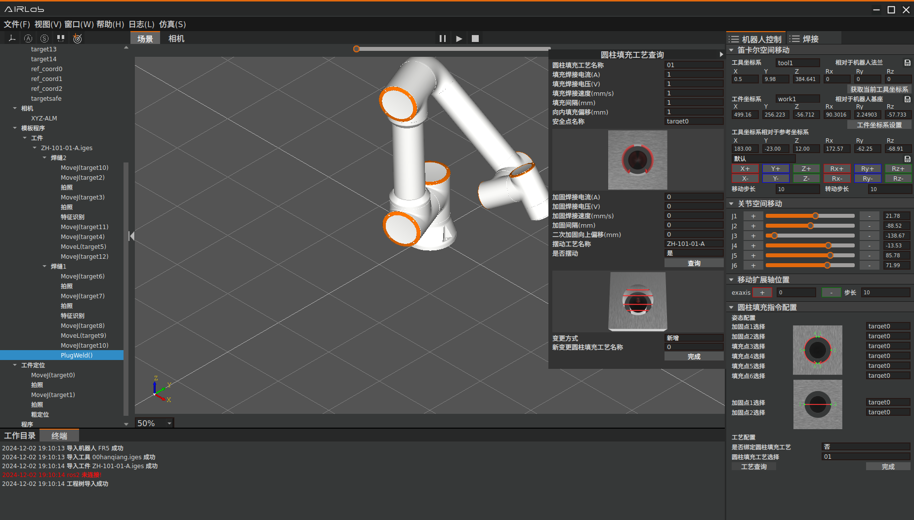

.. centered:: 图4-142 圆柱填充工艺查询

点击完成实现圆柱填充指令配置，最后运行该焊缝程序生成程序节点下的指令，再运行程序节点的指令即可得到如图4-143所示的结果。

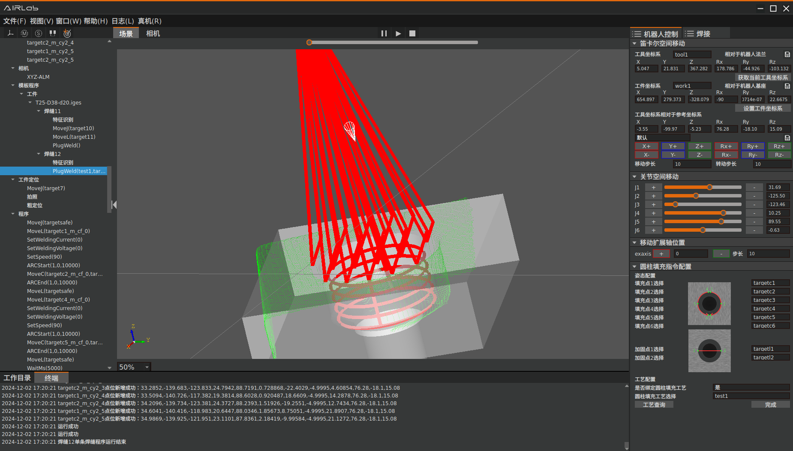

.. centered:: 图4-143 圆柱填充工艺仿真结果