AIRLab软件解析
====================
.. toctree:: 
    :maxdepth: 5

AIRLab软件初始界面如图3-1所示，主要分为五个部分。界面中间是主显示框（分为场景显示和相机显示），上方是菜单栏，最左侧是工程模块区，最右侧是操作区，界面最下端是指令反馈区。本章节将对上述区域的功能和使用方法、AIRLab软件中出现的弹窗及其他页面以及子页面功能进行详细介绍。

.. figure:: analysis/1.png
	:align: center
	:width: 6in

.. centered:: 图3-1 AIRLab软件初始界面

菜单栏
--------------------------
菜单栏包含的所有内容如图3-2所示，主要有按钮：“文件”、“视图”、“窗口”、“工艺”、“仿真”、“插件”，以及图标按钮（从左到右顺序）：点位新增、坐标系新增、模式切换、暂停运行、开始运行、停止运行、视野移动、视野旋转。

.. figure:: analysis/2.png
	:align: center
	:width: 6in

.. centered:: 图3-2 AIRLab菜单栏

文件
~~~~~~~~~~~~~~~~~~~
点击“文件”按钮，会出现下图所示的菜单：“新建”、“打开”、“导出”。使用方法介绍如下：

.. figure:: analysis/3.png
	:align: center
	:width: 1.5in

.. centered:: 图3-3  AIRLab菜单栏-文件

选择“新建”点击，出现如图所示“新建工程”弹窗，在弹窗中选择焊接工程类型，点击“确定”按钮即完成工程新建。

.. figure:: analysis/4.png
	:align: center
	:width: 2in

.. centered:: 图3-4 AIRLab菜单栏-文件设置-新建

选择“打开”点击，出现“选择项目”弹窗，找到工程的路径，选中双击或者单击后点击弹窗中的“打开”按钮，即完成已有工程的导入。

.. figure:: analysis/5.png
	:align: center
	:width: 5in

.. centered:: 图3-5 AIRLab菜单栏-文件设置-打开

选中“导出”点击，出现“保存项目”弹窗，该功能会将AIRLab当前的工程保存在用户自定义路径下。在弹窗中“File name”一栏中为工程命名后，点击“Save”即完成当前工程的导出。

.. figure:: analysis/6.png
	:align: center
	:width: 5in

.. centered:: 图3-6 AIRLab菜单栏-文件设置-导出

视图
~~~~~~~~~~~~~~~~~~~
视图包含12个功能，如图3-7所示，主要功能是调整主显示框中机器人的观察视角。分别为：Zoom、Pan、Rotate、Reset、Fit all、前视、后视、俯视、仰视、左视、右视、全视。

.. centered:: 图3-7 AIRLab菜单栏-视图

视图的具体功能说明见表3-1。

.. centered:: 表3-1 视图功能说明表

窗口
~~~~~~~~~~~~~~~~~~~
“窗口”包含11个二级选项，分别是“软件升级”、“焊接数据采集”、“关于”、“日志”、“虚拟相机”、“全局设置”、“清枪剪丝”、“自动循环运行”、“用户数据备份”、“3D文件解析”、“多工位自动运行”。点击不同的选项，AIRLab出现不同的功能弹窗。详细功能和用法说明见3.6节中的弹窗介绍。

.. figure:: analysis/cn_windows.png
	:align: center
	:width: 2.5in

.. centered:: 图3-8 AIRLab菜单栏-窗口

工艺
~~~~~~~~~~~~~~~~~~~

“工艺”包括“焊接工艺”、“圆柱填充”，根据工艺需要选择不同的工艺，单击选项出现对应的功能弹窗。详细介绍见3.6工程模块解析章节介绍。

.. figure:: analysis/9.png
	:align: center
	:width: 2.5in

.. centered:: 图3-9  AIRLab菜单栏-工艺

仿真
~~~~~~~~~~~~~~~~~~~

该按钮用于切换仿真机器人和实体机器人，使用前需成功导入或创建一个工程，且与实体机器人成功建立Ros2通信连接。完成上述前提后点击该按钮就可以实现虚拟机器人和实体机器人二者之间的切换，切换实机后，AIRLab场景中显示的机器人姿态将与实际机器人同步，如图3-10。

.. centered:: 图3-10  实机切换后AIRLab显示

仿真场景：用于仿真不会实时同步更新三维场景中机器人位置；

真机场景：更新当前工具坐标系、DH补偿参数与实际机器人一致，三维场景中机器人位置与实体机器人一致。

插件
~~~~~~~~~~~~~~~~~~~

为增强AIRLab软件的可扩展性和用户体验，AIRLab提供了插件模块，允许用户根据自己的需求，开发出符合自己需求的插件。这些插件可以通过动态库（.so）加载到AIRLab软件中，从而实现对软件功能的扩展和增强。现有的插件包括binpick、喷涂、对话式智能助手三个功能模块。各个插件介绍和具体操作详见第四章插件部分。

.. centered:: 图3-11  菜单栏-插件

模式切换
~~~~~~~~~~~~~~~~~~~

AIRLab软件与实体机器人建立ROS2通信后，用户点击该按钮可以切换实体机器人的模式状态。A代表当前机器人处于自动模式，M代表当前机器人处于手动模式。此外，在自动模式下点击该图标会将机器人模式切换至手动，在手动模式下点击该图标会将机器人模式切换至自动。

点位新增
~~~~~~~~~~~~~~~~~~~

该功能用于快速记录机器人当前点位，点击该按钮后，工程树中的“机器人”节点下会新增一个点位targetX，X的作用是防止新增点位重名，如图所示。该点位的j1、j2、j3、j4、j5、j6、x、y、z、rx、ry、rz信息为机器人当前的关节坐标和笛卡尔坐标。

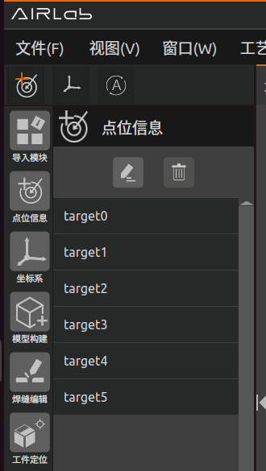

.. centered:: 图3-12 AIRLab菜单栏-点位新增

.. figure:: analysis/13.png
	:align: center
	:width: 3in

.. centered:: 图3-13  AIRLab终端-点位新增成功信息打印

坐标系创建
~~~~~~~~~~~~~~~~~~~

点击该按钮，AIRLab会创建一个新的参考坐标系，用于焊缝偏移和焊接工艺方面，辅助用户快速准确地完成焊缝/焊道的偏移设置。

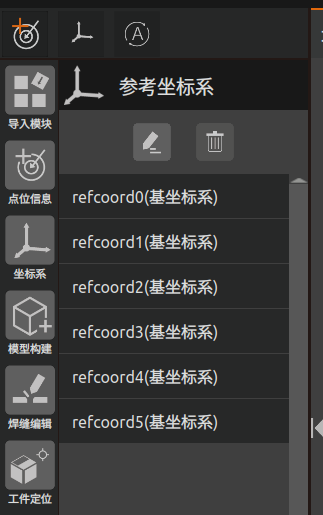

.. centered:: 图3-14  AIRLab菜单栏-参考坐标系

点击参考坐标系，可以选择删除坐标系或者编辑坐标系。选择要编辑的参考坐标系，点击编辑图标；界面出现弹窗“参考坐标系”。

.. figure:: analysis/15.png
	:align: center
	:width: 3in

.. centered:: 图3-15  AIRLab菜单栏-参考坐标系-编辑坐标系

可以选择参考坐标系的参考坐标系是工件坐标系、基座标系或世界坐标系，设置坐标系的位置，选择是否显示该参考坐标系。图3-16为显示坐标系，图3-17为不显示坐标系。

.. figure:: analysis/16.png
	:align: center
	:width: 3in

.. centered:: 图3-16  AIRLab菜单栏-参考坐标系-显示坐标系

.. figure:: analysis/17.png
	:align: center
	:width: 3in

.. centered:: 图3-17  AIRLab菜单栏-参考坐标系-不显示坐标系

离线仿真
~~~~~~~~~~~~~~~~~~~
离线仿真功能主要用于焊缝编辑模块，在焊缝编辑完成后，仿真出编辑后的焊缝轨迹。主要作用是在生成最终的焊接程序前仿真查看该焊接轨迹是否正确。
点击离线仿真图标，离线仿真功能开启，开启状态如下图：

.. figure:: analysis/offline_imulation1.png
	:align: center
	:width: 6in

.. centered:: 图3-18  开启离线仿真

再次点击离线仿真功能关闭，如图所示。

.. figure:: analysis/offline_imulation2.png
	:align: center
	:width: 6in

.. centered:: 图3-19  关闭离线仿真

在离线仿真功能开启的状态下，对焊缝进行编辑，编辑完一条焊缝后，点击焊缝编弹窗的“离线仿真”按钮，三维场景中则会显示该条焊缝编辑后的焊接轨迹。

.. figure:: analysis/offline_imulation3.png
	:align: center
	:width: 6in

.. centered:: 图3-20  单条焊缝进行离线仿真

所有焊缝都编辑完后，点击“焊缝编辑”模块，选择“离线仿真已编辑焊缝”。
三维场景生成所有焊缝编辑后的仿真轨迹；点击“清除轨迹”三维场景中的仿真轨迹被清除。

.. figure:: analysis/offline_imulation4.png
	:align: center
	:width: 6in

.. centered:: 图3-21  所有焊缝离线仿真

暂停程序
~~~~~~~~~~~~~~~~~~~

点击该按钮会立即暂停正在运行程序的机器人，再次按下该按钮后将恢复机器人继续运行暂停前的程序。

开始运行
~~~~~~~~~~~~~~~~~~~

点击该按钮，机器人会先运行AIRLab左侧“工件定位”模块下的所有指令，工件定位成功后机器人开始运行焊缝识别；焊缝识别成功后，根据程序配置中用户设置的参数，自动运行或者不运行程序。

停止运行
~~~~~~~~~~~~~~~~~~~

点击按钮会立即停止正在运行程序的机器人，该按钮与暂停/恢复按钮的区别在于，再次按下该按钮，机器人无法恢复运行，只能通过开始运行按钮重新开始。

视野移动
~~~~~~~~~~~~~~~~~~~

点击视野移动按钮，界面显示视野移动弹窗；用户可以设置移动步长对三维场景视野进行X+、X-、Y+、Y+方向进行固定步长的移动，用于想要精确查看三维场景某一视角。

.. figure:: analysis/18.png
	:align: center
	:width: 2.5in

.. centered:: 图3-22  视野移动弹窗

视野旋转
~~~~~~~~~~~~~~~~~~~

点击视野旋转按钮，界面显示视野旋转弹窗；用户可以设置移动步长对三维场景视野进行RX+、RX-、RY+、RY+方向进行固定步长的旋转，用于想要精确查看三维场景某一视角。

.. figure:: analysis/19.png
	:align: center
	:width: 2.5in

.. centered:: 图3-23  视野旋转弹窗

主显示框
--------------------------

主显示框分为场景显示和相机显示，其中场景主要显示机器人、工具、工件、扩展轴模型等，如图3-24。相机主要显示获得的点云图，如图3-25。

.. figure:: analysis/20.png
	:align: center
	:width: 6in

.. centered:: 图3-24  AIRLab主显示框-场景显示

.. figure:: analysis/21.png
	:align: center
	:width: 6in

.. centered:: 图3-25 AIRLab主显示框-相机显示

指令反馈区
--------------------------

指令反馈区显示程序指令执行结果和返回的机器人错误信息，如图3-26。

.. figure:: analysis/22.png
	:align: center
	:width: 5in

.. centered:: 图3-26 AIRLab指令反馈区

操作区
--------------------------

笛卡尔空间移动
~~~~~~~~~~~~~~~~~~~

该区域包括工具坐标系、工件坐标系、工具坐标系相对于参考坐标系以及长按点动触发、移动步长和转动步长设置四部分内容，如图3-27所示。

.. figure:: analysis/23.png
	:align: center
	:width: 2.5in

.. centered:: 图3-27  AIRLab操作区-笛卡尔空间移动

- 工具坐标系部分：工具坐标系的下拉列表中共有15个编号tool0-tool14，选择对应的坐标系（坐标系名称可自定义）后，在下方X、Y、Z、Rx、Ry、Rz的文本框中会显示对应坐标值，改变上述6个文本框内的数值，场景显示框中虚拟机器人的工具坐标系会相应变化。点击“获取当前工具坐标系”按钮用于获取实体机器人当前的工具坐标系。

- 工件坐标系部：工件坐标系的下拉列表同样有15个编号work0-work14，设置文本框X、Y、Z、Rx、Ry、Rz中值会改变AIRLab软件场景显示框中工件的位置。点击“设置工件坐标系”按钮，机器人会将三维场景中的工具坐标系下发至实际机器人并应用。

.. important:: 
    用户在设置工具/工件坐标系编号时，需与Web端当前机器人使用的工具坐标系编号和工件坐标系编号一致。

- 工具坐标系相对于参考坐标系部分，该部分显示的是工具坐标系相对于参考坐标系的值。

- 长按点动触发、移动步长和转动步长设置部分。如图3-28所示，如果当前导入的机器人模型是实体机器人，长按X+按钮，实体机器人会执行X+点动指令；如果当前导入的机器人模型不是实体机器人，长按X+按钮，仿真机器人会执行X+点动指令。

.. important:: 
     通过长按按钮控制机器人的JOG点动，若在机器人运行中松开按钮，机器人会立即停止运动；若一直按住按钮不松开，机器人会运行移动步长设置的值后停止运动。X-、Y+、Y-、Z+、Z-按钮的操作同理。如果是长按Rx+、Rx-、Ry+、Ry-、Rz+、Rz-按钮，其他方面不变，只是机器人将按照设置的转动步长值运动。

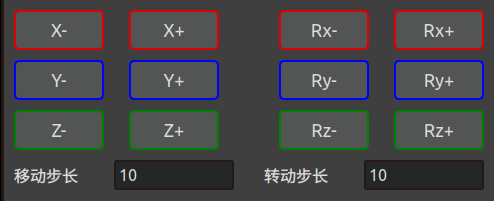

.. centered:: 图3-28  AIRLab操作区-长按点动

关节空间空间移动
~~~~~~~~~~~~~~~~~~~

该区域包括关节J4-J6的12个关节坐标长按触发按钮，6个关节坐标变化文本框以及6个关节滑块三部分内容，如图3-29。

.. figure:: analysis/25.png
	:align: center
	:width: 3in

.. centered:: 图3-29  AIRLab操作区-关节空间空间移动

- 长按J1的“+” 或“-”按钮，可以在手动模式和关节坐标系下通过长按“+”或“-”按钮控制实体机器人J1关节的运动。其他关节的“+” 或“-”按钮操作同理。

.. important:: 
    通过长按按钮控制机器人运行，若在机器人运行中松开按钮，机器人会立即停止运动；若一直按住按钮不松开，机器人会运行移动步长/转动步长的设置值后停止运动。

- 6个文本框会实时更新显示机器人6个关节的角度值。此外，编辑6个文本框中的数值也可以达到控制机器人关节运动的目的（编辑时需要注意不能超出机器人的关节角度软限位）。

- 关节滑槽的作用是用户可以通过滑动关节滑槽实现机器人各关节的运动，滑槽代表的关节角度通过文本框内的数值显示。

移动扩展轴设置
~~~~~~~~~~~~~~~~~~~

该部分包括“exaxis+”、“exaxis-”以及步长设置框，如图3-30。“exaxis+”、“exaxis-”的功能与工具坐标系下的点动X+、X-类似，通过上述两个按钮可以控制扩展轴的运动。长按按钮控制扩展轴运行，若在扩展轴运行中松开按钮，扩展轴会立即停止运动；若一直按住按钮不松开，扩展轴会运行步长设置框设置的值后停止运动。

.. centered:: 图3-30  AIRLab操作区-移动扩展轴位置

工程模块解析
--------------------------
要对一个工件进行焊接，需要先进行导入，导入机器人、工具、工件等模型；如果当前没有工件模型则需要先进行无模型构建。之后对工件进行定位以及对焊缝进行编辑，都完成之后编辑自动拍照位姿并运行程序进行焊缝识别，生成焊接程序。本章将对工程模块的每一个模块进行详细介绍。

导入模块
~~~~~~~~~~~~~~~~~~~

点击工程模块区-导入模块，用户可以选择导入机器人、工具、工件、扩展轴或相机。

.. figure:: analysis/27.png
	:align: center
	:width: 6in

.. centered:: 图3-31  模块设置页面

- 导入机器人：选择机器人，界面显示机器人设置页面，选择要导入的机器人型号。

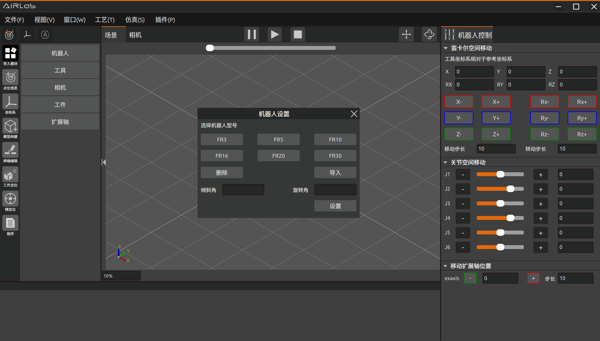

.. centered:: 图3-32  机器人设置页面

以FR5为例，选择FR5型号的机器人点击导入，三维场景中导入FR5机器人模型，终端显示导入机器人成功即为导入机器人模型成功。

.. figure:: analysis/29.png
	:align: center
	:width: 6in

.. centered:: 图3-33  导入机器人成功

考虑到更加灵活丰富的机器人部署场景，我们提供了自由安装功能，用户设置模块设置页面中的倾斜角和旋转角，三维场景中的机器人模型或展示对应的安装效果。修改后点击设置即可完成机器人安装方式设置。

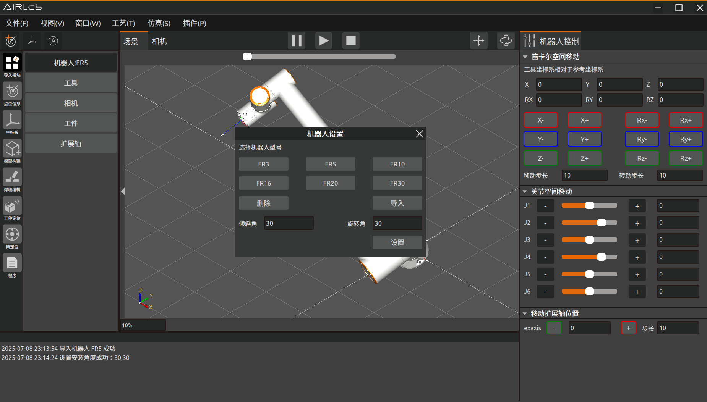

.. centered:: 图3-34  设置机器人倾斜角和旋转角

.. important:: 
	机器人安装完成后，必须正确设置机器人的安装方式，否则会影响机器人的拖动功能以及碰撞检测功能使用。

机器人设置页面中点击“删除”按钮即可删除当前导入的机器人模型。

- 导入工具：选择工具，AIRLab界面显示工具设置页面。

.. centered:: 图3-35  工具设置页面

点击打开，在对应路径下选择要导入的工具模型，点击“Open”。

.. figure:: analysis/32.png
	:align: center
	:width: 5in

.. centered:: 图3-36  选择工具模型

三维场景中显示导入的工具模型，终端显示“导入工具成功”，则成功导入工具模型。

.. figure:: analysis/33.png
	:align: center
	:width: 6in

.. centered:: 图3-37  导入工具成功

导入工具之后可以对当前工具坐标系和工具外观位置进行设置；

点击工具设置页面工具坐标系下的“获取当前”按钮，可以获取工具当前的坐标系，对工具坐标系进行修改后点击保存即可修改工具坐标系。

.. centered:: 图3-38  获取当前工具坐标系

如果需要修改工具外观位置，则修改工具设置页面外观位置下的坐标，之后点击“设置工具外观”按钮，则完成工具外观位置的设置。

.. figure:: analysis/35.png
	:align: center
	:width: 6in

.. centered:: 图3-39  设置工具外观位置

工具设置页面中点击“删除”按钮即可删除当前导入的工具模型。

- 导入工件：选择工件，AIRLab界面显示工件设置页面。
  
.. figure:: analysis/36.png
	:align: center
	:width: 6in

.. centered:: 图3-40  工件设置页面

点击“打开”按钮，在对应路径下选择要导入的工件模型，点击“Open”，三维场景中显示导入的工件模型机器焊缝，导入工件成功。

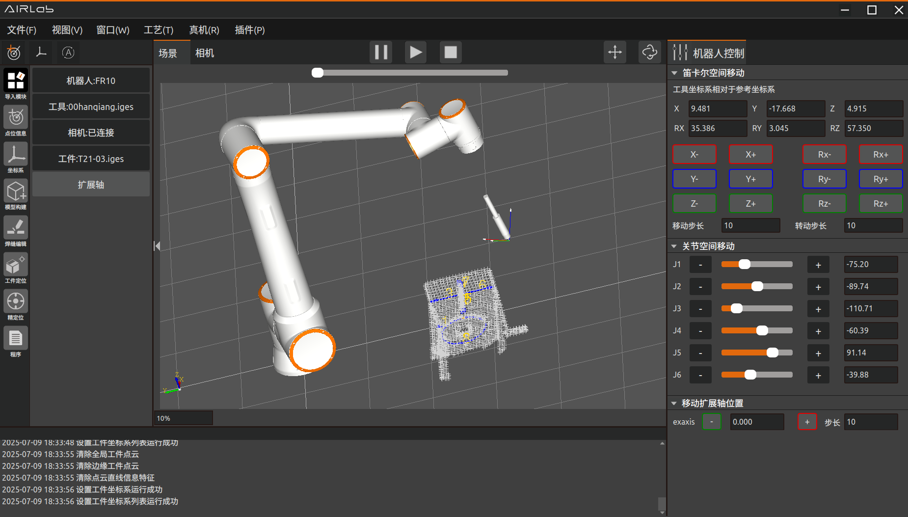

.. centered:: 图3-41  导入工件成功

设置工件坐标系：工件设置页面下设置工件坐标系之后，点击“保存工件坐标系”，即可设置工件坐标系。

删除工件：工件设置页面中点击“删除工件”按钮，即可删除当前三维场景中导入的工件。

- 导入扩展轴：选择扩展轴，AIRLab界面显示扩展轴设置页面。

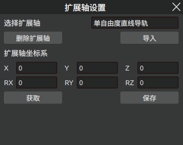

.. centered:: 图3-42  扩展轴设置页面

AIRLab软件三维场景中显示导入的扩展轴模型，扩展轴即导入成功。

.. figure:: analysis/39.png
	:align: center
	:width: 6in

.. centered:: 图3-43  扩展轴导入成功

删除扩展轴：扩展轴设置页面中点击“删除扩展轴”，即可删除当前三维场景中导入的扩展轴。

- 导入相机：选择相机，AIRLab界面显示相机设置页面。相机设置页面分为三部分：相机配置、设备信息及设备调试。

.. figure:: analysis/40.png
	:align: center
	:width: 2.5in

.. centered:: 图3-44  相机设置页面

相机配置：点击相机配置，可以进行相机设备的连接以及一些拍摄参数的设置。点击“搜索设备”，表格中显示连接的相机设备，点击要连接的相机设备点击“连接”，连接状态显示“已连接”则表示连接成功。弹窗上会显示相机的IP和子网掩码即当前相机设置的参数。

.. figure:: analysis/41.png
	:align: center
	:width: 2.5in

.. centered:: 图3-45  相机配置-搜索设备

相机连接成功后，点击“获取参数”会获取当前相机配置的参数，修改相应参数点击“设置参数”，对应参数则会成功修改为设置值。以下是各个参数的含义：

- 结构光曝光时间：结构光模式下当画面太暗时，需要增加曝光时间；当画面太亮时需要减少曝光时间； 

- 线扫时间：当工件过于反光，成像出现多出空洞时，可以增加线扫时间来补全空洞

- 线扫曝光时间：线扫模式下当画面太暗时，需要增加曝光时间；当画面太亮时需要减少曝光时间；

- 明亮程度：画面太暗看不清细节时，可以提高明亮程度；画面太亮发白时，需要降低亮度；

- 是否开启保护壳：焊接保护罩，用于防止焊接时候，出现的残渣飞溅，默认在拍摄过程中处于开启状态。

设备信息：点击设备信息，可以查看所连接的相机名称、型号、连接状态等参数，如图所示。

.. figure:: analysis/42.png
	:align: center
	:width: 3in

.. centered:: 图3-46  相机设备信息

设备调试：点击设备调试，可以对相机进行调试。包括“老化调试”、“单次拍摄”、“保存点云”等功能。

.. figure:: analysis/43.png
	:align: center
	:width: 3in

.. centered:: 图3-47  相机设备调试

当图像有很多小噪点时，可以调高阈值；当需要保留细微边缘时，可以调低阈值；下面对这些功能进行介绍；

- 老化调试：点击“老化调试”按钮可以对相机进行老化调试，相机会持续每隔几秒拍摄一次照片，再次点击“老化调试”停止拍摄，拍摄结果会在主显示框-相机显示中显示；

- 单次拍摄：在当前位置拍摄一张图片，拍摄结果显示在主显示框-相机显示中；其中原始点云是相机拍摄直接得到的点云，基坐标系点云是机器人基坐标系下的点云，可以根据需要切换显示。

- 保存点云：单次拍摄后，点击“保存点云”，选择保存路径即可保存点云结果到指定路径下；

- 保存图像：单次拍摄后，点击“保存图像”，选择保存路径即可保存图像到指定路径下；

- 手眼标定：对相机进行眼在手上或眼在手外标定，计算手眼标定矩阵；详细操作见3.5章节点云相机手眼标定；

SLAM建图
~~~~~~~~~~~~~~~~~~~
点击工程模块的SLAM建图模块，创建SLAM建图程序；与无模型建模程序类似。SLAM建图也是由移动+拍照组合；由于箱体结构较大，需要在不同的扩展轴位置进行多组照片的拍摄；在同一个扩展轴位置拍摄的所有照片拼接成一个子地图；所有的子地图最终拼接成一个总地图；

子地图的SLAM程序如图所示，由多组移动+拍照节点组合；原则是要将当前扩展轴位置的箱体模型拍摄完整；所有的移动+拍照节点添加完成后，添加SLAM建图节点。这样就完成了一个子地图的SLAM所有节点添加。

.. figure:: analysis/slam1.png
	:align: center
	:width: 3in

.. centered:: 图3-48  创建SLAM子地图程序

移动扩展轴创建下一个子地图，所有子地图节点添加完成后，添加构建模型名称节点，至此完成了完整SLAM建图程序；完整的SLAM建图程序如图所示。

.. figure:: analysis/slam2.png
	:align: center
	:width: 3in

.. centered:: 图3-49  完整SLAM建图程序

SLAM建图程序创建完成之后，点击“SLAM建图”模块，出现“生成轨迹”、“清除轨迹”、“运行程序”、“停止程序”等选项。这几个选项功能和无模型建模相同选项功能相同。

.. figure:: analysis/slam3.png
	:align: center
	:width: 3in

.. centered:: 图3-50  点击SLAM建图模块

点击“运行程序”开始运行SLAM建图程序，执行移动+拍照指令后对的点云进行拼接得到各个子地图，如图所示

.. figure:: analysis/slam4.png
	:align: center
	:width: 6in

.. centered:: 图3-51  获取slam子地图1

.. figure:: analysis/slam5.png
	:align: center
	:width: 6in

.. centered:: 图3-52  获取slam子地图2

各个子地图再拼接成一个完整的点云，三维场景中显示获取到的完整的箱梁模型；如图所示。

.. figure:: analysis/slam6.png
	:align: center
	:width: 6in

.. centered:: 图3-53  SLAM总地图模型

完成SLAM程序运行得到的模型如果不完整可以再对模型进行补拍。点击SLAM模块下相机图标，三维场景中出现SLAM建图补充拍摄弹窗如图所示。

.. figure:: analysis/slam7.png
	:align: center
	:width: 3in

.. centered:: 图3-54  SLAM建图补充拍摄

1) 选择要补拍的SLAM编号（现阶段只支持编号0）
2) 点击“移动扩展轴位置”，扩展轴则移动到所选编号的对应位置。
3) 选择拍照点位，点击“移动至该点位”将机器人移动至所选拍照点位；
4) 点击“拍照”按钮进行拍照。
5) 可以重复3~4过程拍摄多张照片；
6) 点击“重新SLAM建图”则会生成补拍后的模型。

无模型构建模块
~~~~~~~~~~~~~~~~~~~
如果要焊接的工件没有模型文件，则需要先对工件进行无模型构建，否则直接导入工件模型进行3.5.3焊缝编辑操作即可。点击工程模块-模型构建；

.. figure:: analysis/44.png
	:align: center
	:width: 6in

.. centered:: 图3-55  工程模块-模型构建

点击加号，界面显示无模型构建弹窗如图：

.. figure:: analysis/45.png
	:align: center
	:width: 3in

.. centered:: 图3-56  无模型构建弹窗

可以选择新增拍照节点、新增移动节点或新增模型构建节点；

添加移动节点：选择要移动到的目标点位，点击确定；则模型构建下新增节点Move(target)；或点击新增当前位置，会新增当前位置点位并在模型构建下新增节点Move(target)；

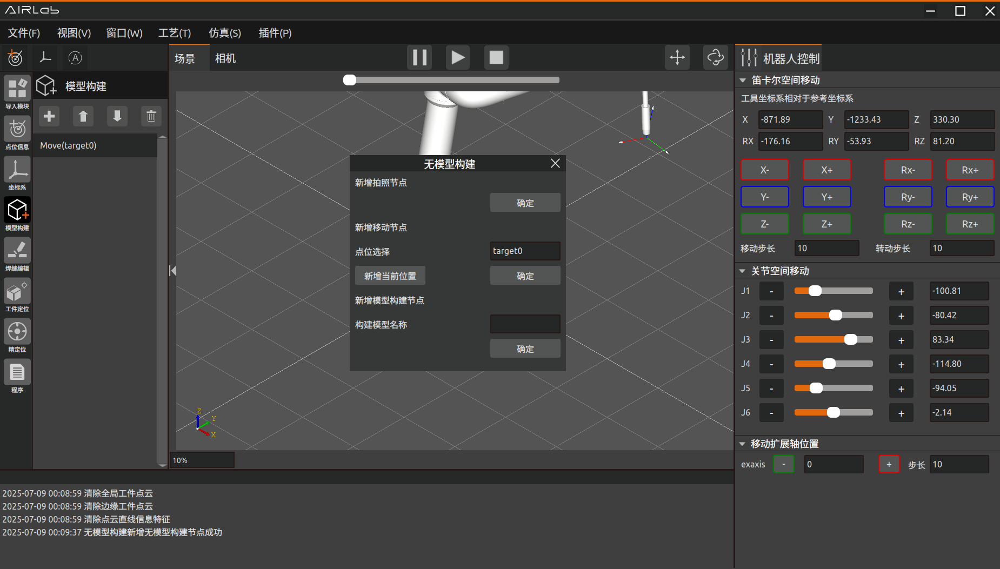

.. centered:: 图3-57  添加移动节点

无模型拍照点位的示教原则是相机能够清晰完整的拍摄到无模型工件的各个位置，特别是需要焊接的焊缝位置。

.. figure:: analysis/47.png
	:align: center
	:width: 5in

.. centered:: 图3-58  不同角度下工件的拍照点位

添加拍照节点：选择节点，点击新增拍照节点下的确定按钮，会在选择的节点下新增拍照节点。

.. centered:: 图3-59  添加拍照节点

添加模型构建节点：添加多组“移动+拍照”节点后添加模型构建节点；首先选择模型构建方法，包括直线＋圆弧和样条曲线两种方法，选择样条曲线则需要设置采样间隔。编辑无模型工件名称，点击“确定”按钮，无模型模块下出现“模型构建”节点。即添加无模型构建节点成功。

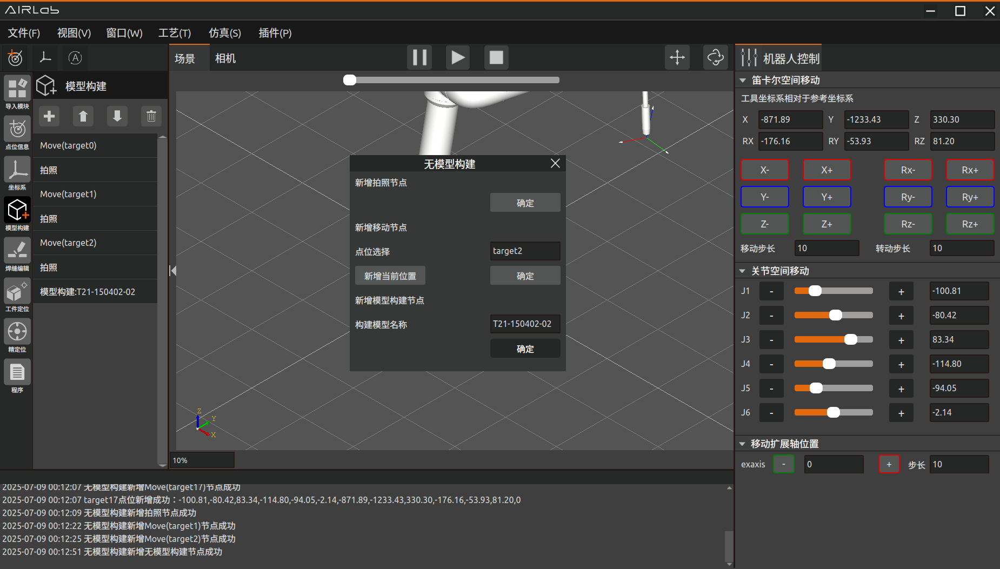

.. centered:: 图3-60  添加模型构建节点

节点添加完成后，可以对添加的节点进行上下移动及删除调整；完成无模型构建程序的创建如图所示。

.. centered:: 图3-61  无模型构建程序

无模型构建程序构建完成之后，鼠标单击“无模型构建”模块，点击“生成轨迹”查看无模型构建程序的仿真轨迹，确认无模型构建程序轨迹正确后，点击运行程序开始运行无模型构建程序。

.. figure:: analysis/51.png
	:align: center
	:width: 2.5in

.. centered:: 图3-62  点击无模型构建模块

无模型构建程序运行完成之后AIRLab三维场景中会显示构建好的无模型工件模型。查看模型是否正确，模型正确无模型构建则成功构建，已经构建成功的模型在下一次直接导入即可，不需要再次对工件进行无模型工件建模。

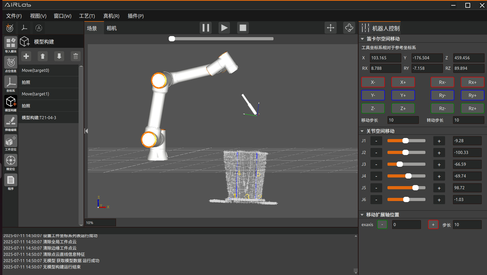

.. centered:: 图3-63  无模型工件构建成功

模型构建的不正确则需要单击“无模型构建”模块，点击“清除模型数据”，重新进行无模型构建，直至正确创建无模型工件模型。
点击无模型构建模块，用户可以选择获取建模数据等选项，具体每个选项的功能如下介绍。

- 补充拍摄：在运行无模型程序生成工件模型后，工件模型如果有不完整的地方需要补拍，将机器人移动到要补拍的位置，点击“补充拍摄”。之后点击“获取建模数据”则会重新导入补拍后的工件模型。

- 获取建模数据：点击“获取建模数据”，清除建模数据之后点击获取建模数据可以重新获取无模型工件模型。

- 清除建模数据：点击“清除建模数据”，清除三维场景中的无模型工件模型。
 
- 运行程序：点击“运行程序”，运行当前无模型构建模块的程序。

- 停止程序：点击“停止程序”，机器人会立即停止运行。

- 生成轨迹：点击“生成轨迹”按钮，AIRLab三维场景中生成程序的仿真轨迹。

- 显示工具：点击“显示工具”，AIRLab三维场景中显示出虚拟工具模型。
 
- 清除工具：点击“清除工具”，AIRLab三维场景中显示的虚拟工具模型被清除。

焊缝编辑
~~~~~~~~~~~~~~~~~~~
导入工件或无模型构建工件成功后，三维场景中会显示工件模型和焊缝数据。

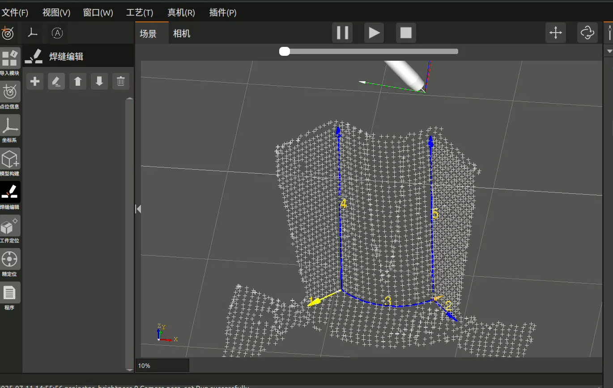

.. centered:: 图3-64  焊缝编辑页面

点击焊缝编辑下的加号弹出焊缝选择弹窗，选择焊缝序号，焊缝类型中自动显示当前所选焊缝的焊缝类型，包括直线焊缝、圆弧焊缝、样条曲线焊缝及柱塞焊缝。点击“确定”按钮添加焊缝，直到所有焊缝添加完成。

.. figure:: analysis/54.png
	:align: center
	:width: 6in

.. centered:: 图3-65  添加焊缝

点击焊缝列表选择焊缝，点击编辑图标，软件中弹出焊缝编辑弹窗如下图所示。

.. figure:: analysis/55.png
	:align: center
	:width: 6in

.. centered:: 图3-66   对焊缝进行编辑

焊缝编辑每个编辑项的含义见3.6.9；将所有的焊缝编辑完成后再进行工件定位或精定位操作。

.. important::
	对于柱塞工件的编辑只需要绑定柱塞工件工艺即可；

对柱塞工件焊缝编辑完成后，点击“焊缝编辑”模块，点击“生成焊接程序”按钮，在“程序”节点下生成柱塞焊接程序。之后可以对生成的焊接节点生成轨迹或运行程序等操作，具体见3.4.6。

工件定位
~~~~~~~~~~~~~~~~~~~

工件定位：在对所有要焊接的焊缝编辑完成后，需要进行工件定位。首先需要创建工件定位程序；点击工程模块-工件定位，点击工件定位下的加号，AIRLab界面会显示工件定位页面如图所示。

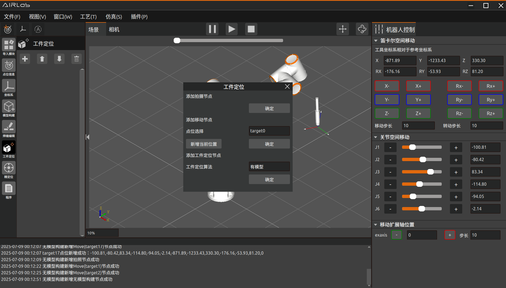

.. centered:: 图3-67  工件定位添加节点弹窗

工件定位模块程序包含3种节点：拍照、移动、粗定位；拍照和移动节点功能和无模型构建模块拍照和移动功能相同，具体介绍见3.5.2无模型构建部分。
添加粗定位节点：添加多组“移动+拍照”节点后添加粗定位节点，选择工件定位算法；粗定位算法包括有模型、圆柱定位、深度模型、深度模型2、柱塞识别；各个算法的适用场景如下。

- 有模型：用于进行无模型构建或导入工件后对工件进行粗定位。
- 圆柱定位：暂未开放
- 深度模型：用于自动循环运行模板程序中，对工件进行识别。
- 深度模型2：与“有模型”选择适用场景相同，用于进行无模型构建或导入工件后对工件进行粗定位。
- 柱塞识别：用于对柱塞工件进行识别及定位。
  
选择工件定位算法后点击确定，工件定位程序下生成“粗定位”节点。

.. figure:: analysis/57.png
	:align: center
	:width: 6in

.. centered:: 图3-68  添加粗定位节点

添加完这些节点之后可以对添加的节点进行调整，之后工件定位程序创建完成。整个程序功能是机器人多次移动到不同拍照点位进行拍照，直至将工件拍摄完整，之后程序会对工件进行粗定位；创建的工件定位程序如下图所示。

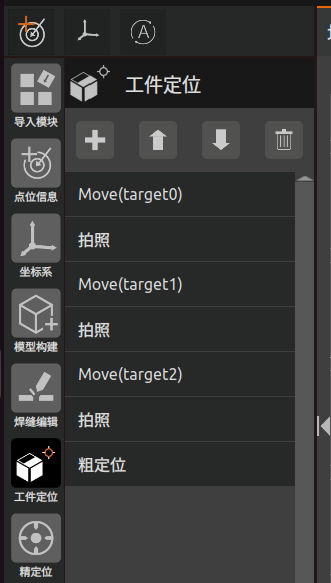

.. centered:: 图3-69  工件定位程序

创建完工件定位之后鼠标单击“工件定位”模块，出现的“运行程序”等选项功能和无模型构建模块“运行程序”等选项功能相同，具体介绍见无模型构建部分。

.. figure:: analysis/59.png
	:align: center
	:width: 2.5in

.. centered:: 图3-70  点击工件定位程序

点击“生成轨迹”查看工件定位程序的仿真轨迹，确认工件定位程序轨迹正确后，点击运行程序开始运行工件定位程序对工件进行工件粗定位。工件定位程序成功运行完成后工件移动到实际和机器人之间的相对位置，如图所示为工件定位后的工件位置。

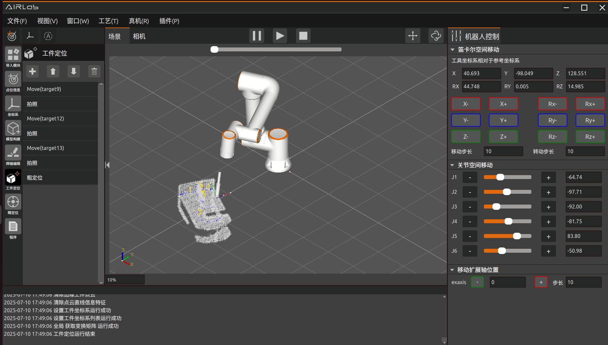

.. centered:: 图3-71  工件定位程序运行成功

自动拍照位姿
~~~~~~~~~~~~~~~~~~~

工件定位完成后，需要对工件焊缝进行精定位获取焊缝数据。无模型构建完成之后，或导入已构建的工件模型后，点击工程模块-精定位，创建精定位程序；点击“精定位”模块，鼠标单击“获取自动拍照位姿”按钮，位姿列表中则会生成推荐的焊缝拍照位姿。

.. centered:: 图3-72  自动拍照位姿列表

因推荐的拍照位姿较多，为了提高效率，用户可以自己减少部分拍照点位自己重新示教拍照点位，拍照点位示教的原则是要将所有焊缝的起点和终点拍摄完整
创建完自动拍照位姿列表之后鼠标单击“自动拍照位姿”模块，会出现“获取自动拍照位姿”、“生成无障碍轨迹”、“生成轨迹”等选项。

.. figure:: analysis/62.png
	:align: center
	:width: 2.5in

.. centered:: 图3-73  点击自动拍照位姿模块

以下是对各个选项功能介绍：

- 获取自动拍照位姿：工件定位后，程序会得到每条焊缝对应的推荐拍照位姿，点击“获取自动拍照位姿”即可获取推荐的拍照点位。
  
- 参考无模型构建生成拍照位姿：会自动获取进行无模型构建时示教的拍照点位作为精定位的拍照点位。
  
- 获取焊缝识别数据：根据精定位识别的结果和已经编辑的焊缝及焊缝属性生成焊接程序。
  
- 参考无模型获取焊缝识别数据：根据无模型构建的结果和已经编辑的焊缝及焊缝属性生成焊接程序。
  
- 无障碍轨迹规划：点击“无障碍轨迹规划”规划碰撞检测后的焊接程序。

- 生成无障碍轨迹：点击“生成无障碍轨迹”，三维场景中会生成经过碰撞检测后的机器人运动轨迹。

- 运行无障碍程序：点击“运行无障碍程序”，机器人会根据经过碰撞检测后的机器人运动轨迹进行运动。

- 运行程序：点击“运行程序”，机器人会运行精定位程序，对焊缝进行精定位，程序运行成功后，会在“程序”模块中生成最终的焊接程序。

- 停止运行：点击“停止运行”，机器人会立即停止精定位程序的运行。

用户选择确认轨迹之后选择运行程序或者运行无障碍程序，进行焊缝识别。自动拍照位姿程序运行完成之后，程序模块下会生成最终的焊接节点。

程序
~~~~~~~~~~~~~~~~~~~
运行完精定位程序后，程序模块下自动生成最终的焊接程序。

.. figure:: analysis/63.png
	:align: center
	:width: 6in

.. centered:: 图3-74  生成焊接程序

点击“程序”模块，用户可以选择“运行程序”、“停止程序”、”生成轨迹“等选项。这些选项功能和上述无模型构建“运行程序”等选项相同。

.. centered:: 图3-75  点击程序模块

点击“生成轨迹”，AIRLab三维场景中生成焊接轨迹，用户可以选择对轨迹进行仿真运行。

.. figure:: analysis/65.png
	:align: center
	:width: 6in

.. centered:: 图3-76  程序生成仿真轨迹

点击“生成工具”，三维场景中会显示关键节点的工具位姿，如下图所示。

.. centered:: 图3-77  生成工具

仿真和工具位姿正确后点击“运行程序”，开始进行实际焊接。
可以对生成的程序进行调整，点击生成的节点，可以对其进行删除、上方添加节点、下方添加节点、编辑节点、上移或下移操作。点击程序模块右侧的加号，AIRLab软件界面会出现程序页面，可以自定义节点内容，点击“确定”之后，程序节点下生成该节点内容。

点位信息
~~~~~~~~~~~~~~~~~~~

点位信息模块：点击点位列表中的点位，可以对点位进行删除或编辑。点击“编辑点位”，AIRLab软件界面显示点位信息修改页面，用户可以选择移动直目标点、同步当前位置或保存修改点位。

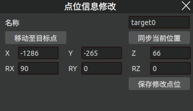

.. centered:: 图3-78  点位信息修改

1) 移动至目标点：用户点击“移动至目标点”按钮，机器人末端则会移动到当前编辑的点位。

2) 同步当前位置：用户点击“同步当前位置”按钮，当前选中的点位target0的点位位姿则会修改为机器人当前实际示教的位姿。

3) 修改保存点位：用户对点位信息进行修改，之后点击“修改保存点位”按钮，即可修改当前点位的坐标。

参考坐标系
~~~~~~~~~~~~~~~~~~~

参考坐标系：点击菜单栏新增参考坐标系图标，新增参考坐标系，用户可以选择参考坐标系的参考基准为工件坐标系或基坐标系；鼠标单击参考坐标系，用户可以现在删除坐标系或编辑坐标系。点击删除坐标系则删除当前的参考坐标系，点击编辑坐标系AIRLab软件显示参考坐标系页面.

.. figure:: analysis/68.png
	:align: center
	:width: 3in

.. centered:: 图3-79  参考坐标系页面

选择参考坐标系是以哪个坐标系为参考坐标系的，之后设置参考坐标系的坐标，选择显示之后点击“设置”按钮，AIRLab三维场景中即会显示设置的参考坐标系。选择“不显示”之后点击“设置”，显示的坐标系则会隐藏。

.. figure:: analysis/69.png
	:align: center
	:width: 5in

.. centered:: 图3-80  显示参考坐标系

弹窗及其他页面
--------------------------

本节介绍AIRLab软件中出现的弹窗及其他页面，弹窗包括关于弹窗、日志弹窗、软件升级弹窗、虚拟相机弹窗、全局设置弹窗、焊接工艺查询弹窗、圆柱填充、焊接数据采集、清枪剪丝弹窗、自动循环运行、用户数据备份、扩展轴同步运动弹窗；其他页面包括其他控制、仿真、调试页面、程序配置及多语言设置。

关于
~~~~~~~~~~~~~~~~~~~
选中“关于”，点击该按钮会查询到当前AIRLab软件、中间层和视觉的版本信息和发布日期，如图3-81所示。

.. figure:: analysis/70.png
	:align: center
	:width: 3in

.. centered:: 图3-81  AIRLab版本信息和发布日期显示

日志
~~~~~~~~~~~~~~~~~~~
日志用于记录系统的运行过程及异常信息，可以快速定位问题。点击该按钮会出现一个“日志等级”弹窗。日志记录分为4个等级，分别是INFO、WARNING、ERROR、DEBUG，选择日志等级后设置当前日志等级（默认INFO）。如图3-82所示，具体含义见表3-2。

.. figure:: analysis/71.png
	:align: center
	:width: 2.5in

.. centered:: 图3-82  AIRLab菜单栏-日志

.. centered:: 表3-2 日志等级信息
.. image:: analysis/4-2.png
	:align: center
	:width: 6in

可以通过修改日志等级来修改当前记录日志情况。

软件升级弹窗
~~~~~~~~~~~~~~~~~~~
点击窗口-软件升级，弹出软件升级弹窗。

.. centered:: 图3-83  “软件升级”弹窗

点击“选择文件”弹出文件选择窗口，选择AIRLab.tar.gz升级文件点击“open”，请确保文件名和格式正确。

.. figure:: analysis/73.png
	:align: center
	:width: 5in

.. centered:: 图3-84  选择AIRLab.tar.gz升级包

选择文件后，点击“open”，确认升级包路径正确无误后点击“升级”按钮。开始软件升级。

.. centered:: 图3-85  点击“升级”按钮

点击升级，等待升级包解压完成，升级进度将在进度条中显示。点击退出则退出软件升级。

.. figure:: analysis/75.png
	:align: center
	:width: 3in

.. centered:: 图3-86  AIRLab软件升级中

升级进度到100%后，点击确认并重启软件，升级完成。

.. figure:: analysis/76.png
	:align: center
	:width: 3in

.. centered:: 图3-87  AIRLab软件升级完成

当升级包损坏或者不完整时，界面会出现升级失败的反馈，并会将AIRLab版本回滚至升级前的状态，完成后点击确认重启软件，重新检查升级包后再次更新。

.. figure:: analysis/update_error_backup.png
	:align: center
	:width: 6in

.. centered:: 图3-88  AIRLab软件升级失败及回滚

版本校验
~~~~~~~~~~~~~~~~~~~
点击“窗口”-“版本校验”，弹出版本校验弹窗，可以查看各个库或功能包的升级版本版本号和实际版本号。如果所有版本都是绿色打勾状态则说明版本校验成功，AIRLab软件可以正常运行，如下图所示。

.. figure:: analysis/version_check.png
	:align: center
	:width: 3in

.. centered:: 图3-89  “版本校验”弹窗

如果版本校验弹窗中该库是红色打叉状态则表示该库或功能包版本不对应，如下图所示；可以跟售后人员反馈该问题并获取最新的升级包。

.. figure:: analysis/version_check_error.png
	:align: center
	:width: 3in

.. centered:: 图3-90  “版本校验”有误

虚拟相机
~~~~~~~~~~~~~~~~~~~
通过虚拟相机视野的显示，可以观察当前相机拍照位置是否合适，同时用户可以根据虚拟相机视野的显示对该拍照位置进行调整，进而将相机调整到最佳的拍照位置。

点击菜单栏-虚拟相机，三维场景中出现虚拟相机弹窗，显示当前位置相机视野，如图所示。

.. figure:: analysis/78.png
	:align: center
	:width: 4in

.. centered:: 图3-91  虚拟相机显示视野

对三维场景中相机位置进行调整，对应虚拟相机视野也会同步进行变换。

.. figure:: analysis/79.png
	:align: center
	:width: 4in

.. centered:: 图3-92  相机视野变换

全局设置
~~~~~~~~~~~~~~~~~~~
为了减少机器人在焊接移动过程中发生碰撞的可能性，AIRLab在菜单栏“窗口”中新增“全局设置”项，提供机器人碰撞检测功能，如图所示。界面包括四种碰撞阈值类型，目前只开放了空移过程碰撞检测距离阈值，该阈值指的是机器人从上一条焊缝的撤出点到下一条焊缝的趋近点之间空移路径的碰撞距离。

.. figure:: analysis/80.png
	:align: center
	:width: 3in

.. centered:: 图3-93  全局设置弹窗内容

目前用户可用的仅有空移过程碰撞检测，当开启自体碰撞检测后，即使用户不设置“空移过程碰撞检测距离阈值(mm)”（即使用默认值0mm），AIRLab也会对机器人的空移路径进行碰撞检测，规划出一条无碰撞的安全路径。当用户设置该参数后，AIRLab会在无碰撞的基础上根据输入的阈值参数为机器人规划出一条距离障碍物更远的空移路径。

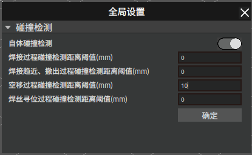

.. centered:: 图3-94  全局设置弹窗--参数设置

用户设置完碰撞检测的参数后，点击“确定”按钮完成参数设置，关闭“全局设置”弹窗。

.. important::
	开启碰撞检测后，用户在创建焊缝模板程序时，需要为每条焊缝示教撤出点和趋近点。

在完成工程模块和其他相关参数的设置后，用户点击AIRLab工具栏中的“一键开始”按钮，当程序运行到避障规划部分时，AIRLab会出现“进度提示”弹窗展示当前规划的进度，如图所示。

.. figure:: analysis/82.png
	:align: center
	:width: 3in

.. centered:: 图3-95 进度提示弹窗--避障规划中

如果避障规划失败，弹窗切换为下图中的内容，用户需要重新示教撤出点和趋近点，并重新点击“一键开始”按钮。

.. figure:: analysis/83.png
	:align: center
	:width: 3in

.. centered:: 图3-96  进度提示弹窗--避障规划失败

如果规划成功，弹窗切换为下图中的内容，用户可以点击“查看轨迹”按钮，生成“程序”节点下运动指令的仿真轨迹；点击“清除轨迹”按钮即可清除界面中的轨迹；点击运行“运行程序”按钮即可直接开始运行lua程序。

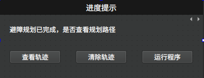

.. centered:: 图3-97  避障规划完成提示弹窗

避障规划成功后，工程树中“程序”节点的相关“MoveJ()”指令会修正为“SplinePTP()”。

下面以仿真轨迹图为例展示AIRLab碰撞检测的实际效果，图3-88为开启碰撞检测功能后，AIRLab自动避障规划的轨迹；图3-89为不开启碰撞检测，AIRLab通过运动规划得到的轨迹，可以明显看出机器人空移过程会与工件发生碰撞。

.. figure:: analysis/85.png
	:align: center
	:width: 4in

.. centered:: 图3-98  开启碰撞检测规划的自动避障路径

.. centered:: 图3-99  不开启碰撞检测规划的空移路径

在障碍物环境不发生变化的情况下，用户在成功完成一次避障规划后，可以不再重复进行避障规划，如果需要重复运行工程树中“程序”下的指令，点击工程模块中的“程序”节点，在展开的菜单中点击“运行程序”即可。如果障碍物环境发生变化，必须重新点击“一键运行”按钮规划新的避障路径。

焊接工艺查询弹窗
~~~~~~~~~~~~~~~~~~~
点击菜单栏工艺-焊接工艺，AIRLab软件界面显示工艺查询弹窗。

.. figure:: analysis/87.png
	:align: center
	:width: 3in

.. centered:: 图3-100 工艺查询弹窗

弹窗左侧为焊接工艺分类，包括平焊、平角焊、立向上焊等9个分类，点击焊接工艺分类下的焊接工艺，右侧会显示该工艺的具体信息。

添加焊接工艺：选择要添加焊接工艺的分类，点击“工艺分类”旁边的加号，在该分类下则会增加一个待编辑的焊接工艺；

.. figure:: analysis/88.png
	:align: center
	:width: 3in

.. centered:: 图3-101  新添加焊接工艺

点击新添加的焊接工艺，在右侧编辑焊接工艺名称、焊接时间间隔（只有多层多道焊才会用到），增加焊道信息。点击焊道列表旁边的加号，新增焊道信息。如果该工艺为多层多道焊，则根据需要添加多个焊道，否则只添加一条焊道。

.. figure:: analysis/89.png
	:align: center
	:width: 3in

.. centered:: 图3-102  修改焊道信息

点击焊道列表中的焊道，焊道编辑部分则会显示当前点击焊道的信息，修改焊道信息，选择参考坐标系、安全点、偏移及绑定焊接工艺后点击完成，焊道列表中该焊道信息将会被修改。

.. centered:: 图3-103 焊道信息修改成功

修改完所有的焊道信息后点击焊道列表下的“完成”按钮，终端显示新增多层多道焊工艺成功，则成功新增一条焊接工艺。

.. figure:: analysis/91.png
	:align: center
	:width: 6in

.. centered:: 图3-104  新增焊接工艺成功

修改焊接工艺：点击要修改的焊接工艺，根据需要修改焊接工艺数据，可以对焊道列表进行新增修改或删除。

1) 新增焊道：点击焊道列表旁边的加号，焊道列表中增加一条焊道。

2) 修改焊道：点击焊道列表中需要修改的焊道，焊道编辑中显示该焊道信息，修改焊道信息后点击“完成”按钮，焊道列表中该焊道信息被修改。

3) 删除焊道：选择需要删除的焊道，点击焊道列表旁边的删除图标，该焊道则会被删除。

所有修改完成之后点击焊道列表下的“完成”按钮，软件页面会提示“该工艺已存在是否覆盖？”，点击“确定”按钮，终端显示“修改多层多道焊工艺成功”，即成功修改焊接工艺。

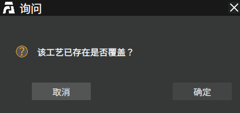

.. centered:: 图3-105  修改焊接工艺提示

删除焊接工艺：选择要删除的焊接工艺，点击工艺类型旁边的删除图标，该焊接工艺则会被删除。

圆柱填充工艺查询弹窗
~~~~~~~~~~~~~~~~~~~~~~~~~~
点击菜单栏工艺-圆柱填充，AIRLab界面显示圆柱填充工艺查询弹窗。图3-106所示为圆柱填充工艺查询的弹窗，圆柱填充工艺包括圆柱底面填充和二次加固两个部分。

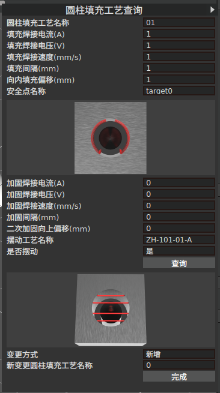

.. centered:: 图3-106  圆柱填充工艺工艺查询弹窗

1. 圆柱底面填充

在进行圆柱填充焊接之前，用户需先设置焊接电流、焊接电压、焊接速度、间隔、偏移量、安全点选择以及摆动工艺选择等参数。 

2. 二次加固
   
在圆柱填充焊接完成后进行二次加固焊接，同样的用户需要先设置参数。其中。

- 填充间隔：指相邻两个填充层之间的垂直距离；

- 向内填充偏移：指填充起始点与圆柱边缘的水平距离；

- 安全点名称：是机器人在填充和加固过程中的过渡点，当完成一次填充或加固后，机器人需要回到该点再进行下一次焊接。

- 加固间隔：指相邻两个加固层之间的垂直距离；

- 二次加固向上偏移：指第二次加固起始点与第一次加固起始点之间的垂直间隔；

用户可以对圆柱填充工艺进行新增、修改、删除操作。

- 新增：变更方式选择“新增”，然后设置工艺参数及新变更填充工艺名称，再点击“完成”按钮，即可新增一种填充工艺；

- 修改：选择“修改”，再选择一种圆柱填充工艺名称，然后重新设置工艺参数，再点击“完成”按钮即可修改该工艺的参数；

- 删除：选择“删除”，选择一种圆柱填充工艺名称，再点击“完成”按钮，即可删除该工艺。

焊缝编辑弹窗
~~~~~~~~~~~~~~~~~~~~~~~~~~
点击焊缝编辑模块，添加焊缝后点击编辑图标三维场景中出现焊缝编辑弹窗如图所示。

.. figure:: analysis/weldEdit1.png
	:align: center
	:width: 4in

.. centered:: 图3-107  焊缝编辑弹窗

以下是对各个编辑项的介绍：

- 焊缝类型：根据选择的焊缝自动生成焊缝类型。

- 焊缝编号：根据选择的焊缝自动生成焊缝编号。

- 是否反向：三维场景中显示焊缝的焊接方向，根据实际焊接选择是否反向。选择“是”，三维场景中焊缝方向则进行调转。

缩进设置

- 起点缩进：设置起点缩进，焊接这条焊缝时则会从缩进之后的起点开始焊接。

- 终点缩进：设置终点缩进，焊接这条焊缝时则会在缩进后的终点停止焊接。、
  
点位偏移和角度设置：如果当前焊缝的起点、终点或中间点位置不准确，可以通过点位偏移和角度设置进行校正。

- 选择需要偏移的点位，选择是否偏移为“偏移”，则可以设置所选点位的位置偏移。可以选择在基坐标系或工件坐标系下进行偏移。
  
焊接姿态策略：可以设置焊接的工具姿态；可以选择直接设置焊接姿态角或自定义姿态。

- 焊接姿态角：可以通过修改工具的俯仰角、推拉角、自传角来修改工具的姿态；
  
- 自定义姿态：直接设置工具末端的姿态来修改工具的姿态；可以选择示教一个合适的姿态后点击“获取当前”按钮获取当前姿态。
  
渐进点和撤退点设置：可以设置焊缝的渐进点和撤退点，焊接时先经过渐进点后到焊缝起点，焊缝焊接完成从焊缝终点撤退到撤退点。

- 渐进点策略：包括自定义距离或自定义点位；自定义距离指的是起始点法向方向的距离。自定义点位则为自己示教的渐进点位置。
  
- 撤退点策略：撤退点设置与渐进点类似；其中自定义距离指的是终点法向方向的距离。
  
焊接工艺设置：对于需要绑定焊接工艺的焊缝；选择“是”则需要选择要绑定的焊接工艺类型和具体的焊接工艺。对于柱塞焊缝选择的焊缝类型为“圆柱填充工艺”，其他焊缝选择的焊接类型为“焊接工艺”。

.. figure:: analysis/weldEdit2.png
	:align: center
	:width: 6in

.. centered:: 图3-108  样条曲线焊缝编辑

对样条曲线焊缝的编辑，点位和角度的设置可以选择设置方式为整体设置或对某一个点位进行设置；

- 选择设置方式为整体设置，设置的点位偏移和焊接姿态则会作用于该条焊缝的所有点位；

- 选择设置方式为某一个点位，设置的点位偏移和焊接姿态只会作用于所选点位。

其他编辑项与直线+圆弧焊缝相同。

焊接数据计算采集弹窗
~~~~~~~~~~~~~~~~~~~~~~~~~~
点击窗口-焊接数据采集，弹出当前焊接信息然弹窗；弹窗显示焊接电流、焊接电压、速度为当前的焊接状态信息；燃弧时长、燃弧长度为统计信息，统计距上一次重置前，使用AIRLab软件进行焊接的总时长和焊接的总长度。点击重置，可将焊接时长和燃弧长度进行清零。

.. figure:: analysis/95.png
	:align: center
	:width: 3in

.. centered:: 图3-109  焊接数据采集弹窗

清枪剪丝
~~~~~~~~~~~~~~~~~~~
点击“窗口”-“清枪剪丝”，出现下图中的“清枪剪丝设置”弹窗。页面中需要设置的参数包括：开启自动清枪剪丝、自动清枪剪丝方式、清枪剪丝周期、是否开启喷油点、清枪安全点、清枪点、剪丝安全点和剪丝点。

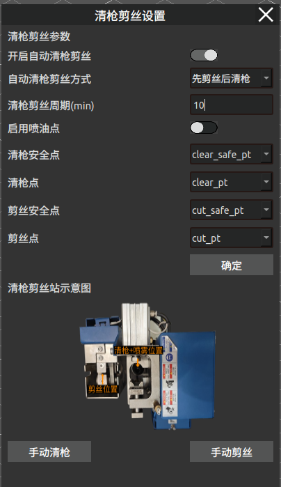

.. centered:: 图3-110  清枪剪丝参数设置弹窗

该功能提供手动和自动两种运行方式。手动方式适用于机器人需要立即进行清枪/剪丝操作的场景，自动方式适用于机器人按照固定时间周期在运行过程中自动触发清枪剪丝场景。

手动方式分为手动清枪和手动剪丝，如果是手动清枪，页面中只需要设置：是否开启喷油点、清枪安全点、清枪点，完成后直接点击“手动清枪”按钮，机器人开始清枪。如果是手动剪丝，页面中只需要设置：剪丝安全点和剪丝点，完成后直接点击“手动剪丝”按钮，机器人即开始剪丝。

自动清枪剪丝，需要设置页面中的所有参数，然后点击“确定”按钮。当机器人本次起弧焊接的累计时长达到设置的清枪剪丝周期，在机器人焊接停止后，会出现下图中的询问弹窗提示用户是否开始清枪剪丝，选择“是”机器人开始自动清枪剪丝，选择“否”即跳过本次清枪安全点、清枪点、剪丝安全点和剪丝点清枪剪丝。

.. centered:: 图3-111  达到清枪剪丝周期，AIRLab询问弹窗

.. important:: 
	如果开启自动清枪剪丝，清枪剪丝周期不能设置为0！

.. figure:: analysis/98.png
	:align: center
	:width: 3in

.. centered:: 图3-112  自动模式下未设置周期的提示弹窗

第一次使用清枪剪丝功能时，用户需要手动示教清枪安全点、清枪点、剪丝安全点和剪丝点。示教方法：首先打开“清枪剪丝”弹窗，按照点位新增方式以及弹窗中的清枪剪丝站示意图，新增上述四个点位；新增成功后在弹窗中选择对应的点位名称，再设置其他参数，点击弹窗中的“确定”按钮，页面中的参数以及四个点位的关节值会保存到清枪剪丝的配置文件中。

后续导入其他工程后，AIRLab会自动读取该配置文件中的参数，在点位列表中新增清枪安全点、清枪点、剪丝安全点和剪丝点。

.. important:: 
	如果清枪剪丝站和机器人底座位置没有变动，用户不需要再示教这四个点位。

自动循环运行
~~~~~~~~~~~~~~~~~~~
AIRLab提供自动循环运行焊接工程的功能，用户可以对工件的焊接工程自动循环运行。详细使用步骤介绍如下：

步骤1：首先启动AIRLab，导入工件配准模板工程，打开菜单栏——自动循环运行弹窗，如图所示。

.. important::
	AIRLab对工件配准模板工程的路径有明确要求，请放在AIRLab所在路径下的/Data/Work_template中，该文件夹下除该工件配准模板工程外不允许存放第二个usd文件，工程名称不做要求。

.. figure:: analysis/99.png
	:align: center
	:width: 2.5in

.. centered:: 图3-113  AIRLab菜单栏-窗口-自动循环运行

根据实际需求设置循环参数，各参数介绍如下：

.. figure:: analysis/100.png
	:align: center
	:width: 2.5in

.. centered:: 图3-114  自动循环运行参数设置

是否开启自动循环运行：如果需要自动循环运行，点击该按钮开启功能；

循环间隔：每次循环之间的等待时间，例如当机器人运行完成当前工件的焊接程序后，需要等待该时间间隔后，再次导入工件模板程序，继续下一次循环运行。

循环模式：分为“一直循环”和“按次循环”两种类型，“一直循环”即无限次循环，“按次循环”即机器人在自动循环运行达到设置的次数后自动结束。

循环次数：当循环模式为“按次循环”时，该参数才需要设置。(注意：循环次数不能设置为0)。

.. important::
	自动循环运行参数设置完成后，会自动保存和读取。如果不需要更改该参数，导入工件配准模板后就不需要重复设置，会读取和使用上次设置的参数。

步骤2：其次点击AIRLab菜单栏的“一键运行”按钮，开始一键运行“工件配准模板工程”，即开始工件识别，识别过程如下图所示。

工件识别过程的进度信息如图 3-104所示；识别成功后会显示工件的匹配度，如图 3-105所示；识别成功后AIRLab会自动检索识别工件的焊接工程，如果该工程在指定路径下存在，则会自动导入工程，如图 3-106所示；如果识别失败，AIRLab会提示错误结果和解决措施，如图 3-107所示。

.. important::
	焊接工程请放在AIRLab所在路径下的Data文件中，焊接工程的名称需要与所焊工件名称完全一致。例如工件ZH-0-01-A，其对应焊接工程为ZH-0-01-A.usd。如果指定路径下不存在对应焊接工程，AIRLab会自动检索失败，给出弹窗提示信息。

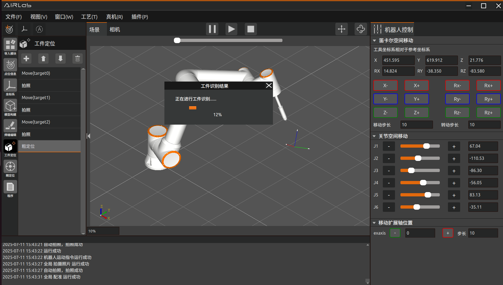

.. centered:: 图3-115  工件正在识别中

.. figure:: analysis/102.png
	:align: center
	:width: 6in

.. centered:: 图3-116   工件识别成功，匹配度为82%

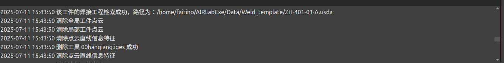

.. centered:: 图3-117  自动检索焊接工程后导入新工程

.. figure:: analysis/104.png
	:align: center
	:width: 6in

.. centered:: 图3-118  工件识别失败提示信息

步骤3：焊接工程自动导入后，AIRLab会控制机器人自动运行该工程。程序运行结束后，AIRLab和机器人进入循环间隔等待，如图 3-108所示。

.. important::
	用户如果需要更换不同工件，需要提前估计更换时间设置好“循环间隔”参数；如果不需要更换工件，循环间隔可以设置为0或者1。

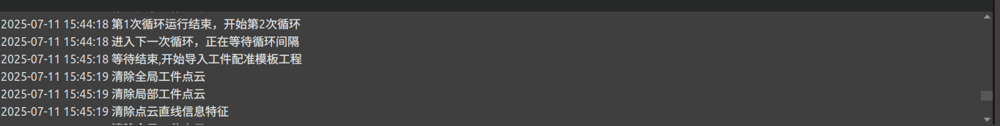

.. centered:: 图3-119   一次循环运行结束，正在等待循环间隔

步骤4：等待结束后，进入下一次循环运行，AIRLab自动清除当前工程并导入工件配准模板工程。导入成功后AIRLab控制机器人自动开始运行工件识别，识别成功后检索该工件的焊接工程，如果工程存在则重复步骤3。

步骤5：AIRLab会自动控制机器人根据设置的循环模式和循环次数，重复步骤4，直至完成全部自动循环运行焊接，如图 3-109所示。

.. figure:: analysis/106.png
	:align: center
	:width: 5in

.. centered:: 图3-120  达到设置的循环次数，结束自动循环运行

.. important::
	如果在循环过程中出现机器人控制器报错或者AIRLab报错，自动循环运行将停止，需要人工排查原因解决。

以上为AIRLab自动循环运行功能的使用方法和步骤。

用户数据备份
~~~~~~~~~~~~~~~~~~~
如果用户需要将一台设备上已配置好的焊接工艺，模板程序及构建的工件数据导入到其他设备，实现环境复刻，AIRLab提供了用户数据备份功能。为了方便用户使用，分为单个模板数据备份和全部数据备份。
点击AIRLab菜单栏——窗口——用户数据备份，界面会出现“用户数据备份”弹窗。下面详细介绍用户数据包导入及导出功能使用方法：

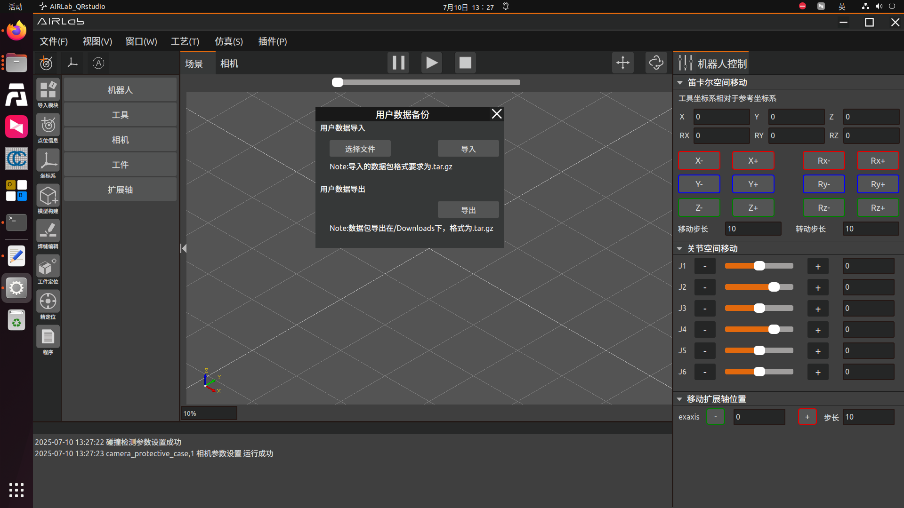

.. centered:: 图3-121  扩展轴设置弹窗

首先需要选择“数据备份及恢复类型”是“单个模板数据”还是“全部数据”，如图所示，确定之后即可进行导入导出操作。
导出功能：如果数据备份及恢复类型是全部数据，点击“导出”按钮，AIRLab首先会将当前软件使用数据包的版本写入version.txt文档中，以便导入时进行版本匹配校验，之后AIRLab开始复制下面的数据内容：可执行文件所在目录下的Data文件夹下存储工件配准模板的文件夹Work_template，存储焊接模板程序的文件夹Weld_template，存储工件及工具模型的文件夹entity，存储用户创建的焊接工艺数据的数据库文件Airlab_weld_peocess.db；主目录的data文件夹下的output模型，自动保存模型文件register_model ，焊缝数据库weld_seam_database三个文件夹。如果数据备份及恢复类型是单个模板数据，需要在AIRLab中先打开该模板工程，再点击“导出”按钮，AIRLab会将该模板和其依赖的文件进行打包压缩，并将输出的压缩文件放在主目录的/Downloads下，名称为工件名，格式为.tar.gz，例如ZH-401-01-A.tar.gz。同样的，AIRLab会将当前单个模板数据包的版本写入数据包的single_version.txt文档中，以便版本匹配校验。
数据包导出过程中，AIRLab会弹出一个提示信息的弹窗，表明数据包正在导出中，如果导出中需要取消导出，可以点击弹窗中的“取消导出”按钮。导出完成后，AIRLab弹出导出完成以及数据包导出路径信息的弹窗。

.. figure:: analysis/108.png
	:align: center
	:width: 6in

.. centered:: 图3-122  用户数据正在打包导出中

.. centered:: 图3-123  用户数据导出完成

.. important::
	注意：如果用户使用导出功能，但上述列举的文件夹有不存在情况时，AIRLab会通过弹窗提示不存在的文件夹名称和路径。用户需要创建这些缺失的文件或者文件夹后，再进行导出。其次，如果上述列举的文件夹或者文件权限被修改为不可访问及复制等时，AIRLab会复制失败，并给出复制失败的文件路径，请根据提示信息检查文件权限，修改正确后重试（有时可能会需要重启边缘PC后，文件权限修改才会生效）。

导出的压缩包目录如下图所示：

.. figure:: analysis/soloData.png
	:align: center
	:width: 2in

.. centered:: 图3-124  单个模板数据的目录结构

.. figure:: analysis/110.png
	:align: center
	:width: 2in

.. centered:: 图3-125  全部数据包的目录结构

导入功能：点击“选择文件”按钮，选择需要导入的数据包（要导入的数据包目录请与图3-125中的结构保持一致），然后点击“导入”按钮，AIRLab首先会校验导入数据包中的version.txt中的版本号，如果版本号一致则会开始数据包内容的导入；如果版本号不匹配，会给出弹窗信息提示用户版本号不一致，数据会不兼容无法进行导入。

.. centered:: 图3-126  选择待导入的数据包

.. figure:: analysis/112.png
	:align: center
	:width: 6in

.. centered:: 图3-127  数据包正在导入中

.. centered:: 图3-128  数据包导入完成

.. centered:: 图3-129  数据包无法导入提示

.. important::
	注意：数据包导入功能会先删除原本的文件及文件夹，如果是仍然需要保留的文件，请注意在导入前备份！

3D文件解析
~~~~~~~~~~~~~~~~~~~
如果用户需要对AIRLab已经建模好的模型焊接，本软件提供“3D文件解析”功能，从而代替原先的“无模型构建”步骤，简化操作。该功能用法如下：

Setp1：点击AIRLab菜单栏-“窗口”-“3D文件解析”，界面会出现“3D文件解析”弹窗。如下图所示：

.. figure:: analysis/prase_3Dfile_popup.png
	:align: center
	:width: 3in

.. centered:: 图3-130  “3D文件解析”弹窗

Setp2：点击弹窗中的“打开”按钮后，会弹出选择界面，请选择需要解析的工件后，再次点击“打开”后完成工件选择，过程如下图所示：

.. figure:: analysis/3Dfile_open.png
	:align: center
	:width: 4in

.. centered:: 图3-131  3D文件选择

Setp3：接下来会弹出解析进度条，请耐心等待解析完成。过程如下图所示：

.. figure:: analysis/3Dfile_prgressbar.png
	:align: center
	:width: 4in

.. centered:: 图3-132  “3D文件解析”进度条弹窗

Setp4：整个进度完成后，将会在场景中构建出对应工件的3D模型，以及相应的焊缝，如下图所示。

.. figure:: analysis/prase_3Dfile_res.png
	:align: center
	:width: 6in

.. centered:: 图3-133  “3D文件解析”结果显示

Setp5：后续可以参考3.5.3小节的焊缝编辑，3.5.4小节的工件定位以及3.5.5小节的自动拍照位姿等步骤完成后续焊接运行。

多工位自动运行
~~~~~~~~~~~~~~~~~~~
AIRLab提供“多工位自动运行”功能，该功能针对多工件焊接场景，如果已经记录过单个工件的AIRLab工程文件，它可以通过设置不同工件所需的扩展轴位置，从而实现高效且自动化的运行设置的多个工程（即多个工件焊接任务）。

本次介绍中首先介绍设置选项中“是否需要自动识别”选择为“否”的情况，步骤如下：

Setp1：点击AIRLab菜单栏-“窗口”-“多工位自动运行”，界面会出现“多工位自动运行”弹窗，界面如下图所示：

.. figure:: analysis/multiple_station_popup.png
	:align: center
	:width: 3in

.. centered:: 图3-134  “多工位自动运行”弹窗

Setp2：接下来将扩展轴运行至完成某个工件焊接所需的位置，接着点击“获取位置”按钮可以记录当前扩展轴位置，如下图所示。

.. figure:: analysis/multiple_station_get_pos.png
	:align: center
	:width: 3in

.. centered:: 图3-135  扩展轴位置设置

Setp3：接着选择在该扩展轴位置，想要进行的焊接任务所对应的工程文件，点击“选择”后弹出选择画面，再次点击“打开”确认选择，如下图所示。

.. figure:: analysis/multiple_station_usda_import.png
	:align: center
	:width: 6in

.. centered:: 图3-136  工程路径选择界面与结果

Setp4：最后选择这次设置的变更方式，一共有三个选项“添加”、“修改”与“删除”。确认变更选项后点击“确定”按钮及完成设置，如果要修改则选中想要修改的设置项，点击“确定”即可完成修改，删除也同理，过程如下图所示。

.. figure:: analysis/multiple_station_add_delete.png
	:align: center
	:width: 6in

.. centered:: 图3-137  添加与修改

Setp5：完成所有设置后点击“开始自动运行”按钮，焊接任务开始。

接着介绍设置选项中“是否需要自动识别”选择为“是”的情况，步骤如下：

Setp1：同样的，获取扩展轴位置后，若选择需要自动识别，则界面变化如下。其中关于自动识别的相关说明，请参照3.6.11自动循环运行小节的说明进行理解。

.. figure:: analysis/multiple_station_auto_detect.png
	:align: center
	:width: 3in

.. centered:: 图3-138  自动识别选项界面

Setp2：选择想要设置的变更方式后，点击“确认”后会弹出“询问”弹窗，请仔细阅读并思考后再做出选择，若点击“确认”则完成本次设置。

.. figure:: analysis/multiple_station_auto_detect_popup.png
	:align: center
	:width: 4in

.. centered:: 图3-139  询问弹窗

扩展轴同步运动
~~~~~~~~~~~~~~~~~~~
如果机器人焊接中需要用到扩展轴，AIRLab提供了扩展轴同步运动功能。

在导入模块选择扩展轴后点击确定，打开扩展轴设置弹窗，弹窗如图 3-128所示。选择扩展轴后点击确定，导入扩展轴，点击“获取”可以获取当前扩展轴坐标系，点击“保存”可以设置扩展轴坐标系。

.. figure:: analysis/115.png
	:align: center
	:width: 3in

.. centered:: 图3-140  扩展轴设置弹窗

其他控制
~~~~~~~~~~~~~~~~~~~
   
点击操作区“其他控制”按钮可进入IO设置界面，主要包括IO控制和外部轴设置两个模块。

1. IO控制模块
  
如图所示，IO控制模块可以实现对机器人控制箱中数字输出、模拟输出（0-10v）和末端工具数字输出、模拟输出（0-10v）扩展IO数字输出、模拟输出（0-10v）进行手动控制：

.. figure:: analysis/117.png
	:align: center
	:width: 3in

.. centered:: 图3-141 IO控制模块

- DO设置：选择端口号，点击“开启”按钮对应DO高电平，点击“关闭”按钮设置对应DO为低电平。

- AO设置：选择端口号，右侧输入框输入值（0-100），该数值为百分比，设置100即表示设置该AO端口为10v。

1. Exaxis控制

如图所示，外部轴设置模块可以实现对机器人外部轴控制。

.. centered:: 图3-142 Exaxis控制

- 选择扩展轴编号：点击“加载”按钮根据选择的扩展轴编号加载外部轴协议。分别设置运行速度（%）、加速度（%）和扩展轴最大距离（mm）。
- 去除使能：点击“去除使能”按钮外部轴去除使能。
- 伺服使能：点击“伺服使能”按钮外部轴使能。
- 正向点动：点击“正向点动”按钮，根据设置的运行速度、加速度、扩展轴最大距离进行外部轴正向点动。
- 反向点动：点击“反向点动”按钮，根据设置的运行速度、加速度、扩展轴最大距离进行外部轴反向点动。
- 停止点动：点击“停止点动”按钮，外部轴停止点动。
- 零点设置：点击“零点设置”按钮，根据回零方式、寻零速度、箍位速度进行外部轴回零。

仿真
~~~~~~~~~~~~~~~~~~~

如图所示，对程序进行仿真轨迹生成后，打开操作区-仿真，设置仿真速度和仿真间隔后，点击“运行”按钮开始对模板程序进行仿真，点击“停止”按钮可以停止模板程序仿真。同时会生成仿真轨迹点表格，记录仿真轨迹点。表格中，仿真轨迹端点的类型为LINEND。点击表格中某一行，虚拟仿真机器人将移动到点击的仿真轨迹点，同时会同步显示该仿真轨迹点的TCP坐标。

.. centered:: 图3-143 仿真页面

程序配置
~~~~~~~~~~~~~~~~~~~

进行程序运行配置和程序起弧配置，如图所示。

.. figure:: analysis/120.png
	:align: center
	:width: 3in

.. centered:: 图3-144  程序配置页面

程序配置部分包括程序运行配置、程序起弧配置、无模型构建设置和焊机编号选择等等。

.. figure:: analysis/121.png
	:align: center
	:width: 3in

.. centered:: 图3-145  程序配置

程序运行配置可以选择手动调试模式、全部识别后焊接和单条识别后焊接。

- 识别后不运行程序：运行精定位程序后不自动运行焊接程序。
  
- 识别后运行程序：运行精定位程序后自动运行焊接程序。
  
程序识别配置包括先工件定位再精定位或只运行精定位

- 先工件定位后再精定位：在一键运行时先对工件进行工件定位再精定位
  
- 只运行精定位：一键运行时不对工件进行工件定位直接运行精定位。

程序起弧配置可以设置为起弧或者不起弧。

- 起弧：运行程序时如果有起弧命令则会进行起弧焊接。
  
- 不起弧：运行程序时不会进行起弧只走焊接轨迹进行模拟焊接；设置模拟焊接运行速度倍速可以加快模拟焊接运行的速度。

无模型构建设置：可以选择重新构建和不重新构建。

- 重新构建：对无模型工件模型进行重新构建；适用于无模型工件之前没有进行过构建或构建效果不好需要重新进行构建。

- 不重新构建：选择不重新构建则不会重新构建该无模型工件模型，直接导入之前建好的模型。适用于之前已经构建过该无模型工件模型，不需要对该无模型工件进行重新建模。

.. important:: 
	在实际操作中建议将无模型工件构建过程先单独进行，工件构建成功后按照原有的平均模型方式操作。在无模型工件模型存在的情况下，建议无模型构建设置参数一直选择“不重新构建”，因为无模型构建得到的焊缝编号在每次构建中可能会发生变化！

全部配置好之后，点击“确定”按钮，完成程序配置。

焊接中断恢复配置是焊接过程中程序发生中断，清除继续焊接需要配置的参数；包括焊接电弧跟踪意外中断检测参数的配置和焊缝中断检测参数的配置。

.. centered:: 图3-146  焊接中断恢复配置

焊接电弧跟踪意外中断检测参数配置是针对焊接过程中电弧中断需要配置的参数，包括选择是否检测和电弧中断确认时长配置

- 是否检测：表示是否检测焊接电弧跟踪意外中断。

- 电弧中断确认时长：定义电弧中断多少毫秒属于电弧中断，需要恢复中断。

配置好之后，点击“确定”按钮，完成焊接电弧跟踪意外中断检测参数配置。

焊接中断检测参数配置是焊接过程中程序中断，恢复中断机器人运动所需要配置的参数，包括选择焊接中断是否恢复、焊缝重叠距离配置、机器人再回到起弧点速度配置和机器人运动到起弧点方式配置。

- 焊接中断是否恢复：选择恢复在焊接中断后会弹出焊接中断的弹窗，清除错误后再恢复中断，否则不会恢复中断。

- 焊缝重叠距离：恢复中断后再次焊接和上次中断位置的重叠距离。

- 机器人再回到起弧点速度：恢复中断后机器人回到设置的起弧点的速度

- 机器人运动到起弧点方式：恢复中断后机器人回到设置的起弧点的方式，可选LIN或PTP方式。
  
配置好之后，点击“确定”按钮，完成焊接中断检测参数配置。

焊接中断恢复配置全部配置完成后，运行程序，当检测到焊接中断信号时，弹出以下弹窗。

.. figure:: analysis/123.png
	:align: center
	:width: 3in

.. centered:: 图3-147  焊接中断弹窗

检查环境，排除问题之后点击“恢复焊接”按钮程序会按照配置的参数恢复中断。

多语言设置
~~~~~~~~~~~~~~~~~~~

AIRLab软件目前提供了中文（简体）、中文（繁体）、英文、日文、韩语、俄语、法语七种语言选择，详细的多语言设置页面如图3-148所示。该页面提供三种操作：切换语言；导出AIRLab软件中已有的语言；导入新语言。满足用户切换多语言，为AIRLab软件设置新语言以及修改AIRLab软件已有的语言内容的需求。

.. centered:: 图3-148 “多语言设置”页面

上述功能的详细操作介绍如下：

1. 切换AIRLab的语言

点击图3-148中“多语言选择”的下拉框，选择需要的语言类型后点击“确定”按钮即可立即切换AIRLab软件语言。

2. 用户为AIRLab设置新语言
   
首先点击“导出”按钮，导出AIRLab当前使用的语言文件，该文件为CSV格式，导出的文件路径在本地的Downloads文件夹下，如图3-149。

.. figure:: analysis/125.png
	:align: center
	:width: 5in

.. centered:: 图3-149 AIRLab语言文件导出路径

CSV文件的内容格式如图(若使用文本编辑器打开)，包括四列内容：language_id，location，source_text，translation_text。“language_id”代表语言类型，“location”代表该文本在源代码中的位置，“source_text”代表源代码中的文本(中文)，“translation_text”代表的是源文本对应的翻译值。

.. figure:: analysis/126.png
	:align: center
	:width: 6in

.. centered:: 图3-150 AIRLab语言CSV文件的内容及格式

如果使用LibreOfffice软件打开，如图3-151，注意打开格式如下图3-152所示。

.. figure:: analysis/127.png
	:align: center
	:width: 2.5in

.. centered:: 图3-151  LibreOffice软件

.. figure:: analysis/128.png
	:align: center
	:width: 6in

.. centered:: 图3-152  AIRLab多语言文件的打开格式

其次是编写用户的CSV文件，用户设置新语言时只需要修改第一列language_id和第四列translation_text的内容。假设用户新增的是法语，就使用“Français”替换图3-150中第一列下的所有“English”；第四列translation_text的内容需要用户根据“source_text”的中文文本进行翻译得到对应的目标语言(对于源文本中出现的相同字符串，请将其翻译为同样的单词)。

.. important:: 
	请不要修改“source_text”列下的任何字符！

完成翻译工作后，用户需要为该CSV文件重命名一个文件名，文件名将是AIRLab语言数据库中的该语言数据表的表名，比如图3-149中的文件名“en_translation_table”就是语言类型“English”在数据库中的表名。

.. important:: 
	用户CSV文件的命名建议保留其语言特色，避免与数据库中已有的语言数据表名重复，由此导致其他语言数据表内容被替换的错误。

最后是向AIRLab软件中导入该CSV文件，将该文件复制到~/AIRLabExe/CSVfile目录下，点击“导入”按钮，选择该文件导入，如图3-153。AIRLab终端显示“CSV文件导入成功”即表示用户的语言文件导入成功，如图3-154。重启AIRLab后，在“语言选择”的下拉框选择用户新增的语言切换即可。

.. figure:: analysis/129.png
	:align: center
	:width: 4in

.. centered:: 图3-153  “导入”按钮的弹窗

.. centered:: 图3-154 语言文件导入成功时的终端显示信息

如果终端显示“CSV文件导入失败”，可以查看日志记录的错误信息，如图3-155所示，并仔细检查导入的CSV文件与最初导出的CSV文件是否在行数、列数以及列之间的中文分隔符“；”有不一致的地方。

.. figure:: analysis/131.png
	:align: center
	:width: 6in

.. centered:: 图3-155  语言文件导入失败时的日志信息提示

.. important:: 
	当对“translation_text”的内容进行修改时，需要参考“source_text”的中文文本的字段长度，如果翻译值过长，请适当使用缩写，否则AIRLab界面中对应的控件文本可能会显示不全。

1. 用户修改AIRLab已存在的语言

如果用户需要修改AIRLab中已经存在的语言，首先需要点击“导出”按钮将该语言的CSV文件导出；修改完成后将文件复制在到~/AIRLabExe/CSVfile目录下，点击“导入”按钮，选择修改后的文件导入，终端显示“CSV导入成功”后重启软件，即完成语言的修改。

错误提示弹窗
~~~~~~~~~~~~~~~~~~~
AIRLab软件运行过程中会出现一些错误，界面会弹出错误提示弹窗如图所示

.. figure:: analysis/132.png
	:align: center
	:width: 6in

.. centered:: 图3-156  错误提示弹窗

根据错误类型修复错误后点击“一键清除”按钮，弹窗消失，再继续运行。

扩展轴坐标系标定
~~~~~~~~~~~~~~~~~~~
AIRLab软件提供了扩展轴坐标系标定的功能，在主界面依次点击“导入模块”-“扩展轴”，打开扩展轴设置界面（参照3.5.1节），接着选择想要标定的扩展轴坐标系名称点击“修改”按钮进入“扩展轴坐标系标定” 界面，如下图所示。

.. figure:: analysis/exaxis_calibration_ui.png
	:align: center
	:width: 6in

.. centered:: 图3-157  扩展轴坐标系标定界面

同时注意，Exaxis0是无法标定的，如果选择Exaxis0进行标定则会提示如下错误弹窗。

.. figure:: analysis/exaxis_error_popup.png
	:align: center
	:width: 3in

.. centered:: 图3-158  扩展轴0标定错误弹窗

AIRLab提供了针对“单自由度直线导轨”类型扩展轴的标定方法，下面将对该过程进行介绍，具体步骤如下：

Step1：首先打开前文提到的“扩展轴坐标系标定”界面，首先点击“清空坐标系”按钮，并且确定“当前应用的工具坐标系是否已标定”选项，标定扩展轴的前提是完成工具坐标系标定，确认后会出现“询问”弹窗，完成确认后正式开始标定设置；

.. figure:: analysis/exaxis_calibration_ui+popup.png
	:align: center
	:width: 6in

.. centered:: 图3-159  扩展轴坐标系标定界面（左）与弹窗提示（右）

Step2：点击“伺服使能”按钮，使能扩展轴，若成功则会变为绿色，反之为红色并有错误弹窗提示。若使能成功，则点击“零点设置”按钮，完成初始设置。流程如下图所示；

.. figure:: analysis/exaxis_enable.png
	:align: center
	:width: 6in

.. centered:: 图3-160  扩展轴伺服使能与零点设置

Step3：保持扩展轴不动，改变机械臂末端工具姿态，使末端工具对准扩展轴上固定一点，点击“设置点1”，按钮变为“修改点1”后及完成设置，若要修改该点则重复上述操作。类似的，改变机械臂姿态后完成“设置点2”过程，整个过程如下图所示；

.. figure:: analysis/exaxis_setPoint1+2.png
	:align: center
	:width: 6in

.. centered:: 图3-161  扩展轴设置点1与设置点2

Step4：点击“正向点动”移动扩展轴一段距离(记住点击次数，下一步要返回移动前的零点)，之后改变机械臂姿态，再一次使得末端工具对准之前的固定参考点，然后点击“设置点3”，按钮变为“修改点3”后及完成设置，若要修改该点则重复上述操作，过程如下图所示；

.. figure:: analysis/exaxis_setPoint3.png
	:align: center
	:width: 3in

.. centered:: 图3-162  扩展轴设置点3

Step5：点击“反向点动”，将扩展轴移回零点，之后改变机械臂姿态，再一次使得末端工具对准之前的固定参考点，接着通过沿着基坐标系的点动将末端移动到固定点垂直往上空间一点，然后点击“设置点4”，按钮变为“修改点4”后及完成设置，若要修改该点则重复上述操作，过程如下图所示；

.. figure:: analysis/exaxis_setPoint4.png
	:align: center
	:width: 3in

.. centered:: 图3-163  扩展轴设置点4

Step6：以上步骤完成后，点击“计算”按钮计算工具位姿，显示结果如下图所示。

.. figure:: analysis/exaxis_calibration_res.png
	:align: center
	:width: 3in

.. centered:: 图3-164  扩展轴坐标系计算结果

Step9：检查计算结果无误后，点击“保存”按钮，将会把计算结果保存在本地路径~/AIRLabExe/Data/import_config/Cleargun_cutwire_settings.config下的[Exaxis_coord_value_list]中，本次示例中标定的是Exaxis1，所以保存的内容为<1=“标定计算结果”>，同时“扩展轴设置”中也出现了标定成功的Exaxis1选项，过程如下图所示。

.. figure:: analysis/exaxis_cal_res_save.png
	:align: center
	:width: 6in

.. centered:: 图3-165  扩展轴坐标系计算结果保存

若选择的扩展轴坐标系为已有扩展轴坐标系（上述本地路径下已有相关坐标系的值），则会有“询问”弹窗提示是否覆盖之前的结果，如下图所示，若选择“确定”按钮则覆盖原有结果。

.. figure:: analysis/exaxis_ask_popup.png
	:align: center
	:width: 3in

.. centered:: 图3-166  扩展轴坐标系询问弹窗