环境安装
=========

.. toctree:: 
    :maxdepth: 5

工具准备
-------------------
#. 边缘计算PC。

#. 两个大小为64G的U盘，一个用来做启动盘，一个用来存放系统镜像。

系统镜像准备
-------------------
法奥AIRLab初版镜像版本联系法奥技术人员获取。下载到系统镜像存放U盘。

启动盘制作
-------------------
借助U启动软件制作Rescuezilla引导U盘。

1. 下载并安装U启动，推荐下载UEFI版（用其它支持U盘烧录的软件均可），下载地址为：http://uqidong.oumoyc.cn/?bd_vid=7439611603348517307。

2. 打开U启动软件，选择ISO模式。

.. centered:: 图2-1    选择IOS模式

3. 点击浏览，选择Rescuezilla镜像文件并点击保存。

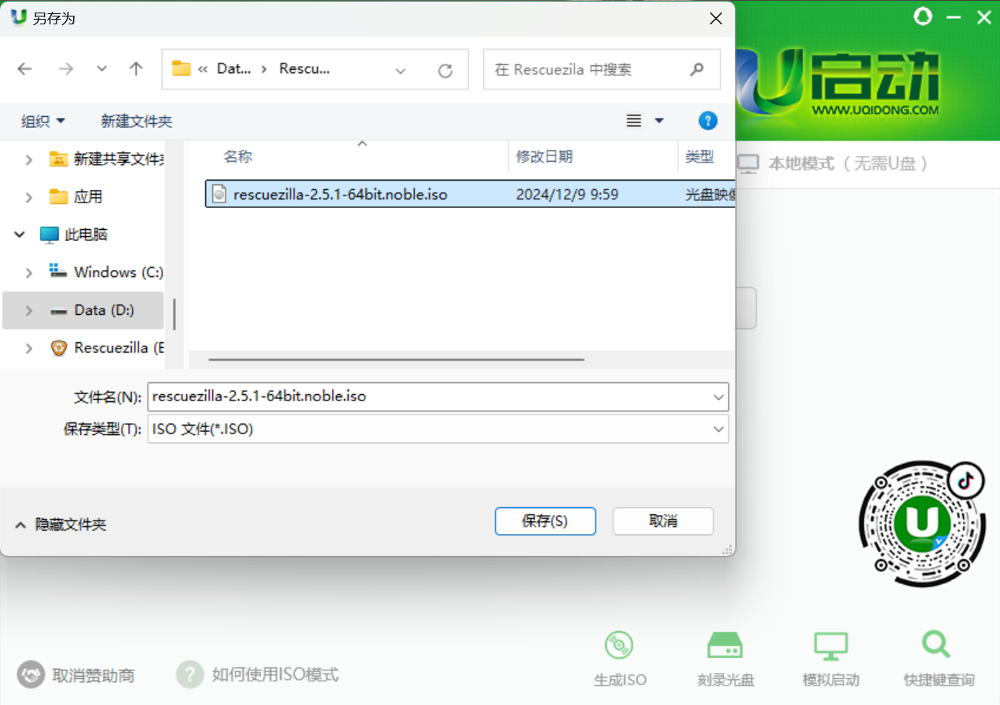

.. centered:: 图2-2    选择Rescuezilla镜像文件

4. 点击开始制作，在弹出的提示选择ISO对话框中选择否。

.. centered:: 图2-3    选择“否”

5. 在弹出的ISO制作窗口中，在硬盘驱动器栏中选择目标U盘设备，点击写入即可开始制作引导U盘。等待写入操作结束即可弹出U盘。

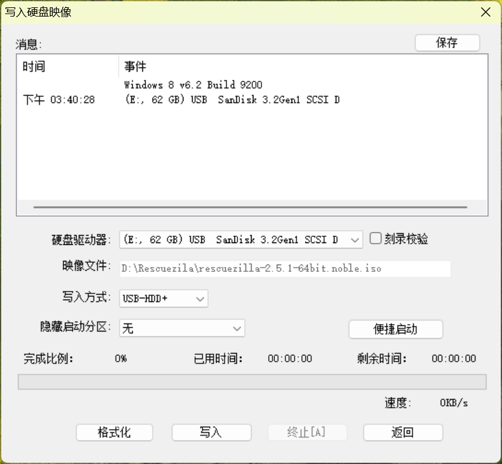

.. centered:: 图2-4    写入U盘

.. important:: 
  此操作会清空U盘所有数据，务必确认U盘是否适合制作引导U盘！

安装系统镜像并启动
-------------------
修改BIOS启动项
~~~~~~~~~~~~~~~~~~~
制作好Rescuezilla引导启动U盘后，将启动U盘和系统镜像存放U盘同时插入边缘PC的USB口。

1. 确认好键盘鼠标连接到工控机上后，点击电源键开机，按住F2进入BIOS界面；

.. figure:: environment/5.jpg
	:align: center
	:width: 5in

.. centered:: 图2-5   进入BIOS页面

2. 点击菜单栏中的Boot->Boot Priority选项，进入启动项设置子界面

.. figure:: environment/6.jpg
	:align: center
	:width: 5in

.. centered:: 图2-6   进入启动项设置子页面

3. 在子界面中，点击Priority #1 的选项框并选择U盘对应的启动项。按键盘的F10，保存修改启动项并退出，在弹出的选项框中选YES，机器会自动保存设置并重启。

.. figure:: environment/7.jpg
	:align: center
	:width: 5in

.. centered:: 图2-7  
	 修改启动项并保存修改

还原系统镜像
~~~~~~~~~~~~~~~~~~~
1. Rescuezilla系统启动后，选择还原项。

.. figure:: environment/8.jpg
	:align: center
	:width: 5in

.. centered:: 图2-8 选择还原项

2. 进入还原流程的第一步，选择系统镜像存放U盘路径，然后点击下一步。

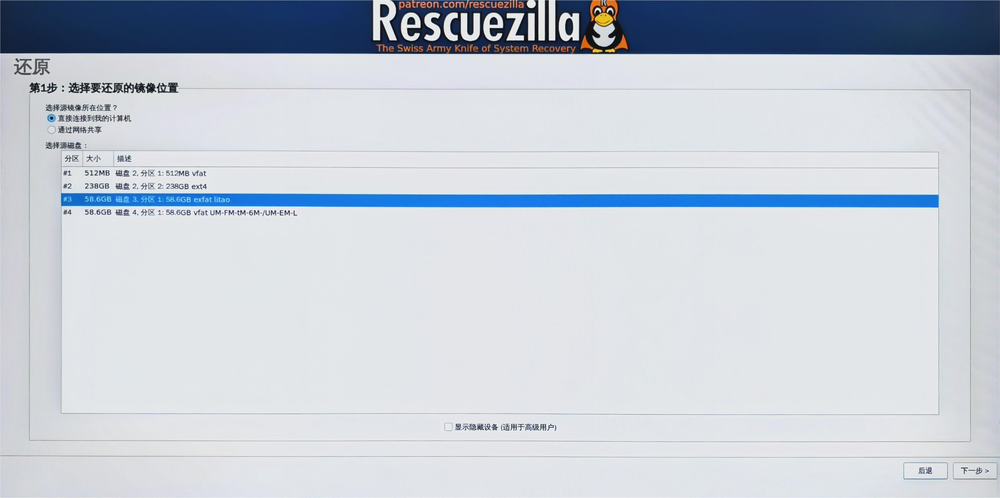

.. centered:: 图2-9 选择系统镜像存放的U盘路径

3. 进入还原流程的第二步，在系统镜像存放U盘中选择下载的镜像文件，然后点击下一步。

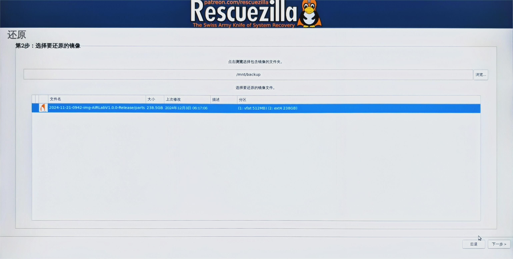

.. centered:: 图2-10 选择初始镜像文件

4. 进入还原流程的第三步，选择镜像文件中的数据需要还原的目标磁盘，一般是目标机器上的某个硬盘，然后点击下一步。

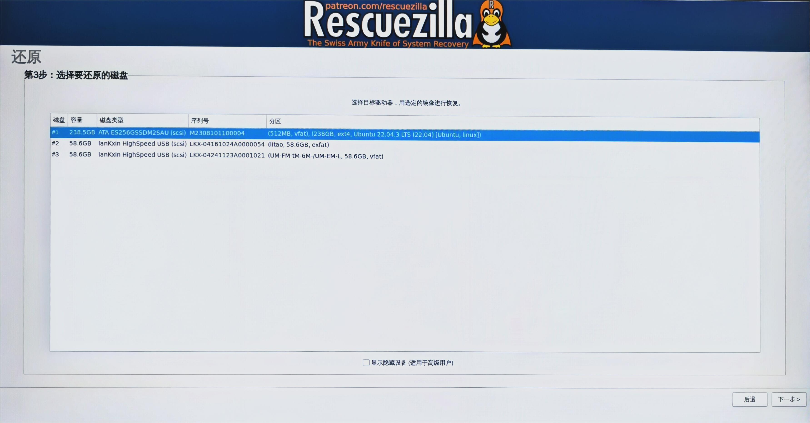

.. centered:: 图2-11 选择要还原的目标硬盘

5. 进入还原流程的第四步，选择镜像文件中的需要还原至目标磁盘的分区并点击下一步。注意，此处选择覆盖分区表的话会导致引导信息改变，一般默认选择。

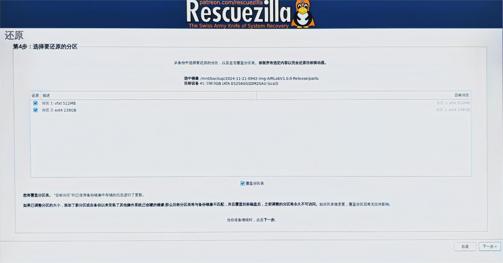

.. centered:: 图2-12 选择要还原的分区

6. 进入还原流程的第五步，确认之前的设置项并点击下一步。此时会弹出一个确认对话框，确认无误的话选择是即可。

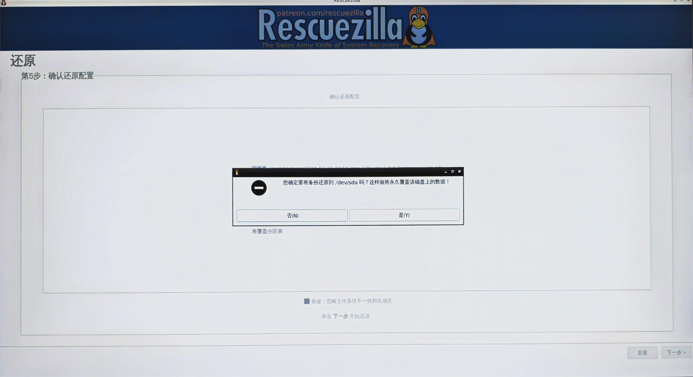

.. centered:: 图2-13 确认还原配置

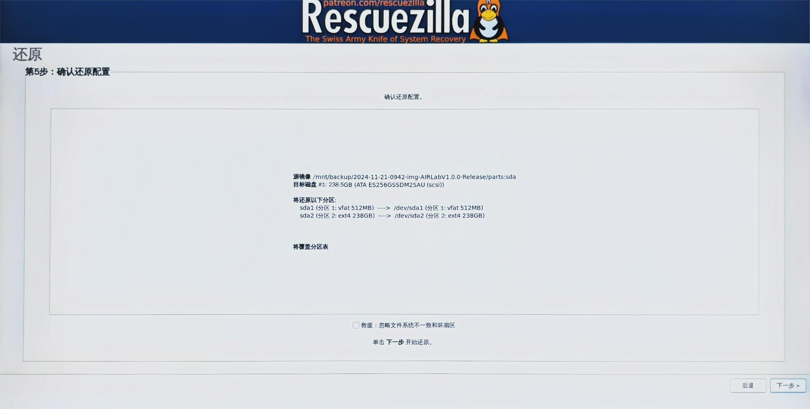

.. centered:: 图2-14  在弹出的弹窗中选择“是”

7. 进入还原程序，等待进度条结束即可，根据需要恢复数据的容量不同，此过程可能会持续数十分钟。

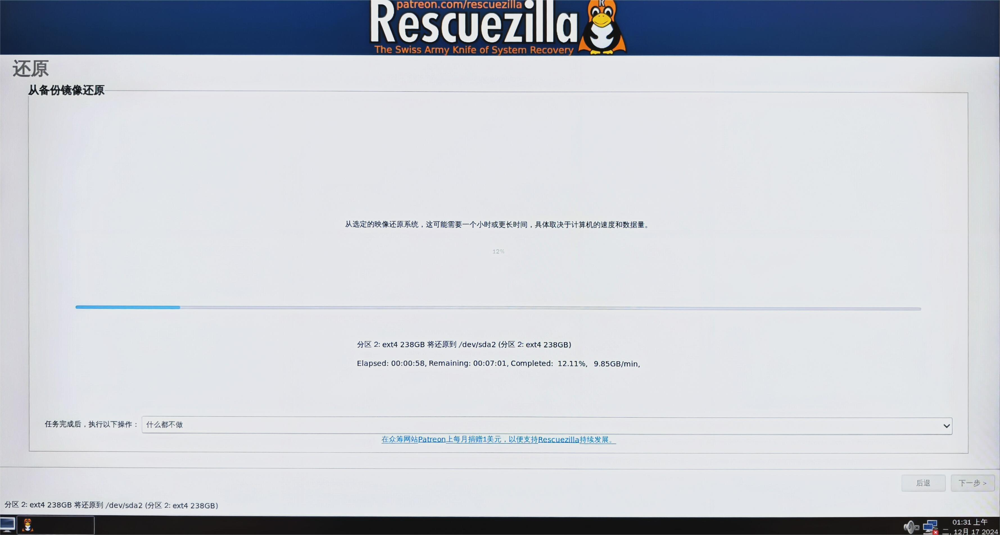

.. centered:: 图2-15  进入还原程序

启动AIRLab软件
~~~~~~~~~~~~~~~~~~~

1. 还原过程结束后，点击页面左下角“Shutdown”按钮，会弹出对话框选择操作，此时选择重启即可进入到系统初始页面。

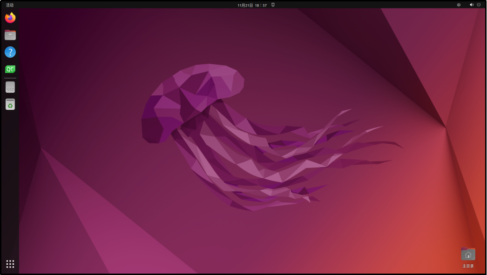

.. centered:: 图2-16  进入系统

2. 点击AIRLab软件启动图标即可启动AIRLab软件系统，接下来就可以根据我们的用户手册进行软件操作了。

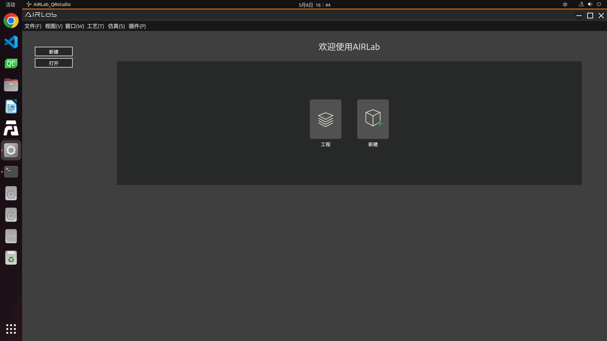

.. centered:: 图2-17  系统主目录