插件
=========

.. toctree:: 
    :maxdepth: 5

本章节主要介绍插件授权及各个插件的功能及具体操作过程。

插件授权
-------------------
点击插件-插件授权，可查看AIRLab唯一标识及各插件授权状态。

.. figure:: plug/ Plugin_License.png
	:align: center
	:width: 6in

	插件授权页面

若状态为“已授权”，则可正常打开插件使用；若为“未授权”，打开插件时将提示插件加载失败，如图所示。

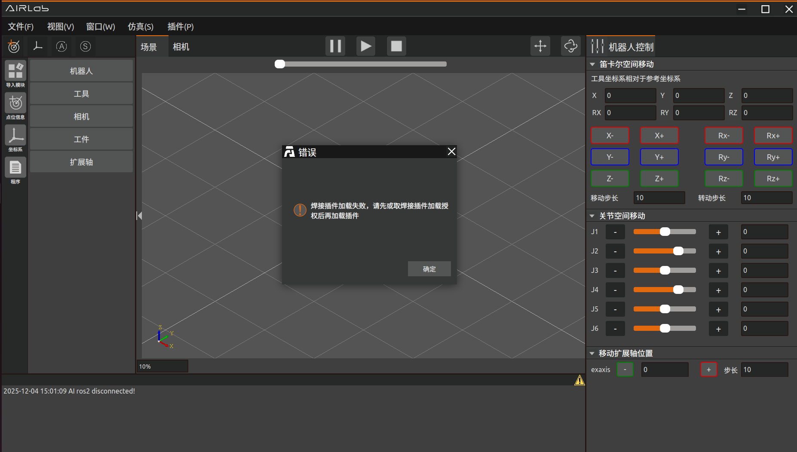

	焊接插件加载失败

如需对插件进行授权，请联系售后获取授权文件（.bin格式）。随后在授权界面中选择该文件，点击“授权”进行升级。

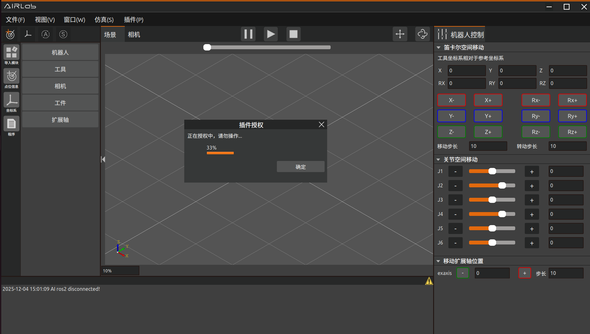

	正在授权中

等待进度条加载完成后页面显示“授权成功”提示。

.. figure:: plug/Auth_Successful.png
	:align: center
	:width: 6in

	授权成功

重新插拔加密狗并等待约30秒左右，插件授权状态更新即表示授权完成。
若授权过程中出现错误，授权流程将自动终止，并弹出如图所示的错误提示，此时，请联系售后人员进行处理。

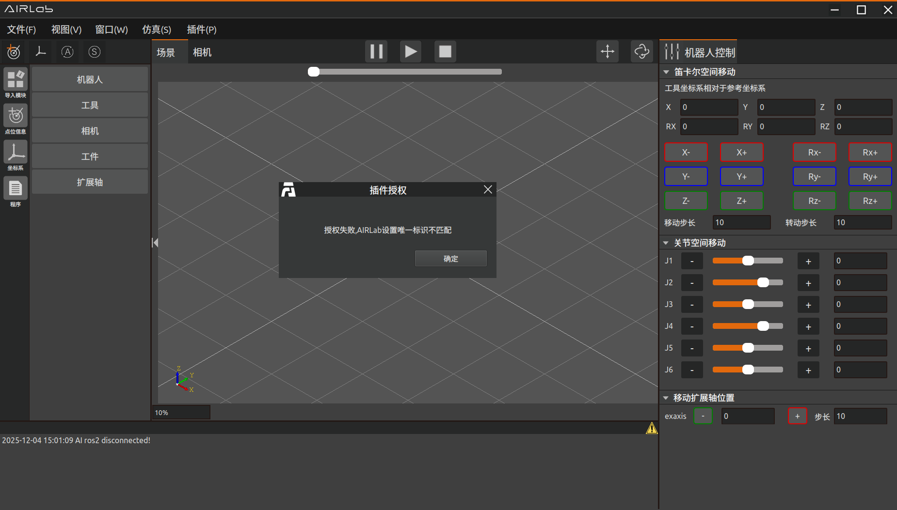

	授权失败

bin picking
-------------------
bin picking插件模块实现了自动抓取物体的功能。点击菜单栏插件-bin picking，主场景分为三维场景和二维显示场景并弹出bin picking弹窗。其中三维场景中显示机器人运动过程，二维显示场景中显示工件的RGB图像和识别出工件的bounding box。

创建bin picking工程
~~~~~~~~~~~~~~~~~~~

点击菜单栏-文件，选择文件类型为bin picking，点击“新建”之后导入需要的机器人、工具、工件或者直接打开bin picking工程文件；

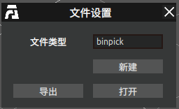

	新建binpick工程文件

UI界面介绍
~~~~~~~~~~~~~~~~~~~
导入bin picking工程，点击菜单栏插件-bin picking，弹出bin picking弹窗，如图4-2所示。bin picking弹窗分为四个部分：初始设置、位置绑定、抓取位置误差补偿及程序运行四个部分。

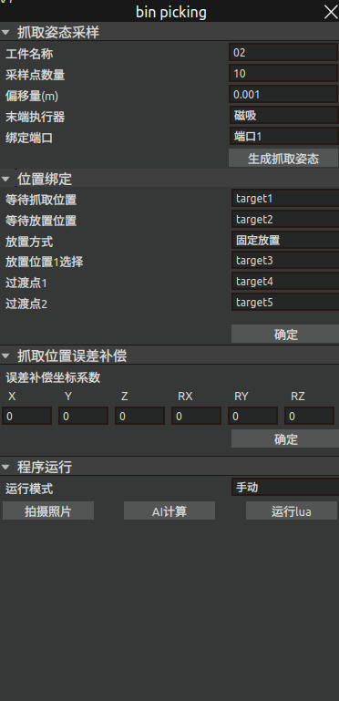

	bin picking弹窗

导入bin picking工程，点击菜单栏插件-bin picking，弹出bin picking弹窗，如图4-7所示。bin picking弹窗分为四个部分：初始设置、位置绑定、抓取位置误差补偿及程序运行四个部分。
1. 首先进行初始设置：

选择是否进行二次抓取、是否避障以及末端执行器，末端执行器分为磁吸和夹爪，之后选择夹爪或磁吸绑定的端口号及夹爪类型。全部设置好之后点击“确定”，指令反馈区显示“初始设置成功”则表示初始设置完成。

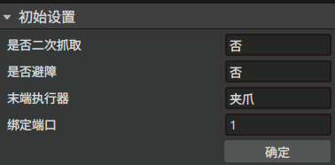

	初始设置

1. 之后进行位置绑定

首先根据是否二次抓取标定和绑定等待抓取位置和等待放置位置或第一、二次拍照位置和二次抓取放置位置；选择放置方式，可选固定放置或规则放置；

- 固定放置：可以设置多个放置点，之后软件会根据识别的类型将识别的物体放在不同的放置点。

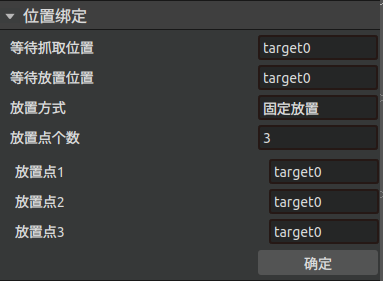

	固定放置

- 规则放置：用户可以根据需要设置行数、列数、层数和层高等放置规则；设置完之后点击确定绑定位置；终端显示位置绑定成功则成功绑定。

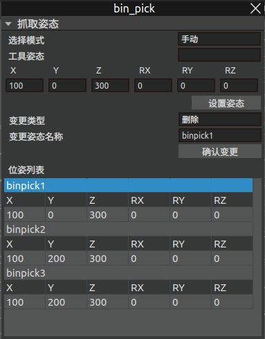

	规则放置

3. 抓取位置误差补偿

抓取位置误差补偿是为了消除抓取过程中的系统误差而设置的误差补偿，抓取时如果误差较大可以设置误差补偿系数（基于工具坐标系），设置完系数后点击“确定”。指令反馈区显示设置误差补偿系数成功即成功设置误差补偿系数。

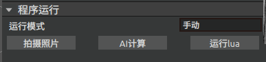

	抓取误差补偿
	
4. 程序运行

生成抓取姿态成功和位置绑定成功后即可进行程序运行，有手动和自动两种运行模式。

- 手动运行：选择手动运行，机器人进行一次自动抓取；

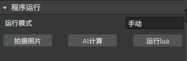

	手动运行模式

先点击拍摄照片，拍摄待抓取物体的照片；拍摄成功后，终端会显示“拍摄照片成功”提示，2D场景显示真实工件的RGB图。

之后点击AI计算，AI识别待抓取物体的位置，2D场景显示工件的bounding box；	

等待计算完成之后点击运行lua，机器人进行一次识别抓取运动；

- 自动运行：自动运行包括运行，停止及重置；

运行：点击“运行”按钮，机器人开始自动进行拍照识别、抓取操作；

停止：点击“停止”按钮，自动抓取停止运动；

重置：点击“重置”按钮，抓取计数器置为0，再次运行则从开始进行抓取，放置在第一个放置位置上。

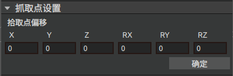

	自动运行模式

整体操作过程
~~~~~~~~~~~~~~~~~~~
Step1：相机标定
   
在进行抓取操作之前需要先进行相机标定，根据实际情况选择眼在手上或眼在手外。

Step2：点位示教

1. 二次抓取示教点位：
   
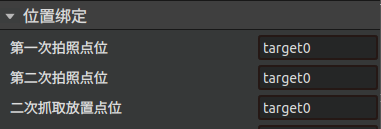

	自动运行模式

- 第一次拍照点位：以可以完整拍出抓取物体为原则，在抓取物体正上方示教第一次拍照点位；

- 第二次拍照点位：在中间放置点位正上方示教第二次拍照点位；

- 二次抓取放置点位：示教物体调整位姿时放置的位置；	

2. 非二次抓取示教点位：
   
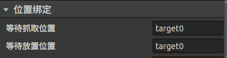

	非二次抓取位置绑定

- 等待抓取位置：抓取点附近位置；

- 等待放置位置：放置位置附近点位（推荐放置位置正上方点位）；

3. 固定放置示教点位：

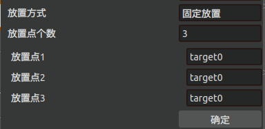

	固定放置位置绑定

- 选择固定放置放置点个数，有几个放置点则需要示教几个放置点位；

4. 规则放置示教点位

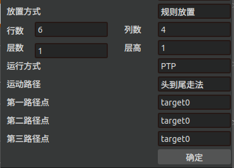

	固定放置位置绑定

- 等一路径点、第二路径点和第三路径点决定了规制放置的放置矩阵；第一路径点和第二路径点决定了放置矩阵的行，第二路径点和第三路径点决定了放置矩阵的列。
   

Step3：运行AIRLab软件

一键启动AIRLab软件（确保机械臂已连接，视觉、AI等节点成功启动），打开bin picking插件，先进行初始设置，初始设置成功后进行位置绑定，之后进行自动运行。
	

喷涂
-------------------
该插件模块是针对喷涂任务开发的功能模块。

UI界面介绍
~~~~~~~~~~~~~~~~~~~
点击菜单栏插件-喷涂，弹出喷涂弹窗。喷涂弹窗主要分为三个部分，喷涂参数设置、仿真设置和程序运行。

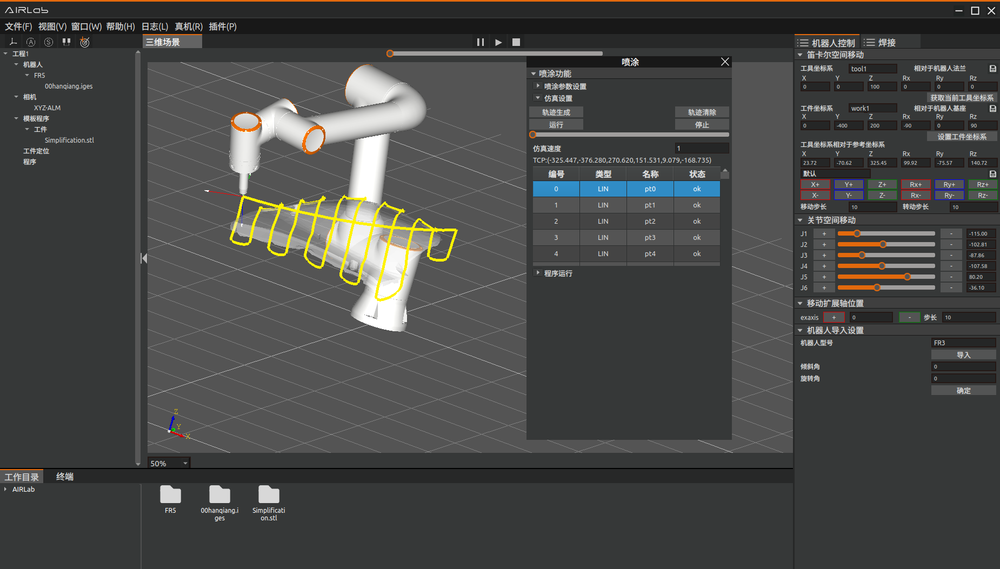

	喷涂插件弹窗

喷涂参数设置主要作用是选择喷涂模型和设置喷涂参数，包括喷涂方向、法向计算半径、椭圆长半轴、椭圆短半轴等。设置完成后，点击初始化AI，点击AI计算，会自动计算出喷涂轨迹。

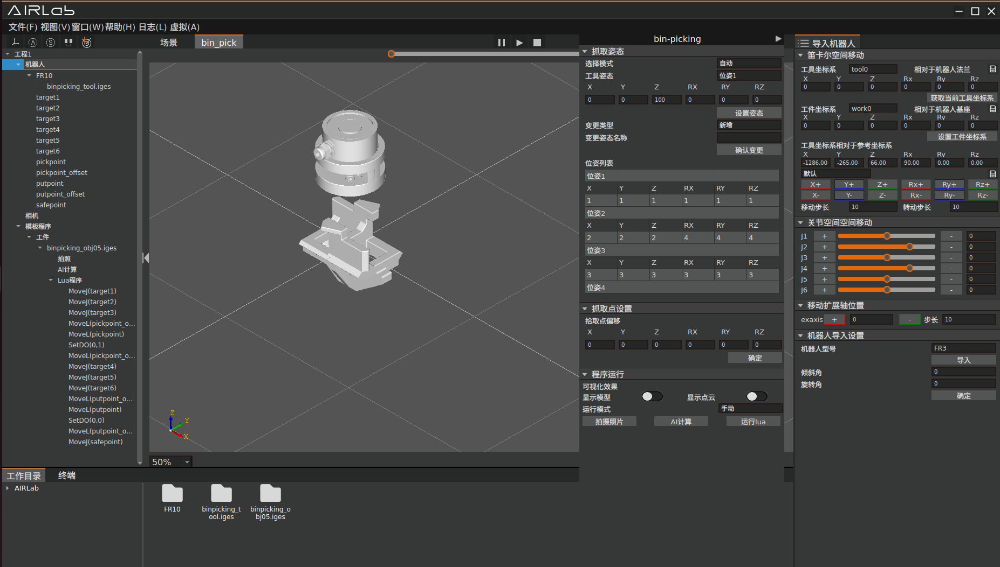

	喷涂参数设置

仿真设置主要是对喷涂轨迹进行仿真，先点击轨迹生成，三维场景中生成仿真轨迹。生成的仿真轨迹正确，设置仿真速度，点击运行按钮则可以看到仿真效果。点击停止按钮停止仿真。

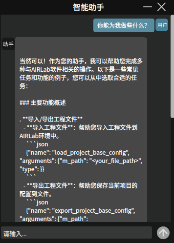

	仿真设置

程序运行部分主要是对喷涂程序进行轨迹保存、轨迹传输、轨迹加载等。

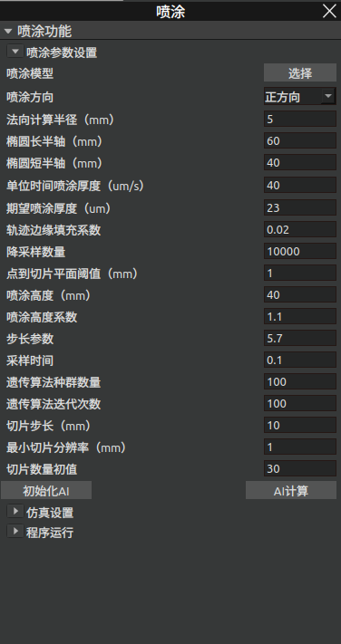

	程序运行

- 保存轨迹文件：点击“保存轨迹文件”按钮可以将喷涂轨迹保存到本地。
  
- 轨迹传输：将本地保存的轨迹传输到控制器。
  
- 轨迹加载：从控制器中加载之前喷涂轨迹。
  
- 轨迹运行：点击“轨迹运行”，运行当前轨迹。
  
- 停止运行：点击“停止运行”，停止当前运行的轨迹。

仿真过程
~~~~~~~~~~~~~~~~~~~

喷涂完整仿真过程如下：

Step1：导入喷涂模型；在喷涂界面喷涂参数设置部分选择导入喷涂模型。

Step2：设置喷涂参数。

Step3：根据实际喷涂作业设置完喷涂参数后，点击初始化AI对AI节点进行初始化操作，之后点击AI计算计算喷涂轨迹。

Step4：喷涂界面仿真设置UI界面点击“轨迹生成”，观察喷涂轨迹生成无误后就可以运行仿真。

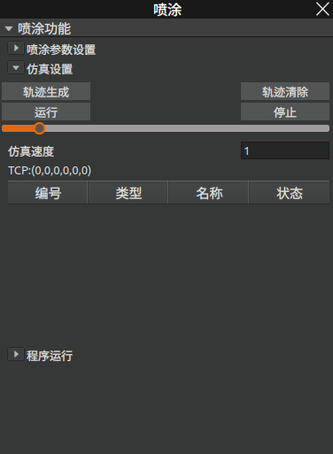

	喷涂仿真轨迹

对于已经计算过喷涂轨迹并将轨迹传输到控制器的工件，在下一次喷涂作业使不需要再次进行AI计算，直接进行轨迹加载再进行仿真即可。

对话式AI助手
-------------------
为提供更好的用户体验和提高用户效率，AIRLab软件开发对话式智能助手插件。通过对话式AI助手，用户可以与软件进行自然语言交互，下发需要的操作，机器人根据用户的输入进行相应的操作。点击菜单栏插件-对话式智能助手弹出智能助手弹窗。

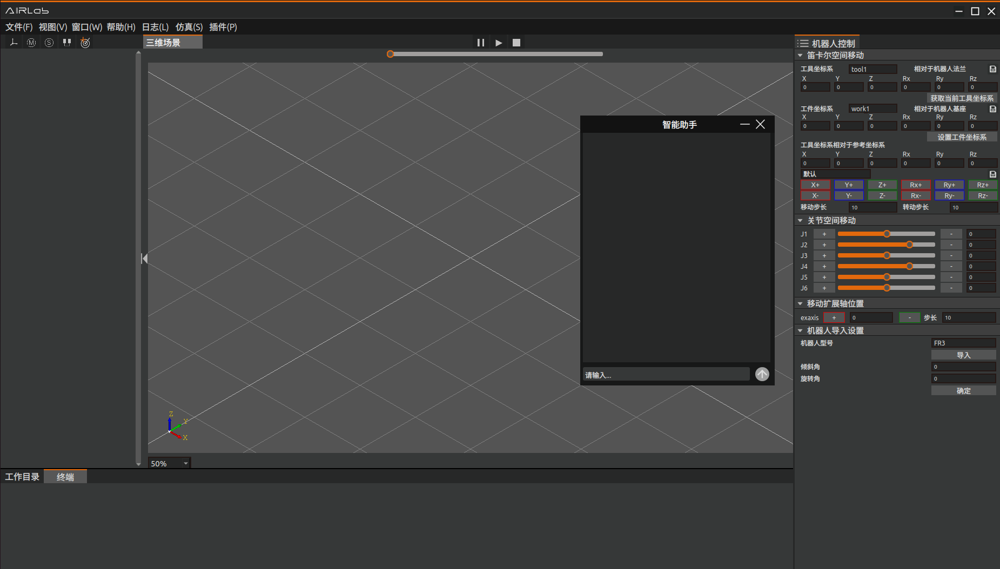

	对话式智能助手弹窗

在输入框输入问题或操作，点击发送，等待AI助手的回复或做出相应的操作。AI助手的主要功能有可以帮助用户导入/导出工程文件、绑定焊接工艺、新增工程树节点等。

	AI助手功能

以导入一个工程为例：

用户发送“请帮我导入工程ZH-401-yyh.json”，AI助手回复确认信息，用户判断信息无误后回复“是”，AI助手执行相应的操作，导入ZH-401-yyh.json工程文件。

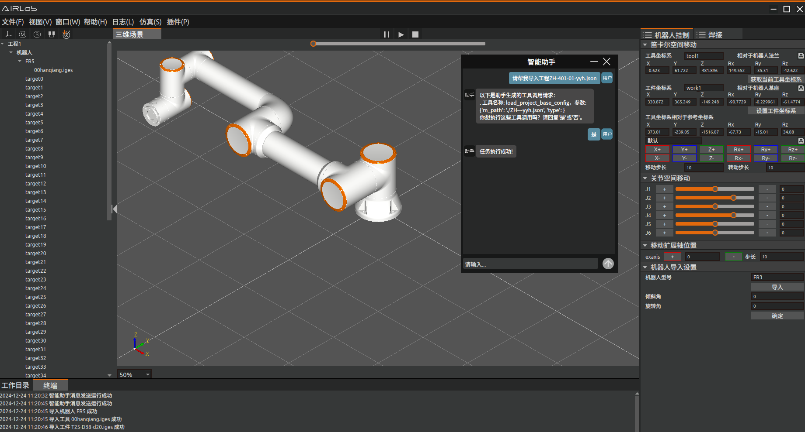

	导入工程