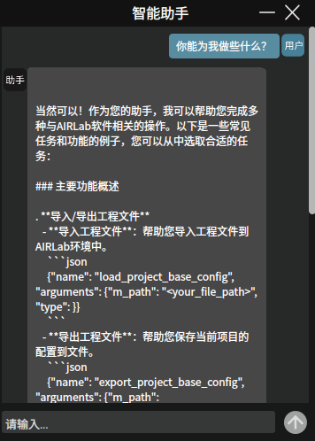
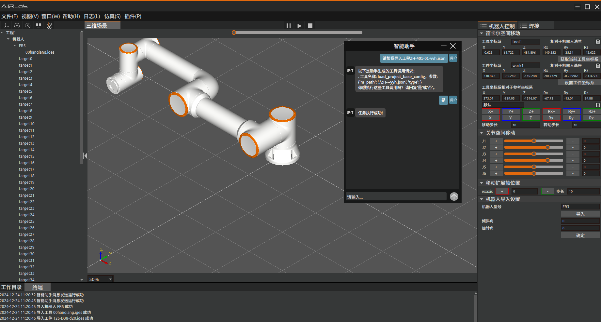

插件
=========

.. toctree:: 
    :maxdepth: 5

本章节主要介绍各个插件的功能及具体操作过程。

binpick
-------------------
binpick插件模块实现了自动抓取物体的功能。点击菜单栏插件-binpick，主场景分为三维场景和二维显示场景并弹出bin_pick弹窗，进行抓取时信息显示及抓取时需要的UI交互。其中三维场景中显示机器人运动过程，二维显示场景中显示工件的RGB图像和识别出工件的bounding box。

创建binpick工程
~~~~~~~~~~~~~~~~~~~

点击菜单栏-文件，选择文件类型为binpick，点击“新建”；之后导入需要的工具工件。

.. figure:: plug/1.png
	:align: center
	:width: 2.5in

.. centered:: 图5-1 新建binpick工程文件
	
创建binpick程序；如图5-2所示是binpick的模板程序，主要需要4个点位，pickpoint、pickpoint_offset、过渡点位和放置点位。

.. figure:: plug/2.png
	:align: center
	:width: 2.7in

.. centered:: 图5-2 binpick的模板程序

其中pickpoint和pickpoint_offset为拾取点位和拾取偏移点位，为AI计算所得，点位名称不能修改。过渡点位和放置点位分别为机器人运动过程中设置的过渡点及工件需要放置的点位，用户自己设置即可。SetDO为IO控制节点，控制夹爪的抓取和松开。用户根据这些节点创建符合实际抓取任务的binpick程序。
binpick程序创建成功后，点击菜单栏-工件，点击“导出”按钮保存binpick工程。下一次运行可以直接导入binpick工程不需要重新创建工程操作。

UI界面介绍
~~~~~~~~~~~~~~~~~~~
导入binpick工程，点击菜单栏插件-binpick，弹出bin_pick弹窗，如图5-3所示。bin_pick弹窗分为三个部分：抓取姿态、抓取点设置和程序运行。

.. figure:: plug/3.png
	:align: center
	:width: 3in

.. centered:: 图5-3 bin_pick弹窗

1. 抓取姿态

抓取姿态模块主要作用是设置工具抓取姿态，在位姿列表中会先加载出数据库中保存的位姿，可以对这些位姿进行删除、修改或新增操作。

.. figure:: plug/4.png
	:align: center
	:width: 3in

.. centered:: 图5-4 抓取姿态模块

删除：将选择模式选为“手动”，点击位姿列表中要删除的位姿或者输入变更姿态名称，选择变更类型为“删除”，点击“确认变更”，则相应位姿从数据库中删除。

.. figure:: plug/5.png
	:align: center
	:width: 3in

.. centered:: 图5-5 删除位姿

修改：点击位姿列表中要修改的位姿或者输入变更姿态名称，选择变更类型为“变更”；将选择模式选为“手动”，通过调整X、Y、Z、RX、RY、RZ的值来手动调整工具抓取姿态，设置完成后点击“设置姿态”可以查看设置的位姿，确定设置的位姿无误后点击“确认变更”，则相应位姿被修改。

.. figure:: plug/6.png
	:align: center
	:width: 3in

.. centered:: 图5-6 修改位姿

新增：可以通过自动或手动两种模式进行位姿的新增；其中自动模式尚未开放，先主要介绍手动模式新增位姿方法。首先选择变更类型为“新增”，输变更姿态名称，将选择模式选为“手动”，通过调整X、Y、Z、RX、RY、RZ的值来手动调整工具抓取姿态，设置完成后点击“设置姿态”可以查看设置的位姿，确定设置的位姿无误后点击“确认变更”，则新增相应位姿。

.. figure:: plug/7.png
	:align: center
	:width: 3in

.. centered:: 图5-7 新增位姿

2. 抓取点设置

抓取点设置模块主要作用是设置拾取点的偏移量，相当于过渡点；在机器人运动到拾取点的偏移量所在的位置可以设置机器人速度减小，使抓取过程更加安全。

.. figure:: plug/8.png
	:align: center
	:width: 4in

.. centered:: 图5-8 抓取点设置

3. 程序设置

程序运行模块主要有两种运行模式，手动模式和自动模式。

.. figure:: plug/9.png
	:align: center
	:width: 4in

.. centered:: 图5-9 程序运行

手动模式：选择运行模式为“手动”，点击“拍摄照片”按钮，2D场景显示真实工件的RGB图。

.. figure:: plug/10.png
	:align: center
	:width: 6in

.. centered:: 图5-10 点击“拍摄照片”

正确显示RGB图片后点击“AI计算”按钮，2D场景显示工件的bounding box；

.. figure:: plug/11.png
	:align: center
	:width: 6in

.. centered:: 图5-11 点击AI计算

RGB图片和工件的bounding box都正确显示后，点击运行lua开始运行binpick模板程序。
自动模式：选择运行模式为“自动”，选择运行次数，点击“运行”，程序开始运行；程序会自动拍摄照片和AI计算，2D场景正确显示工件的RGB图片和bounding box。之后自动运行lua程序。

.. figure:: plug/12.png
	:align: center
	:width: 6in

.. centered:: 图5-12 自动运行程序
	
操作过程
~~~~~~~~~~~~~~~~~~~
binpick完整操作过程如下：

Step1：导入binpick工程；如果没有binpick工程，则需要先新建一个binpick工程。

Step2：点击菜单栏插件-binpick，主场景弹出binpick弹窗，三维场景分为左右两个场景；其中三维场景中显示机器人运动过程，二维显示场景中显示工件的RGB图像和识别出工件的bounding box。

.. figure:: plug/13.png
	:align: center
	:width: 6in

.. centered:: 图5-13 binpick三维场景

Step3：选择binpick场景，binpick场景中显示真实场景中工具和工件的位姿，将工具的抓取姿态设置为合适的位姿，同时设置拾取点偏移，工具姿态的设置及拾取点偏移设置具体见5.1.2部分介绍。

.. figure:: plug/14.png
	:align: center
	:width: 6in

.. centered:: 图5-14 binpick场景中设置抓取姿态

Step4：工具具姿态的设置及拾取点偏移设置完成后切回三维场景中，运行lua程序，有手动和自动运行两种模式。手动运行和自动运行操作具体见5.1.2，运行过程如下：

1. 机器人运动至拍照点位，拍摄工件照片，2D场景显示RGB图。
   
2. 点击AI计算，2D场景显示工件的bounding box；
   
3. 运行lua；根据AI计算结果，机器人运动到拾取点位抓取工件，IO控制夹爪抓取，抓取到工件后运动到过渡点，再从过渡点运动至放置偏移点和放置点，IO控制夹爪松开。

喷涂
-------------------
该插件模块是针对喷涂任务开发的功能模块。

UI界面介绍
~~~~~~~~~~~~~~~~~~~
点击菜单栏插件-喷涂，弹出喷涂弹窗。喷涂弹窗主要分为三个部分，喷涂参数设置、仿真设置和程序运行。

.. figure:: plug/15.png
	:align: center
	:width: 6in

.. centered:: 图5-15 喷涂插件弹窗

喷涂参数设置主要作用是选择喷涂模型和设置喷涂参数，包括喷涂方向、法向计算半径、椭圆长半轴、椭圆短半轴等。设置完成后，点击初始化AI，点击AI计算，会自动计算出喷涂轨迹。

.. figure:: plug/16.png
	:align: center
	:width: 3in

.. centered:: 图5-16 喷涂参数设置

仿真设置主要是对喷涂轨迹进行仿真，先点击轨迹生成，三维场景中生成仿真轨迹。生成的仿真轨迹正确，设置仿真速度，点击运行按钮则可以看到仿真效果。点击停止按钮停止仿真。

.. figure:: plug/17.png
	:align: center
	:width: 3in

.. centered:: 图5-17 仿真设置

程序运行部分主要是对喷涂程序进行轨迹保存、轨迹传输、轨迹加载等。

.. figure:: plug/18.png
	:align: center
	:width: 3in

.. centered:: 图5-18 程序运行

- 保存轨迹文件：点击“保存轨迹文件”按钮可以将喷涂轨迹保存到本地。
  
- 轨迹传输：将本地保存的轨迹传输到控制器。
  
- 轨迹加载：从控制器中加载之前喷涂轨迹。
  
- 轨迹运行：点击“轨迹运行”，运行当前轨迹。
  
- 停止运行：点击“停止运行”，停止当前运行的轨迹。

仿真过程
~~~~~~~~~~~~~~~~~~~

喷涂完整仿真过程如下：

Step1：导入喷涂模型；在喷涂界面喷涂参数设置部分选择导入喷涂模型。

Step2：设置喷涂参数。

Step3：根据实际喷涂作业设置完喷涂参数后，点击初始化AI对AI节点进行初始化操作，之后点击AI计算计算喷涂轨迹。

Step4：喷涂界面仿真设置UI界面点击“轨迹生成”，观察喷涂轨迹生成无误后就可以运行仿真。

.. figure:: plug/19.png
	:align: center
	:width: 6in

.. centered:: 图5-19 喷涂仿真轨迹

对于已经计算过喷涂轨迹并将轨迹传输到控制器的工件，在下一次喷涂作业使不需要再次进行AI计算，直接进行轨迹加载再进行仿真即可。

对话式AI助手
-------------------
为提供更好的用户体验和提高用户效率，AIRLab软件开发对话式智能助手插件。通过对话式AI助手，用户可以与软件进行自然语言交互，下发需要的操作，机器人根据用户的输入进行相应的操作。点击菜单栏插件-对话式智能助手弹出智能助手弹窗。

.. figure:: plug/20.png
	:align: center
	:width: 6in

.. centered:: 图5-20 对话式智能助手弹窗

在输入框输入问题或操作，点击发送，等待AI助手的回复或做出相应的操作。AI助手的主要功能有可以帮助用户导入/导出工程文件、绑定焊接工艺、新增工程树节点等。

.. centered:: 图5-21 AI助手功能

以导入一个工程为例：

用户发送“请帮我导入工程ZH-401-yyh.json”，AI助手回复确认信息，用户判断信息无误后回复“是”，AI助手执行相应的操作，导入ZH-401-yyh.json工程文件。

.. centered:: 图5-22 导入工程