插件
=========

.. toctree:: 
    :maxdepth: 5

本章节主要介绍插件授权及各个插件的功能及具体操作过程。

插件授权
-------------------
点击插件-插件授权，可查看AIRLab唯一标识及各插件授权状态。

.. figure:: plug/ Plugin_License.png
	:align: center
	:width: 3in

	插件授权页面

若状态为“已授权”，则可正常打开插件使用；若为“未授权”，打开插件时将提示插件加载失败，如图所示。

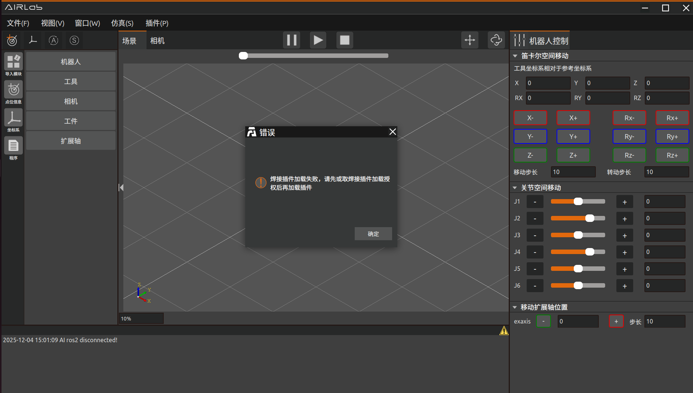

	焊接插件加载失败

如需对插件进行授权，请联系售后获取授权文件（.bin格式）。随后在授权界面中选择该文件，点击“授权”进行升级。

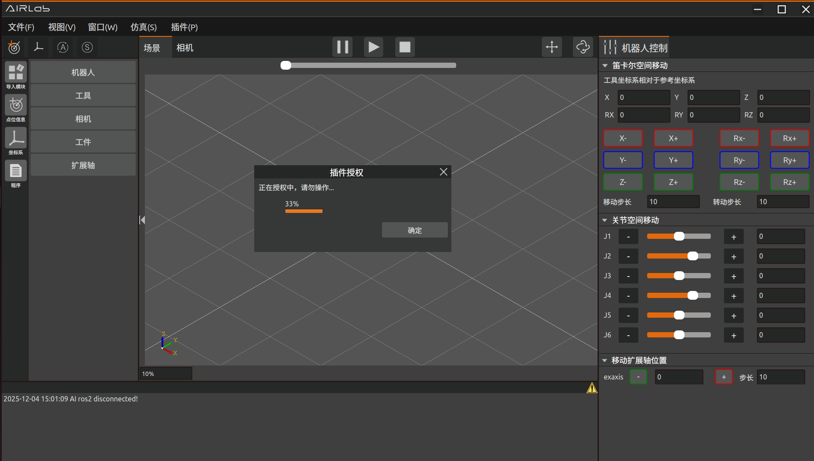

	正在授权中

等待进度条加载完成后页面显示“授权成功”提示。

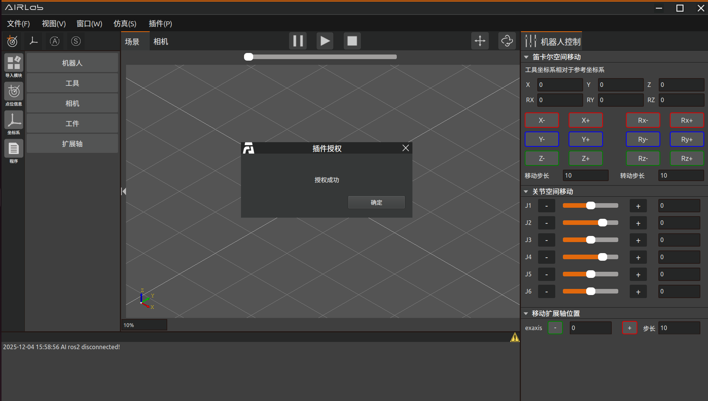

	授权成功

重新插拔加密狗并等待约30秒左右，插件授权状态更新即表示授权完成。
若授权过程中出现错误，授权流程将自动终止，并弹出如图所示的错误提示，此时，请联系售后人员进行处理。

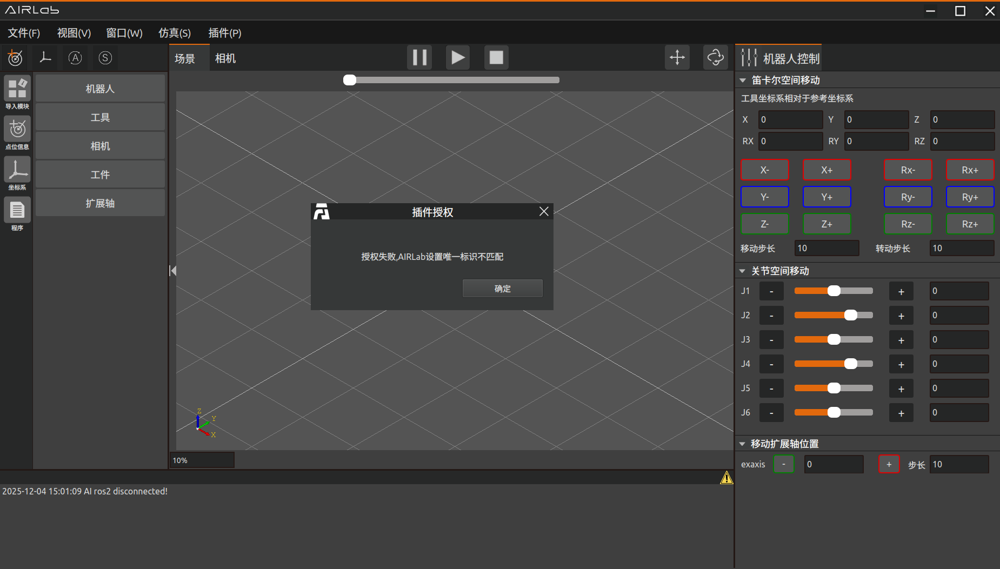

	授权失败

bin-picking
-------------------
bin-picking插件模块实现了自动抓取物体的功能。点击菜单栏插件-bin-picking，主场景分为三维场景和二维显示场景并弹出bin-picking弹窗。其中三维场景中显示机器人运动过程，二维显示场景中显示工件的RGB图像和识别出工件的bounding box。

创建bin-picking工程
~~~~~~~~~~~~~~~~~~~

点击菜单栏-文件，选择文件类型为bin-picking，点击“新建”之后导入需要的机器人、工具、工件或者直接打开bin-picking工程文件；

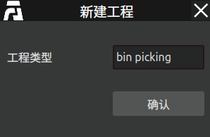

	新建bin-picking工程文件
	
打开插件后，菜单栏会新增以下三个选项，分别为“模型”、“设置”、“调试”，如下图所示。

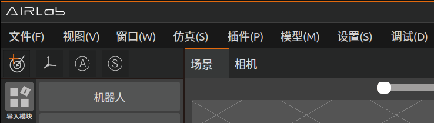

	bin-picking菜单栏
	
bin-picking模型弹窗
~~~~~~~~~~~~~~~~~~~~~~~~
点击菜单栏-“模型”-打开模型训练弹窗，如下图所示。

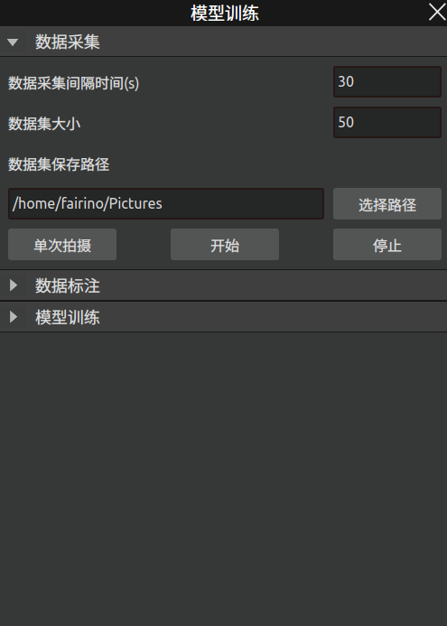

	bin-picking模型训练-数据采集弹窗

该弹窗可以实现自主进行数据集构建，标注以及模型训练功能，其具体步骤如下：

Step1：首先点击“数据采集”标题，打开子界面。其中，该界面有3个参数可供设置，

- 数据采集间隔时间：自动采集时的拍照间隔时间，单位为秒；

- 数据集大小：自动采集图片总数；

- 数据集保存路径：最终所拍摄的数据集照片保存地址，点击右侧“选择路径”按钮即可打开路径选择弹窗；
	
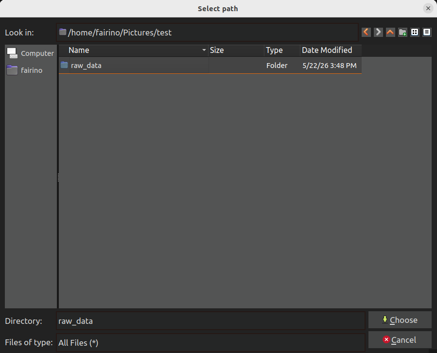

	bin-picking路径选择弹窗

完成参数设置后，可点击“开始”按钮，开始采集拍照。每次拍照完成后，重新摆放目标位置，间隔时间到达后会自动进行拍照，免去了频繁点击界面拍照的步骤。中途如果点击“停止”按钮，即可停止本次数据采集过程。“单次拍摄”按钮在点击后会触发单次拍照，采集一张照片，可供测试使用。

Step2：获得原始数据集后，点击“数据标注”标题，打开子界面，如下图所示。

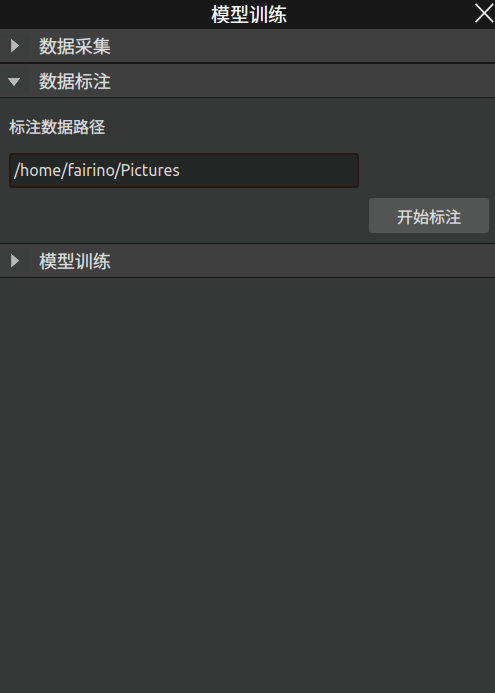

	bin-picking模型训练-数据标注弹窗

其中，标注数据路径就是之前原始数据集的路径，所以其会自动跟原始数据集保持一致，直接点击开始标注即可，点击后会打开Labelme标注软件，如下图所示。

.. figure:: plug/binpicking_model_labelme.png
	:align: center
	:width: 4in

	bin-picking模型训练-Labelme软件

打开后，选择矩形工具将目标物体框出，并打上自己设想的ID号保存即可，完成所有原始数据集的标注即可进行下一步。

Step3：将所有原始数据集标定过后，点击“模型训练”标题，打开子界面，准备进行最后的模型训练步骤，界面如下。

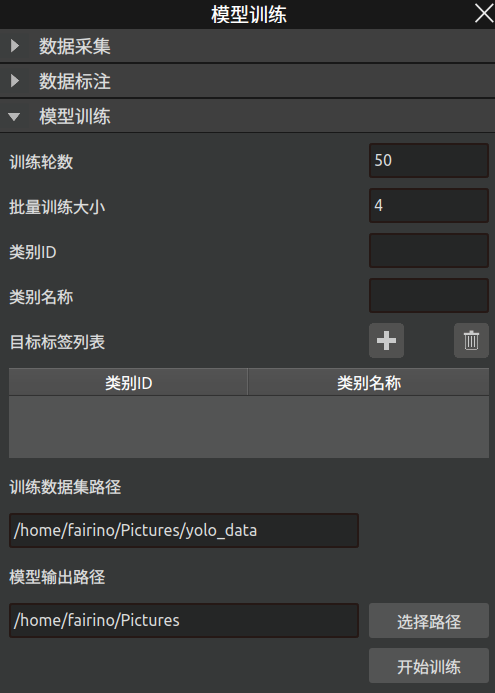

	bin-picking模型训练-模型训练弹窗

整个界面的参数含义如下：

- 训练轮数：整个训练的轮数；

- 训练批量大小：每次训练的输入数据量；

- 类别ID：与之前标注时的类别保持一致填写即可；

- 类别名称：目标物体训练时使用的名称，简单实用与ID相同即可，完成设定后点击“添加”图标即可完成表格内容添加，如下图所示；

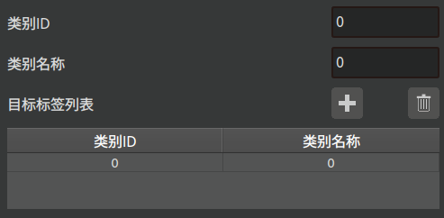

	bin-picking模型训练-目标标签列表

- 训练数据集路径：同样与原始数据集路径相关，会自动填写为原始数据集路径下的yolo_data文件夹；

- 模型输出路径：最终训练完成后，整个模型文件的输出路径；

完成整体参数设置后，点击“开始训练”按钮，程序会自动开始模型训练过程，当完成整体训练后，软件会进行弹窗提示，如下图所示。

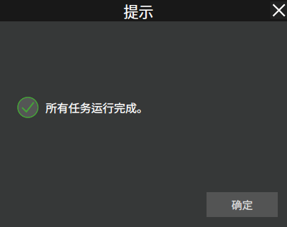

	bin-picking模型训练-完成训练弹窗

最终的生成模型会以.pt结尾，在设定的模型输出路径下的train/weights中，一般选用best.pt即可，如下图所示。

.. figure:: plug/binpicking_model_pt_path.png
	:align: center
	:width: 4in

	bin-picking模型训练-pt文件路径

整个流程执行完成后，顺利生成了后续需要用到的模型(.pt)文件。

bin-picking设置弹窗
~~~~~~~~~~~~~~~~~~~~~~~~
点击菜单栏-“设置”-打开bin-picking设置弹窗，如下图所示。bin-picking弹窗分为五个部分：项目配置、初始设置、位置绑定、抓取位置误差补偿及程序运行。整个界面使用流程如下：

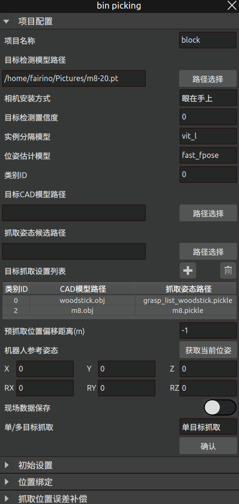

	bin-picking弹窗

1.	进行项目设置：

主要涉及较多参数设置，具体含义介绍如下：

- 项目名称：预留了插件中已配置好的三种场景，分别为木块、螺钉和锁具，以及一个新增选项，可供自定义设置自己的项目。若选择新增，则界面会变化如下。其中，填写新增的项目名称后，点击确定按钮，则新增的项目名也会添加至下拉框中，选择其进行编辑即可。

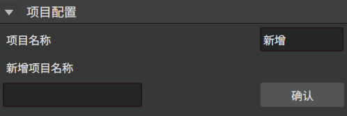

	bin-picking设置弹窗-新增项目

- 目标检测模型路径：选择模型训练生成的pt文件即可；
- 相机安装方式：根据实际情况选择眼在手上或是眼在手外；
- 目标检测置信度：目标检测的置信度阈值，低于此阈值会将结果舍弃；
- 实例分割模型：本次模型提供两个模型选项，分别为fastsam和vit_l；
- 位姿估计模型：本次位姿估计模型同样提供两个选项，分别为fpose和fast_fpose模型；
- 类别ID：与选中的模型训练时所设计的模型ID一致；
- 目标CAD模型路径：该类别ID的CAD模型路径；
- 抓取姿态候选路径：该类别ID的抓取姿态候选路径；

同样的，完成以上三个参数设置后，点击“添加”图标，即可完成目标抓取设置列表的内容添加。重复以上操作直至与实际需求一致，完成表格填写。

- 预抓取位置偏移距离：前往抓取点之前的抓取过渡点，具体表示为过渡点离抓取点的距离，以米为单位。
- 机器人参考姿态：运动时机器人的抓取位姿参考的位姿，通常及拍照点的位姿，可通过移至拍照点，点击“获取当前位姿”完成设置。
- 现场数据保存：开启后，会保存程序抓取过程中保存的图片，后续可以通过数据导出查看。
- 单/多目标抓取：可以选择本次抓取一次识别场景中的目标抓取位姿数量。单目标表示为每次只识别场景中的一个位姿进行抓取，多目标表示为一次尽可能识别场景中的全部抓取位姿。

完成整个界面参数设置后，点击“确认”按钮即可完成整个项目的设置，同时相应的会开始启动对应设置的“AI节点”，需要等待些许时间，若启动节点成功，则会显示如下弹窗，反之也有失败弹窗。

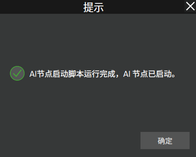

	AI节点启动成功

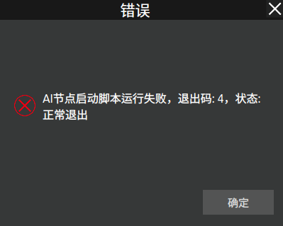

	AI节点启动失败

2. 进行初始设置：

整个初始设置界面如下：

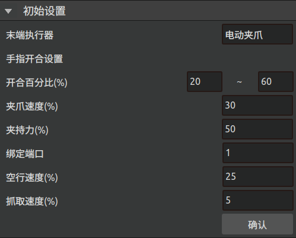

	AI节点启动失败

针对该界面所有的参数进行说明：

- 末端执行器：有两个选项“电动夹爪”和“气动夹爪”，根据实际使用夹爪的控制方式进行选择，若是通过配置协议的使用前者，反之若使用IO控制的则使用后者。

- 开合百分比：用于控制“电动夹爪”的关闭指令以及打开指令的的夹爪开合大小。

- 夹爪速度：用于控制“电动夹爪”的夹爪开合速度百分比。

- 夹持力：用于控制“电动夹爪”的夹爪加持力度百分比。

- 绑定端口：根据“末端执行器”和控制器绑定的端口进行设置，与实际保持一致。

- 空行速度：用于设置抓取任务时，机器人过渡点之间运行时的速度。

- 抓取速度：用于设置抓取任务时，机器人即将抓取物体状态下(下一个目标点就是目标抓取点)的速度。

2. 进行位置绑定

该子页面主要用于进行后续放置任务的点位绑定，具体设置及其参数介绍如下：

- 相机拍照位置：设置目标点为机器人的拍照点。

- 等待抓取位置：设置目标点为抓取前所去的示教点。

- 等待放置位置：设置目标点为放置点前的过渡示教点。

- 放置方式：该选项主要有三个选项，分别为固定放置、规则放置和自定义放置模式。

- 固定放置模式：通过设置固定放置点个数，可以控制抓取流程按照顺序依次摆放至所设置的固定放置点。

- 规则放置模式：可以根据需要设置行数、列数、层数和层高等放置规则。

- 自定义放置模式：可以通过设置识别的目标种类及其对应该种类的放置点，之后软件会根据识别的实际目标型号将识别的物体放在所设置的放置点。

具体的各种模式的子界面显示如下：

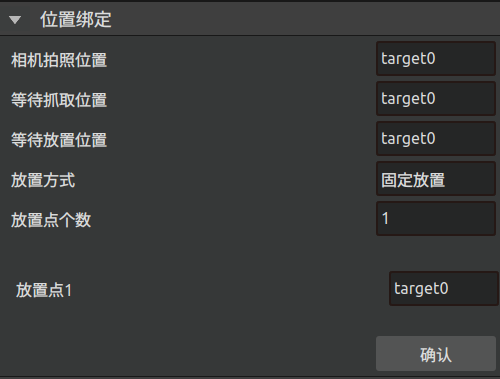

	位置绑定-固定放置

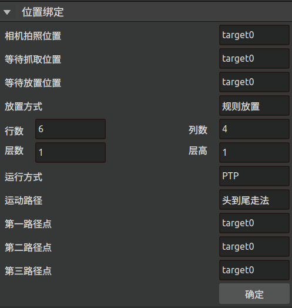

	位置绑定-规则放置

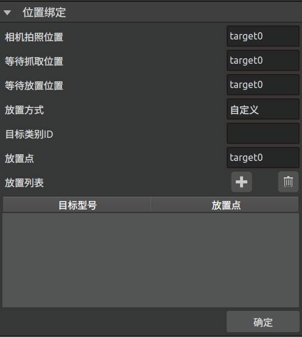

	位置绑定-自定义放置

若之前选的项目是“锁具”，由于对于该种类的特殊放置规则（二次抓取）则原先的“相机拍照位置”“等待抓取位置”“等待放置位置”会相应变成“第一次拍照点位”“第二次拍照点位”“二次抓取放置点位”，具体含义如下：

- 第一次拍照点位：设置目标点为初次抓取阶段的拍照点。

- 第二次拍照点位：设置目标点为重抓取阶段的拍照点。

- 二次抓取放置点位：设置目标点为重抓取阶段的放置点。

其界面显示如下：

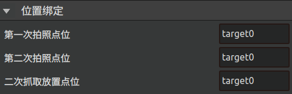

	位置绑定-二次抓取

4. 抓取位置误差补偿

抓取位置误差补偿是为了消除抓取过程中的系统误差而设置的误差补偿，抓取时如果误差较大可以设置误差补偿系数（基于工具坐标系），设置完系数后点击“确定”。指令反馈区显示设置误差补偿系数成功即成功设置误差补偿系数。

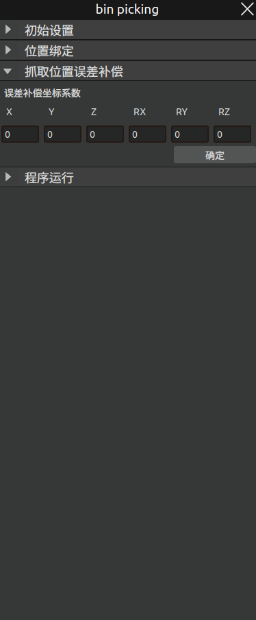

	抓取位置误差补偿
	
5. 程序运行

初始设置和位置绑定成功后即可进行程序运行，有手动和自动两种运行模式。

- 手动运行：选择手动运行，机器人进行一次自动抓取；

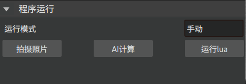

	手动运行模式

先点击拍摄照片，拍摄待抓取物体的照片；拍摄成功后，终端会显示“拍摄照片成功”提示，2D场景显示真实工件的RGB图。

之后点击AI计算，AI识别待抓取物体的位置，2D场景显示工件的bounding box；	

等待计算完成之后点击运行lua，机器人进行一次识别抓取运动；

若目标种类为“锁具”，则手动界面会多出三个按钮，分别为“初次抓取”“位姿调整”“重抓取”，分别对应其二次抓取中三个阶段的“AI计算”过程，即可以手动进行各个阶段的操作，界面如下：

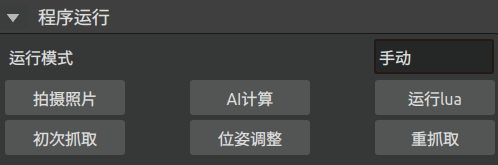

	手动运行模式-锁具

- 自动运行：自动运行包括运行，停止及重置；

运行：点击“运行”按钮，机器人开始自动进行拍照识别、抓取操作；

停止：点击“停止”按钮，自动抓取停止运动；

重置：点击“重置”按钮，抓取计数器置为0，再次运行则从开始进行抓取，放置在第一个放置位置上，若目标种类为螺钉，则会先执行倒盘动作；

暂停：暂停当前程序运行；

继续：从暂停的动作轮次，重新运行该动作。

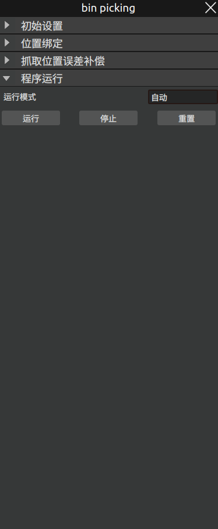

	自动运行模式

bin-picking调试文件导出弹窗
~~~~~~~~~~~~~~~~~~~~~~~~~~~~~~~~~~~~~~
点击菜单栏-“调试”-打开调试文件导出弹窗，如下图所示。

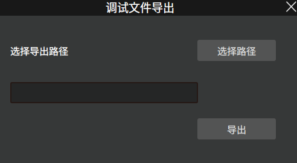

	bin-picking文件导出弹窗

选择目标调试文件的导出路径后，点击导出按钮，即导出过程开始，进度条开始移动，完成后，显示如下弹窗。

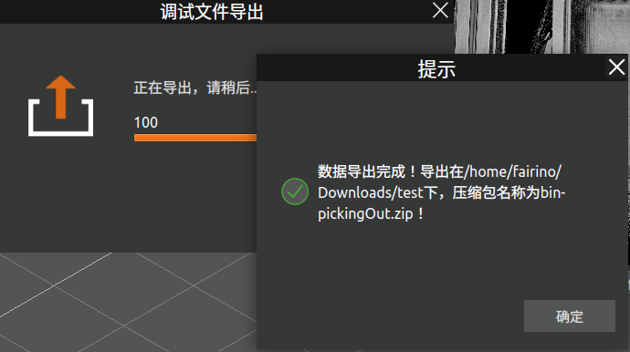

	bin-picking文件导出-完成弹窗

整体操作过程
~~~~~~~~~~~~~~~~~~~
Step1：相机标定
   
在进行抓取操作之前需要先进行相机标定，根据实际情况选择眼在手上或眼在手外。

Step2：点位示教

1. 二次抓取示教点位：
   
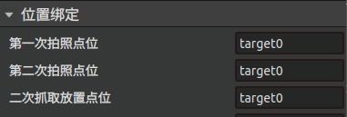

	二次抓取位置绑定

- 第一次拍照点位：以可以完整拍出抓取物体为原则，在抓取物体正上方示教第一次拍照点位；

- 第二次拍照点位：在中间放置点位正上方示教第二次拍照点位；

- 二次抓取放置点位：示教物体调整位姿时放置的位置；	

2. 非二次抓取示教点位：
   
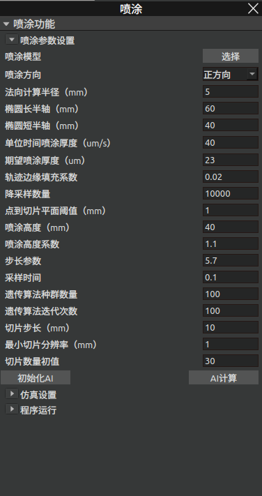

	非二次抓取位置绑定

- 等待抓取位置：抓取点附近位置；

- 等待放置位置：放置位置附近点位（推荐放置位置正上方点位）；

3. 固定放置示教点位：

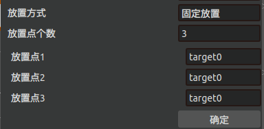

	固定放置位置绑定

- 选择固定放置放置点个数，有几个放置点则需要示教几个放置点位；

4. 规则放置示教点位

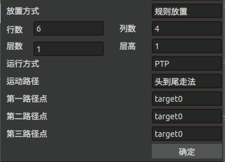

	规则放置位置绑定

- 第一路径点、第二路径点和第三路径点决定了规制放置的放置矩阵；第一路径点和第二路径点决定了放置矩阵的行，第二路径点和第三路径点决定了放置矩阵的列。
   
5. 自定义示教点位

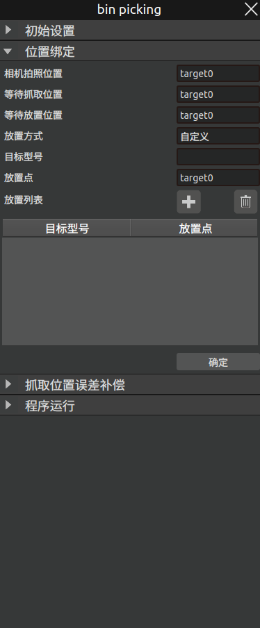

	自定义放置位置绑定

- 与固定放置类似，先确定本次目-标任务的目标种类，依次添加对应的放置点，若同一目标需要有多个放置点，更改放置点，保持目标型号不变继续添加即可。   

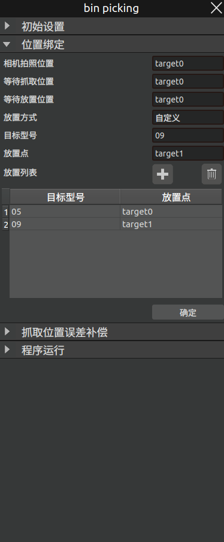

	自定义放置位置绑定-结果

Step3：运行AIRLab软件

一键启动AIRLab软件（确保机械臂已连接，视觉、AI等节点成功启动），打开bin-picking插件，先进行项目配置、再进行初始设置，初始设置成功后进行位置绑定，最后即可进行自动运行。

码垛
--------
码垛插件实现了物体的自动识别抓取，并按预设垛型进行自动放置。点击菜单栏中的“插件-打开码垛插件”，主场景将分为三维与二维两个显示区域，并同时弹出palletizing窗口。其中，三维场景用于展示机器人的运动过程、运行轨迹及仿真模型；二维场景则用于显示工件的RGB图像及其识别出的边界框（bounding box）。

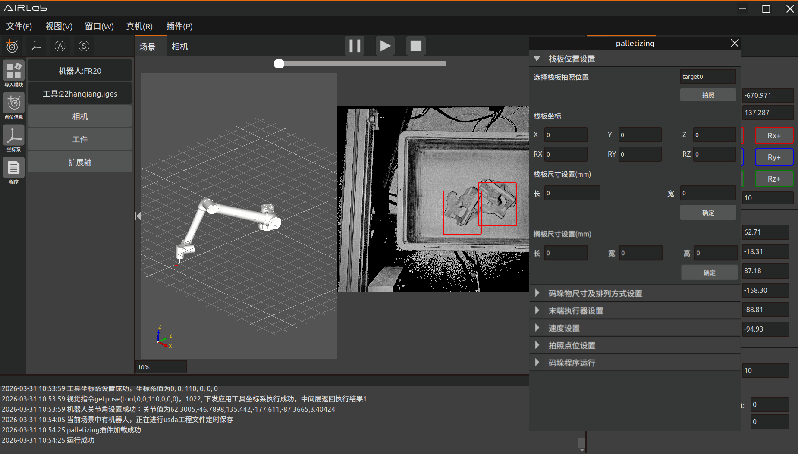

	码垛插件打开

AI节点连接
~~~~~~~~~~~~~~~~~~
在进行循环码垛之前，先确保AI节点打开并初始化成功；如图所示：

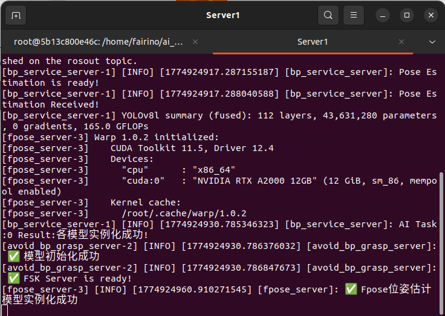

	AI节点连接

栈板识别定位
~~~~~~~~~~~~~~~~~~
在AIRLab软件中，首先导入机器人和工具模型。随后在栈板上第一个码垛物的位置粘贴二维码，用于确定栈板坐标系及其初始位置。之后示教栈板的拍照点位（该点位需位于粘贴二维码位置的正上方，确保能够清晰拍到二维码以进行AI识别）。

之后，点击palletizing-栈板位置设置，选择已示教的拍照点位，并点击“拍照”按钮。机器人将自动移动至该点位进行拍照和AI识别。识别完成后，三维场景会显示识别出的栈板坐标，同时三维场景中会自动导入栈板工件。

.. important::
	识别的栈板坐标存在误差，需要您确认一下该坐标系的RX、RY、RZ值是否正常，保证栈板跟地面是平行的。

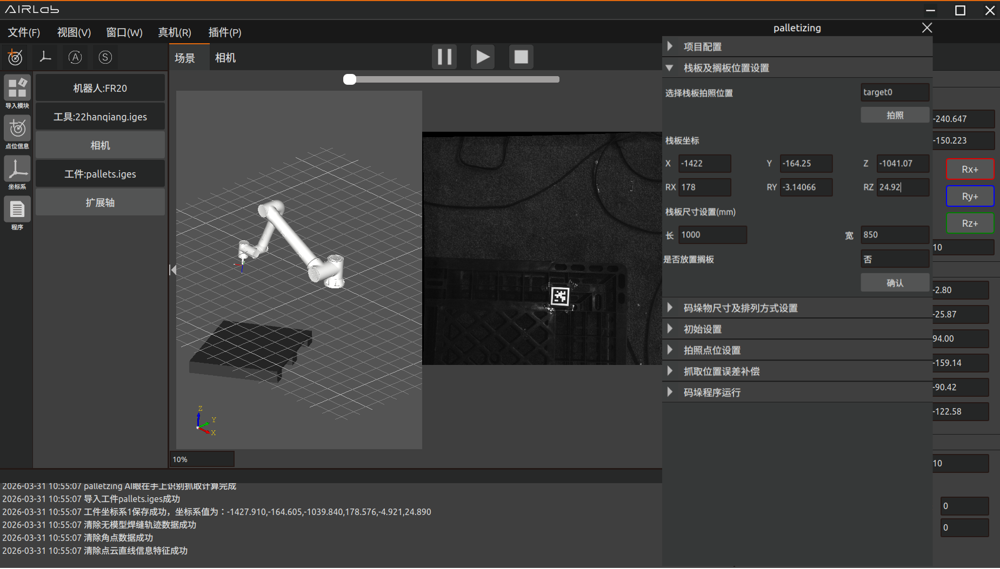

	栈板识别定位

栈板识别定位成功后，设置栈板尺寸和搁板尺寸并点击确定按钮进行确认。

码垛垛型确定
~~~~~~~~~~~~~~~~~~
打开palletizing-码垛物尺寸及排列方式设置模块，设置码垛物尺寸及码垛间距，点击确定按钮，软件则根据栈板尺寸及码垛物体尺寸自动算出垛型参数（栈板行和列最大排列个数）。

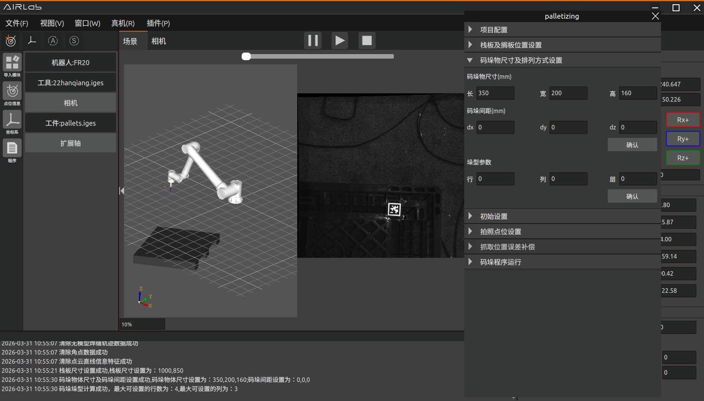

	码垛物尺寸设置

可以对垛型参数进行修改，设置大于最大的排列个数软件会进行错误提示，点击确认按钮确定垛型参数。

程序运行设置
~~~~~~~~~~~~~~~~~~
预设完垛型参数后对自动码垛运行进行设置，包括末端执行器设置、速度设置、拍照点位设置

1、末端执行器设置

选择末端执行器及绑定端口（暂时只支持气动夹爪），点击确定

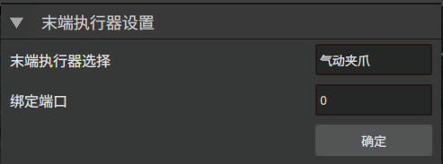

	末端执行器设置

2、速度设置

设置程序运行空移速度及抓取速度，其中

空移速度：用于设置码垛任务时，机器人过渡点之间及运行至预抓取点位过程中的速度。

抓取速度：从预抓取位置至抓取位置的速度

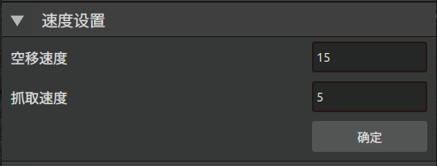

	运行速度设置

设置完成后点击确定按钮

3、拍照点位设置

需要绑定隔板拍照点位、码垛物体拍照点位及等待放置点位，其中：

- 隔板拍照点位：用于对隔板进行拍照识别。推荐设置在隔板左下角的上方，确保能够清晰拍摄到隔板左下角，以便识别。

- 码垛物体拍照点位：用于对码垛物体进行拍照识别。推荐设置在码垛物体抓取位置的上方，确保能够完整拍摄到待抓取的物体。

- 等待放置点位：作为抓取点位与放置点位之间的过渡点。推荐设置在抓取点位与放置点位的中间位置，且与放置点姿态、抓取点姿态的变化幅度不宜过大。

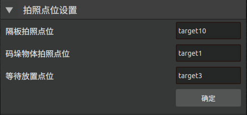

	拍照点位设置

设置完成后点击“确定”按钮。

码垛程序运行
~~~~~~~~~~~~~~~~~~
1.完成栈板识别、码垛垛型设置及运行设置后进行码垛程序运行

打开palletizing-码垛程序运行模块，点击“开始码垛”按钮

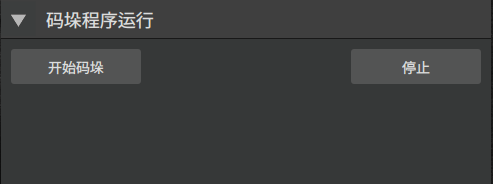

	码垛程序运行设置

程序将按照预设垛型自动运行。机器人会先运行至过渡点，再从过渡点移动至码垛物体拍照点进行拍照识别；识别成功后，三维场景中会生成机器人的抓取运行轨迹，机器人随即按轨迹完成抓取与放置。

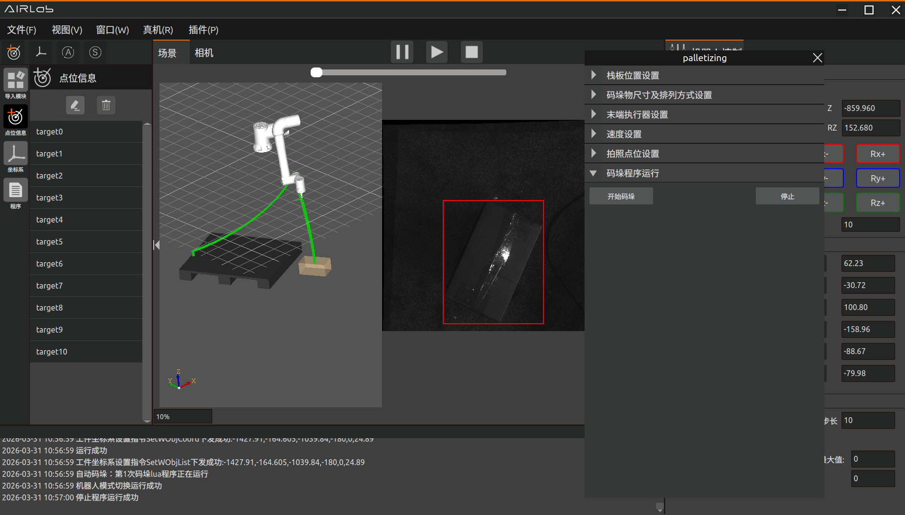

	生成码垛轨迹

完成一层码垛后，机器人会运行至隔板拍照点对隔板进行拍照识别，然后将隔板放置于该层码垛物体上方，并进入下一轮识别与码放，如此循环，直至按预设垛型完成全部码垛任务。

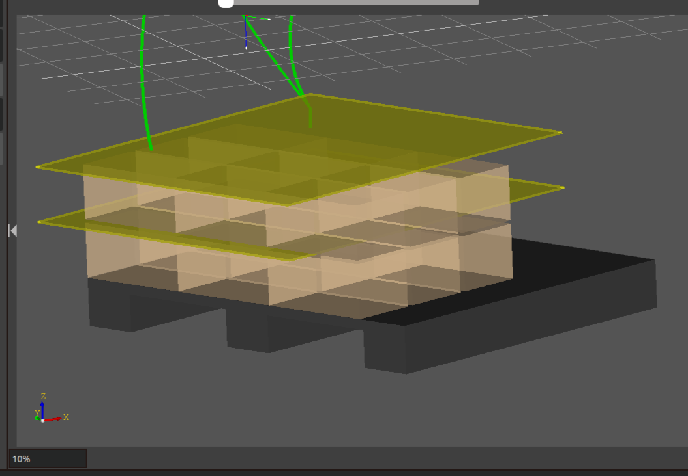

	码垛完成

2、点击“停止”按钮，即可终止当前正在执行的码垛任务。

AI智能助手
-------------------
AI智能助手插件模块实现了通过文本与AI大模型对话，实现部分焊接以及bin-picking的功能。

智能助手弹窗
~~~~~~~~~~~~~~~~~~~

点击菜单栏-插件-AI智能助手即可打开智能助手插件，其界面如下。

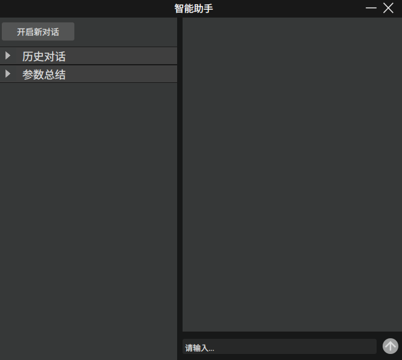

	AI智能助手界面

此UI界面主要分为两部分，右半区为交互内容区，提供对话输入框以及发送按钮，左半区为可操作区域，主要提供“开启新对话”按钮，以及“历史对话”和“参数总结”子区域，各部分介绍如下：

- 开启新对话按钮：实现新对话的开启，同时保存本次对话内容进入“历史对话”信息之中；

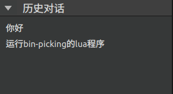

	AI智能助手-历史对话界面

- 历史对话界面：可以记录之前对话的内容，点击相应对话标题可以进行对话间的切换，保证历史消息不丢失，同时切换回原本的对话中可以继续之前的对话；
- 参数总结页面：在与AI大模型对话的过程中，如果涉及程序内部参数改动或是设置，在该页面下会对本次改动涉及的参数进行总结，方便进行查看参数的改动，如下图所示；

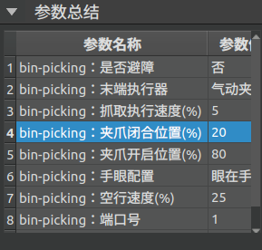

	AI智能助手-参数总结界面