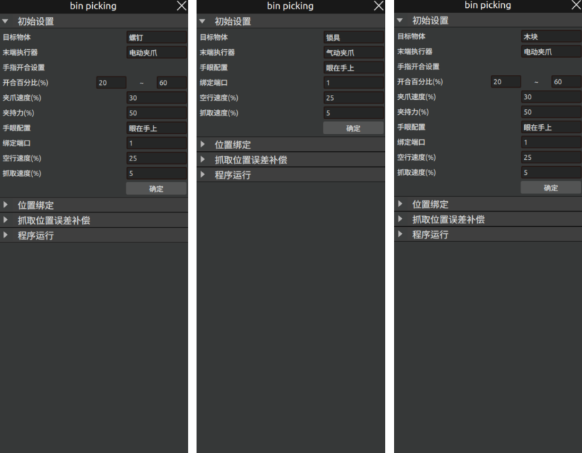
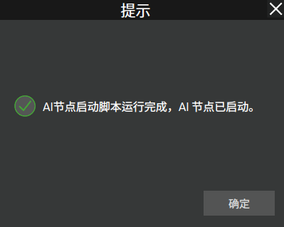
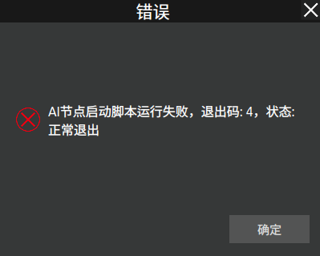
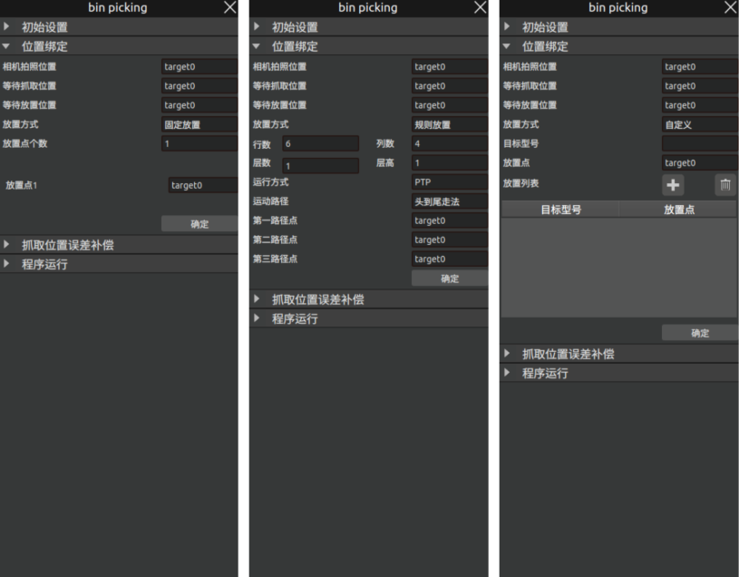

插件
=========

.. toctree:: 
    :maxdepth: 5

本章节主要介绍插件授权及各个插件的功能及具体操作过程。

插件授权
-------------------
点击插件-插件授权，可查看AIRLab唯一标识及各插件授权状态。

.. figure:: plug/ Plugin_License.png
	:align: center
	:width: 6in

	插件授权页面

若状态为“已授权”，则可正常打开插件使用；若为“未授权”，打开插件时将提示插件加载失败，如图所示。

.. figure:: plug/Load_Failed.png
	:align: center
	:width: 6in

	焊接插件加载失败

如需对插件进行授权，请联系售后获取授权文件（.bin格式）。随后在授权界面中选择该文件，点击“授权”进行升级。

.. figure:: plug/Authorizing.png
	:align: center
	:width: 6in

	正在授权中

等待进度条加载完成后页面显示“授权成功”提示。

.. figure:: plug/Auth_Successful.png
	:align: center
	:width: 6in

	授权成功

重新插拔加密狗并等待约30秒左右，插件授权状态更新即表示授权完成。
若授权过程中出现错误，授权流程将自动终止，并弹出如图所示的错误提示，此时，请联系售后人员进行处理。

.. figure:: plug/Auth_Failed.png
	:align: center
	:width: 6in

	授权失败

bin picking
-------------------
bin picking插件模块实现了自动抓取物体的功能。点击菜单栏插件-bin picking，主场景分为三维场景和二维显示场景并弹出bin picking弹窗。其中三维场景中显示机器人运动过程，二维显示场景中显示工件的RGB图像和识别出工件的bounding box。

创建bin picking工程
~~~~~~~~~~~~~~~~~~~

点击菜单栏-文件，选择文件类型为bin picking，点击“新建”之后导入需要的机器人、工具、工件或者直接打开bin picking工程文件；

.. figure:: plug/binpicking_new_project.png
	:align: center
	:width: 2.5in

	新建binpick工程文件

UI界面介绍
~~~~~~~~~~~~~~~~~~~
.. figure:: plug/binpicking_init_target_screw.png
	:align: center
	:width: 3in

	bin picking弹窗

导入bin picking工程，点击菜单栏插件-bin picking，弹出bin picking弹窗，如下图所示。bin picking弹窗分为四个部分：初始设置、位置绑定、抓取位置误差补偿及程序运行四个部分。整个界面使用流程如下：

1. 首先进行初始设置：

初始设置中的“目标物体”是本次的抓取对象，目前的插件提供三种物体进行选择，分别为“螺钉”“锁具”“木块”以及预留“自定义”种类供后续更新。进行目标物体种类的同时，后续参数也会发生变化。

同时对该界面其余所有的参数进行说明：

- 末端执行器：有两个选项“电动夹爪”和“气动夹爪”，根据实际使用夹爪的控制方式进行选择，若是通过配置协议的使用前者，反之若使用IO控制的则使用后者。

- 开合百分比：用于控制“电动夹爪”的关闭指令以及打开指令的的夹爪开合大小。

- 夹爪速度：用于控制“电动夹爪”的夹爪开合速度百分比。

- 夹持力：用于控制“电动夹爪”的夹爪加持力度百分比。

- 手眼配置：根据实际手眼情况进行配置，分为“眼在手上”和“眼在手外”。

- 绑定端口：根据“末端执行器”和控制器绑定的端口进行设置，与实际保持一致。

- 空行速度：用于设置抓取任务时，机器人过渡点之间运行时的速度。

- 抓取速度：用于设置抓取任务时，机器人即将抓取物体状态下(下一个目标点就是目标抓取点)的速度。

同时，以上选项都具备默认值，若进行目标物体种类切换，插件也会根据当前物体的预设进行变换，预设设置具体如下：

	初始设置

螺钉与木块默认使用电动夹爪，锁具则是气动夹爪。全部设置好之后点击“确定”，相应的会开始启动对应目标的“AI节点”，需要等待些许时间，若启动节点成功，则会显示如下弹窗，反之也有失败弹窗。

	AI节点启动成功

	AI节点启动失败

指令反馈区显示“初始设置成功”则表示初始设置完成。

2. 之后进行位置绑定

该子页面主要用于进行后续放置任务的点位绑定，具体设置及其参数介绍如下：

- 相机拍照位置：设置目标点为机器人的拍照点。

- 等待抓取位置：设置目标点为抓取前所去的示教点。

- 等待放置位置：设置目标点为放置点前的过渡示教点。

- 放置方式：该选项主要有三个选项，分别为固定放置、规则放置和自定义放置模式。

- 固定放置模式：通过设置固定放置点个数，可以控制抓取流程按照顺序依次摆放至所设置的固定放置点。

- 规则放置模式：可以根据需要设置行数、列数、层数和层高等放置规则。

- 自定义放置模式：可以通过设置识别的目标种类及其对应该种类的放置点，之后软件会根据识别的实际目标型号将识别的物体放在所设置的放置点。

具体的各种模式的子界面显示如下：

	位置绑定

若之前选的目标物体是“锁具”，由于对于该种类的特殊放置规则（二次抓取）则原先的“相机拍照位置”“等待抓取位置”“等待放置位置”会相应变成“第一次拍照点位”“第二次拍照点位”“二次抓取放置点位”，具体含义如下：

- 第一次拍照点位：设置目标点为初次抓取阶段的拍照点。

- 第二次拍照点位：设置目标点为重抓取阶段的拍照点。

- 二次抓取放置点位：设置目标点为重抓取阶段的放置点。

其界面显示如下：

.. figure:: plug/binpicking_bind_fix.png
	:align: center
	:width: 3in

	位置绑定-二次抓取

3. 抓取位置误差补偿

抓取位置误差补偿是为了消除抓取过程中的系统误差而设置的误差补偿，抓取时如果误差较大可以设置误差补偿系数（基于工具坐标系），设置完系数后点击“确定”。指令反馈区显示设置误差补偿系数成功即成功设置误差补偿系数。

.. figure:: plug/binpicking_grasp_comp.png
	:align: center
	:width: 3in

	抓取误差补偿
	
4. 程序运行

初始设置和位置绑定成功后即可进行程序运行，有手动和自动两种运行模式。

- 手动运行：选择手动运行，机器人进行一次自动抓取；

.. figure:: plug/binpicking_run_manual.png
	:align: center
	:width: 3in

	手动运行模式

先点击拍摄照片，拍摄待抓取物体的照片；拍摄成功后，终端会显示“拍摄照片成功”提示，2D场景显示真实工件的RGB图。

之后点击AI计算，AI识别待抓取物体的位置，2D场景显示工件的bounding box；	

等待计算完成之后点击运行lua，机器人进行一次识别抓取运动；

若目标种类为“锁具”，则手动界面会多出三个按钮，分别为“初次抓取”“位姿调整”“重抓取”，分别对应其二次抓取中三个阶段的“AI计算”过程，即可以手动进行各个阶段的操作，界面如下：

.. figure:: plug/binpicking_run_manual_lock.png
	:align: center
	:width: 3in

	手动运行模式-锁具

- 自动运行：自动运行包括运行，停止及重置；

运行：点击“运行”按钮，机器人开始自动进行拍照识别、抓取操作；

停止：点击“停止”按钮，自动抓取停止运动；

重置：点击“重置”按钮，抓取计数器置为0，再次运行则从开始进行抓取，放置在第一个放置位置上，若目标种类为螺钉，则会先执行倒盘动作。

.. figure:: plug/binpicking_run_auto.png
	:align: center
	:width: 3in

	自动运行模式

整体操作过程
~~~~~~~~~~~~~~~~~~~
Step1：相机标定
   
在进行抓取操作之前需要先进行相机标定，根据实际情况选择眼在手上或眼在手外。

Step2：点位示教

1. 二次抓取示教点位：
   
.. figure:: plug/9.png
	:align: center
	:width: 4in

	二次抓取位置绑定

- 第一次拍照点位：以可以完整拍出抓取物体为原则，在抓取物体正上方示教第一次拍照点位；

- 第二次拍照点位：在中间放置点位正上方示教第二次拍照点位；

- 二次抓取放置点位：示教物体调整位姿时放置的位置；	

2. 非二次抓取示教点位：
   
.. figure:: plug/10.png
	:align: center
	:width: 4in

	非二次抓取位置绑定

- 等待抓取位置：抓取点附近位置；

- 等待放置位置：放置位置附近点位（推荐放置位置正上方点位）；

3. 固定放置示教点位：

.. figure:: plug/11.png
	:align: center
	:width: 4in

	固定放置位置绑定

- 选择固定放置放置点个数，有几个放置点则需要示教几个放置点位；

4. 规则放置示教点位

.. figure:: plug/12.png
	:align: center
	:width: 4in

	固定放置位置绑定

- 等一路径点、第二路径点和第三路径点决定了规制放置的放置矩阵；第一路径点和第二路径点决定了放置矩阵的行，第二路径点和第三路径点决定了放置矩阵的列。
   
5. 自定义示教点位

.. figure:: plug/binpicking_bind_custom.png
	:align: center
	:width: 3in

	自定义放置位置绑定

- 与固定放置类似，先确定本次目-标任务的目标种类，依次添加对应的放置点，若同一目标需要有多个放置点，更改放置点，保持目标型号不变继续添加即可。   

.. figure:: plug/binpicking_bind_custum_add2.png
	:align: center
	:width: 3in

	自定义放置位置绑定-结果

Step3：运行AIRLab软件

一键启动AIRLab软件（确保机械臂已连接，视觉、AI等节点成功启动），打开bin picking插件，先进行初始设置，初始设置成功后进行位置绑定，之后进行自动运行。	