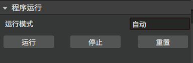

插件
=========

.. toctree:: 
    :maxdepth: 5

本章节主要介绍各个插件的功能及具体操作过程。

bin picking
-------------------
bin picking插件模块实现了自动抓取物体的功能。点击菜单栏插件-bin picking，主场景分为三维场景和二维显示场景并弹出bin picking弹窗。其中三维场景中显示机器人运动过程，二维显示场景中显示工件的RGB图像和识别出工件的bounding box。

创建bin picking工程
~~~~~~~~~~~~~~~~~~~

点击菜单栏-文件，选择文件类型为bin picking，点击“新建”或者打开bin picking工程文件；之后导入需要的工具工件。

.. centered:: 图5-1 新建binpick工程文件

UI界面介绍
~~~~~~~~~~~~~~~~~~~
导入bin picking工程，点击菜单栏插件-bin picking，弹出bin picking弹窗，如图5-2所示。bin picking弹窗分为四个部分：抓取姿态采样、位置绑定、抓取位置误差补偿及程序运行四个部分。

.. figure:: plug/2.png
	:align: center
	:width: 3in

.. centered:: 图5-2  bin picking弹窗

1. 首先进行抓取姿态采样：

选择工件名称、采样点数量、偏移量等参数，点击生成抓取姿态对所选工件和当前工具的抓取姿态进行采样，采样成功后，终端会显示“生成抓取姿态成功”，即表示抓取姿态采样成功；否则终端显示“生成抓取姿态失败”并显示错误信息。

.. figure:: plug/3.png
	:align: center
	:width: 3in

.. centered:: 图5-3  抓取姿态采样

2. 之后进行位置绑定

首先需要标定和绑定等待抓取位置和等待放置位置；选择放置方式，可选固定放置或规则放置；

固定放置：表示物体放置的位置为同一个位置；

.. centered:: 图5-4  固定放置

规则放置：用户可以根据需要设置行数、列数、层数和层高等放置规则；设置完之后点击确定绑定位置；终端显示位置绑定成功则成功绑定。

.. figure:: plug/5.png
	:align: center
	:width: 3in

.. centered:: 图5-5  规则放置

3. 抓取位置误差补偿

暂未开放。

4. 程序运行

生成抓取姿态成功和位置绑定成功后即可进行程序运行，有手动和自动两种运行模式。

手动运行：选择手动运行，机器人进行一次自动抓取；

.. figure:: plug/6.png
	:align: center
	:width: 3in

.. centered:: 图5-6  手动运行模式

先点击拍摄照片，拍摄待抓取物体的照片；拍摄成功后，终端会显示“拍摄照片成功”提示，2D场景显示真实工件的RGB图。

之后点击AI计算，AI识别待抓取物体的位置，2D场景显示工件的bounding box；	

等待计算完成之后点击运行lua，机器人进行一次识别抓取运动；

自动运行：选择自动运行，机器人则自动进行拍照，识别，抓取操作，直至待抓取物体全部被抓取；点击停止，则停止自动抓取运动。

.. figure:: plug/7.png
	:align: center
	:width: 4in

.. centered:: 图5-7  自动运行模式

整体操作过程
~~~~~~~~~~~~~~~~~~~
1. 相机标定

bin picking循环码垛采用的是眼在手外拍照方式，在进行抓取操作之前需要先进行相机标定。

2. 点位示教
   
如果选择放置方式为固定放置，则需要示教5个点位，分别为等待抓取位置、等待放置位置、放置位置、过度点1、过渡点2。

- 等待抓取位置：抓取点附近位置；

- 等待放置位置：放置位置附近点位（推荐放置位置正上方点位）；

- 放置位置：需要将待抓取物体放置的位置。
 
- 过渡点：为防止抓取时碰撞，设置过渡点，从抓取点PTP到过渡点1再PTP到过渡点2。

选择放置方式为规则放置，则需要示教等待抓取位置、等待放置位置、第一路径点、第二路径点以及第三路径点。

- 等待抓取位置：抓取点附近位置；

- 等待放置位置：放置位置附近点位（推荐放置位置正上方点位）；

- 等一路径点、第二路径点和第三路径点决定了规制放置的放置矩阵；第一路径点和第二路径点决定了放置矩阵的行，第二路径点和第三路径点决定了放置矩阵的列。

3. 启动AI节点

在binpicking_for_block路径下打开终端，运行server_start.sh，在新打开的终端中显示Avoid_BP_Server is ready即表示AI节点成功启动。

.. centered:: 图5-8  启动AI节点

4. 运行AIRLab软件

一键启动AIRLab软件（确保机械臂已连接，视觉节点成功启动），打开bin picking插件，先进行抓取姿态采样，采样成功后进行位置绑定，之后进行程序运行。
	

喷涂
-------------------
该插件模块是针对喷涂任务开发的功能模块。

UI界面介绍
~~~~~~~~~~~~~~~~~~~
点击菜单栏插件-喷涂，弹出喷涂弹窗。喷涂弹窗主要分为三个部分，喷涂参数设置、仿真设置和程序运行。

.. figure:: plug/9.png
	:align: center
	:width: 6in

.. centered:: 图5-9 喷涂插件弹窗

喷涂参数设置主要作用是选择喷涂模型和设置喷涂参数，包括喷涂方向、法向计算半径、椭圆长半轴、椭圆短半轴等。设置完成后，点击初始化AI，点击AI计算，会自动计算出喷涂轨迹。

.. figure:: plug/10.png
	:align: center
	:width: 3in

.. centered:: 图5-10 喷涂参数设置

仿真设置主要是对喷涂轨迹进行仿真，先点击轨迹生成，三维场景中生成仿真轨迹。生成的仿真轨迹正确，设置仿真速度，点击运行按钮则可以看到仿真效果。点击停止按钮停止仿真。

.. centered:: 图5-11 仿真设置

程序运行部分主要是对喷涂程序进行轨迹保存、轨迹传输、轨迹加载等。

.. figure:: plug/12.png
	:align: center
	:width: 3in

.. centered:: 图5-12 程序运行

- 保存轨迹文件：点击“保存轨迹文件”按钮可以将喷涂轨迹保存到本地。
  
- 轨迹传输：将本地保存的轨迹传输到控制器。
  
- 轨迹加载：从控制器中加载之前喷涂轨迹。
  
- 轨迹运行：点击“轨迹运行”，运行当前轨迹。
  
- 停止运行：点击“停止运行”，停止当前运行的轨迹。

仿真过程
~~~~~~~~~~~~~~~~~~~

喷涂完整仿真过程如下：

Step1：导入喷涂模型；在喷涂界面喷涂参数设置部分选择导入喷涂模型。

Step2：设置喷涂参数。

Step3：根据实际喷涂作业设置完喷涂参数后，点击初始化AI对AI节点进行初始化操作，之后点击AI计算计算喷涂轨迹。

Step4：喷涂界面仿真设置UI界面点击“轨迹生成”，观察喷涂轨迹生成无误后就可以运行仿真。

.. figure:: plug/13.png
	:align: center
	:width: 6in

.. centered:: 图5-13 喷涂仿真轨迹

对于已经计算过喷涂轨迹并将轨迹传输到控制器的工件，在下一次喷涂作业使不需要再次进行AI计算，直接进行轨迹加载再进行仿真即可。

对话式AI助手
-------------------
为提供更好的用户体验和提高用户效率，AIRLab软件开发对话式智能助手插件。通过对话式AI助手，用户可以与软件进行自然语言交互，下发需要的操作，机器人根据用户的输入进行相应的操作。点击菜单栏插件-对话式智能助手弹出智能助手弹窗。

.. figure:: plug/14.png
	:align: center
	:width: 6in

.. centered:: 图5-14 对话式智能助手弹窗

在输入框输入问题或操作，点击发送，等待AI助手的回复或做出相应的操作。AI助手的主要功能有可以帮助用户导入/导出工程文件、绑定焊接工艺、新增工程树节点等。

.. figure:: plug/15.png
	:align: center
	:width: 3in

.. centered:: 图5-15 AI助手功能

以导入一个工程为例：

用户发送“请帮我导入工程ZH-401-yyh.json”，AI助手回复确认信息，用户判断信息无误后回复“是”，AI助手执行相应的操作，导入ZH-401-yyh.json工程文件。

.. figure:: plug/16.png
	:align: center
	:width: 6in

.. centered:: 图5-16 导入工程