快速开始
=============

.. toctree:: 
    :maxdepth: 5

如下图所示，接下来将以红色线条作为需焊接区域为例，介绍离线焊接软件使用。

.. figure:: quick_start/001.png
	:align: center
	:width: 6in

.. centered:: 图表 2-1 H型工件焊接区域

设备安装
-------------------

如下图所示，将相机和焊枪通过连接件安装在机器人末端。

.. figure:: quick_start/002.png
	:align: center
	:width: 6in

.. centered:: 图表 2-2 安装相机和焊枪

.. important:: 
    - 	请确保安装牢固，否则会影响精度。
    - 	拖动机器人时请拖动红色矩形框区域或机器人本体，请勿拖动焊枪。

工具坐标系标定
-------------------

打开浏览器访问目标网址 192.168.58.2，输入用户名和密码点击登录即可登录FR示教器软件。在“初始设置”中的“机器人设置”的菜单栏下，点击“工具坐标”进入工具坐标界面。工具坐标可实现工具坐标的修改、清空与应用。工具坐标系的下拉列表中共有 15 个编号，选择对应的坐标系（坐标系名称可自定义）后会在下方显示对应坐标值，工具类型以及安装位置（仅在传感器类型工具下显示），选择某一坐标系后点击“应用”按钮，当前使用的工具坐标系变为所选择的坐标，如下图所示。

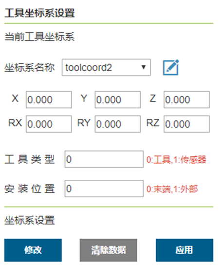

.. centered:: 图表 2-3 设置工具坐标

点击“修改”可根据提示对该编号的工具坐标系进行重新设置。如图2-4所示，工具标定方法分为四点法和六点法，四点法只标定工具 TCP，即工具中心点的位置，其姿态默认与末端姿态一致，六点法则在四点法的基础上增加了两点，用于标定工具的姿态，这里以六点法为例进行讲解。

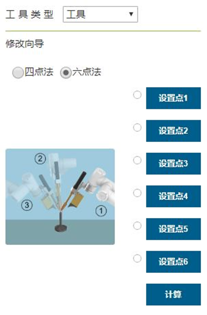

.. centered:: 图表 2-4 四点法和六点法

在机器人空间选择一个固定的点，将工具以三个不同的姿态移至固定点，依次设置 1-3 点。如图 2-5左上方所示。将工具垂直移至固定点设置点 4，如图 2-5 右上方所示。保持该姿态不变，利用基坐标移动，在水平方向移动一段距离，设定点 5，该方向即设定的工具坐标系 X 轴正方向。回到固定点，垂直往上移动一段距离，设定点 6，该方向即工具坐标系 Z 轴正方向，工具坐标系 Y 正方向则通过右手定则确定。点击计算按钮计算工具位姿，若需重新设置，点击取消按修改钮重新进行新建工具坐标系步骤。

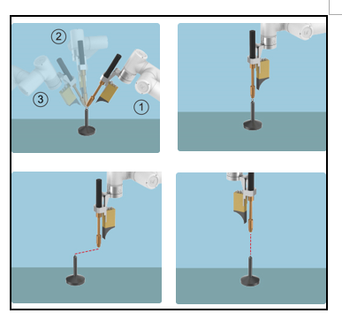

.. centered:: 图表 2-5 六点法标定工具坐标系

完成最后步骤后，点击“完成”可返回工具坐标界面，点击“保存”即可存储刚才建立的工具坐标系。

点云相机手眼标定
-------------------

打开终端输入以下命令：

1. cd ros2_ws
   
2. source install/setup.bash
   
2- ros2 run frhand_eye get_HE_data

运行标定拍照程序对标定球阵列拍摄多组点云数据。这一步中需要控制机器人以八个不同的位姿拍摄八组不同角度的标定球阵列点云数据，其中前四次拍摄通过离线编程软件的机器人控制模块，点击笛卡尔空间运动中的平移按钮使机器人平移运动。每次运动完需确保相机能完整拍摄到标定球阵列范围，终端输入回车键完成一次拍摄。后四次拍摄则需要手动拖动机器人以不同的位姿（位置和姿态都不同）来拍摄标定球阵列，同样每次拖动完确保相机能完整拍摄到标定球阵列范围，终端输入回车键完成一次拍摄。至此完成了八组标定数据的获取，在程序目录下生成了cam.txt和tcp.txt两个文件，分别存储了每次拍摄到的标定球阵列点云数据的五个球心坐标和机器人末端法兰盘笛卡尔空间位姿数据。
获取完数据后关闭拍照程序，终端输入以下命令运行手眼标定矩阵计算程序：

1. ros2 run frhand_eye HE_calculation
   
这一步只需运行对应程序，程序自动读取之前的八组标定数据txt文件，计算出手眼标定矩阵并打印在终端中。
获得的手眼标定矩阵需要放入frvision_remote_service功能包中的ConnectCloud.cpp源文件中的第292行处，如图2-6所示。

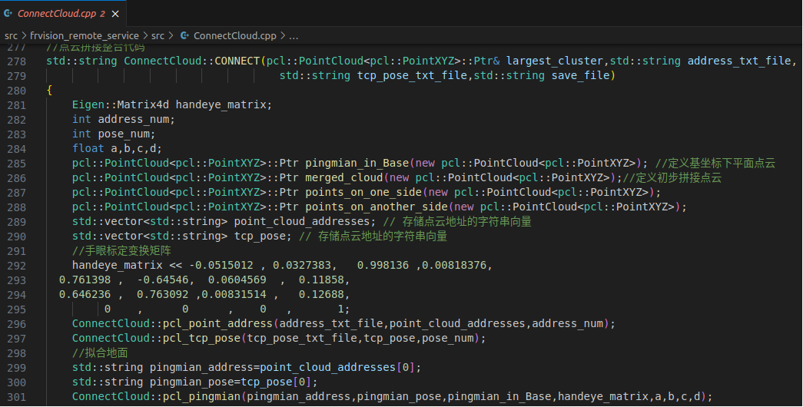

.. centered:: 图表 2-6 修改视觉功能包中的手眼标定矩阵

保存程序后，打开终端，重新编译视觉包

1. cd ros2_ws

2. colcon build --packages-select frvision_remote_service 

一键启动
-------------------

在Ubuntu下打开命令行，输入：

1. ./fr_weld.sh 

如图2-7所示，法奥ROS2主程序、视觉模块、离线编程软件一键启动。

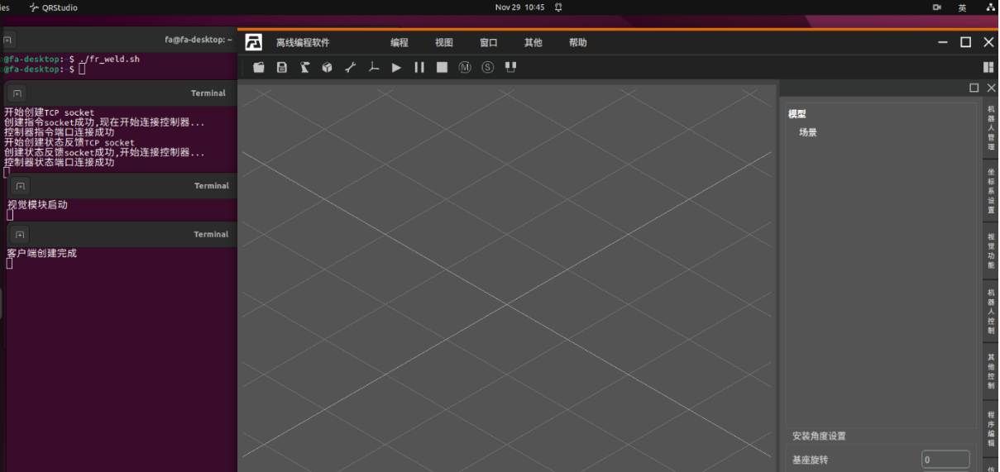

.. centered:: 图表 2-7 一键启动

导入模型
-------------------

导入机器人模型
~~~~~~~~~~~~~~~~~~~

如图2-8所示，点击红色矩形框导入机器人，选择当前的机器人型号后，点击确定即可导入机器人。

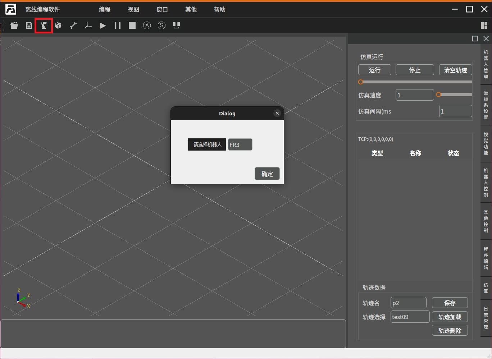

.. centered:: 图表 2-8 导入机器人

设置安装角度和DH补偿参数
~~~~~~~~~~~~~~~~~~~~~~~~~~~~~~~

如需设置机器人安装角度，请打开操作区-机器人管理，在界面最下方设置安装角度。如图2-9所示，修改旋转或倾斜角度以设置机器人安装角度。点击获取DH补偿按键获取当前机器人DH补偿参数并同步至离线编程软件。

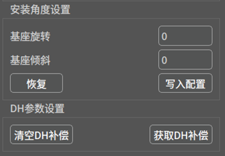

.. centered:: 图表 2-9 设置安装角度和获取DH补偿参数

导入工具模型
~~~~~~~~~~~~~~~~~~~

如图2-10所示，点击红色矩形框导入工具模型，选择需导入的工具模型后，点击open导入工具模型。

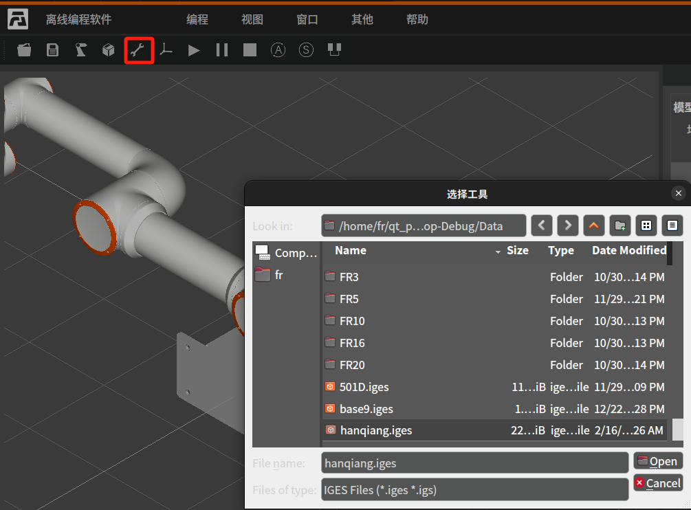

.. centered:: 图表 2-10 导入工具模型

导入工件模型
~~~~~~~~~~~~~~~~~~~

如图2-11所示，点击红色矩形框导入工件模型，选择需导入的工件模型后，点击确定导入工件模型。

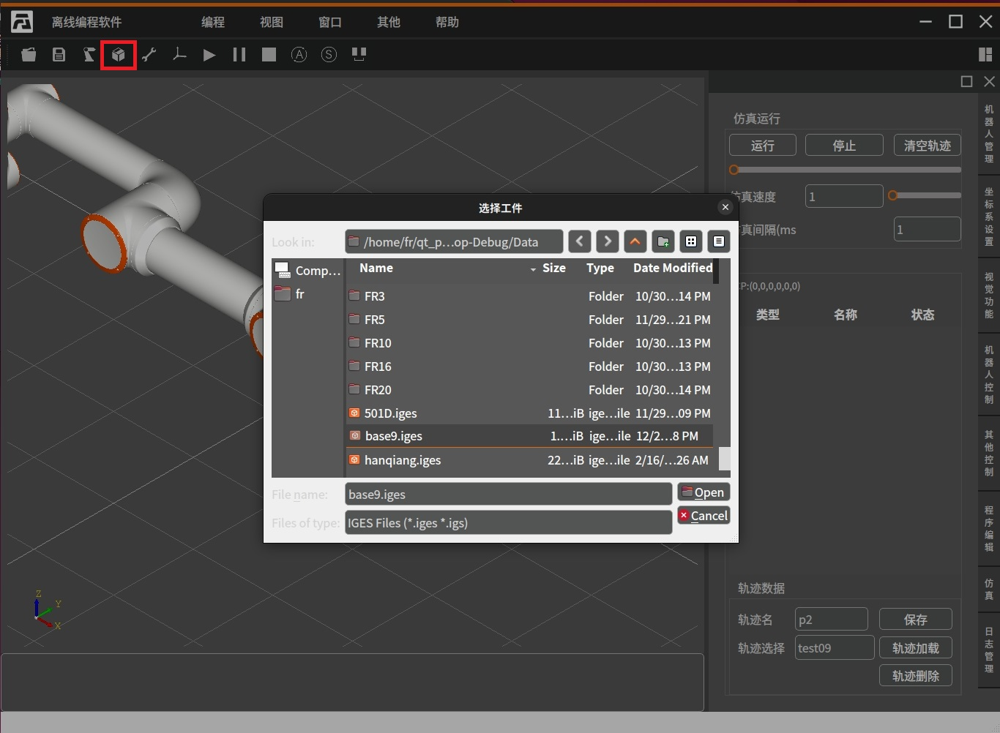

.. centered:: 图表 2-11 导入工件模型

视觉模块
-------------------

拍摄照片
~~~~~~~~~~~~~~~~~~~

开始这一步前请将机器人工件坐标系编号设为0。如图2-12所示，将机器人移动至合适位置。

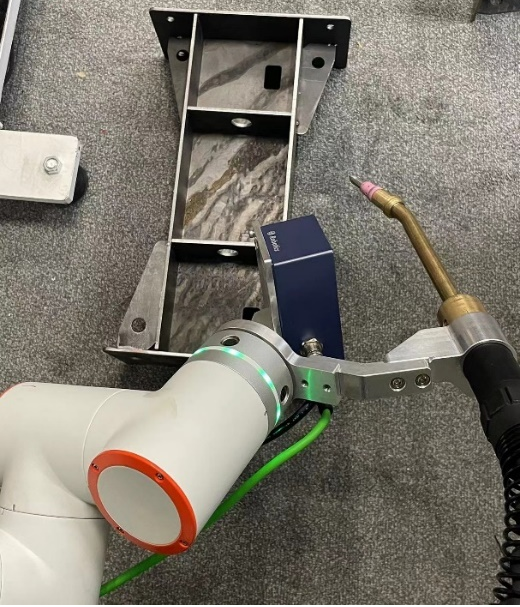

.. centered:: 图表 2-12 拍摄照片位置示意图

.. important:: 
    - 	第一张照片为无工件的工作台，拍摄完成后再放置工件。
    - 	相机距离工件60-90mm最佳，共需拍摄七张以上不同姿态的照片

如图2-13所示，打开操作区-视觉功能。点击清空照片，清空已存储照片。点击全局相机拍摄按钮拍摄当前照片（拍照时间约10s左右，拍照成功或失败会在指令反馈区提示）。重复上述操作直至所有照片拍摄完成。

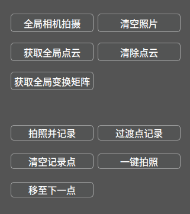

.. centered:: 图表 2-13 拍摄照片

一键拍照
~~~~~~~~~~~~~~~~~~~

该功能适用于多个相同工件的照片拍摄，且每次拍照工件姿态变换不大。
点击清空记录点，清空当前存储的记录点位。点击清空照片，清空已存储照片。第一张照片无工件的工作台，需点击全局相机拍摄来进行拍照。拍摄完成后，将工件放置于工作台。先将机器人移动至合适姿态，如2-6.1所述移动机器人至合适位置，点击拍照并记录点位按钮。移动至下一拍照点前，如机器人姿态变换较大请插入适当过渡点。如需插入过渡点，则将机器人移动至过渡点，点击过渡点记录按钮，记录过渡点位。重复上述操作直至所有照片拍摄完成。到此您已完成一键拍照功能的点位记录工作以及初次拍照。
使用一键拍照功能前，点击清空照片，清空已存储照片。第一张照片无工件的工作台，需点击全局相机拍摄来进行拍照。拍摄完成后，将工件放置于工作台。先将机器人移动至合适姿态，如图2-14所示，点击一键拍照功能，软件会控制机器人自动移动至记录位置，并拍摄照片，拍摄完成后移动至过渡点或一下拍照点位进行拍照，直至所有照片拍摄完成。

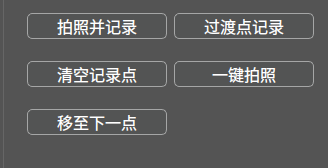

.. centered:: 图表 2-14 一键拍照

半自动拍摄：点击清空照片，清空已存储照片。第一张照片无工件的工作台，需点击全局相机拍摄来进行拍照。拍摄完成后，将工件放置于工作台。先将机器人移动至合适姿态，点击移至下一点，会移动到下一个拍照点或过渡点，指令反馈区会提示当前点位是否为拍照点，如果是拍照点，点击全局相机拍摄，重复上述操作直至所有照片拍摄完成。

获取工件点云和变换矩阵
~~~~~~~~~~~~~~~~~~~~~~~~~~~~~~

拍摄完成后，点击操作区-视觉功能-获取全局点云和获取全局变换矩阵，如图2-15所示，三维场景中会根据已拍摄的照片生成工件的点云模型，并将获取工件的变换矩阵。（点击清除点云数据，可清除点云数据）

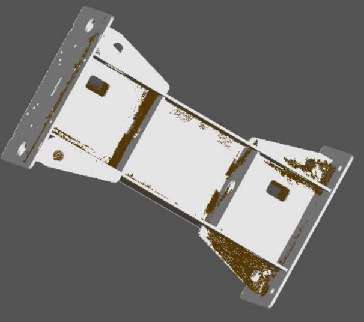

.. centered:: 图表 2-15 获取工件点云和变换矩阵

坐标系设置
-------------------

开始这一步前请将机器人工具坐标系设置为焊枪的工具坐标系。

如图2-16所示，打开操作区坐标系设置，点击获取当前工具坐标系，获取当前焊枪的工具坐标系。点击设置机器人工件坐标系按钮，将获取的工件的旋转矩阵下发至机器人工件坐标系。并设置坐标系编号，工具坐标系编号为当前工具坐标系编号，工件坐标系编号。

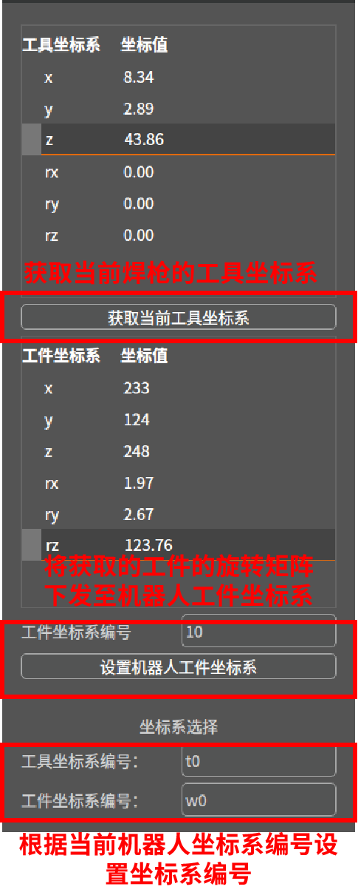

.. centered:: 图表 2-16 坐标系设置

点位选取
-------------------

如图2-17所示，移动实际机器人至合适初始位置，点击操作区-机器人控制-同步位姿，可以同步当前机器人位置。同步位置后，输入起点点位名称，保存该点位。同理保存终点点位。

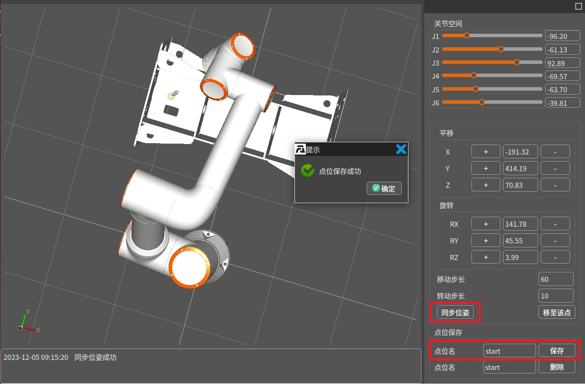

.. centered:: 图表 2-17 保存初始位置

如图2-18所示，操作区-程序编辑，点击图中红色圆圈所在位置，拾取该点位。拾取后，点击生成虚拟位姿生成虚拟位姿，观察虚拟位姿是否合适，修改rx,ry,rz值以调整虚拟位姿至合适位姿（如需更新调整后的虚拟位姿需再次点击生成虚拟位姿）。输入点位名称后保存该点位，保存完成后点击清除虚拟位姿。

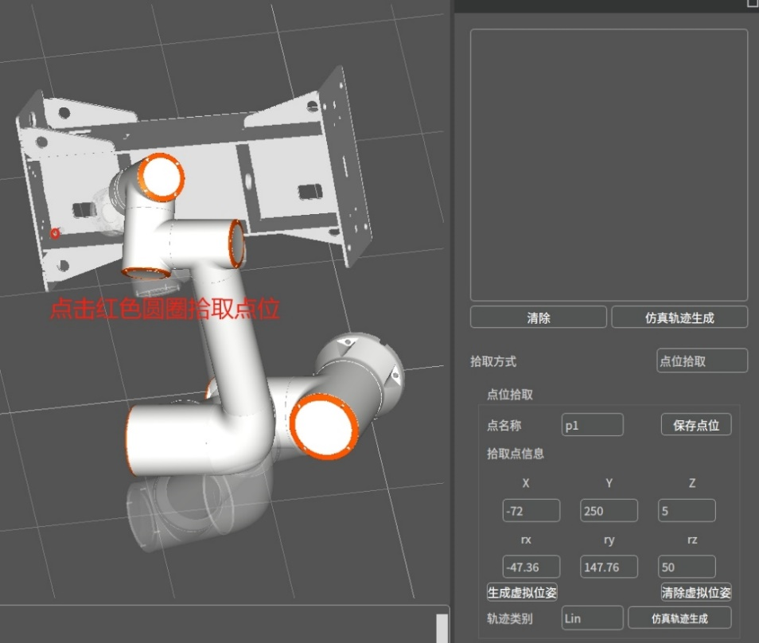

.. centered:: 图表 2-18 保存点位

如图2-19所示，保存剩余两个点位。

.. centered:: 图表 2-19 保存其他点位

程序编辑
-------------------

如图2-20所示，打开操作区-程序编辑-nodegraph程序编辑器，进行程序编辑。右击空白区域添加所需要的组件。通过下拉框选取或输入对应参数后，左击长按每一个组件末端的绿点连接至第二个组件的开头，重复上述操作直至完成所有连接。

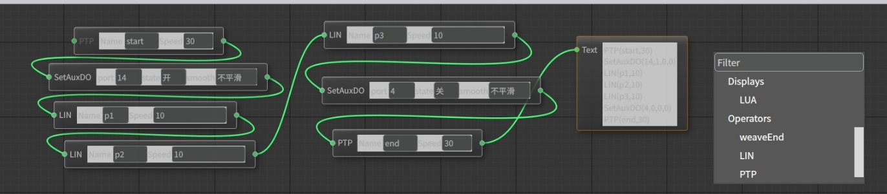

.. centered:: 图表 2-20 节点编辑

.. important:: 
    - 	在焊接线条开始前打开焊枪对应端口，焊接结束后关闭对应端口。
    - 	最后一个节点必须为Text。

如图2-21所示，点击仿真轨迹生成，生成仿真轨迹。

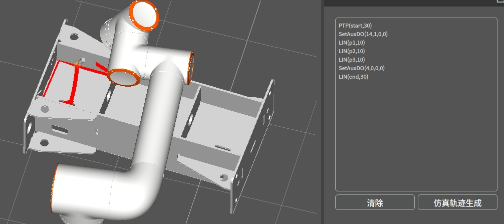

.. centered:: 图表 2-21 仿真轨迹生成

仿真和运行
-------------------

如图2-22所示打开操作区-仿真,点击运行，进行仿真运行，观察仿真运行是否符合要求。如符合要求，清空轨迹后，切换机器人模式为自动模式，点击开始运行，即可运行焊接程序。

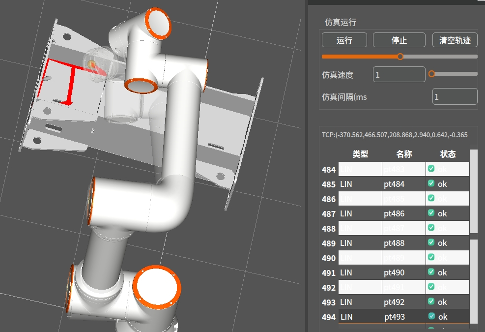

.. centered:: 图表 2-22 仿真运行

