快速开始
=============

.. toctree:: 
    :maxdepth: 5

本章节将以一个实际焊接工程为例介绍如何控制机器人快速开始焊接工作（需要先获取焊接插件授权），图2-1，图2-2为焊接准备，其中图2-1为待焊接工件，图2-2为机器人和工件。

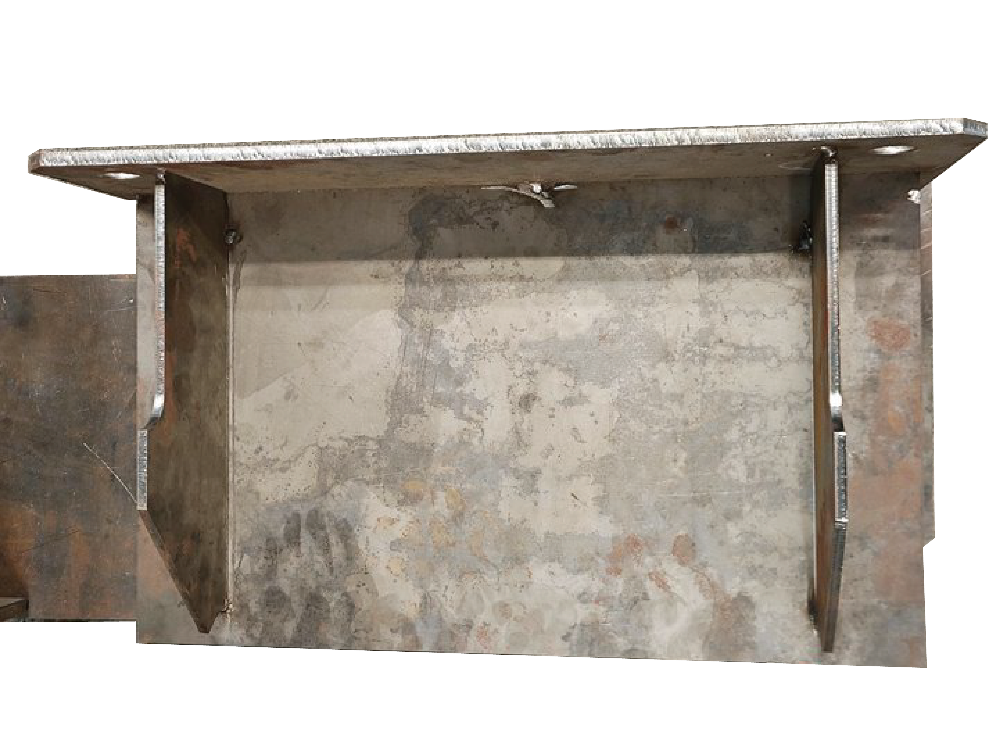
	
	待焊接工件

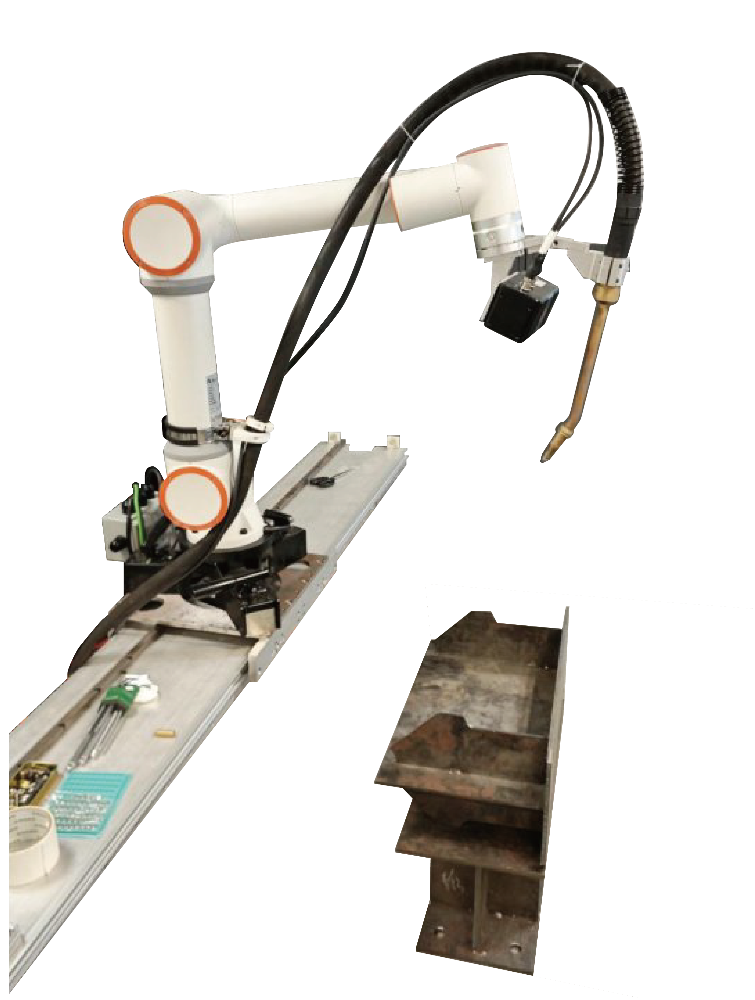

	机器人+工件

3D机械振镜相机产品说明
--------------------------
高精度3D相机采用光栅结构光进行扫描，根据双目图像恢复算法重建出物体的真实三维点云数据。满足工业级高分辨率、亚毫米测量的三维视觉应用需求。该设备体积小、景深大测量精度高等特点。可应用于工业自动化、机器人、三维物体重建等场景。

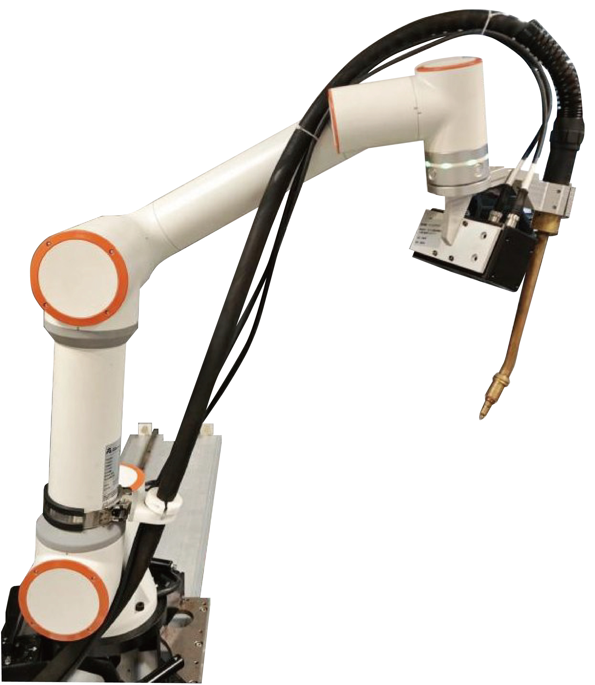

	标准版本

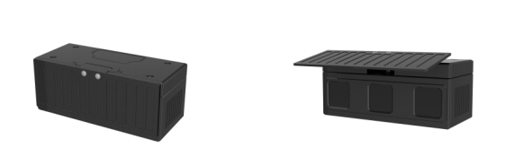

	配备保护罩版本

此款相机可搭配各型主流焊接机器人，引导焊接机器人进行焊接作业，实现复杂焊缝特征提取、轨迹寻位、工件找正定位等功能。成像算法，最高可实现0.2mm的Z向重复精度；采用双目结构光技术，亚毫米级精度图像采集；

该相机具有以下特点：

- 支持多帧融合，解决金属零件表面反光问题；

- 高效投影模块配合精准曝光，性能更稳定；

- 系统抗噪性能强，较暗工件也可输出清晰点云；

- 非接触式测量，不损伤被测物体表面；

- 出厂时就进行优化方案的预设定，无需要用户自行标定；

- 紧凑的铝合金全封闭外壳设计，在工业生产中，提供了长效、可靠的保障，预留多孔位安装，让相机的部署更加方便快捷；

该产品是适用于 350mm~1100mm 距离物体识别的智能相机。该产品不仅体积小，重量轻，机身强度高，而且成像速度快，精度高，特别适用于高温环境工作，具有抗高温的特点，前置有防溅盖板能够有效起到防火花溅射，无示教焊接轨迹生成的功能。

系統要求
~~~~~~~~~~~~~~~~~~~
- Windows 10.0 或以上 / Ubuntu 18.04 或以上；

- 主频 1.8GHz 或以上；
  
- 建议 8GB RAM 或以上。

产品参数
~~~~~~~~~~~~~~~~~~~
.. centered:: 表2-1 产品参数表
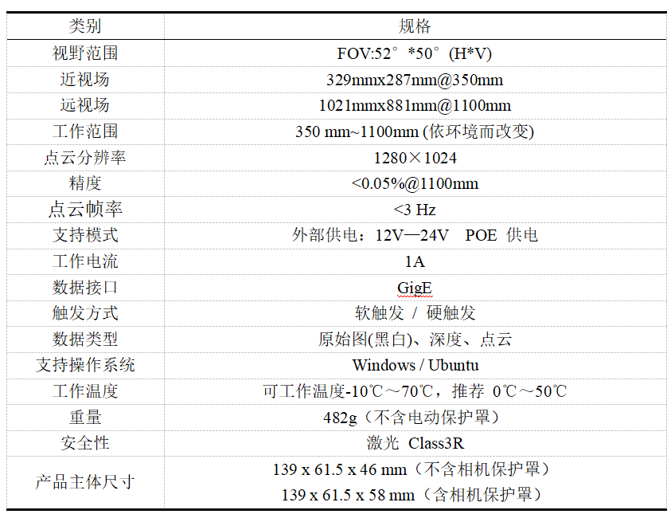

视场测量范围
~~~~~~~~~~~~~~~~~~~
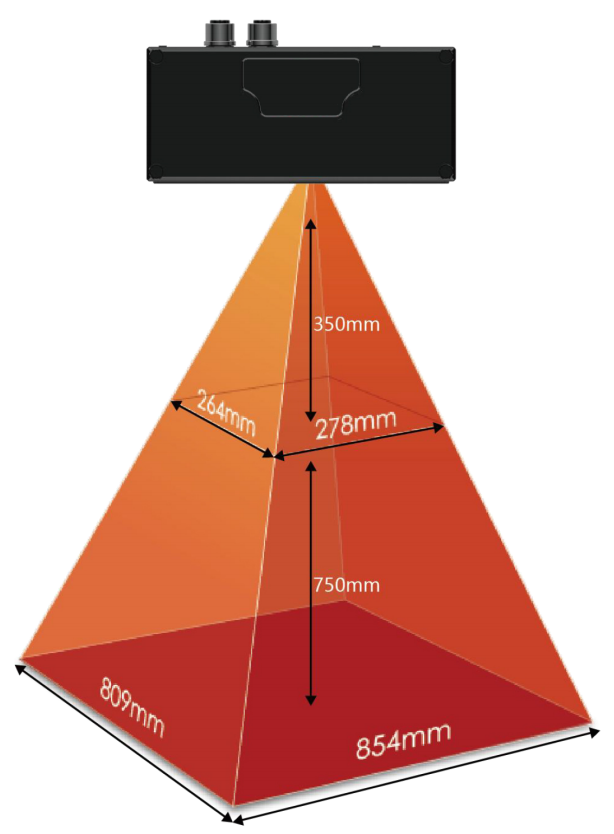

	视场测量范围

结构图纸
~~~~~~~~~~~~~~~~~~~
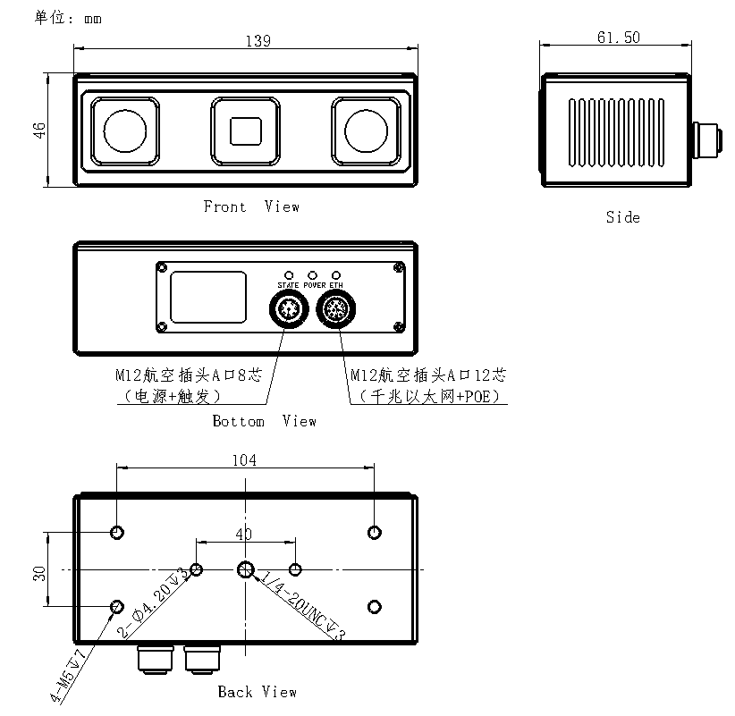

	标准版本结构尺寸图

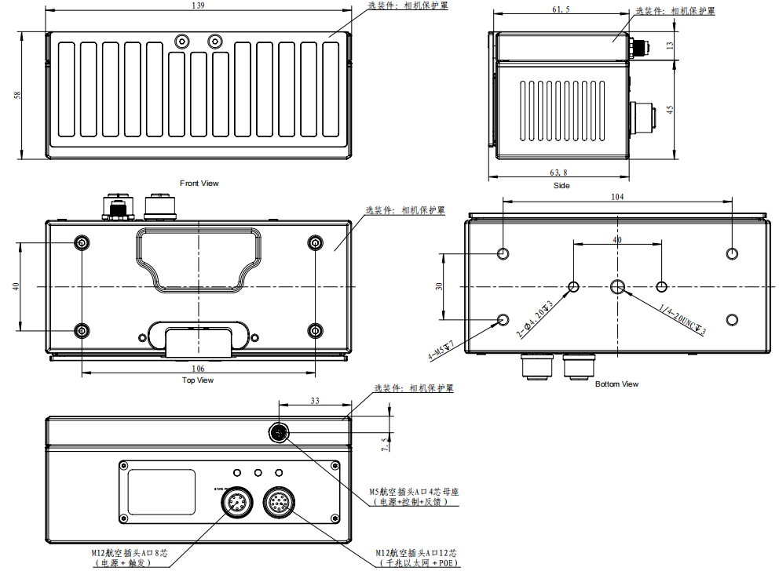

	配备保护罩版本结构尺寸图

结构图纸
~~~~~~~~~~~~~~~~~~~
相机电源接口

.. centered:: 表2-2  机身电源座（8pin）
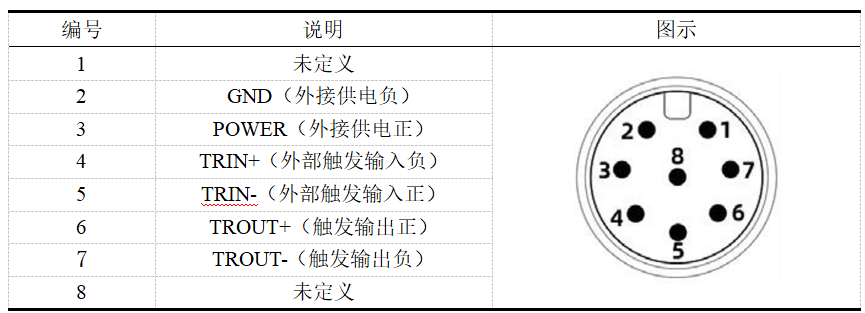

.. centered:: 表2-3  电源线缆（8pin）
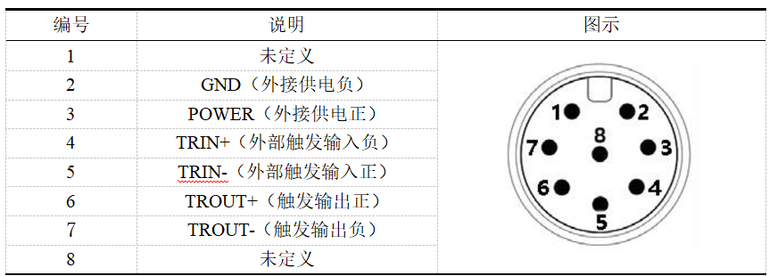

相机通信控制接口

.. centered:: 表2-4  机身POE网口座（12pin）
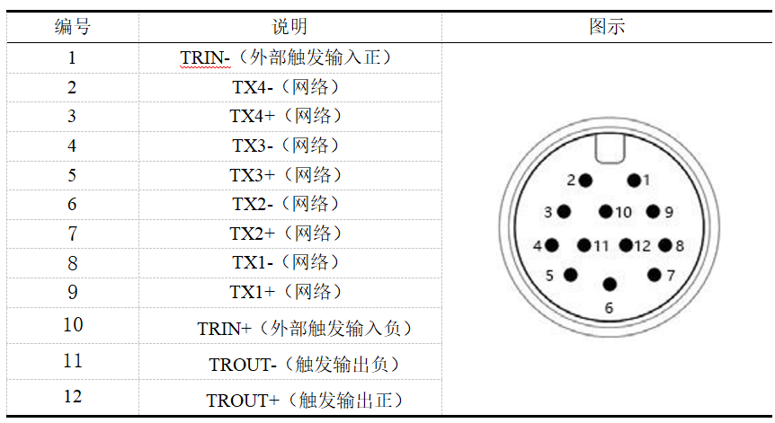

.. centered:: 表2-5  POE网口线缆（12pin）
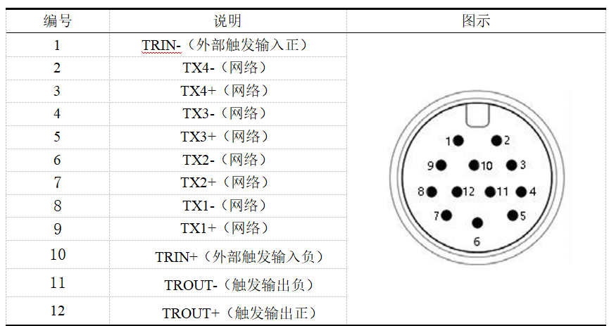

相机防护罩外部控制接口

.. centered:: 表2-6  防护盖外控座（4pin）
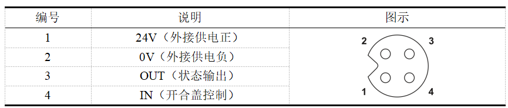

.. centered:: 表2-7  防护盖外控线缆（4pin）
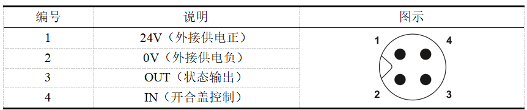

相机安装
~~~~~~~~~~~~~~~~~~~
保护罩的安装需要拆掉相机上壳M5堵头，露出进线孔，使用4颗M3*12内六角圆柱头螺钉安装在相机上壳对应孔位。

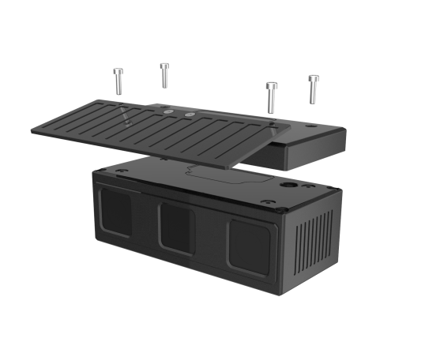

	保护罩安装示意图

相机安装示意：

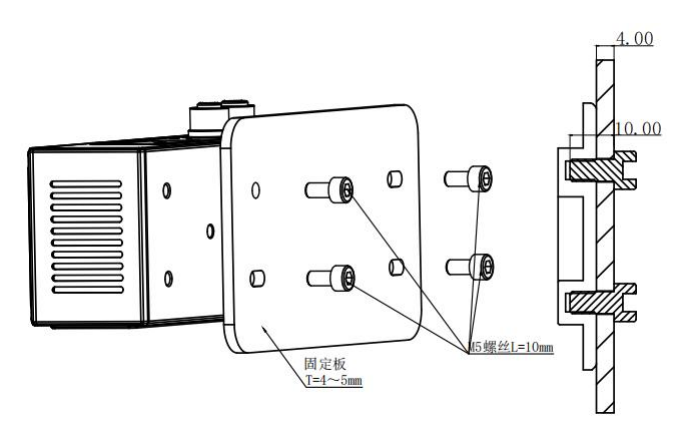

	相机安装示意图

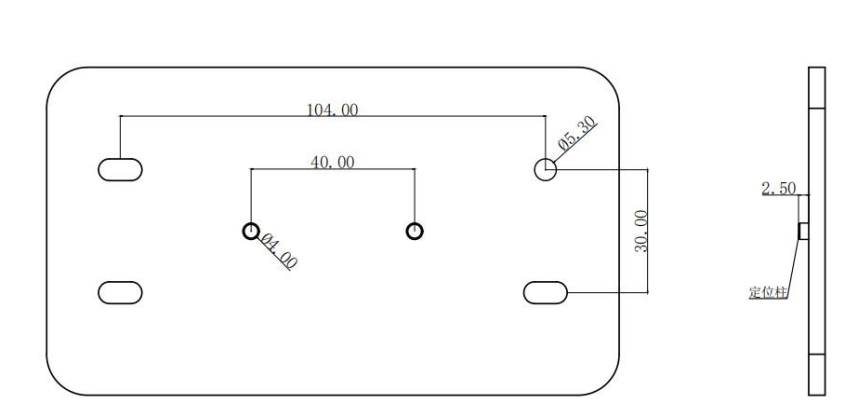

	固定板建议尺寸

安装要求：

.. centered:: 表2-8  安装要求
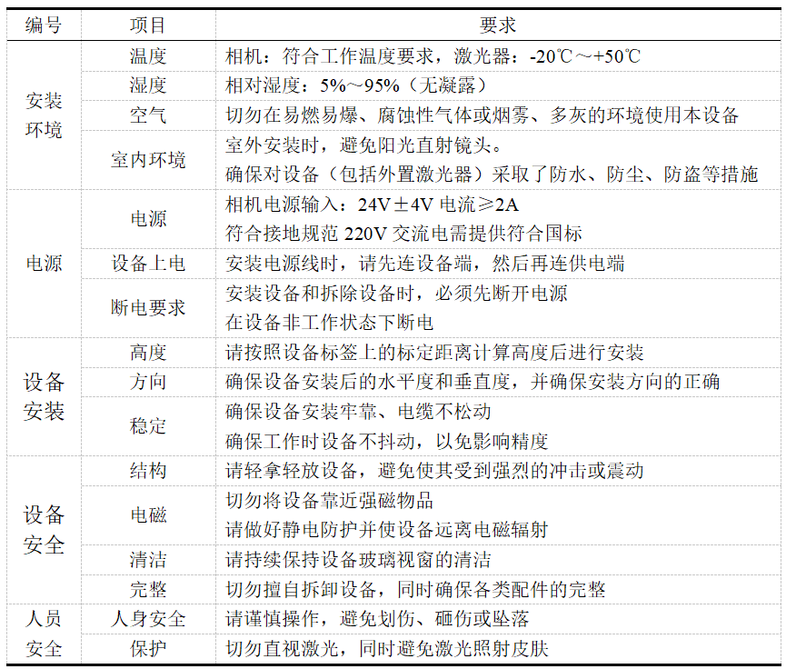

使用方式和注意事项：

- 建议使用默认分辨率，减少上电初始化分别率增加时间消耗； 

- 相机意外断开，可检查网线和电源线是否松动，软件是否运行正常，或重新启动相机； 

- 请按照指引正确操作产品，如操作不当可能会导致内部元件损坏； 

- 开机后,请勿直视光机，以免造成眼睛不适； 

- 请勿使用其它热源加热此产品； 

- 请勿用任何方式修改或拆解此产品，以免造成产品损坏及精度下降；

- 请勿摔落或撞击此产品，以防内部组件损坏及精度下降； 

- 请勿触摸镜片，以免造成取图效果； 

- 产品在使用一段时间后会发热,属于正常现象。

设备安装
-------------------
如图2-11所示，将相机和焊枪通过连接件安装在机器人末端。

.. figure:: quick_start/11.png
	:align: center
	:width: 4in

	安装相机和焊枪

.. important:: 
  请确保安装牢固，否则会影响精度。

工具坐标系标定
-------------------
AIRLab软件提供了工具坐标系的手动标定功能，打开AIRLab软件，导入机器人、工具，点击左侧“导入模块”-“工具”，打开工具设置界面（参照3.5.1节），接着选择想要标定的工具坐标系名称点击“修改”按钮进入“工具坐标系手动标定”界面，如下图所示。

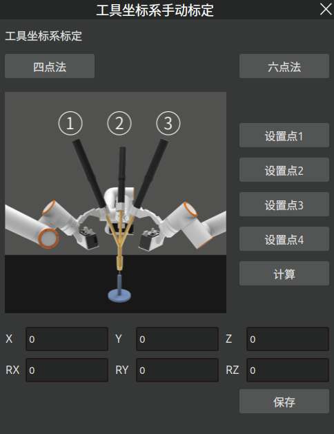

	工具坐标系手动标定界面

AIRLab提供了两种标定方法，分别为“四点法”与“六点法”，本文将以“六点法”为例对其进行介绍，具体步骤如下：

.. important::
	标定之前确认当前应用的工具坐标系为0，工件坐标系为0，扩展轴坐标系为0！

Step1：首先打开前文提到的“工具坐标系手动标定”界面，然后点击想要使用的标定方法，本次演示则点击“六点法”按钮，显示界面如下；

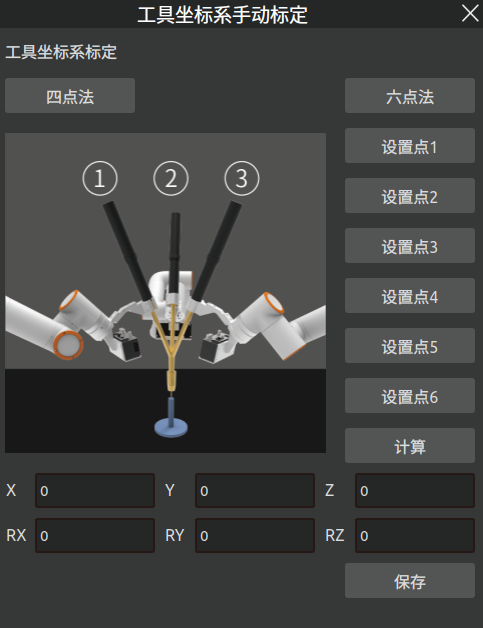

	标定方法设置

.. figure:: quick_start/14.png
	:align: center
	:width: 6in

	设置点1

Step3：改变机械臂的姿态同样将机械臂末端工具对准标定工具的顶端（固定参考点），等待机械臂移动就位后，点击界面的“设置点2”按钮，当按钮变成“修改点2”则说明点位设置成功，若要修改所设置点位，则点击“修改点2”进行重复步骤。过程如下图所示；

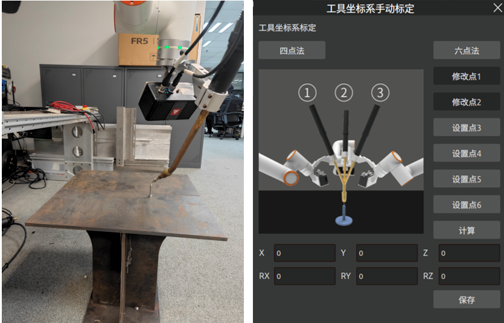

	设置点2

Step4：再次改变机械臂的姿态，将机械臂末端工具对准标定工具的顶端（固定参考点），等待机械臂移动就位后，点击界面的“设置点3”按钮，当按钮变成“修改点3”则说明点位设置成功，若要修改所设置点位，则点击“修改点3”进行重复步骤。点位3设置完成后，页面上的标定点位示意图切换为点位4，按照示意图开始设置点位4即可。过程如下图所示；

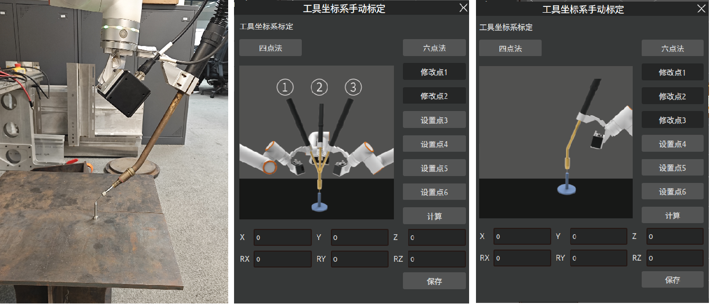

	设置点3

Step5：调整机械臂姿态，这次需要将机械臂末端竖直对准标定工具的顶端（固定参考点），如下图（左侧）所示，等待机械臂移动就位后，点击界面的“设置点4”按钮，当按钮变成“修改点4”则说明点位设置成功，若要修改所设置点位，则点击“修改点4”进行重复步骤。点位4设置完成后，页面上的标定点位示意图切换为点位5，按照示意图开始设置点位5即可。过程如下图所示；

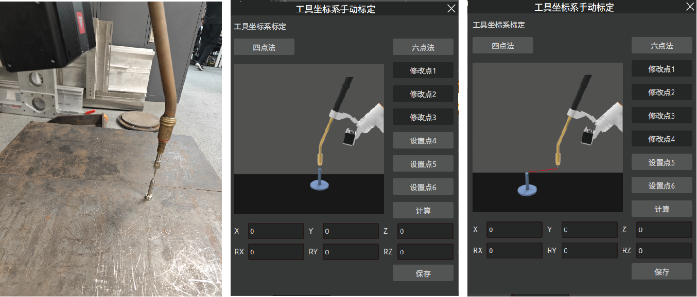

	设置点4

Step6：保持机械臂的姿态不变，利用基坐标系移动，在水平方向上移动一段距离，该方向即设定的工具坐标系X轴正方向。等待机械臂移动就位后，点击界面的“设置点5”按钮，当按钮变成“修改点5”则说明点位设置成功，若要修改所设置点位，则点击“修改点5”进行重复步骤。点位5设置完成后，页面上的标定点位示意图切换为点位6，按照示意图开始设置点位6即可。过程如下图所示；

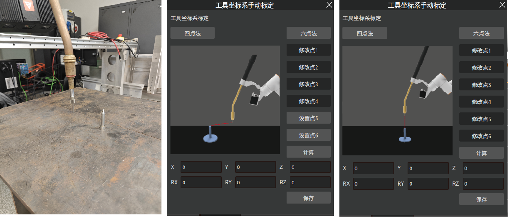

	设置点5

Step7：回到固定参考点，垂直往上移动一段距离，该方向即工具坐标系Z轴正方向，工具坐标系Y正方向则通过右手定则确定。等待机械臂移动就位后，点击界面的“设置点6”按钮，当按钮变成“修改点6”则说明点位设置成功，若要修改所设置点位，则点击“修改点6”进行重复步骤。过程如下图所示；

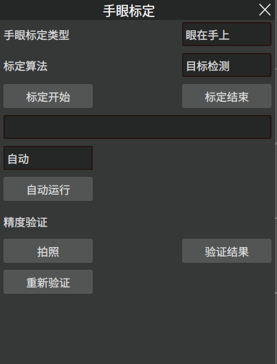

	设置点6

Step8：以上步骤完成后，点击“计算”按钮计算工具位姿，显示结果如下图所示。

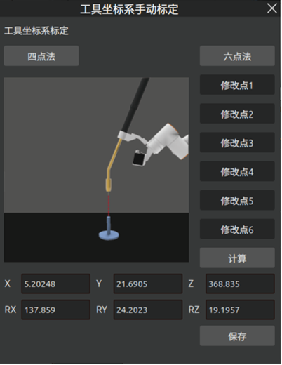

	工具坐标系计算结果

Step9：检查计算结果无误后，点击“保存”按钮，将会把计算结果保存在本地路径~/AIRLabExe/Data/import_config/Cleargun_cutwire_settings.config下的[Tool_coord_value_list]中，本次示例中标定的是tool3，所以保存的内容为<3=“标定计算结果”>，同时“工具设置”中也出现了标定成功的tool3选项，过程如下图所示。

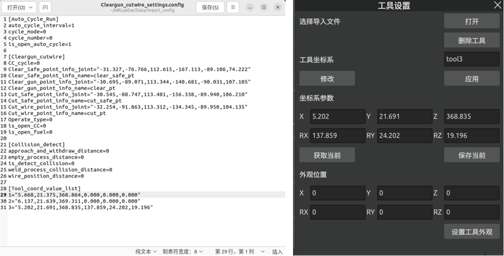

	工具坐标系计算结果保存

若选择的工具坐标系为已有工具坐标系（上述本地路径下已有相关坐标系的值），则会有“询问”弹窗提示是否覆盖之前的结果，如下图所示，若选择“确定”按钮则覆盖原有结果。

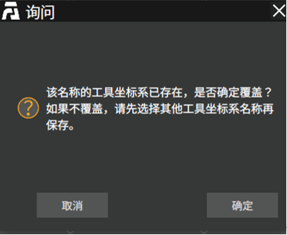

	工具坐标系询问弹窗

导入工程
-------------------
打开AIRLab软件，如图所示，点击文件-新建或打开，快速新建或打开一个新的工程文件。

.. important::
	导入之前存储的已设置扩展轴的工程时，会自动导入扩展轴（扩展轴坐标系设置为工程存储的扩展轴坐标系）。

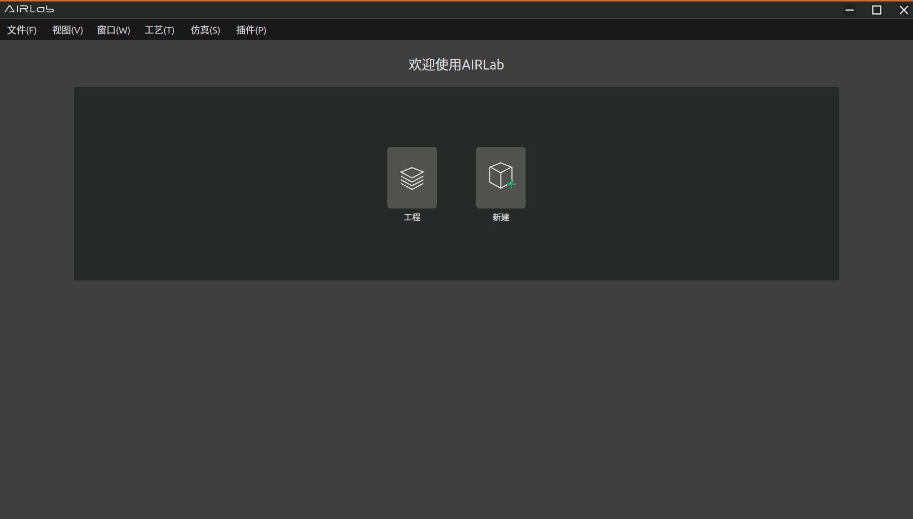

	选择工程导入

点云相机手眼标定
-------------------
机器人上电后，启动AIRLab软件，确保各模块正确启动。

Step1：相机连接

1) 打开导入模块中的相机模块，三维场景中显示“相机设置”弹窗。
2) 连接相机；点击导入模块-相机，三维场景显示相机设置弹窗，点击“相机配置-搜索设备”进行自动连接，相机连接成功后进行相机手眼标定；如果连接失败，AIRLab中会显示未连接，此时请先人工排查相机连线是否正确。
3) 相机配置：选择拍摄模式为“结构光”，同时设置合适的曝光时间等参数。

.. figure:: quick_start/26.png
	:align: center
	:width: 3in

	相机设置-搜索设备

Step2：手眼标定

1) 点击“相机设置”弹窗中的设备调试。点击“手眼标定”按钮，三维场景中显示“手眼标定弹窗”弹窗，如图所示。
   
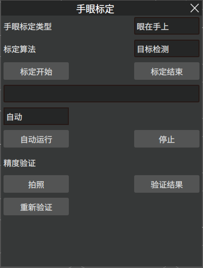

	手眼标定弹窗

2) 选择手眼标定类型和标定算法，点击手眼标定窗口中的“标定开始”按钮开始标定。

.. figure:: quick_start/Start_Calibration.png
	:align: center
	:width: 2.5in

	标定开始

3) 标定板放置在相机正下方，机器人以合适的姿态控制末端相机正对标定板，相机距离标定板有效拍摄距离为400-600mm，如图2-27所示。将AIRLab主显示框切换至相机显示，如图2-28所示。
   
.. figure:: quick_start/24.png
	:align: center
	:width: 4in

	标定板放置位置

.. figure:: quick_start/25.png
	:align: center
	:width: 4in

	AIRLab软件-相机显示

4) 选择运行方式为“自动”后点击“自动运行”按钮，软件将开始自动进行手眼标定，拍照过程中相机发出蓝光即为拍摄成功。自动运行机器人自动拍摄标定板并自动变换位姿，拍摄一轮变换八个姿态拍摄八次标定板。拍摄过程中提示标定失败需要再次点击“自动运行”重新进行本轮标定。

.. figure:: quick_start/28.png
	:align: center
	:width: 4in

	相机拍照

.. figure:: quick_start/29.png
	:align: center
	:width: 4in

	点云显示

5) 3~5轮标定结束后点击“标定结束”按钮，完成相机手眼标定；
   
Step3：精度验证

手眼标定结束后，对标定结果进行精度验证。

1) 手动拖动机器人使相机正对标定板，相机距离标定板距离为400mm-600mm。点击“重新验证”按钮对手眼标定结果进行重新验证；点击精度验证下的“拍照”按钮进行拍摄。拍摄成功后，软件终端显示相机拍摄成功。

2) 手动拖动机器人变换姿态，变换姿态建议八个姿态，分别为正向关节配置四个姿态和末端关节反过来后的四个姿态，如下图所示。每次四个姿态同样尽量覆盖机器人的关节活动范围，每次变化姿态界面差值需满足RX变化量>10°，RY变化量>10°，RZ变化量>45°。加上精度验证第一次拍照，总共拍九次。

.. figure:: quick_start/Verify_Pose.png
	:align: center
	:width: 5in

	验证姿态

3) 精度验证拍摄成功就此后，点击“验证结果”按钮，会出现图2-32所示的弹窗。弹窗中的4个点位是标定板上的四个固定点坐标，通过点击“移动至点位1”等按钮控制机器人移动到标定板指定位置，进而获得综合误差。

.. figure:: quick_start/30.png
	:align: center
	:width: 4in

	精度验证结果

4) 如果需要重新验证，则需要点击“重新验证”按钮清除误差之后再次进行上述验证过程。综合误差的数值在0.5mm~1.0mm区间内表示本次手眼标定结果较好，在1.0mm~1.5mm区间内的标定效果次之。其他结果代表本次标定结果不佳，需要进行重新标定。

地面获取与验证
-------------------
在首次进行任务作业前，需要先确定作业地面（若更换作业地面，需重新按此流程进行再次确认），操作步骤如下。

Step1：打开“相机设置”界面，点击“设备调试”标题。调整相机位置，对准作业地面，点击“拍摄地面”按钮，完成地面拍摄。

Step2：完成地面拍摄后，点击“获取地面方程”按钮。

Step3：需对所拍摄地面进行验证，点击“地面效果验证”按钮，界面会显示当前使用的切地参数和点云结果，如下图所示。

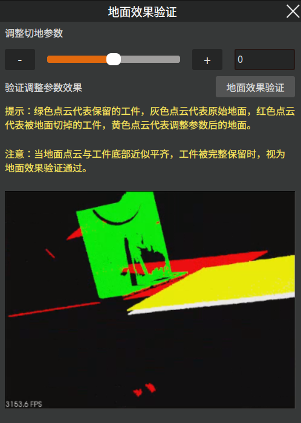

	地面效果验证弹窗

其中红色点云代表被地面切割掉的工件，绿色点云代表被保留的工件，灰色点云代表原始地面，黄色点云代表调整参数后的地面。

如果上述验证结果不符合预期，可以通过调整切地参数（拖动滑块或是文本框输入），点击下方“地面效果验证”按钮，弹窗会显示新参数下的地面验证点云，如下图所示。

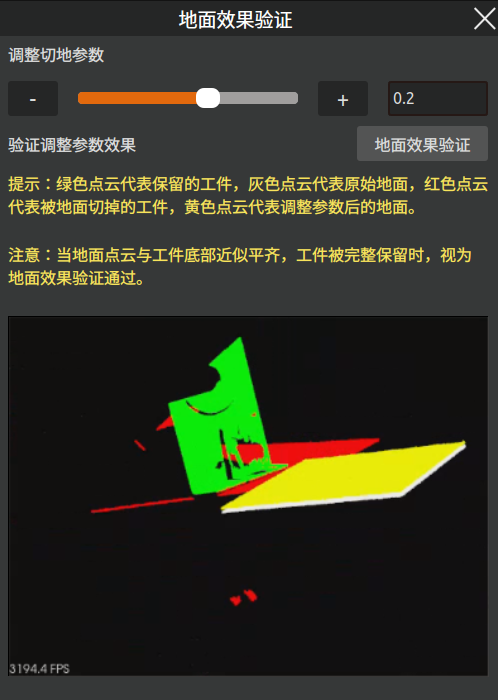

	地面效果验证参数调整

若本次设置地面验证的点云符合需求（地面与工件底部近似平齐，工件被完整地保留），如果符合，地面效果验证结束，直接关闭“地面效果验证”弹窗；如果不符合则重复上述调整参数-重新验证操作，直至符合要求。

开始运行
-------------------
完成上述步骤后，可以控制机器人开始焊接任务，主要分为四个步骤。

Step1：获取地面方程，具体操作见2.6地面获取与验证小节部分。

Step2：编辑焊缝，确定焊缝列表，详细操作见3.5.4焊缝编辑部分。

Step3：设置程序配置模式，点击焊接-焊接程序配置对焊缝程序进行配置，如图所示。注意：用户需要在程序运行之前根据实际需要设置该参数，参数具体意义见3.6.10焊接程序配置。

.. important::
	用户需要在程序运行之前根据实际需要设置该参数，参数具体意义见3.6.9程序配置。

.. figure:: quick_start/31.png
	:align: center
	:width: 4in

	获取程序配置

Step4：配置完成后点击一键运行，程序将从“工件定位”开始运行直到焊接完成。