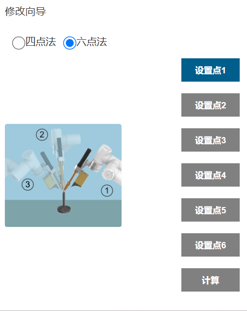
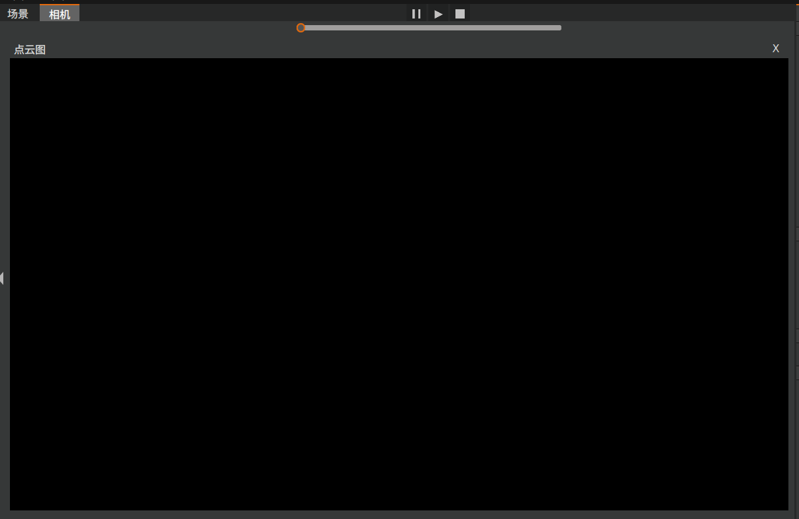
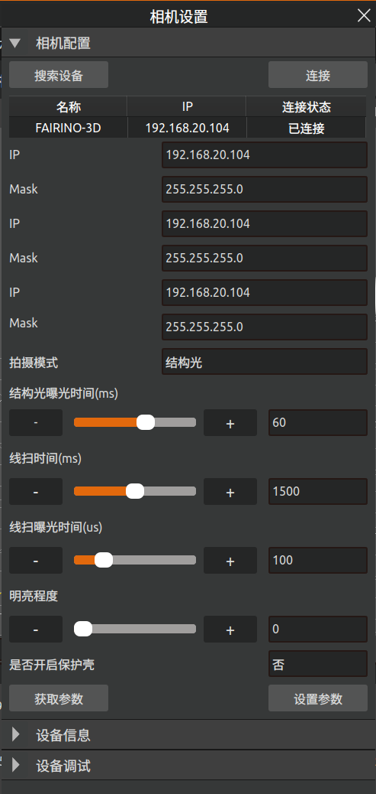

快速开始
=============

.. toctree:: 
    :maxdepth: 5

本章节将以一个实际焊接工程为例介绍如何控制机器人快速开始焊接工作，图3-1、3-2为焊接准备，其中图3-1为待焊接工件，图3-2为机器人和工件。

.. figure:: quick_start/1.png
	:align: center
	:width: 4in
	
.. centered:: 图3-1 待焊接工件

.. figure:: quick_start/2.png
	:align: center
	:width: 4in

.. centered:: 图3-2 机器人+工件

设备安装
-------------------
如图3-3所示，将相机和焊枪通过连接件安装在机器人末端。

.. figure:: quick_start/3.png
	:align: center
	:width: 4in

.. centered:: 图3-3 安装相机和焊枪

.. important:: 
  请确保安装牢固，否则会影响精度。
  请确保安装牢固，否则会影响精度。

工具坐标系标定
-------------------
打开浏览器访问目标网址192.168.58.2，输入用户名和密码点击登录即可登录FR示教器软件。点击界面左侧“初始设置”—“机器人设置”—“工具坐标”，进入工具坐标界面。

“工具坐标”界面用于实现工具坐标系的修改、清空和应用，工具坐标系名称的下拉列表中共有15个编号toolcoord0-toolcoord14(坐标系名称可自定义)，选择对应的坐标系后会在下方坐标文本框中显示对应坐标值(代表当前使用的工具的末端相对于机器人基座中心的偏移量)、工具类型以及安装位置(仅在传感器类型工具下显示)，选择某一坐标系后点击“应用”按钮，当前使用的工具坐标系即变为所选择的坐标，如图3-4所示。

.. figure:: quick_start/4.png
	:align: center
	:width: 4in

.. centered:: 图3-4 设置工具坐标

如果需要对某一工具坐标系进行重新设置，点击图3-4中的“修改”按钮，进入工具标定，如图3-5所示。工具标定方法分为四点法和六点法，四点法只标定工具TCP，即工具中心点的位置，其姿态默认与末端法兰姿态一致；六点法在四点法的基础上增加了两点，用于标定工具的姿态。这里以六点法为例进行介绍。

.. centered:: 图3-5 工具标定-四点法和六点法

Step1：在机器人空间选择一个固定的点，将工具以三个不同的姿态移至固定点，依次设置图3-6中的点①②③；

Step2：将工具垂直移至图3-6中右上方所示位置，设为定点④；

Step3：保持姿态不变，利用基座标移动，在水平方向移动一段距离，设置为定点⑤，该方向即所设定的工具坐标系X轴正方向；

Step4：回到定点④，垂直往上移动一段距离，设为定点⑥，该方向即为设定的工具坐标系Z轴正方向(工具坐标系的Y轴正方向通过右手定则确定)；

Step5：点击图3-6中的“计算”按钮计算工具坐标系；

Step6：若需重新设置，点击图3-5中的“取消”按钮进行新的工具坐标系标定；若不需要重新设置，点击图3-5中的“保存”将工具坐标系存储下来。

.. figure:: quick_start/6.png
	:align: center
	:width: 3in

.. centered:: 图3-6 六点法工具标定步骤

导入工程
-------------------
打开AIRLab软件，点击界面上方菜单栏中的“文件”按钮，点击“打开”按钮，选择工程，点击“Open”导入工程，如图3-7所示。

.. figure:: quick_start/7.png
	:align: center
	:width: 5in

.. centered:: 图3-7 选择工程导入

点云相机手眼标定
-------------------
本步骤的目的是为了标定相机和机器人的相对位置，具体操作如下：

Step1：将标定板放置在相机正下方，如图3-8所示。将AIRLab主显示框切换至相机显示，如图3-9所示。

.. figure:: quick_start/8.png
	:align: center
	:width: 4in

.. centered:: 图3-8 标定板放置位置

.. figure:: quick_start/9.png
	:align: center
	:width: 4in

.. centered:: 图3-9 AIRLab软件-相机显示

Step2：点击AIRLab左侧工程树中“相机”的子节点，右侧会切换出“相机属性”子页面，点击“标定开始”按钮，如图3-10。再点击图3-10 中的“自动运行”按钮，相机开始自动标定，如图3-11所示，AIRLab软件端的点云图如图3-12所示。

.. figure:: quick_start/10.png
	:align: center
	:width: 3.5in

.. centered:: 图3-10 相机属性-标定开始

.. figure:: quick_start/11.png
	:align: center
	:width: 3.5in

.. centered:: 图3-11 点云相机手眼标定

.. figure:: quick_start/12.png
	:align: center
	:width: 4in

.. centered:: 图3-12 点云标定结果

Step3：等待相机标定完成；

Step4：本轮相机标定结束后，可以更改标定板位置，点击“自动运行”按钮进行下一轮标定，该步骤目的是为了提高系统精度，可以选择标定3~5轮，系统会选择其中精度最高的坐标系使用；

Step5：点击“标定结束”按钮，结束本次点云相机手眼标定；

Step6：进行精度验证。随机选择一个位置放置标定板，点击图3-13中的“拍照”按钮，重复该过程3次后，点击“验证结果”按钮，会出现图3-14所示的弹窗。弹窗中的4个点位是标定板上的四个固定点坐标，通过点击“移动至点位1”等按钮控制机器人移动到标定板指定位置，进而获得综合误差。

.. figure:: quick_start/13.png
	:align: center
	:width: 3.5in

.. centered:: 图3-13 点云相机手眼标定

.. centered:: 图3-14 验证结果-弹窗

Step4：本轮相机标定结束后，可以更改标定板位置，点击“自动运行”按钮进行下一轮标定，该步骤目的是为了提高系统精度，可以选择标定3~5轮，系统会选择其中精度最高的坐标系使用；

开始运行
-------------------
完成上述步骤后，可以控制机器人开始焊接任务，主要分为五个步骤。

Step1：获取地面方程

点击工程树中“工件定位”节点，软件右侧子页面会切换为“工件定位程序”，如图3-14所示。点击“拍摄地面”按钮，再点击“保存地面”即可保存计算的地面方程。

.. centered:: 图3-15 子页面-工件定位程序

Step2：运行工件定位程序

点击菜单栏中的开始运行图标按钮，机器人首先开始运行工程树中“工件定位”节点下的所有指令，运行完成后获得全局变换矩阵和全局点云，控制器得到机器人和工件的实际相对位置。

Step3：获取程序配置模式

其次读取用户设置的程序配置模式，如图3-16。其中，手动调试模式用于单步调试；全部识别后焊接指机器人会将工程树中“模板程序”下的所有焊缝识别完后再进行全部焊接；单条识别后焊接指机器人每次只识别一条焊缝，识别完成后即开始焊接该焊缝，焊接完成后再识别下一条焊缝，再焊接，直到完成“模板程序”下所有焊缝的焊接。程序起弧设置中的“不起弧”是用于测试的，用户可以选择“不起弧”先进行模拟焊接，模拟焊接结果无误后再设置“起弧”进行实际焊接。

.. figure:: quick_start/16.png
	:align: center
	:width: 4in

.. centered:: 图3-16 获取程序配置

Step4：焊缝识别

确定程序配置模式和起弧方式后，机器人将根据焊缝程序的具体指令开始焊缝识别，识别成功后，会在工程树的“机器人”节点下生成修正点位，在“程序”节点下生成机器人需要的焊接指令，如图3-17、3-18所示。

.. centered:: 图3-17 焊缝识别结果-新增修正点位

.. centered:: 图3-18 焊缝识别结果-新增焊接指令

Step5：运行“程序”

当焊缝识别完成后，机器人将会运行“程序”节点下生成的所有指令来执行焊接任务。