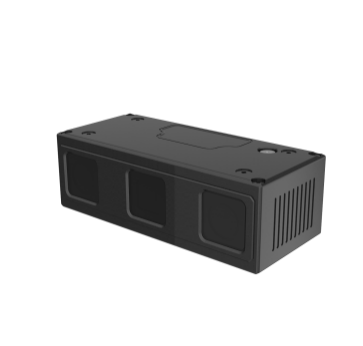
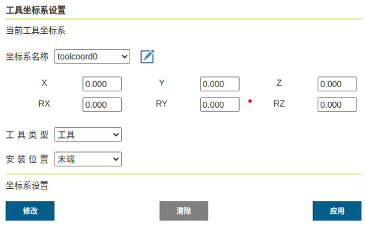
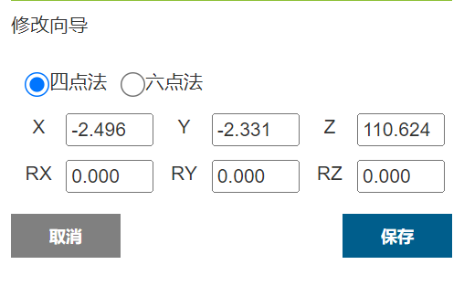
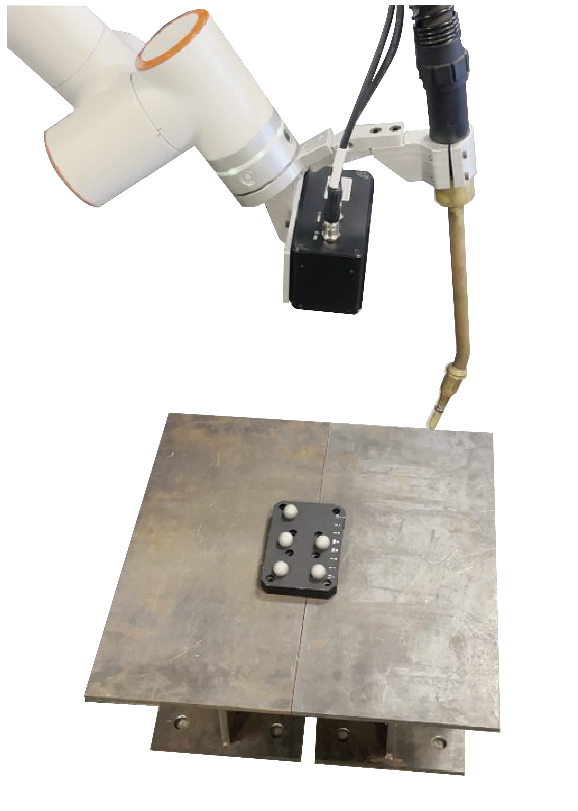
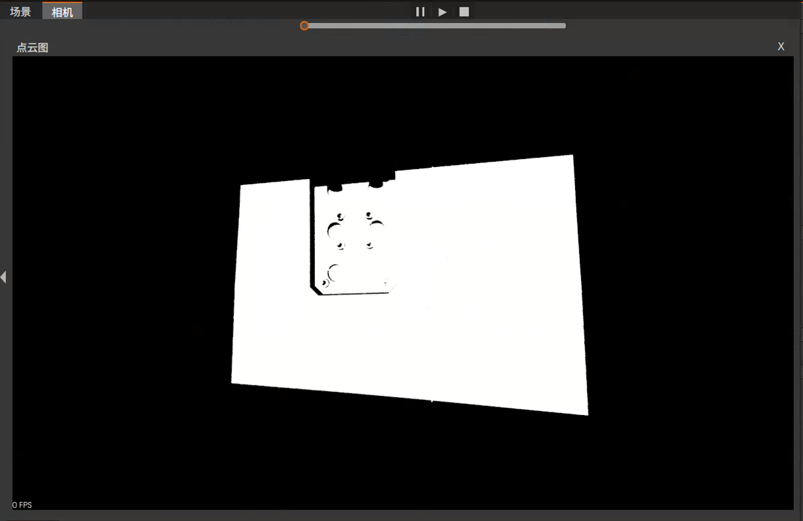
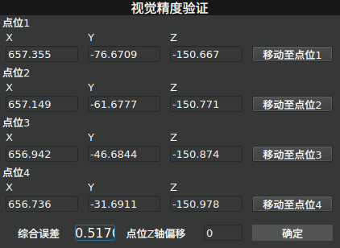

快速开始
=============

.. toctree:: 
    :maxdepth: 5

本章节将以一个实际焊接工程为例介绍如何控制机器人快速开始焊接工作，图2-1、3-2为焊接准备，其中图2-1为待焊接工件，图2-2为机器人和工件。

.. figure:: quick_start/1.png
	:align: center
	:width: 3in
	
.. centered:: 图2-1 待焊接工件

.. figure:: quick_start/2.png
	:align: center
	:width: 3in

.. centered:: 图2-2 机器人+工件

3D机械振镜相机产品说明
--------------------------
高精度3D相机采用光栅结构光进行扫描，根据双目图像恢复算法重建出物体的真实三维点云数据。满足工业级高分辨率、亚毫米测量的三维视觉应用需求。该设备体积小、景深大测量精度高等特点。可应用于工业自动化、机器人、三维物体重建等场景。

.. centered:: 图2-3 标准版本

.. figure:: quick_start/4.png
	:align: center
	:width: 3in

.. centered:: 图2-4 配备保护罩版本

此款相机可搭配各型主流焊接机器人，引导焊接机器人进行焊接作业，实现复杂焊缝特征提取、轨迹寻位、工件找正定位等功能。成像算法，最高可实现0.2mm的Z向重复精度；采用双目结构光技术，亚毫米级精度图像采集；

该相机具有以下特点：

- 支持多帧融合，解决金属零件表面反光问题；

- 高效投影模块配合精准曝光，性能更稳定；

- 系统抗噪性能强，较暗工件也可输出清晰点云；

- 非接触式测量，不损伤被测物体表面；

- 出厂时就进行优化方案的预设定，无需要用户自行标定；

- 紧凑的铝合金全封闭外壳设计，在工业生产中，提供了长效、可靠的保障，预留多孔位安装，让相机的部署更加方便快捷；

该产品是适用于 350mm~1100mm 距离物体识别的智能相机。该产品不仅体积小，重量轻，机身强度高，而且成像速度快，精度高，特别适用于高温环境工作，具有抗高温的特点，前置有防溅盖板能够有效起到防火花溅射，无示教焊接轨迹生成的功能。

系統要求
~~~~~~~~~~~~~~~~~~~
- Windows 10.0 或以上 / Ubuntu 18.04 或以上；

- 主频 1.8GHz 或以上；
  
- 建议 8GB RAM 或以上。

产品参数
~~~~~~~~~~~~~~~~~~~
.. centered:: 表2-1 产品参数表

视场测量范围
~~~~~~~~~~~~~~~~~~~
.. figure:: quick_start/5.png
	:align: center
	:width: 3in

.. centered:: 图2-5  视场测量范围

结构图纸
~~~~~~~~~~~~~~~~~~~

.. centered:: 图2-6  标准版本结构尺寸图

.. centered:: 图2-7  配备保护罩版本结构尺寸图

结构图纸
~~~~~~~~~~~~~~~~~~~
相机电源接口

.. centered:: 表2-2  机身电源座（8pin）

.. centered:: 表2-3  电源线缆（8pin）

相机通信控制接口

.. centered:: 表2-4  机身POE网口座（12pin）

.. centered:: 表2-5  POE网口线缆（12pin）

相机防护罩外部控制接口

.. centered:: 表2-6  防护盖外控座（4pin）

.. centered:: 表2-7  防护盖外控线缆（4pin）

相机安装
~~~~~~~~~~~~~~~~~~~
保护罩的安装需要拆掉相机上壳M5堵头，露出进线孔，使用4颗M3*12内六角圆柱头螺钉安装在相机上壳对应孔位。

.. centered:: 图2-8  保护罩安装示意图

相机安装示意：

.. centered:: 图2-9  相机安装示意图

.. centered:: 图2-10  固定板建议尺寸

安装要求：

.. centered:: 表2-8  安装要求

使用方式和注意事项：

- 建议使用默认分辨率，减少上电初始化分别率增加时间消耗； 

- 相机意外断开，可检查网线和电源线是否松动，软件是否运行正常，或重新启动相机； 

- 请按照指引正确操作产品，如操作不当可能会导致内部元件损坏； 

- 开机后,请勿直视光机，以免造成眼睛不适； 

- 请勿使用其它热源加热此产品； 

- 请勿用任何方式修改或拆解此产品，以免造成产品损坏及精度下降；

- 请勿摔落或撞击此产品，以防内部组件损坏及精度下降； 

- 请勿触摸镜片，以免造成取图效果； 

- 产品在使用一段时间后会发热,属于正常现象。

设备安装
-------------------
如图2-11所示，将相机和焊枪通过连接件安装在机器人末端。

.. centered:: 图2-11 安装相机和焊枪

.. important:: 
  请确保安装牢固，否则会影响精度。

工具坐标系标定
-------------------
AIRLab软件提供了工具坐标系的手动标定功能，在主界面依次点击“导入模块”-“工具”，打开工具设置界面（参照3.5.1节），接着选择想要标定的工具坐标系名称点击“修改”按钮进入“工具坐标系手动标定” 界面，如下图所示。

.. centered:: 图2-12 工具坐标系手动标定界面

AIRLab提供了两种标定方法，分别为“四点法”与“六点法”，本文将以“六点法”为例对其进行介绍，具体步骤如下：

Step1：首先打开前文提到的“工具坐标系手动标定”界面，然后点击想要使用的标定方法，本次演示则点击“六点法”按钮，显示界面如下；

.. centered:: 图2-13 标定方法设置

Step2：控制机械臂以某个姿态将机械臂末端工具对准标定工具的顶端（固定参考点），等待机械臂移动就位后，点击界面的“设置点1”按钮，当按钮变成“修改点1”则说明点位设置成功，若要修改所设置点位，则点击“修改点1”进行重复步骤。过程如下图所示；

.. figure:: quick_start/set_point_1.png
	:align: center
	:width: 6in

.. centered:: 图2-14 设置点1

Step3：改变机械臂的姿态同样将机械臂末端工具对准标定工具的顶端（固定参考点），等待机械臂移动就位后，点击界面的“设置点2”按钮，当按钮变成“修改点2”则说明点位设置成功，若要修改所设置点位，则点击“修改点2”进行重复步骤。过程如下图所示；

.. figure:: quick_start/set_point_2.png
	:align: center
	:width: 6in

.. centered:: 图2-15 设置点2

Step4：再次改变机械臂的姿态，将机械臂末端工具对准标定工具的顶端（固定参考点），等待机械臂移动就位后，点击界面的“设置点3”按钮，当按钮变成“修改点3”则说明点位设置成功，若要修改所设置点位，则点击“修改点3”进行重复步骤。过程如下图所示；

.. figure:: quick_start/set_point_3.png
	:align: center
	:width: 6in

.. centered:: 图2-16 设置点3

Step5：调整机械臂姿态，这次需要将机械臂末端竖直对准标定工具的顶端（固定参考点），如下图（左侧）所示，等待机械臂移动就位后，点击界面的“设置点4”按钮，当按钮变成“修改点4”则说明点位设置成功，若要修改所设置点位，则点击“修改点4”进行重复步骤。过程如下图所示；

.. figure:: quick_start/set_point_4.png
	:align: center
	:width: 6in

.. centered:: 图2-17 设置点4

Step6：保持机械臂的姿态不变，利用基坐标系移动，在水平方向上移动一段距离，该方向即设定的工具坐标系X轴正方向。等待机械臂移动就位后，点击界面的“设置点5”按钮，当按钮变成“修改点5”则说明点位设置成功，若要修改所设置点位，则点击“修改点5”进行重复步骤。过程如下图所示；

.. figure:: quick_start/set_point_5.png
	:align: center
	:width: 6in

.. centered:: 图2-18 设置点5

Step7：回到固定参考点，垂直往上移动一段距离，该方向即工具坐标系Z轴正方向，工具坐标系Y正方向则通过右手定则确定。等待机械臂移动就位后，点击界面的“设置点6”按钮，当按钮变成“修改点6”则说明点位设置成功，若要修改所设置点位，则点击“修改点6”进行重复步骤。过程如下图所示；

.. figure:: quick_start/set_point_6.png
	:align: center
	:width: 6in

.. centered:: 图2-19 设置点6

Step8：以上步骤完成后，点击“计算”按钮计算工具位姿，显示结果如下图所示。

.. figure:: quick_start/tool_cal_res.png
	:align: center
	:width: 4in

.. centered:: 图2-20 工具坐标系计算结果

Step9：检查计算结果无误后，点击“保存”按钮，将会把计算结果保存在本地路径~/AIRLabExe/Data/import_config/Cleargun_cutwire_settings.config下的[Tool_coord_value_list]中，本次示例中标定的是tool3，所以保存的内容为<3=“标定计算结果”>，同时“工具设置”中也出现了标定成功的tool3选项，过程如下图所示。

.. figure:: quick_start/tool_cal_res_save.png
	:align: center
	:width: 6in

.. centered:: 图2-21 工具坐标系计算结果保存

若选择的工具坐标系为已有工具坐标系（上述本地路径下已有相关坐标系的值），则会有“询问”弹窗提示是否覆盖之前的结果，如下图所示，若选择“确定”按钮则覆盖原有结果。

.. figure:: quick_start/tool_exist_popup.png
	:align: center
	:width: 4in

.. centered:: 图2-22 工具坐标系询问弹窗

导入工程
-------------------
打开AIRLab软件，如图所示，点击文件-新建或打开，快速新建或打开一个新的工程文件，如图2-23所示。

.. figure:: quick_start/15.png
	:align: center
	:width: 5in

.. centered:: 图2-23 选择工程导入

点云相机手眼标定
-------------------
本步骤的目的是为了标定相机和机器人的相对位置，具体操作如下：

Step1：放置标定板；将标定板放置在相机正下方距离相机50-80厘米，如图2-16所示。将AIRLab主显示框切换至相机显示，如图2-24所示。

.. centered:: 图2-24  标定板放置位置

.. figure:: quick_start/17.png
	:align: center
	:width: 4in

.. centered:: 图2-25  AIRLab软件-相机显示

Step2：连接相机；点击导入模块-相机，三维场景显示相机设置弹窗，点击“相机配置-搜索设备”进行自动连接，相机连接成功后进行相机手眼标定；如果连接失败，AIRLab中会显示未连接，此时请先人工排查相机连线是否正确。

.. figure:: quick_start/18.png
	:align: center
	:width: 3in

.. centered:: 图 2-26  相机设置-搜索设备

Step3：相机手眼标定；点击相机设置弹窗设备调试-手眼标定；场景中显示手眼标定弹窗如图2-27所示；

.. centered:: 图2-27  手眼标定页面

选择手眼标定类型和标定算法后，点击“标定开始”按钮，表示手眼标定现在开始。选择运行方式，包括“自动”和“手动”两种运行方式。下面对自动运行方式进行介绍。

1. 选择运行方式为“自动”后点击“自动运行”按钮，软件将开始自动进行手眼标定，拍照过程中相机发出蓝光即为正常拍摄。

.. figure:: quick_start/20.png
	:align: center
	:width: 4in

.. centered:: 图2-28  相机拍照

.. centered:: 图2-29  点云显示

2. 相机自动标定过程会拍8张照片，标定结束后会提示标定成功或者失败，提示标定成功进行下一步，提示标定失败需要点击“自动运行”重新进行标定。

3. 本轮相机标定结束后，可以更改标定板位置，再次点击“自动运行”按钮进行下一轮标定，该步骤目的是为了提高系统精度，可以选择标定3~5轮，系统会选择其中精度最高的坐标系使用；

4. 点击“标定结束”按钮，结束本次点云相机手眼标定。

Step3：进行精度验证；随机选择一个位置放置标定板，点击图2-27中的“拍照”按钮，保持标定板位置不动，移动机器人三次拍摄3次照片后，点击“验证结果”按钮，会出现图2-30所示的弹窗。弹窗中的4个点位是标定板上的四个固定点坐标，通过点击“移动至点位1”等按钮控制机器人移动到标定板指定位置，进而获得综合误差。

.. centered:: 图2-30  精度验证结果

如果需要重新验证，则需要点击“重新验证”按钮清除误差之后再次进行上述验证过程。综合误差的数值在0.5~1.0区间内表示本次手眼标定结果较好，在1.0~1.5区间内的标定效果次之。其他结果代表本次标定结果不佳，需要进行重新标定。

开始运行
-------------------
完成上述步骤后，可以控制机器人开始焊接任务，主要分为四个步骤。

Step1：获取地面方程；选择“相机配置-设备调试”，点击“拍摄地面”按钮，拍照成功即可。

Step2：编辑焊缝，确定焊缝列表，详细操作见3.5.3焊缝编辑部分。

Step3：设置程序配置模式，如图2-31。

.. important::
	用户需要在程序运行之前根据实际需要设置该参数，参数具体意义见3.6.9程序配置。

.. figure:: quick_start/23.png
	:align: center
	:width: 4in

.. centered:: 图2-31 获取程序配置

Step4：配置完成后点击一键运行，程序将从“工件定位”开始运行直到焊接完成。